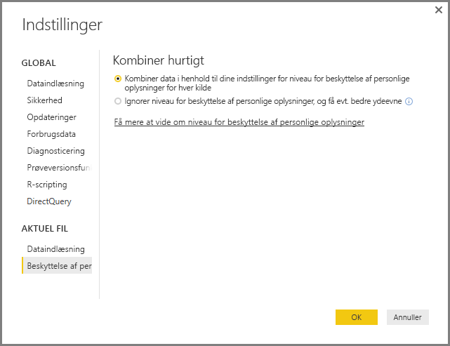

# Niveauer for beskyttelse af personlige oplysninger i Power BI Desktop
I **Power BI Desktop** angiver niveauerne for beskyttelse af personlige oplysninger et isolationsniveau, der definerer, i hvilket omfang én datakilde isoleres fra andre datakilder. Et begrænsende isolationsniveau blokerer oplysninger, så de ikke udveksles mellem datakilder, men det kan reducere funktionaliteten og have indflydelse på ydeevnen.

Indstillingen **Niveauer for beskyttelse af personlige oplysninger**, der findes i **Filer > Indstillinger > Indstillinger** og derefter **Aktuel fil > Beskyttelse af personlige oplysninger** bestemmer, om Power BI Desktop bruger din indstilling for beskyttelse af personlige oplysninger, når data kombineres. Denne dialogboks indeholder et link til Power BI Desktop-dokumentationen om niveauer for beskyttelse af personlige oplysninger (denne artikel).

## Konfigurer et niveau for beskyttelse af personlige oplysninger
Ved hjælp af indstillinger for niveauerne for beskyttelse af personlige oplysninger kan du angive et isolationsniveau, der definerer, i hvilket omfang én datakilde skal isoleres fra andre datakilder.

| Indstilling | Beskrivelse | Eksempel på datakilder |
| --- | --- | --- |
| **Privat datakilde** |En **privat** datakilde indeholder følsomme eller fortrolige oplysninger, og datakilden kan kun ses af godkendte brugere. En privat datakilde er helt isoleret fra andre datakilder. |Facebook-data, en tekstfil, der indeholder aktiebonusser, eller en projektmappe, der indeholder evalueringsoplysninger om medarbejdere. |
| **Datakilde på organisationsniveau** |En datakilde på **organisationsniveau** er en datakilde, der kun kan ses af en gruppe af personer, der er tillid til. En datakilde på **organisationsniveau** er isoleret fra alle **offentlige** datakilder, men kan ses af andre datakilder på **organisationsniveau**. |Et **Microsoft Word**-dokument på et SharePoint-intranetsted med tilladelser, der er aktiveret for en gruppe, der er tillid til. |
| **Offentlig datakilde** |I en **offentlig** datakilde kan de data, der er indeholdt i datakilden, ses af alle. Det er kun filer, internetdatakilder eller projektmappedata, der kan markeres som **offentlige**. |Gratis data fra Microsoft Azure Marketplace, data fra en Wikipedia-side eller en lokal fil, der indeholder data, som er kopieret fra en offentlig webside. |

## Konfigurer indstillinger for niveauet for beskyttelse af personlige oplysninger
Dialogboksen med indstillinger for **beskyttelse af personlige oplysninger** for de enkelte datakilder findes under **Filer > Indstillinger > Indstillinger for datakilde**.

Hvis du vil konfigurere niveauet for beskyttelse af personlige oplysninger for en datakilde, skal du vælge datakilden og derefter vælge **Rediger**. Dialogboksen **Indstillinger for datakilde** vises, og her kan du vælge det relevante niveau for beskyttelse af personlige oplysninger i menuen nederst i dialogboksen, som vist på følgende billede.

> [!CAUTION]
> Du skal konfigurere en datakilde, der indeholder meget følsomme eller fortrolige data, som **Privat**.
> 

## Konfigurer niveauer for beskyttelse af personlige oplysninger
**Niveauer for beskyttelse af personlige oplysninger** er som standard angivet til **Kombiner data i henhold til dine indstillinger for beskyttelsesniveau for hver kilde**, hvilket betyder, at **Niveauer for beskyttelse af personlige oplysninger** gennemtvinges.

| Indstilling | Beskrivelse |
| --- | --- |
| **Kombiner data i henhold til dine indstillinger for beskyttelsesniveau for hver kilde** (slået til og standardindstillingen) |Indstillinger for niveauer for beskyttelse af personlige oplysninger bruges til at bestemme isolationsniveauet mellem datakilder, når data kombineres. |
| **Ignorer beskyttelsesniveauerne, og øg muligvis ydeevnen** (slået fra) |Niveauer for beskyttelse af personlige oplysninger tages ikke i betragtning, når data kombineres, men det kan medføre forbedret ydeevne og funktionalitet af dataene. |

> **Sikkerhedsbemærkning:** Hvis du vælger **Ignorer niveauerne for beskyttelse af personlige oplysninger, og øg eventuelt ydeevnen** i dialogboksen **Niveauer for beskyttelse af personlige oplysninger**, kan det muligvis medføre, at følsomme eller fortrolige data eksponeres for en uautoriseret person. Slå ikke denne indstilling *fra*, medmindre du er sikker på, at datakilden ikke indeholder følsomme eller fortrolige data.
> 
> 

> [!CAUTION]
> Indstillingen **Ignorer niveauerne for beskyttelse af personlige oplysninger, og øg muligvis ydeevnen** fungerer ikke i Power BI-tjenesten. Power BI Desktop-rapporter med denne indstilling aktiveret, som derefter publiceres til Power BI-tjenesten, vil som sådan *ikke* afspejle denne funktionalitet, når den bruges i tjenesten.
> 

**Konfigurer niveauer for beskyttelse af personlige oplysninger**

I Power BI Desktop eller i forespørgselseditoren skal du vælge **Filer > Indstillinger > Indstillinger** og derefter **Aktuel fil > Beskyttelse af personlige oplysninger**.

a. Når **Kombiner data i henhold til dine indstillinger for beskyttelsesniveau for hver kilde** er valgt, kombineres data i henhold til din indstilling af Niveauer for beskyttelse af personlige oplysninger. Hvis du fletter data på tværs af zoner til isolering af beskyttelse af personlige oplysninger, medfører det, at visse data bufferlagres.

b. Når **Ignorer beskyttelsesniveauerne, og øg muligvis ydeevnen** er valgt, kombineres dataene, og dine niveauer for beskyttelse af personlige oplysninger ignoreres, hvilket kan resultere i, at en uautoriseret bruger får vist følsomme eller fortrolige data. Indstillingen kan forbedre ydeevnen og funktionaliteten.

> **Sikkerhedsbemærkning:** Hvis du vælger **Ignorer beskyttelsesniveauerne, og øg muligvis ydeevnen**, kan det forbedre ydeevnen, men Power BI Desktop kan ikke sikre beskyttelse af personlige data, der er flettet med Power BI Desktop-filen.
> 
> 

