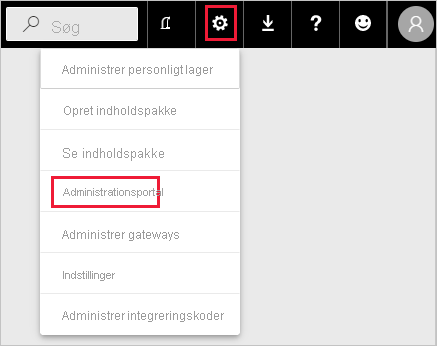

# Administrationsindstillinger til administration af Power BI-visualiseringer

Som Power BI-administrator af din organisation kan du styre, hvilken type Power BI-visualiseringer brugerne har adgang til på tværs af organisationen.

Hvis du vil administrere Power BI-visualiseringer, skal du være global administrator i Office 365 eller være tildelt administratorrollen for Power BI-tjenesten. Du kan finde flere oplysninger om Power BI-tjenesteadministratorrollen under [Beskrivelse af rollen som Power BI-administrator](service-admin-role.md).

## Få adgang til administrationsportalen

Hvis du vil aktivere de indstillinger, der er beskrevet i artiklen, skal du have adgang til administrationsportalen.

1. I Power BI-tjenesten skal du vælge **Indstillinger**.

2. I rullemenuen med indstillinger skal du vælge **Administrationsportal**.

    

## Lejerindstillinger for Power BI-visualiseringer

Som Power BI-administrator i din organisation kan du styre, hvilken type Power BI-visualiseringer brugerne har adgang til på tværs af organisationen.

Indstillingerne for lejerbrugergrænsefladen påvirker kun Power BI-tjenesten. Hvis disse indstillinger skal træde i kraft i Power BI Desktop, skal du anvende gruppepolitikker. En tabel i slutningen af hvert afsnit indeholder oplysninger om aktivering af indstillingen i Power BI Desktop.

>[!NOTE]
>Ændring af lejerindstillinger påvirker ikke Power BI-visualiseringer, der er angivet under fanen [visualiseringer til organisationer](#organizational-visuals).

### Visualiseringer fra AppSource eller en fil

Administrer organisationens adgang til følgende type Power BI-visualiseringer:

* Visualiseringer, der er oprettet af udviklere og gemt som en .pbiviz-fil.

* Visualiseringer, der er tilgængelige fra AppSource.

Følg nedenstående vejledning for at gøre det muligt for brugere i din organisation at uploade .pbiviz-filer og føje visualiseringer fra AppSource til deres rapporter og dashboards.

1. Udvid indstillingerne **Tillad visuelle elementer, der er oprettet ved hjælp af Power BI SDK**.

2. Klik på **Aktiveret**.

3. Vælg, hvem der kan uploade .pbiviz- og AppSource-visualiseringer:

    * Vælg muligheden **Hele organisationen** for at tillade alle i din organisation at uploade .pbiviz-filer og tilføje visualiseringer fra AppSource.

     * Vælg muligheden **Specifikke sikkerhedsgrupper** for at administrere overførslen af .pbiviz-filer og tilføje visualiseringer fra AppSource ved hjælp af sikkerhedsgrupper. Tilføj de sikkerhedsgrupper, du vil administrere, til tekstlinjen *Indtast sikkerhedsgrupper*. De sikkerhedsgrupper, du har angivet, er udelukket som standard. Hvis du vil medtage disse sikkerhedsgrupper og udelukke alle andre i organisationen, skal du markere afkrydsningsfeltet **Undtagen bestemte sikkerhedsgrupper**.

4. Klik på **Anvend**.

Ændringer af lejerindstillinger i brugergrænsefladen gælder kun for Power BI-tjenesten. Hvis du vil gøre det muligt for brugerne i din organisation at uploade .pbiviz-filer og føje visualiseringer fra AppSource til visualiseringsruden i Power BI Desktop, skal du bruge [Microsoft Azure Active Directory-gruppepolitik](https://docs.microsoft.com/azure/active-directory-domain-services/manage-group-policy).

|Nøgle  |Værdinavn  |Værdi  |
|---------|---------|---------|
|Software\Policies\Microsoft\Power BI Desktop\    |EnableCustomVisuals    |0 – Deaktivér  1 – Aktivér (standard)         |
|

### Certificerede Power BI-visualiseringer

Når denne indstilling er aktiveret, gengives kun [certificerede Power BI-visualiseringer](../developer/visuals/power-bi-custom-visuals-certified.md) i din organisations rapporter og dashboards. Power BI-visualiseringer fra AppSource eller filer, der ikke er certificeret, returnerer en fejlmeddelelse.

1. På administrationsportalen skal du vælge **Tilføj og brug kun certificerede visualiseringer**.

2. Klik på **Aktiveret**.

3. Klik på **Anvend**.

Ændringer af lejerindstillinger i brugergrænsefladen gælder kun for Power BI-tjenesten. Hvis du vil administrere lejerindstillingen for certificerede visualiseringer i Power BI Desktop, skal du bruge [Microsoft Azure Active Directory-gruppepolitik](https://docs.microsoft.com/azure/active-directory-domain-services/manage-group-policy).

|Nøgle  |Værdinavn  |Værdi  |
|---------|---------|---------|
|Software\Policies\Microsoft\Power BI Desktop\    |EnableUncertifiedVisuals    |0 – Deaktivér  1 – Aktivér (standard)         |
|

## Visualiseringer til organisationen

Som Power BI-administrator kan du administrere listen over Power BI-visualiseringer, der er tilgængelige i din organisations [organisationslager](../developer/visuals/power-bi-custom-visuals.md#organizational-store). Under fanen **Visualiseringer til organisationer** på *administrationsportalen* kan du tilføje og fjerne visualiseringer og beslutte, hvilke visualiseringer der automatisk skal vises i ruden visualiseringer for organisationens brugere. Du kan føje til listen over alle typer visualiseringer, herunder ikke-certificerede visualiseringer og .pbiviz-visualiseringer, selvom de modsiger [lejerindstillingerne](#power-bi-visuals-tenant-settings) i din organisation.

Indstillinger for visualiseringer til organisationer udrulles automatisk til Power BI Desktop.

>[!NOTE]
>Visualiseringer til organisationer understøttes ikke på Microsoft Power BI-rapportserver.

### Tilføj en visualisering fra en fil

Brug denne metode til at tilføje en ny Power BI-visualisering fra en .pbiviz-fil.

> [!WARNING]
> En Power BI-visualisering uploadet fra en fil kan indeholde kode, der udgør en risiko for sikkerheden eller personlige oplysninger. Sørg for, at du har tillid til forfatteren af og kilden til visualiseringen, før du installerer den i organisationens lager.

1. Vælg **Tilføj visualisering** > **Fra en fil**.

    

2. Udfyld følgende felter:

    * **Vælg en .pbiviz-fil** – Vælg en visualiseringsfil, som du vil uploade.

    * **Navngiv din visualisering** – Giv visualiseringen en kort titel, så rapportforfattere nemt kan se, hvad den gør.

    * **Ikon** – Overfør en ikonfil, der skal vises i visualiseringsruden.

    * **Beskrivelse** – Giv en kort beskrivelse af din visualisering for at give brugeren mere kontekst.

    * **Adgang** – Dette afsnit indeholder to muligheder:
    
        * Vælg, om brugerne i din organisation har adgang til denne visualisering. Denne indstilling er aktiveret som standard.

        * Vælg, om visualiseringen skal vises i visualiseringsruden for brugerne i din organisation. Denne indstilling er deaktiveret som standard. Du kan finde flere oplysninger i [Føj en visualisering til visualiseringsruden](#add-a-visual-to-the-visualization-pane).

    

3. Vælg **Tilføj** for at starte anmodningen om at uploade. Når det er fuldført, vises visualiseringen på listen over visualiseringer til organisationer.

### Tilføj en visualisering fra AppSource (eksempel)

Brug denne metode til at tilføje en ny Power BI-visualisering fra AppSource.

AppSource Power BI-visualiseringer opdateres automatisk. Brugerne i din organisation har altid den nyeste version af visualiseringen.

1. Vælg **Tilføj visualisering** > **Fra AppSource**.

    

2. Find den AppSource-visualisering, du vil tilføje, i vinduet **Power BI visualiseringer**, og klik på **Tilføj**. Når det er fuldført, vises visualiseringen på listen over visualiseringer til organisationer.

### Føj en visualisering til visualiseringsruden

Du kan vælge visualiseringer på siden med visualiseringer til organisationer, der automatisk vises for alle brugerne i din organisation i visualiseringsruden.

1. Klik på **Indstillinger** i rækken på den visualisering, du vil tilføje.

    organisationsrude

2. Aktivér indstillingen visualiseringsrude, og klik på **Opdater**.

    

### Slet en visualisering, som er uploadet fra en fil

Hvis du vil slette en visual permanent, skal du vælge ikonet Papirkurv for den pågældende visual i lageret.

> [!IMPORTANT]
> Du kan ikke fortryde en sletning. Når visualiseringen er slettet, holder den øjeblikkeligt op med at blive gengivet i eksisterende rapporter. Selv om du uploader den samme visualisering igen, erstatter den ikke den, der blev slettet. Brugerne kan dog importere den nye visual igen og erstatte det eksemplar, de har i deres rapporter.

### Deaktiver en .pbiviz-visualisering

Du kan deaktivere en .pbiviz-visualisering, så den ikke er tilgængelig via [organisationslageret](../developer/visuals/power-bi-custom-visuals.md#organizational-store), samtidig med at du beholder den på listen over visualiseringer til organisationer.

1. Klik på **indstillinger** i rækken på den .pbiviz-visualisering, som du vil deaktivere.

2. I sektionen **Adgang** skal du deaktivere indstillingen: *Brugere i organisationen kan tilgå, få vist, dele og interagere med denne visualisering*.

Når du har deaktiveret .pbiviz-visualiseringen, gengives visualiseringen ikke i eksisterende rapporter, og følgende fejlmeddelelse vises:

*Denne brugerdefinerede visualisering er ikke længere tilgængelig. Kontakt administratoren for at få flere oplysninger.*

>[!NOTE]
>.pbiviz-visualiseringer, der er angivet bogmærker for, fortsætter med at fungere, når de er blevet deaktiveret.

### Opdater en visual

AppSource-visualiseringer opdateres automatisk. Når er en ny version er tilgængelig fra AppSource, erstatter den en ældre version, der er udrullet via listen over visualiseringer til organisationer.

Hvis du vil opdatere en .pbiviz-visualisering, skal du følge disse trin for at erstatte den.

1. Klik på **Indstillinger** i rækken på den visualisering, du vil tilføje.

2. Klik på **Gennemse**, og vælg den .pbiviz, du vil erstatte den aktuelle visualisering med.

3. Klik på **Opdater**.

## Næste trin

> [!div class="nextstepaction"]
>[Administrer Power BI på administrationsportalen](service-admin-portal.md)

> [!div class="nextstepaction"]
>[Visuals i Power BI](../developer/visuals/power-bi-custom-visuals.md)

> [!div class="nextstepaction"]
>[Visualiseringer til organisationer i Power BI](../developer/visuals/power-bi-custom-visuals-organization.md)