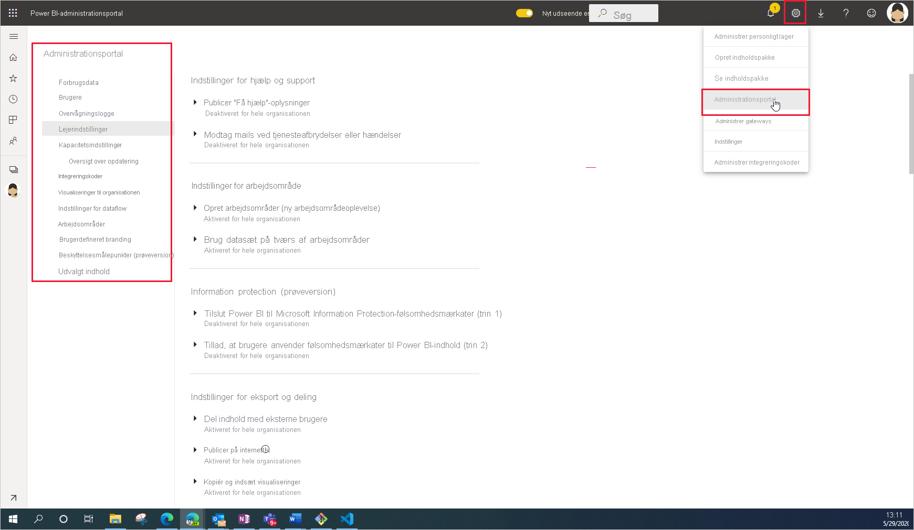

# Hvad er Power BI-administration

Power BI-administration er administration af de indstillinger, der gælder for hele organisationen, og som styrer, hvordan Power BI fungerer. Brugere, der er tildelt administratorroller, konfigurerer, overvåger og klargør organisationens ressourcer. Denne artikel indeholder en oversigt over administratorroller, -opgaver og -værktøjer, der hjælper dig til at komme i gang.

## Administratorroller, der er relateret til Power BI

Der er flere roller, der arbejder sammen for at administrere Power BI for din organisation. De fleste administratorroller tildeles i Microsoft 365 Administration eller ved hjælp af PowerShell. Administratorrollerne Power BI Premium-kapacitet og Power BI Embedded-kapacitet tildeles, når kapaciteten oprettes. Hvis du vil vide mere om de enkelte administratorroller, kan du se [Om administratorroller](https://docs.microsoft.com/microsoft-365/admin/add-users/about-admin-roles?view=o365-worldwide). Du kan få mere at vide om, hvordan du tildeler administratorroller under [Tildel administratorroller](https://docs.microsoft.com/microsoft-365/admin/add-users/assign-admin-roles?view=o365-worldwide).

| **Type af administrator** | **Administrativt omfang** | **Power BI-opgaver** |
| --- | --- | --- |
| Global administrator | Microsoft 365 | Har ubegrænset adgang til alle administrationsfunktioner i virksomheden |
| | | Tildeler roller til andre brugere |
| Faktureringsadministration | Microsoft 365 | Administrer abonnementer |
| | | Køb licenser |
| Licensadministrator | Microsoft 365 | Tildel eller fjern licenser til brugere |
| Brugeradministrator | Microsoft 365 | Opret og administrer brugere og grupper |
| | | Nulstil brugeradgangskoder |
| Power BI Administration | Power BI-tjeneste | Fuld adgang til administrationsopgaver for Power BI|
| | | Aktivér og deaktiver Power BI-funktioner |
| | | Rapportér om brug og ydeevne |
| | | Gennemse og administrer overvågning |
| Administration af Power BI Premium-kapacitet | En enkelt Premium-kapacitet | Tildele arbejdsområder til kapaciteten.|
| | | Administrer brugertilladelser til kapaciteten |
| | | Administrer arbejdsbelastninger for at konfigurere hukommelsesforbrug |
| | | Genstart kapaciteten |
| Administrator af Power BI Embedded-kapacitet | En enkelt Embedded-kapacitet | Tildele arbejdsområder til kapaciteten.|
| | | Administrer brugertilladelser til kapaciteten |
| | | Administrer arbejdsbelastninger for at konfigurere hukommelsesforbrug |
| | | Genstart kapaciteten |

## Administrative opgaver og værktøjer

Power BI-administratorer fungerer primært på Power BI-administrationsportalen. Du bør dog have kendskab til relaterede værktøjer og administrationscentre. Se på ovenstående tabel for at finde ud af, hvilken rolle der kræves for at udføre opgaver ved hjælp af de værktøjer, der er angivet her.

| **Værktøj** | **Typiske opgaver** |
| --- | --- |
| [Power BI-administrationsportal](https://app.powerbi.com/admin-portal) | Opnå og arbejd med Premium-kapacitet |
| | Opnå tjenestekvalitet |
| | Administrer arbejdsområder |
| | Publicer Power BI-visuals |
| | Kontrollér koder, der bruges til at integrere Power BI i andre programmer |
| | Foretag fejlfinding af dataadgang og andre problemer |
| [Microsoft 365 Administration](https://admin.microsoft.com) | Administrer brugere og grupper |
| | Køb og tildel licenser |
| | Bloker brugeres adgang til Power BI |
| [Microsoft 365 Security & Compliance Center](https://protection.office.com) | Gennemse og administrer overvågning |
| | Dataklassificering og -sporing |
| | Politikker til forebyggelse af datatab |
| | Informationsstyring |
| [Azure Active Directory (AAD) på Azure-portalen](https://aad.portal.azure.com) | Konfigurer betinget adgang til Power BI-ressourcer |
| | Klargør Power BI Embedded-kapacitet |
| [PowerShell-cmdlet'er](https://docs.microsoft.com/powershell/power-bi/overview) | Administrer arbejdsområder og andre aspekter af Power BI via scripts |
| [Administrative API'er og SDK](service-admin-reference.md) | Byg brugerdefinerede administrationsværktøjer. Power BI Desktop kan f.eks. bruge disse API'er til at oprette rapporter ud fra data, der er relateret til administration. |

## Næste trin

Nu, hvor du kender den grundlæggende viden om, hvad der er involveret i Power BI-administration, kan du finde flere oplysninger i disse artikler:

- [Brug Power BI-administrationsportalen](service-admin-portal.md)
- [Vejledning til indstillinger for lejeradministrator](../guidance/admin-tenant-settings.md)
- [Brug PowerShell-cmdlet'er](https://docs.microsoft.com/powershell/power-bi/overview)
- [Ofte stillede spørgsmål om Power BI-administration](service-admin-faq.md)
- [Licens til Power BI-tjeneste for brugere i din organisation](service-admin-licensing-organization.md)
- Har du spørgsmål? [Prøv at spørge Power BI-community'et](https://community.powerbi.com/)
- Forslag? [Få ideer til at forbedre Power BI](https://ideas.powerbi.com/)
