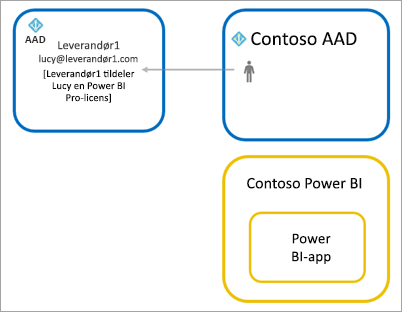

# Distribuer Power BI-indhold til eksterne gæstebrugere med Azure AD B2B

Power BI gør det muligt at dele indhold med eksterne gæstebrugere gennem Azure Active Directory Business-to-business (Azure AD B2B). Når du bruger Azure AD B2B, kan din organisation aktivere og styre deling med eksterne brugere på et centralt sted. Eksterne gæster har som standard kun erfaring på forbrugerniveau. Du kan desuden give gæstebrugere uden for din organisation adgang til at redigere og administrere indhold i din organisation.

Denne artikel indeholder en grundlæggende introduktion til Azure AD B2B i Power BI. Du kan finde flere oplysninger under [Distribuer Power BI-indhold til eksterne gæster ved hjælp af Azure Active Directory B2B](../guidance/whitepaper-azure-b2b-power-bi.md).

## Aktivér adgang

Sørg for at aktivere funktionen [Del indhold med eksterne brugere](service-admin-portal.md#export-and-sharing-settings) i Power BI-administrationsportalen, før du inviterer gæstebrugere. Selv når denne indstilling er aktiveret, skal brugeren have rollen Kan invitere gæster i Azure Active Directory for at invitere gæstebrugere.

Muligheden for at [give eksterne gæstebrugere tilladelse til at redigere og administrere indhold i organisationen](service-admin-portal.md#allow-external-guest-users-to-edit-and-manage-content-in-the-organization) lader dig give gæstebrugere mulighed for at se og oprette indhold i arbejdsområder, herunder gennemse organisationens Power BI.

> [!NOTE]
> Indstillingen [Del indhold med eksterne brugere](service-admin-portal.md#export-and-sharing-settings) styrer, om Power BI giver mulighed for at invitere eksterne brugere til din organisation. Efter at eksterne brugere har accepteret invitationen, bliver de Microsoft Azure Active Directory B2B-gæstebrugere i din organisation. De vises i personvælgere i hele Power BI-oplevelsen. Hvis indstillingen er deaktiveret, har eksisterende gæstebrugere i din organisation fortsat adgang til alle de elementer, de allerede havde adgang til, og vises fortsat i personvælgere. Hvis gæster er tilføjet via en [planlagt invitation](#planned-invites), vises de desuden i personvælgere. Brug en politik for betinget adgang til Azure Active Directory, hvis du vil forhindre gæstebrugere i at få adgang til Power BI.

## Hvem kan du invitere?

De fleste mailadresser understøttes for invitationer af gæstebrugere, herunder mailkonti som gmail.com, outlook.com og hotmail.com. I Azure AD B2B kaldes disse adresser for *sociale identiteter*.

Du kan ikke invitere brugere, der er knyttet til en offentlig cloud, f. eks. [Power BI til US Government](service-govus-overview.md).

## Inviter gæstebrugere

Gæstebrugere kræver kun en invitation, første gang du inviterer dem ind i organisationen. Hvis du vil invitere brugere, skal du bruge planlagte invitationer eller ad hoc-invitationer.

Hvis du vil bruge ad hoc-invitationer, skal du bruge følgende funktioner:

* Deling af rapporter og dashboards
* Appadgangsliste

Ad hoc-invitationer understøttes ikke for adgangslister for arbejdsområder. Brug [planlagte invitationer](#planned-invites) til at føje disse brugere til din organisation. Når de eksterne brugere er blevet gæster i din organisation, kan du føje dem til adgangslisterne for arbejdsområder.

### Planlagte invitationer

Brug en planlagt invitation, hvis du ved, hvilke brugere du vil invitere. Du kan sende invitationen ved hjælp af Azure Portal eller PowerShell. Du skal være tildelt rollen Brugeradministrator for at invitere personer.

Følg disse trin for at sende en invitation via Azure Portal.

1. På [Azure Portal](https://portal.azure.com) skal du vælge **Azure Active Directory**.

1. Under **Administrer** skal du vælge **Brugere** > **Alle brugere** > **Ny gæstebruger**.

    

1. Angiv en **mailadresse** og **personlig meddelelse**.

    

1. Vælg **Inviter**.

Hvis du vil invitere mere end én gæstebruger, skal du bruge PowerShell eller oprette en masseinvitation i Microsoft Azure Active Directory. Hvis du vil bruge PowerShell til masseinvitationen, skal du følge trinnene i [Selvstudium: Brug PowerShell til at masseinvitere Microsoft Azure Active Directory B2B-samarbejdsbrugere](/azure/active-directory/b2b/bulk-invite-powershell/). Hvis du vil bruge Azure Portal til masseinvitationen, skal du følge trinnene i [Selvstudium: Masseinviter Microsoft Azure Active Directory B2B-samarbejdsbrugere](/azure/active-directory/b2b/tutorial-bulk-invite/).

Gæstebrugerne skal vælge **Introduktion** i den mailinvitation, de modtager. Gæstebrugeren føjes derefter til organisationen.

### Ad hoc-invitationer

Du kan når som helst invitere en ekstern bruger ved at føje personen til dit dashboard eller din rapport via delingsfunktionen eller til din app via adgangssiden. Her er et eksempel på, hvad du skal gøre, når du inviterer en ekstern bruger til at anvende en app.

Gæstebrugeren modtager en mail med besked om, at du har delt appen med vedkommende.

Gæstebrugeren skal logge på med sin mailadresse for organisationen. Gæstebrugeren vil blive bedt om at acceptere invitationen, når vedkommende har logget på. Efter logon åbnes appen for gæstebrugeren. For at vende tilbage til appen skal vedkommende tilføje linket som bogmærke eller gemme mailen.

## Licensering

Gæstebrugeren skal have den korrekte licens for at få vist det indhold, du har delt. Der er tre muligheder for at sikre, at brugeren har den korrekte licens: Brug Power BI Premium, tildel en Power BI Pro-licens, eller brug gæstens Power BI Pro-licens.

[Gæstebrugere, der kan redigere og administrere indhold i organisationen](service-admin-portal.md#allow-external-guest-users-to-edit-and-manage-content-in-the-organization) skal bruge en Power BI Pro-licens til at bidrage med indhold til arbejdsområder eller dele indhold med andre.

### Brug Power BI Premium

Tildeling af arbejdsområdet til [Power BI Premium-kapacitet](service-premium-what-is.md) giver gæstebrugeren mulighed for at bruge appen uden at have en Power BI Pro-licens. Med Power BI Premium kan apps også drage fordel af andre funktioner, f.eks. øget opdateringshastighed, dedikeret kapacitet og store modelstørrelser.

### Tildel en Power BI Pro-licens til en gæstebruger

Tildeling af en Power BI Pro-licens fra organisationen til en gæstebruger giver gæstebrugeren mulighed for at få vist indholdet, der deles med den pågældende. Du kan finde flere oplysninger om tildeling af licenser under [Tildel licenser til brugere på siden Licenser](/office365/admin/manage/assign-licenses-to-users#assign-licenses-to-users-on-the-licenses-page). Før du tildeler Pro-licenser til gæstebrugere, skal du kontakte din Microsoft-kontorepræsentant for at sikre, at du overholder vilkårene i din aftale med Microsoft.

### Gæstebrugeren medtager sin egen Power BI Pro-licens

Gæstebrugeren har muligvis allerede en Power BI Pro-licens, der blev tildelt via den pågældendes egen organisation.

## Gæstebrugere, der kan redigere og administrere indhold

Når du bruger funktionen [Tillad, at eksterne gæstebrugere kan redigere og administrere indhold i organisationen](service-admin-portal.md#allow-external-guest-users-to-edit-and-manage-content-in-the-organization), får de angivne gæstebrugere yderligere adgang til din organisations Power BI. Gæster med tilladelse kan se alt indhold, de har tilladelse til, få adgang til startsiden, gennemse arbejdsområder, installere apps, se, hvor de er på adgangslisten, og bidrage med indhold til arbejdsområder. De kan oprette eller være administrator af arbejdsområder, der bruger den nye oplevelse i arbejdsområdet. Der er visse begrænsninger. Du finder en liste over disse begrænsninger i afsnittet Overvejelser og begrænsninger.

Du kan hjælpe gæster med tilladelse med at logge på Power BI ved at give dem lejerens URL-adresse. Du kan finde lejerens URL-adresse ved at følge disse trin.

1. Vælg hjælp ( **?** ) i den øverste menu i Power BI, og vælg derefter **Om Power BI**.

2. Søg efter værdien ud for **Lejerens URL-adresse**. Del lejerens URL-adresse med de gæstebrugere, du har givet tilladelse.

    

## Overvejelser og begrænsninger

* Med ekstern Azure AD B2B begrænses gæster som standard til udelukkende at kunne forbruge indhold. Eksterne Azure AD B2B-gæster kan få vist apps, dashboards og rapporter samt eksportere data og oprette mailabonnementer på dashboards og rapporter. De kan ikke få adgang til arbejdsområder eller udgive deres eget indhold. Hvis du vil fjerne disse begrænsninger, kan du bruge funktionen [Tillad, at eksterne brugere kan redigere og administrere indhold i organisationen](service-admin-portal.md#allow-external-guest-users-to-edit-and-manage-content-in-the-organization).

* Hvis du vil invitere gæstebrugere, kræves der en Power BI Pro-licens. Brugere af Pro-prøveversioner kan ikke invitere gæstebrugere til Power BI.

* Nogle oplevelser er ikke tilgængelige for [gæstebrugere, der kan redigere og administrere indhold i organisationen](service-admin-portal.md#allow-external-guest-users-to-edit-and-manage-content-in-the-organization). Hvis gæstebrugerne skal opdatere eller publicere rapporter, skal de bruge Power BI-tjenesten, herunder Hent data, for at overføre Power BI Desktop-filer.  Følgende funktioner understøttes ikke:
  * Direkte publicering fra Power BI Desktop til Power BI-tjenesten.
  * Gæstebrugere kan ikke bruge Power BI Desktop til at oprette forbindelse til tjenestedatasæt i Power BI-tjenesten
  * Klassiske arbejdsområder, der er knyttet til Microsoft 365-grupper
    * Gæstebrugere kan ikke oprette eller være administrator af disse arbejdsområder
    * Gæstebrugere kan være medlemmer
  * Afsendelse af ad hoc-invitationer understøttes ikke for adgangslister for arbejdsområder
  * Power BI Publisher til Excel understøttes ikke for gæstebrugere
  * Gæstebrugere kan ikke installere en Power BI Gateway og forbinde den med din organisation
  * Gæstebrugere kan ikke installere apps, der publiceres til hele organisationen
  * Gæstebrugere kan ikke bruge, oprette, opdatere eller installere organisationsindholdspakker
  * Gæstebrugere kan ikke anvende Analysér i Excel
  * Gæstebrugere må ikke være @mentioned i kommentarer
  * Gæstebrugere kan ikke bruge abonnementer
  * Gæstebrugere, der bruger denne funktion, skal have en arbejds- eller skolekonto

* Der er flere begrænsninger for de gæstebrugere, der bruger sociale identiteter, på grund af logonbegrænsninger.
  * De kan bruge forbrugsoplevelser i Power BI-tjenesten via en webbrowser
  * De kan ikke bruge Power BI – Mobil-apps
  * De kan ikke logge på, hvor der kræves en arbejds- eller skolekonto

* Denne funktion er i øjeblikket ikke tilgængelig med rapportwebdelen til Power BI SharePoint Online.

* Der findes Microsoft Azure Active Directory-indstillinger, der kan begrænse, hvad eksterne gæstebrugere kan foretage sig overordnet i organisationen. De pågældende indstillinger gælder også for dit Power BI-miljø. I følgende dokumentation beskrives indstillingerne:
  * [Administrer indstillinger for eksternt samarbejde](/azure/active-directory/b2b/delegate-invitations#configure-b2b-external-collaboration-settings)
  * [Tillad eller bloker invitationer til B2B-brugere fra bestemte organisationer](https://docs.microsoft.com/azure/active-directory/b2b/allow-deny-list)
  * [Brug betinget adgang til at tillade eller blokere adgang](/azure/active-directory/conditional-access/concept-conditional-access-cloud-apps)

* Du kan dele indhold fra en offentlig cloud, f. eks. GCC, med en ekstern kommerciel cloudbruger. Gæstebrugeren kan dog ikke bruge sin egen licens. Indholdet skal være i den kapacitet, der er tildelt til Premium, for at der er adgang. Du kan også tildele en Power BI Pro-licens til gæstekontoen.

* Deling uden for din organisation understøttes ikke i nationale cloudmiljøer, f. eks. cloudforekomster i Tyskland eller Kina. I stedet skal du oprette brugerkonti i din organisation, som eksterne brugere kan bruge til at få adgang til indholdet.

* Hvis du deler direkte med en gæstebruger, sender Power BI en mail til dem med linket. Hvis du vil undgå at sende en mail, skal du føje gæstebrugeren til en sikkerhedsgruppe og dele med sikkerhedsgruppen.  

## Næste trin

Du kan finde flere oplysninger, herunder hvordan sikkerhed på rækkeniveau fungerer, i dette whitepaper: [Distribuer Power BI-indhold til eksterne gæstebrugere med Azure AD B2B](https://aka.ms/powerbi-b2b-whitepaper).

Du kan finde oplysninger om Azure AD B2B i [Hvad er Azure AD B2B-samarbejde?](/azure/active-directory/active-directory-b2b-what-is-azure-ad-b2b/).
