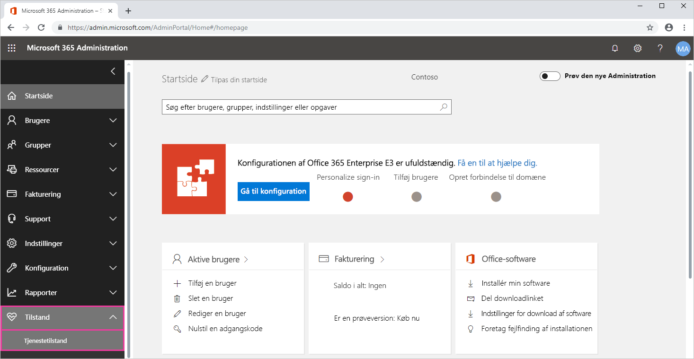
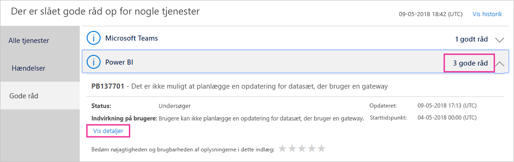

# Registrer Power BI-tjenestetilstand i Office 365

Microsoft 365 Administration indeholder vigtige værktøjer til Power BI-administratorer. Disse værktøjer omfatter aktuelle og historiske oplysninger om tjenestetilstand. Du skal have en af følgende roller for at få adgang til oplysningerne om tjenestetilstand:

* Power BI Service Administrator

* Office 365 Global Administrator

Du kan finde flere oplysninger om roller under [Administratorroller, der er relateret til Power BI](service-admin-administering-power-bi-in-your-organization.md#administrator-roles-related-to-power-bi).

1. Log på [Microsoft 365 Administration](https://portal.office.com/adminportal).

1. Vælg **Vis alle** > **Tilstand** > **Tjenestetilstand** i navigationsruden. Siden Tjenestetilstand vises:

    

1. På listen **Alle tjenester** skal du vælge **Varsler** eller **Hændelser** og gennemse resultaterne. På skærmbilledet herunder kan du se et af tre aktive varsler.

    

1. Du kan se flere oplysninger ved at vælge **Vis oplysninger** for et element. På skærmbilledet herunder kan du se yderligere detaljer, herunder de nyeste statusopdateringer.

    

    Rul ned for at se flere oplysninger, og luk ruden, når du er færdig.

1. Hvis du vil se historiske oplysninger på tværs af alle tjenester, skal du vælge **Vis historik** øverst til højre på siden **Tjenestetilstand**. Vælg derefter **Seneste 7 dage** eller **Seneste 30 dage**. 

1. Vælg **Vis aktuel status** for at vende tilbage til den aktuelle tjenestetilstand.