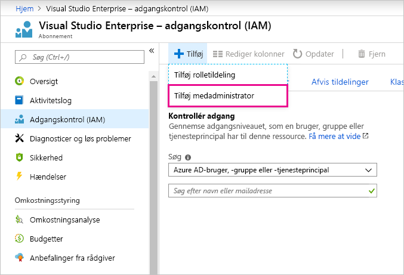

# Brug af den samme konto til Power BI og Azure

Hvis du både bruger Power BI og Azure, kan du med fordel bruge samme logon til begge tjenester, så du ikke er nødt til at indtaste din adgangskode to gange.

Power BI logger dig på med din organisationskonto, der er knyttet til din arbejds- eller skolemailadresse.  Azure logger dig på med enten en Microsoft-konto eller din organisationskonto.

Hvis du vil bruge samme logon til både Azure og Power BI, skal du logge på Azure med din organisationskonto.

**Hvad sker der, hvis jeg allerede logger på Azure med min Microsoft-konto?**

Du kan tilføje din organisationskonto som en medadministrator i Azure ved at benytte denne fremgangsmåde:

1. Log på [Azure Portal](https://portal.azure.com/). Hvis du bruger flere Azure-mapper, skal du vælge **Abonnementer** og derefter filtrere for kun at få vist den relevante mappe og de abonnementer, du vil redigere.

1. Vælg **Adgangskontrol (IAM)** i navigationsruden, og vælg derefter **Tilføj** \> **Tilføj medadministrator**.

    

1. Angiv den mailadresse, der er tilknyttet din organisationskonto, og vælg **Tilføj**.

1. Næste gang du logger på Azure-administrationsportalen, skal du bruge din organisationsmailadresse.

Har du flere spørgsmål? [Prøv at spørge Power BI-community'et](https://community.powerbi.com/)
