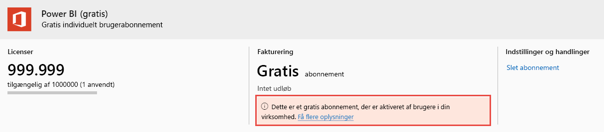

# Få vist og administrer Power BI-brugerlicenser

Denne artikel indeholder en beskrivelse af, hvordan administratorer kan bruge Microsoft 365 Administration eller Azure Portal til at få vist og administrere brugerlicenser.

> [!NOTE]
>
>En bruger kan være tildelt både en Power BI-licens (gratis) og en Power BI Pro-licens. Dette kan ske, når en bruger tilmelder sig en gratis licens og senere tildeles en Power BI Pro-licens. I så fald gælder det højeste licensniveau.
>

## Få vist dine abonnementer

Du kan se, hvilke Power BI-abonnementer din organisation har, ved at følge disse trin.

1. Log på [Microsoft 365 Administration](https://admin.microsoft.com).
2. I navigationsmenuen skal du vælge **Fakturering** > **Produkter og tjenester**.

Dine aktive Power BI-abonnementer vises sammen med dine andre abonnementer. Du kan måske se et uventet abonnement på Power BI (gratis), som vist her.

  

Denne type abonnement oprettes for dig, når brugerne benytter sig af tilmelding via selvbetjening. Hvis du vil vide mere, skal du se [Power BI i din organisation](https://docs.microsoft.com/microsoft-365/admin/misc/power-bi-in-your-organization?view=o365-worldwide).

## Administrer brugerlicenser i Microsoft 365

Hvis du vil bruge Microsoft 365 Administration til at administrere brugerlicenser, skal du se [Dokumentation til virksomhedsabonnementer og fakturering](https://docs.microsoft.com/microsoft-365/commerce/?view=o365-worldwide).

## Administrer brugerlicenser på Azure Portal

Følg disse trin for at få vist og tildele Power BI-licenser ved hjælp af Azure Portal.

1. Log på [Azure Portal](https://portal.azure.com).

2. Søg efter og vælg **Azure Active Directory**.

3. Under **Administrer** i ressourcemenuen i Azure Active Directory skal du vælge **Licenser**.

4. Vælg **Alle produkter** i ressourcemenuen, og vælg derefter den Power BI-licenstype, du vil have vist på listen over licenserede brugere.

5. Vælg **+ Tildel** i kommandolinjen for at tildele en licens. På siden **Tildel licens** skal du vælge en bruger og derefter vælge **Tildelingsindstillinger** for at aktivere en Power BI-licens for den valgte brugerkonto.

6. Hvis du vil fjerne en licens, skal du markere afkrydsningsfeltet ud for brugerens navn og derefter vælge **Fjern licens**.

## Næste trin

- [Køb Power BI Pro](../service-admin-purchasing-power-bi-pro.md)
- [Licenser til din organisation](../service-admin-licensing-organization.md)
