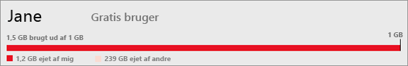
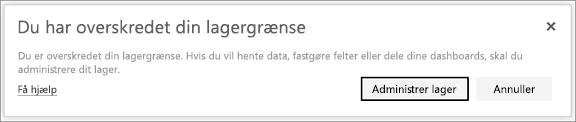

# Administrer datalager i Power BI-arbejdsområder

Få mere at vide om, hvordan du administrerer dit datalager i dit individuelle område eller arbejdsområde, så du kan fortsætte med at publicere rapporter og datasæt.

## Grænser for kapacitet

Lagerbegrænsninger for arbejdsområdet, uanset om det er i mit arbejdsområde eller i en apps arbejdsområde, afhænger af, om arbejdsområdet er i [delt eller Premium-kapacitet](../fundamentals/service-basic-concepts.md#capacities).

### Grænser for delt kapacitet
For arbejdsområder i delt kapacitet: 

- Der er en lagergrænse pr. arbejdsområde på 100 GB.
- I forbindelse med arbejdsområder i apps kan det samlede forbrug ikke overstige lejerens lagergrænse på 10 GB ganget med antallet af Pro-licenser i lejeren.

### Grænser for Premium-kapacitet
For arbejdsområder i Premium-kapacitet:
- Der er en grænse på 100 TB pr. Premium-kapacitet.
- Der er ingen lagergrænse pr. bruger.

Læs om andre funktioner i [prismodellen for Power BI](https://powerbi.microsoft.com/pricing).

## Dette er inkluderet i lageret

Inkluderet i dit datalager er dine egne datasæt og Excel-rapporter samt de elementer, som nogen har delt med dig. Datasæt er de datakilder, du har uploadet eller oprettet forbindelse til. Disse datakilder omfatter de Power BI Desktop-filer og Excel-projektmapper, du bruger. Følgende er også medtaget i din datakapacitet.

* Excel-områder, der er fastgjort til et dashboard.
* Reporting Services-visualiseringer i det lokale miljø, der er fastgjort til et Power BI-dashboard.
* Uploadede billeder.

Størrelsen på et dashboard, som du deler, varierer, afhængigt af hvad der er fastgjort til det. Hvis du f.eks. fastgør elementer fra to rapporter, der er en del af to forskellige datasæt, omfatter størrelsen begge datasæt.

<a name="manage"/>

## Administrer de elementer, du ejer

Se, hvor meget datalager, du bruger på din Power BI-konto, og administrer din konto.

1. Hvis du vil administrere dit eget lager, skal du gå til **Mit arbejdsområde** i navigationsruden.
   
    

2. Vælg tandhjulsikonet  i øverste højre hjørne \> **Administrer personligt lager**.
   
    Den øverste bjælke viser, hvor meget af din maksimale lagerkapacitet du har brugt.
   
    
   
    Datasæt og rapporter er opdelt på to faner:
   
    **Ejet af mig:** Du har uploadet disse rapporter og datasæt til din Power BI-konto, herunder tjenestedatasæt som f.eks. Salesforce og Dynamics CRM.  

    **Ejet af andre:** Andre har delt disse rapporter og datasæt med dig.
1. Hvis du vil slette et datasæt eller en rapport, skal du vælge ikonet for Papirkurv .

Vær opmærksom på, at du eller en anden muligvis har rapporter og dashboards, der er baseret på et datasæt. Hvis du sletter datasættet, fungerer disse rapporter og dashboards ikke længere.

## Administrer dit arbejdsområde
1. Vælg pilen ud for **Arbejdsområder** \> vælg navnet på arbejdsområdet.
   
    
2. Vælg tandhjulsikonet  i øverste højre hjørne \> **Administrer gruppelager**.
   
    Den øverste bjælke viser, hvor meget af gruppens maksimale lagerkapacitet der er brugt.
   
    
   
    Datasæt og rapporter er opdelt på to faner:
   
    **Ejet af os:** Du eller en anden har uploadet disse rapporter og datasæt til gruppens Power BI-konto, herunder tjenestedatasæt som f.eks. Salesforce og Dynamics CRM.

    **Ejet af andre:** Andre har delt disse rapporter og datasæt med din gruppe.

3. Hvis du vil slette et datasæt eller en rapport, skal du vælge ikonet for Papirkurv .
   
   > [!NOTE]
   > Vær opmærksom på, at du eller en anden i gruppen muligvis har rapporter og dashboards, der er baseret på et datasæt. Hvis du sletter datasættet, fungerer disse rapporter og dashboards ikke længere.
   
   Et hvilket som helst medlem af et arbejdsområde med rolle som administrator, medlem eller bidragyder kan slette datasæt og rapporter fra arbejdsområdet.

## Begrænsninger for datasæt
Der er en grænse på 1 GB pr. datasæt, der indlæses i Power BI. Hvis du har valgt at beholde Excel-oplevelsen i stedet for at importere dataene, er grænsen 250 MB for datasættet.

## Det sker der, når du når grænsen
Når du når din grænse for datakapacitet, får du vist meddelelser i tjenesten. 

Når du vælger tandhjulsikonet , får du vist en rød linje, der angiver, at du har overskredet din datakapacitet.

Denne grænse angives også i **Administrer personligt lager**.

 

 Når du forsøger at udføre en handling, som gør, at du når en af grænserne, får du vist en meddelelse, der angiver, at du har overskredet grænsen. Du kan [administrere](#manage) dit lager for at reducere mængden af lagret indhold og komme under grænsen.

 

 ## Næste trin

 Har du flere spørgsmål? [Prøv at spørge Power BI-community'et](https://community.powerbi.com/)
