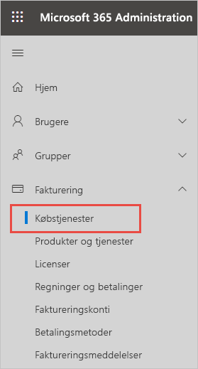
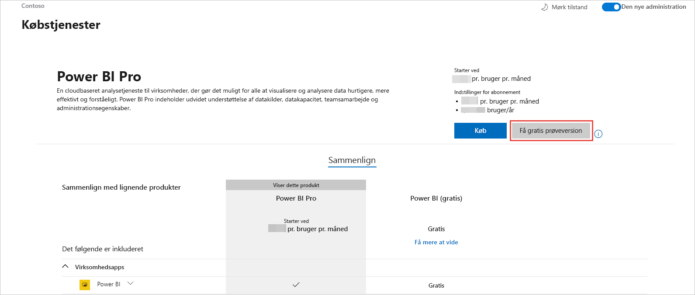
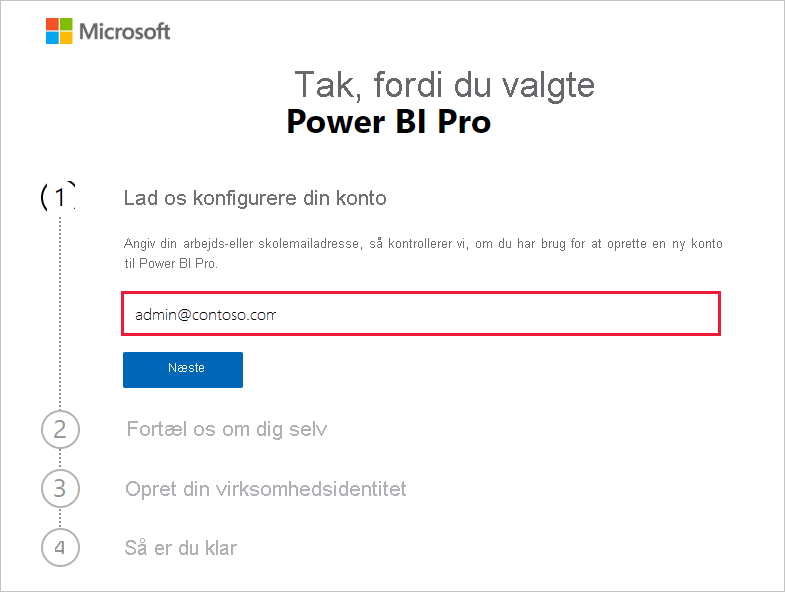
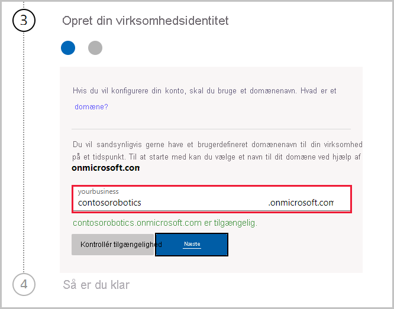

# Få et Power BI-abonnement til din organisation

Administratorer kan tilmelde sig Power BI via siden **Køb tjenester** i Microsoft 365 Administration. Når en administrator tilmelder sig Power BI, kan vedkommende tildele licenser til brugere, der bør have adgang.

Brugere i organisationen kan tilmelde sig Power BI via Power BI-webstedet. Når en bruger i organisationen tilmelder sig Power BI, tildeles brugeren automatisk en Power BI-licens. Hvis du vil slå funktionaliteten til selvbetjening fra, skal du følge trinnene i [Aktivér eller deaktiver tilmelding og køb via selvbetjening](service-admin-disable-self-service.md).

## Tilmeld dig via Microsoft 365

Hvis du er global administrator eller faktureringsadministrator, kan du få et Power BI-abonnement til din organisation. Du kan få flere oplysninger under [Hvem kan købe og tildele licenser?](service-admin-licensing-organization.md#who-can-purchase-and-assign-licenses)

> [!NOTE]
>
> Et Microsoft 365 E5-abonnement indeholder allerede Power BI Pro-licenser. Du kan få mere at vide om, hvordan du administrerer licenser, under [Få vist og administrer brugerlicenser](service-admin-manage-licenses.md).
>
>

Følg disse trin for at købe Power BI Pro-licenser via Microsoft 365 Administration:

1. Log på [Microsoft 365 Administration](https://admin.microsoft.com).

2. I navigationsmenuen skal du vælge **Fakturering** > **Køb tjenester**.
  
   

3. Søg efter eller rul for at finde det abonnement, du vil købe. Du kan finde **Power BI** under **andre kategorier, der kan have interesse for dig**, nederst på siden. Vælg linket for at få vist de Power BI-abonnementer, der er tilgængelige for din organisation.

4. Vælg et tilbud, f.eks. Power BI Pro.

5. Vælg **Køb** på siden **Køb tjenester**. Hvis du ikke tidligere har brugt det, kan du starte med et gratis prøveabonnement på Power BI Pro. Det omfatter 25 licenser og udløber om en måned.

   

6. Vælg **Betal en gang om måneden** eller **Betal for et helt år**, afhængigt af hvordan du vil betale.

7. Angiv det ønskede antal licenser, du vil købe, under **Hvor mange brugere ønsker du?** , og vælg derefter **Gå til kassen** for at gennemføre transaktionen.

8. Du bekræfter dit køb ved at gå til **Fakturering** > **Produkter og tjenester** og finde **Power BI Pro**.

Du kan læse mere om, hvordan din organisation kan styre og få Power BI-tjenesten i [Power BI i din organisation](https://docs.microsoft.com/microsoft-365/admin/misc/power-bi-in-your-organization?view=o365-worldwide).

## Flere måder at få Power BI til organisationen på

Hvis du ikke allerede er Microsoft 365-abonnent, kan du følge trinnene herunder for at få en prøveversion af Power BI Pro til din organisation. Eller du kan [tilmelde dig en ny prøveversion af Microsoft 365](service-admin-signing-up-for-power-bi-with-a-new-office-365-trial.md) og derefter tilføje Power BI ved at følge trinnene i foregående afsnit.

Du skal bruge en arbejds- eller skolekonto for at tilmelde dig et Power BI-abonnement. Vi understøtter ikke mailadresser, der leveres af forbrugermailtjenester eller udbydere af telekommunikation. Hvis du ikke har en arbejds- eller skolekonto, kan du oprette en under tilmeldingen.

Følge disse trin for at tilmelde dig:

1. Gå til [Tilmelding til Power BI Pro](https://signup.microsoft.com/create-account/signup?OfferId=d59682f3-3e3b-4686-9c00-7c7c1c736085&ali=1&products=d59682f3-3e3b-4686-9c00-7c7c1c736085). 

2. Angiv din arbejds- eller skolemailadresse, og vælg derefter **Næste**. Det er okay, hvis du angiver en mailadresse, der ikke anses for at være en arbejds- eller skolemailadresse. Der konfigureres en ny konto for dig, når du opretter din virksomhedsidentitet.

   

3. Der køres et hurtigt tjek for at se, om du skal oprette en ny konto. Vælg **Konfigurer konto** for at fortsætte med tilmeldingsprocessen.

   > [!NOTE]
   >Hvis din mailadresse allerede er i brug med en anden Microsoft-tjeneste, kan du i stedet **logge på** eller **oprette en ny konto**. Hvis du vælger at oprette en ny konto, skal du fortsætte med at følge disse trin for at komme i gang.
>
>
 
4. Udfyld formularen for at fortælle os om dig selv. Sørg for at vælge det korrekte land eller område. Det land, du vælger, bestemmer, hvor dine data gemmes, som forklaret i [Sådan afgør du, hvor din Power BI-lejer er placeret](service-admin-where-is-my-tenant-located.md#how-to-determine-where-your-power-bi-tenant-is-located).

   

5. Vælg **Næste**. Vi er nødt til at sende en bekræftelseskode for at bekræfte din identitet. Angiv et telefonnummer, som vi kan sende dig en sms eller ringe dig op på. Vælg derefter **Send bekræftelseskode**.

6. Angiv bekræftelseskoden, og fortsæt derefter til **Opret din virksomhedsidentitet**.

   

    Angiv et kort navn på din virksomhed, så tjekker vi, om det er tilgængeligt. Vi bruger dette korte navn til at oprette dit organisationsnavn i datacenteret som et underdomæne af onmicrosoft.com. Du kan tilføje dit eget virksomhedsdomæne senere. Du skal ikke være bekymret, hvis det korte navn, du vil have, er taget. Andre med et lignende virksomhedsnavn har sandsynligvis valgt det samme korte navn. Prøv blot en anden variant. Vælg **Næste**.
    
7. Opret dit bruger-id og din adgangskode for at logge på din konto. Vælg **Tilmeld dig**, så er du klar.

Den konto, du har oprettet, er nu den globale administrator af en ny prøveversion af Power BI Pro-lejeren. Du kan logge på [Microsoft 365 Administration](https://admin.microsoft.com) for at tilføje flere brugere, konfigurere et brugerdefineret domæne, købe flere tjenester og administrere dit Power BI-abonnement.

## Næste trin

- [Få vist og administrer brugerlicenser](service-admin-manage-licenses.md)
- [Aktivér eller deaktiver tilmelding og køb via selvbetjening](service-admin-disable-self-service.md)
- [Virksomhedsabonnementer og faktureringsdokumentation](https://docs.microsoft.com/microsoft-365/commerce/?view=o365-worldwide)
