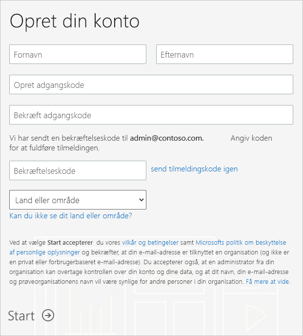

# Få et Power BI-abonnement til din organisation

Som administrator kan du tilmelde dig Power BI på [Power BI-webstedet](https://powerbi.microsoft.com). Du kan også tilmelde dig på siderne til køb af tjenesten i Microsoft 365 Administration. Når en administrator tilmelder sig Power BI, kan vedkommende tildele licenser til brugere, der bør have adgang.

Individuelle brugere i din organisation kan derudover muligvis tilmelde sig Power BI på Power BI-webstedet. Når en bruger i organisationen tilmelder sig Power BI, tildeles brugeren automatisk en Power BI-licens. Hvis du vil slå denne funktion fra, skal du følge fremgangsmåden under [Aktivér eller deaktiver tilmelding og indkøb via selvbetjening](service-admin-disable-self-service.md).

## Tilmeld dig via Power BI

Du skal bruge en arbejds- eller skolekonto for at tilmelde dig et Power BI-abonnement. Vi understøtter ikke mailadresser, der leveres af forbrugermailtjenester eller udbydere af telekommunikation.

Følge disse trin for at tilmelde dig:

1. Gå til [Power BI-webstedet](https://powerbi.microsoft.com). Vælg **Prøv gratis**.
2. Angiv din arbejdsmailadresse, og vælg derefter **Tilmeld dig**.

   

3. Bekræft din identitet. Vi ringer til dig eller sender en sms med en bekræftelseskode, der skal bruges.
4. Vælg **Ja** for at bekræfte, at du bruger en mailadresse, som du har fået fra din virksomhed.
5. Opret din konto. Vi sender en bekræftelseskode til din mailadresse for at fuldføre tilmeldingen.

   

## Tilmeld dig via Microsoft 365

Hvis du er global administrator eller faktureringsadministrator af Microsoft 365, kan du få et Power BI-abonnement til din organisation. Du kan få flere oplysninger under [Hvem kan købe og tildele licenser?](service-admin-licensing-organization.md#who-can-purchase-and-assign-licenses)

> [!NOTE]
>
> Et Microsoft 365 E5-abonnement indeholder allerede Power BI Pro-licenser. Du kan få mere at vide om, hvordan du administrerer licenser, under [Få vist og administrer brugerlicenser](service-admin-manage-licenses.md).
>
>

Følg disse trin for at købe Power BI Pro-licenser via Microsoft 365 Administration:

1. Log på [Microsoft 365 Administration](https://admin.microsoft.com).

2. I navigationsmenuen skal du vælge **Fakturering** > **Køb tjenester**.
  
   

3. Søg efter eller rul for at finde det abonnement, du vil købe. Du kan finde **Power BI** under **andre kategorier, der kan have interesse for dig**, nederst på siden. Vælg linket for at få vist de Power BI-abonnementer, der er tilgængelige for din organisation.

4. Vælg et tilbud, f.eks. Power BI Pro.

5. Vælg **Køb** på siden **Køb tjenester**. Hvis du ikke tidligere har brugt det, kan du starte med et gratis prøveabonnement på Power BI Pro. Det omfatter 25 licenser og udløber om en måned.

   

6. Vælg **Betal en gang om måneden** eller **Betal for et helt år**, afhængigt af hvordan du vil betale.

7. Angiv det ønskede antal licenser, du vil købe, under **Hvor mange brugere ønsker du?** , og vælg derefter **Gå til kassen** for at gennemføre transaktionen.

8. Du bekræfter dit køb ved at gå til **Fakturering** > **Produkter og tjenester** og finde **Power BI Pro**.

Hvis du vil læse mere om, hvordan din organisation får Power BI-tjenesten, kan du se under [Power BI i din organisation](https://docs.microsoft.com/microsoft-365/admin/misc/power-bi-in-your-organization?view=o365-worldwide).

## Næste trin

- [Få vist og administrer brugerlicenser](service-admin-manage-licenses.md)
- [Aktivér eller deaktiver tilmelding og køb via selvbetjening](service-admin-disable-self-service.md)
- [Virksomhedsabonnementer og faktureringsdokumentation](https://docs.microsoft.com/microsoft-365/commerce/?view=o365-worldwide)
