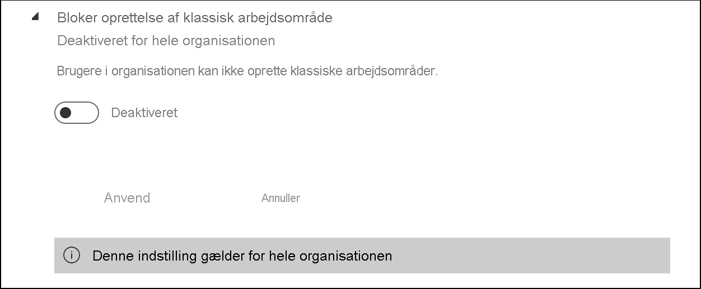
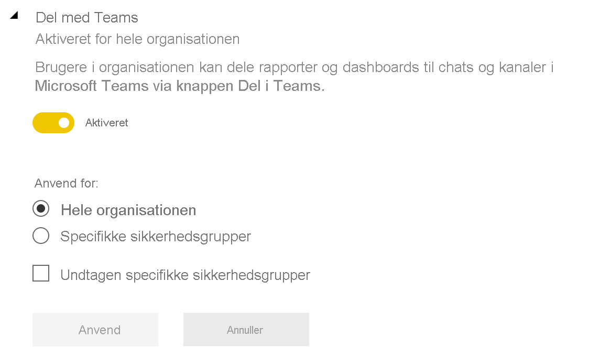

# Administrer Power BI på administrationsportalen

På administrationsportalen kan du administrere Power BI-indstillingerne for din virksomhed. Portalen indeholder elementer såsom forbrugsdata, adgang til Microsoft 365 Administration og lejerindstillinger.

Globale administratorer og brugere, der har rollen som Power BI-tjeneste administrator, kan få adgang til hele administrationsportalen. Hvis du ikke har en af disse roller, kan du kun se **Kapacitetsindstillinger** på portalen. Du kan finde flere oplysninger om Power BI-tjenesteadministratorrollen under [Beskrivelse af rollen som Power BI-administrator](service-admin-role.md).

## Sådan finder du vej til administrationsportalen

Du skal være global administrator eller Power BI-tjenesteadministrator for at få adgang til Power BI-administrationsportalen. Du kan finde flere oplysninger om Power BI-tjenesteadministratorrollen under [Beskrivelse af rollen som Power BI-administrator](service-admin-role.md). Benyt følgende fremgangsmåde for at oprette adgang til Power BI-administrationsportalen:

1. Log på [Power BI](https://app.powerbi.com) ved hjælp af legitimationsoplysningerne til din administratorkonto.

1. Vælg **Indstillinger** > **Administrationportal** i sidehovedet.

    

Der er flere afsnit på administrationsportalen. Resten af denne artikel indeholder oplysninger om hver af disse afsnit.

* [Forbrugsdata](#usage-metrics)
* [Brugere](#users)
* [Overvågningslogge](#audit-logs)
* [Lejerindstillinger](#tenant-settings)
* [Kapacitetsindstillinger](#capacity-settings)
* [Integrer koder](#embed-codes)
* [Visualiseringer til organisationen](organizational-visuals.md#organizational-visuals)
* [Azure-forbindelser (prøveversion)](#azure-connections-preview)
* [Arbejdsområder](#workspaces)
* [Brugerdefineret branding](#custom-branding)
* [Målepunkter for beskyttelse](#protection-metrics)
* [Udvalgt indhold](#featured-content)

## Forbrugsdata

Med **Forbrugsdata** kan du overvåge Power BI-forbruget i organisationen. Du kan også se, hvilke brugere og grupper i din organisation der er mest aktive i Power BI.

> [!NOTE]
> Første gang du tilgår dashboard'et, eller når du besøger det igen efter en lang periode uden at åbne dashboard'et, så får du sandsynligvis vist indlæsningsskærmen, mens vi indlæser dashboard'et.

Når dashboardet er indlæst, får du vist to afsnit med felter. Det første afsnit indeholder forbrugsdata for individuelle brugere, og det andet afsnit har lignende oplysninger for grupper.

Nedenfor er en oversigt over indholdet i hvert felt:

* Specifik optælling af alle dashboards, rapporter og datasæt i brugerarbejdsområdet.
  
    

* Mest brugte dashboard efter antallet af brugere, der har adgang til det. Eksempel: Du har et dashboard, som du har delt med tre brugere. Du har også føjet dashboardet til en indholdspakke, som to forskellige brugere har oprettet forbindelse til. Dashboardantallet ville være 6 (1 + 3 + 2).
  
    

* Det mest populære indhold, som brugere har oprettet forbindelse til. Dette vil være alt vilkårligt indhold, som brugere kan oprette adgang til gennem Hent data-processen, f.eks. Saas-indholdspakker, organisatoriske indholdspakker, filer eller databaser.

  
    

* En visning af dine vigtigste brugere baseret på, hvor mange dashboards de har, både dashboards de selv har oprettet, og dashboards der er delt med dem.
  
    

* En visning af dine vigtigste brugere baseret på, hvor mange rapporter de har.
  
    

Det andet afsnit viser den samme type oplysninger, men baseret på grupper. I dette afnit kan du se, hvilke grupper i organisationen der er mest aktive, og hvilken slags indhold de bruger.

Disse oplysninger giver dig reel indsigt i, hvordan folk bruger Power BI på tværs af din organisation.

## Kontrollér forbrugsdata

Rapporter med forbrugsdata er en funktion, som Power BI- eller den globale administrator kan slå til eller fra. Administratorer har detaljeret kontrol over, hvilke brugere der har adgang til forbrugsdata. Det er slået **Til** som standard for alle brugere i organisationen.

Administratorer kan også bestemme, om oprettere af indhold kan se brugerspecifikke data i forbrugsdata. 

Få mere at vide om selve rapporterne under [Overvåg forbrugsdata for dashboards og rapporter](../collaborate-share/service-usage-metrics.md).

### Forbrugsdata for oprettere af indhold

1. På administrationsportalen skal du vælge **Lejerindstillinger** > **Indstillinger for overvågning og brug** > **Forbrugsdata for oprettere af indhold**.

    

1. Aktivér (eller deaktiver) forbrugsdata > **Anvend**.

    

### Brugerspecifikke data i forbrugsdata for indholdsforfattere

Brugerspecifikke data er som standard aktiveret for forbrugsdata, og kontooplysninger indgår i rapporten med forbrugsdata. Hvis du ikke vil medtage kontooplysninger for nogle eller alle brugere, kan du deaktivere funktionen for nærmere angivne sikkerhedsgrupper eller for en hel organisation. Kontooplysninger vises derefter i rapporten som *Ikke-navngivet*.

### Slet alt eksisterende forbrugsdataindhold

Når administratorer deaktiverer forbrugsdata for hele organisationen, kan de kan også vælge en af eller begge disse indstillinger:

- **Slet alt eksisterende forbrugsdataindhold** til at slette alle eksisterende rapporter og dashboardfelter, der blev oprettet ved hjælp af forbrugsdatarapporter og -datasæt. Denne indstilling fjerner al adgang til forbrugsdata for alle brugere i organisationen, som muligvis allerede anvender dem.
- **Slet alle eksisterende brugerspecifikke data i det aktuelle forbrugsdataindhold** Denne indstilling fjerner al adgang til forbrugsdata for alle brugere i organisationen, som muligvis allerede anvender dem. 

Vær forsigtig med at gøre dette, da sletning af eksisterende forbrugsdataindhold og brugerspecifikke data ikke kan fortrydes.

## Brugere

Du kan administrere Power BI-brugere, -grupper og -administratorer i Microsoft 365 Administration. Fanen **Brugere** indeholder et link til Administration.

## Overvågningslogge

Du kan administrere Power BI-overvågningslogge i Office 365 Security & Compliance Center. Fanen **Overvågningslogge** indeholder et link til Security & Compliance Center. Du kan finde flere oplysninger under [Spor brugeraktiviteter i Power BI](service-admin-auditing.md).

Hvis du vil bruge overvågningslogs, skal du sørge for, at indstillingen [**Opret overvågningslogs til overvågning af intern aktivitet og overholdelse af angivne standarder**](#create-audit-logs-for-internal-activity-auditing-and-compliance) er aktiveret.

## Lejerindstillinger

**Lejerindstillinger** giver dig detaljeret kontrol over de funktioner, der er til rådighed for din organisation. Hvis du har bekymringer om følsomme data, kan det være, at nogle af vores funktioner ikke er passende for din organisation, eller du vil måske kun have, at en bestemt funktion er tilgængelig for en bestemt gruppe.

> [!NOTE]
> Lejerindstillinger, der styrer tilgængeligheden af funktioner i Power BI-brugergrænsefladen, kan hjælpe med at oprette politikker for styring, men de er ikke en sikkerhedsmåling. Indstillingen **Eksport af data** begrænser f.eks. ikke tilladelser for en Power BI-bruger på et datasæt. Power BI-brugere med læseadgang til et datasæt har tilladelse til at forespørge dette datasæt og kan bevare resultaterne uden at bruge funktionen **Eksport af data** i Power BI-brugergrænsefladen.

På følgende billede ses flere indstillinger under fanen **Lejerindstillinger**.

> [!NOTE]
> Det kan tage op til 15 minutter, før indstillingen træder i kraft for alle i din organisation.

Indstillingerne kan have en af tre tilstande:

* **Deaktiveret for hele organisationen**: Ingen i din organisation kan bruge denne funktion.

    

* **Aktiveret for hele organisationen**: Alle i din organisation kan bruge denne funktion.

    

* **Aktiveret for en del af organisationen**: I stedet for at aktivere funktionen i hele organisationen kan du anvende indstillingen på **bestemte sikkerhedsgrupper** i din organisation, der har tilladelse til at bruge denne funktion.

    Du kan også aktivere en funktion for hele organisationen **med undtagelse af bestemte sikkerhedsgrupper**.

    

    Du kan også kombinere indstillinger for kun at aktivere funktionen for en bestemt gruppe brugere og deaktivere den for nogle brugere. Med denne tilgang sikrer du, at visse brugere ikke har adgang til funktionen, selvom de er medlemmer af den tilladte gruppe. Den mest restriktive indstilling for en bruger er gældende.

    

De næste par afsnit giver et overblik over de forskellige typer af lejerindstillinger.

## Indstillinger for hjælp og support

### Publicer "Få hjælp"-oplysninger

Administratorer kan angive interne URL-adresser for at tilsidesætte linkdestinationen i menuen Hjælp i Power BI og i forbindelse med opgradering af licenser. Hvis der er angivet brugerdefinerede URL-adresser, kan brugere i organisationen gå til interne hjælp- og supportressourcer i stedet for til standarddestinationerne. Følgende ressourcedestinationer kan tilpasses:

* **Learn**. Dette link i menuen Hjælp viser en [liste over alle vores Power BI-læringsforløb og -moduler](https://docs.microsoft.com/learn/browse/?products=power-bi). Hvis du vil sende dette link til interne undervisningsressourcer i stedet for, skal du angive en brugerdefineret URL-adresse til **undervisningsdokumentation**.

* **Community**. Hvis du vil sende brugerne til et internt forum fra menuen Hjælp i stedet for til [Power BI-community](https://community.powerbi.com/), skal du angive en brugerdefineret URL-adresse til **Diskussionsforum**.

* **Opgraderinger af licenser**. Brugere med en Power BI (gratis)-licens bliver muligvis præsenteret for muligheden for at opgradere deres konto til Power BI Pro, mens de bruger tjenesten. Hvis du angiver en intern URL-adresse til **Licensanmodninger**, omdirigerer du brugerne til en intern anmodning og et købsflow og forhindrer selvbetjeningskøb. Hvis du vil forhindre brugere i at købe licenser, men ikke har noget i mod, at de starter en Power BI Pro-prøveversion, kan du se [Tillad brugere at prøve Power BI Pro](#allow-users-to-try-power-bi-pro) for at adskille købs-og prøveoplevelsen.

* **Få hjælp**. Hvis du vil sende brugerne til en intern helpdesk fra menuen Hjælp i stedet for til [Power BI-support](https://powerbi.microsoft.com/support/), skal du angive en brugerdefineret URL-adresse til **Helpdesk**.

### Modtag mails ved tjenesteafbrydelser eller -hændelser

Mailaktiverede sikkerhedsgrupper modtager mails, hvis lejeren påvirkes af en tjenesteafbrydelse eller -hændelse. Få mere at vide om [Meddelelser om tjenesteafbrydelser](service-interruption-notifications.md).

### Tillad brugere at prøve Power BI Pro

Indstillingen til **Tillad brugere at prøve Power BI Pro** er aktiveret som standard, og øger kontrollen med, hvordan brugerne kan opnå Power BI Pro-licenser. I scenarier hvor du har blokeret selvbetjening, kan du bruge denne indstilling for at gøre det muligt for brugerne at starte en Power BI Pro-prøveversion. Slutbrugeroplevelsen afhænger af, hvordan du kombinerer licensindstillingerne. I tabellen nedenfor kan du se, hvordan opgraderingsoplevelsen fra Power BI (gratis) til Power BI Pro påvirkes af forskellige indstillingskombinationer:

| Indstillingen Køb via selvbetjening | Indstillingen Tillad brugere at prøve Power BI Pro | Slutbrugeroplevelse |
| ------ | ------ | ----- |
| Aktiveret | Deaktiveret | Brugeren kan købe en Pro-licens, men kan ikke starte en prøveversion |
| Aktiveret | Aktiveret | Brugeren kan starte en gratis prøveversion af Pro og kan opgradere til en betalt licens |
| Deaktiveret | Deaktiveret | Brugeren får vist en meddelelse om at kontakte it-administratoren for at anmode om en licens |
| Deaktiveret | Aktiveret | Brugeren kan starte en Pro-prøveversion, men skal kontakte it-administratoren for at få en betalt licens |

> [!NOTE]
> Du kan tilføje en intern URL-adresse til licensanmodninger i [Indstillinger for Hjælp og support](#help-and-support-settings). Hvis du angiver URL-adressen, tilsidesættes standardkøbsprocessen. Brugere, der kan købe en licens i de scenarier, der er beskrevet i ovenstående tabel, omdirigeres til din interne URL-adresse.

Du kan finde flere oplysninger i [Aktivér eller deaktiver tilmelding og køb via selvbetjening](service-admin-disable-self-service.md).

## Indstillinger for arbejdsområde

Administrationsportalen har tre afsnit i **Lejerindstillinger** til at styre arbejdsområder:

- [Opret de nye arbejdsområdeoplevelser](#create-the-new-workspaces).
- [Brug datasæt på tværs af arbejdsområder](#use-datasets-across-workspaces).
- [Bloker oprettelse af klassisk arbejdsområde](#block-classic-workspace-creation).

### Opret de nye arbejdsområder

Arbejdsområder er steder, hvor brugerne kan samarbejde om dashboards, rapporter og andet indhold. Administratorer bruger indstillingen **Opret arbejdsområder (ny arbejdsområdeoplevelse)** til at angive, hvilke brugere i organisationen der kan oprette arbejdsområder. Administratorer kan give alle eller ingen i en organisation tilladelse til at oprette arbejdsområder i den nye arbejdsområdeoplevelse. De kan også begrænse oprettelse til medlemmer af bestemte sikkerhedsgrupper. Få mere at vide om [arbejdsområder](../collaborate-share/service-new-workspaces.md).

:::image type="content" source="media/service-admin-portal/power-bi-admin-workspace-settings.png" alt-text="Opret de nye arbejdsområdeoplevelser":::

I forbindelse med klassiske arbejdsområder, der er baseret på Microsoft 365 Grupper, finder administrationen fortsat sted på administrationsportalen og i Azure Active Directory.

> [!NOTE]
> Indstillingen **Opret arbejdsområder (i den nye arbejdsområdeoplevelse)** er som standard angivet til kun at give de brugere, der kan oprette Microsoft 365-grupper, tilladelse til at oprette nye arbejdsområder i Power BI. Sørg for at angive en værdi i Power BI-administrationsportalen for at sikre, at relevante brugere kan oprette arbejdsområder.

**Liste over arbejdsområder**

Administrationsportalen indeholder en anden sektion med indstillinger for arbejdsområderne i din lejer. I denne sektion kan du sortere og filtrere listen over arbejdsområder og få vist detaljerne for hvert arbejdsområde. Se [Arbejdsområder](#workspaces) i denne artikel for at få flere oplysninger.

**Publicer indholdspakker og apps**

I administrationsportalen kan du også styre, hvilke brugere der har tilladelse til at distribuere apps til organisationen. Se [Publicer indholdspakker og apps til hele organisationen](#publish-content-packs-and-apps-to-the-entire-organization) i denne artikel for at få flere oplysninger.

### Brug datasæt på tværs af arbejdsområder

Administratorer kan styre, hvilke brugere i organisationen der kan bruge datasæt på tværs af arbejdsområder. Når denne indstilling er aktiveret, skal brugerne stadig bruge den påkrævede Build-tilladelse til et bestemt datasæt.

:::image type="content" source="media/service-admin-portal/power-bi-admin-datasets-workspaces.png" alt-text="Brug datasæt på tværs af arbejdsområder":::

Du kan få flere oplysninger under [Introduktion til datasæt på tværs af arbejdsområder](../connect-data/service-datasets-across-workspaces.md).

### Bloker oprettelse af klassisk arbejdsområde

Administratorer kan styre, om organisationen kan oprette klassiske arbejdsområder. Når denne indstilling er aktiveret, kan brugere, der opretter et arbejdsområde, kun oprette nye arbejdsområder med den nye arbejdsområdeoplevelse. 

Når indstillingen er aktiveret, vises Office 365-grupper, der er oprettet for nylig, ikke på listen over Power BI-arbejdsområder. Eksisterende klassiske arbejdsområder vises stadig på listen. Når indstillingen er deaktiveret, vises alle Office 365-grupper, som brugeren er medlem af, på listen over arbejdsområder. Få mere at vide om [arbejdsområder med den nye arbejdsområdeoplevelse](../collaborate-share/service-new-workspaces.md).

## Indstillinger for eksport og deling

### Tillad, at Azure Active Directory gæstebrugere får adgang til Power BI

Hvis du aktiverer denne indstilling, kan gæstebrugere af Azure Active Directory-B2B få adgang til Power BI. Når du deaktiverer denne indstilling, får gæstebrugere vist en fejl, når de forsøger at få adgang til Power BI. Når du deaktiverer denne indstilling for hele organisationen, forhindrer den også brugerne i at invitere gæster til din organisation og fra at tildele tilladelser til individuelle gæstebrugere. Brug indstillingen for bestemte sikkerhedsgrupper til at styre, hvilke gæstebrugere der har adgang til Power BI.

### Gør det muligt at give tilladelser til eksisterende gæstebrugere af Azure Active Directory

Når denne funktion er aktiveret, kan brugere i din organisation give tilladelse til individuelle gæstebrugere via tilladelser eller delingsoplevelser i Power BI. Når den er deaktiveret for en bruger, kan vedkommende ikke tildele tilladelser til eller invitere gæstebrugere til Power BI.

> [!IMPORTANT]
>  Denne indstilling forhindrer ikke, at gæstebrugere tildeles tilladelser i alle tilfælde. Indstillingen forhindrer kun tildeling af adgang til individuelle gæstebrugere. Gæstebrugere kan stadig få adgang via brugergrupper, f.eks. sikkerhed, Office 365-grupper eller distributionslister. 

Når en bruger, der ikke har ret til at give tilladelser til gæstebrugere, forsøger at gøre det, vises der en fejlmeddelelse i brugergrænsefladen. Når du ændrer tilladelser til et element, skal brugere, der ikke har ret til at give tilladelse til gæster, fjerne alle gæstebrugere fra adgangslisten, før de kan tildele eller ændre tilladelser til elementet. 

### Inviter eksterne brugere til din organisation 

Indstillingen **Inviter eksterne brugere til din organisation** hjælper organisationer med at vælge, om nye eksterne brugere kan inviteres til organisationen via Power BI delings- og tilladelsesoplevelser. Hvis en ekstern bruger ikke allerede er gæstebruger i organisationen, kan vedkommende ikke føjes til organisationen via Power BI, når indstillingen er deaktiveret. 

> [!IMPORTANT]
> Denne indstilling blev tidligere kaldt "Del indhold med eksterne brugere". Det reviderede navn er en mere præcis afspejling af indstillingens funktionalitet.

Hvis du vil invitere eksterne brugere til din organisation, skal en bruger også have rollen for invitation af gæster til Azure Active Directory. Denne indstilling styrer kun muligheden for at invitere via Power BI. 

Når indstillingen **Gør det muligt at give tilladelser til eksisterende gæstebrugere af Azure Active Directory** er deaktiveret for en bruger, kan vedkommende heller ikke invitere eksterne brugere til din organisation via Power BI.

### Publicer på internettet

Som administrator for en Power BI-lejer giver indstillingen **Publicer på internettet** dig mulighed for at vælge, hvilke brugere der kan oprette integreringskoder til udgivelse af rapporter på internettet. Denne funktion gør rapporten og de data, den indeholder, tilgængelige for alle på internettet. Få mere at vide om [publicering på internettet](../collaborate-share/service-publish-to-web.md).

> [!NOTE]
> Det er kun Power BI-administratorer, der kan tillade oprettelse af nye integreringskoder til publicering på internettet. Organisationer kan have eksisterende integreringskoder. Se afsnittet [Integreringskoder](service-admin-portal.md#embed-codes) i administrationsportalen for at gennemse de aktuelt udgivne rapporter.

På følgende billede ses menuen **Flere indstillinger (...)** for en rapport, når indstillingen **Publicer på internettet** er aktiveret.

Indstillingen **Publicer på internettet** i administrationsportalen gør det muligt at angive, hvilke brugere der kan oprette integreringskoder.

Administratorer kan indstille **Publicer på internettet** til **Aktiveret** og **Vælg, hvordan integreringskoder fungerer** til **Tillad kun eksisterende integreringskoder**. I dette tilfælde kan brugerne oprette integreringskoder, men de skal kontakte Power BI-administratoren for at få tilladelse til at gøre det.

Brugere kan se forskellige indstillinger på brugergrænsefladen afhængigt af indstillingen **Publicer på internettet**.

|Funktion |Aktiveret for hele organisationen |Deaktiveret for hele organisationen |Specifikke sikkerhedsgrupper   |
|---------|---------|---------|---------|
|**Publicer på internettet** i menuen **Flere indstillinger (...)** for rapporten|Aktiveret for alle|Ikke synligt for alle|Kun synligt for godkendte brugere eller grupper.|
|**Håndter integreringskoder** under **Indstillinger**|Aktiveret for alle|Aktiveret for alle|Aktiveret for alle  Indstillingen * **Slet** er kun synlig for godkendte brugere eller grupper. * **Hent koder** er aktiveret for alle.|
|**Integrer koder** i administrationsportalen|Status afspejler et af følgende: * Aktiv * Ikke understøttet * Blokeret|Status viser **Deaktiveret**|Status afspejler et af følgende: * Aktiv * Ikke understøttet * Blokeret  Hvis en bruger ikke er godkendt på grund af indstillingen af lejeren, vises status som **Krænkelse**.|
|Eksisterende publicerede rapporter|Alle aktiveret|Alle deaktiveret|Rapporter fortsætter med at gengive for alle.|

### Eksportér data

Brugere i virksomheden kan eksportere data fra et felt eller en visualisering. Dette styrer, Analysér i Excel, eksport til. csv, overførsler af datasæt (. pbix) og funktionerne i Power BI Service Live Connect. Få mere at vide om [eksport af data fra et felt eller en visualisering](../visuals/power-bi-visualization-export-data.md).

>[!NOTE]
> Før introduktionen af indstillingen Eksportér til Excel styrede denne indstilling også eksport af data til Excel-filer. Du finder flere oplysninger i [noten under Eksportér til Excel](#export-to-excel).

På følgende billede ses indstillingen for at eksportere data fra et felt.

> [!NOTE]
> Hvis **Eksportér data** deaktiveres, kan brugere ikke anvende funktionen [Analysér i Excel](../collaborate-share/service-analyze-in-excel.md) og heller ikke bruge Power BI-tjenestens direkte forbindelse.

### Eksportér til Excel

Brugere i organisationen kan eksportere dataene fra en visualisering til en Excel-fil.

>[!IMPORTANT]
> Før introduktionen af indstillingen Eksportér til Excel styrede indstillingen Eksportér data eksport til en Excel-fil. I de lejere, der fandtes før introduktionen af indstillingen Eksportér to Excel, kan lejeradministratorerne derfor se, at der er *Ikke-anvendte ændringer*, første gang de ser indstillingen Eksportér til Excel. De skal anvende disse ændringer, før den nye indstilling træder i kraft. I modsat fald styres eksporten til en Excel-fil fortsat af indstillingen Eksportér data.

### Eksportér rapporter som PowerPoint-præsentationer eller PDF-dokumenter

Brugere i organisationen kan eksportere Power BI-rapporter som PowerPoint-filer eller PDF-dokumenter. [Få mere at vide](../consumer/end-user-powerpoint.md)

På følgende billede ses menuen **Filer** for en rapport, når indstillingen **Eksportér rapporter som PowerPoint-præsentationer eller PDF-dokumenter** er aktiveret.

### Udskriv dashboards og rapporter

Brugere i virksomheden kan udskrive dashboards og rapporter. [Få mere at vide](../consumer/end-user-print.md)

På følgende billede ses indstillingen for at udskrive et dashboard.

På følgende billede ses menuen **Filer** for en rapport, når indstillingen **Udskriv dashboards og rapporter** er aktiveret.

### Tillad, at eksterne brugere kan redigere og administrere indhold i organisationen

Azure AD B2B-gæstebrugere kan redigere og administrere indhold i organisationen. [Få mere at vide](service-admin-azure-ad-b2b.md)

På følgende billede vises indstillingen Tillad, at eksterne brugere kan redigere og administrere indhold i organisationen.

I administrationsportalen kan du også styre, hvilke brugere der har tilladelse til at invitere eksterne brugere til organisationen. Se [Del indhold med eksterne brugere](#export-and-sharing-settings) i denne artikel for at få flere oplysninger.

### Mailabonnementer
Brugere i organisationen kan oprette mailabonnementer. Få mere at vide om [abonnementer](../collaborate-share/service-publish-to-web.md).

### Fremhævet indhold

Gør det muligt for nogle af eller alle rapportforfattere i din organisation at fremhæve deres indhold i afsnittet Udvalgte Power BI Start. Nye brugere kan se fremhævet indhold øverst på deres Power BI Start-side. Fremhævet indhold flyttes ned på startsiden, efterhånden som brugerne tilføjer **favoritter**, **ofte viste**og **seneste viste**. 

Vi anbefaler, at du starter med et lille antal promotorer. Det kan gøre det svært at holde styr på alt det fremhævede indhold, hvis hele organisationen har mulighed for at fremhæve indhold på startsiden. 

Når du har gjort det muligt at fremhæve indhold, kan du også administrere det i administrationsportalen. Se [Administrer fremhævet indhold](#manage-featured-content) i denne artikel for at få mere at vide om, hvordan du styrer fremhævet indhold i dit domæne.

## Indholdspakke og appindstillinger

### Publicer indholdspakker og apps til hele organisationen

Administratorer bruger denne indstilling til at bestemme, hvilke brugere i organisationen der kan publicere indholdspakker og apps til hele organisationen frem for til specifikke grupper. Få mere at vide om [publicering af apps](../collaborate-share/service-create-distribute-apps.md).

På følgende billede vises indstillingen **Hele min organisation**, når du opretter en indholdspakke.

### Opret skabelonbaserede apps og indholdspakker for organisationen

Brugere i virksomheden kan oprette skabelonbaserede apps og indholdspakker for organisationen, der bruger datasæt baseret på én datakilde i Power BI Desktop. Få mere at vide om [skabelonapps](../connect-data/service-template-apps-create.md).

### Push apps til slutbrugere

Rapportoprettere kan dele apps direkte med slutbrugere uden at kræve installation fra [AppSource](https://appsource.microsoft.com). Få mere at vide om [automatisk installation af apps til slutbrugere](../collaborate-share/service-create-distribute-apps.md#automatically-install-apps-for-end-users).

## Integrationsindstillinger

### Brug Analysér i Excel med datasæt i det lokale miljø

Brugere i virksomheden kan bruge Excel til at se og interagere med Power BI-datasæt i det lokale miljø. [Få mere at vide](../collaborate-share/service-analyze-in-excel.md)

> [!NOTE]
> Hvis **Eksportér data** deaktiveres, kan brugere heller ikke anvende funktionen **Analysér i Excel**.

### Brug ArcGIS Maps for Power BI

Brugere i organisationen kan anvende ArcGIS Maps for Power BI-visualiseringen fra Esri. [Få mere at vide](../visuals/power-bi-visualization-arcgis.md)

### Brug global søgning til Power BI (prøveversion)

Brugere i organisationen kan bruge eksterne søgefunktioner, der bruger Azure Search.

## Udvalgte tabelindstillinger

Lejerindstillingen **Tillad forbindelser til udvalgte tabeller** under **Lejerindstillinger** gør det muligt for Power BI-administratorer at styre, hvem der i organisationen kan bruge udvalgte tabeller i Excel-datatypegalleriet. 

:::image type="content" source="media/service-admin-portal/admin-allow-connections-featured-tables.png" alt-text="Alle forbindelser til udvalgte tabeller":::

Forbindelser til udvalgte tabeller deaktiveres også, hvis lejerindstillingen **Eksportér data** er angivet til **Deaktiveret**.

Læs mere om [Udvalgte Power BI-tabeller i Excel](../collaborate-share/service-excel-featured-tables.md).

## Lejerindstillingen Del i Teams

Indstillingen **Del i Teams** findes i sektionen **Lejerindstillinger** på Power BI-administrationsportalen. Indstillingen giver organisationer mulighed for at skjule **Del i Teams**-knapper i Power BI-tjenesten. Når den er angivet til deaktiveret, kan brugerne ikke se **Del i Teams**-knapper på handlingslinjen eller i genvejsmenuer, når de får vist rapporter og dashboards i Power BI-tjenesten.

Læs mere om, hvordan du [deler Power BI-indhold i Teams](../collaborate-share/service-share-report-teams.md).

## R visuals – indstillinger

### Interager med og del R-visualiseringer

Brugere i virksomheden kan interagere med og dele visuelle elementer oprettet med R-scripts. [Få mere at vide](../visuals/service-r-visuals.md)

> [!NOTE]
> Denne indstilling gælder for hele organisationen og kan ikke begrænses til bestemte grupper.

## Indstillinger for overvågning og brug

### Opret overvågningslogge for intern aktivitetsovervågning og overholdelse

Brugere i virksomheden kan overvåge handlinger, der udføres i Power BI af andre brugere i virksomheden. [Få mere at vide](service-admin-auditing.md)

Denne indstilling skal være aktiveret, for at overvågningslogposter bliver registreret. Der kan være op til 48 timers forsinkelse, fra at du aktiverer overvågning, til at du får vist data i overvågningsloggen. Hvis du ikke får vist data med det samme, skal du tjekke overvågningsloggene senere. Der kan være en lignende forsinkelse mellem at få tilladelse til at få vist overvågningslogge og til at kunne åbne logfilerne.

> [!NOTE]
> Denne indstilling gælder for hele organisationen og kan ikke begrænses til bestemte grupper.

### Forbrugsdata for oprettere af indhold

Brugere i organisationen kan se forbrugsdata for dashboards og rapporter, som de opretter. [Få mere at vide](../collaborate-share/service-usage-metrics.md)

### Brugerspecifikke data i forbrugsdata for indholdsforfattere

Forbrugsdata for indholdsforfattere viser viste navne og mailadresser for de brugere, der har adgang til indhold. [Få mere at vide](../collaborate-share/service-usage-metrics.md)

Brugerspecifikke data er som standard aktiveret for forbrugsdata, og kontooplysninger om indholdsforfattere indgår i rapporten med forbrugsdata. Hvis du ikke vil indsamle disse oplysninger for alle brugere, kan du deaktivere funktionen for nærmere angivne sikkerhedsgrupper eller for en hel organisation. Kontooplysningerne for de ekskluderede brugere vises derefter i rapporten som *Ikke-navngivet*.

## Indstillinger for dashboard

### Dataklassifikation for dashboards

Brugere i organisationen kan markere dashboards med klassificeringsangivelser, der angiver sikkerhedsniveauer for dashboards. [Få mere at vide](../create-reports/service-data-classification.md)

> [!NOTE]
> Denne indstilling gælder for hele organisationen og kan ikke begrænses til bestemte grupper.

## Indstillinger for udviklere

### Integrer indhold i apps

Brugere i virksomheden kan integrere Power BI-dashboards og rapporter i Software as a Service (SaaS)-programmer. Hvis denne indstilling deaktiveres, kan brugere ikke anvende REST API'er til at integrere Power BI-indhold i deres program. [Få mere at vide](../developer/embedded/embedding.md)

### Tillad, at tjenesteprincipaler bruger Power BI-API'er

Webapps, der er registreret i Azure Active Directory (Azure AD), bruger en tildelt tjenesteprincipal til at få adgang til Power BI-API'erne, uden at en bruger er logget på. Hvis du vil tillade, at en app bruger godkendelse via tjenesteprincipal, skal tjenesteprincipalen være inkluderet i den tilladte sikkerhedsgruppe. [Få mere at vide](../developer/embedded/embed-service-principal.md)

> [!NOTE]
> Tjenesteprincipaler nedarver tilladelserne til alle Power BI-lejerindstillinger fra deres sikkerhedsgruppe. Hvis du vil begrænse tilladelserne, skal du oprette en dedikeret sikkerhedsgruppe for tjenesteprincipaler og føje den til listen "Undtagen specifikke sikkerhedsgrupper" for de relevante aktiverede Power BI-indstillinger.

## Indstillinger for dataflow

### Opret og brug dataflow

Brugere i organisationen kan oprette og bruge dataflow. Du kan se en oversigt over dataflow i [Selvbetjent dataforberedelse i Power BI](../transform-model/service-dataflows-overview.md). Hvis du vil aktivere dataflow i en Premium-kapacitet, skal du se under [Konfigurer arbejdsbelastninger](service-admin-premium-workloads.md).

> [!NOTE]
> Denne indstilling gælder for hele organisationen og kan ikke begrænses til bestemte grupper.

## Indstillinger for skabelonapps

Tre indstillinger styrer, hvorvidt skabelonapps kan publicere eller installere skabelonapps.

### Publicer skabelonapps

Brugere i organisationen kan oprette arbejdsområder for skabelonapps. Styr, hvilke brugere der kan publicere skabelonapps eller distribuere dem til klienter uden for organisationen ved hjælp af [AppSource](https://appsource.microsoft.com) eller en anden distributionsmetode.

### Installér skabelonapps, der er angivet på AppSource

Brugere i organisationen kan **kun** downloade og installere skabelonapps fra [AppSource](https://appsource.microsoft.com). Styr, hvilke specifikke brugere eller sikkerhedsgrupper der kan installere skabelonapps fra AppSource.

### Installér skabelonapps, der ikke er angivet på AppSource

Styr, hvilke brugere i organisationen der kan downloade og installere skabelonapps, som **ikke er anført på [AppSource](https://appsource.microsoft.com)** .

## Kapacitetsindstillinger

### Power BI Premium

Under fanen **Power BI Premium** kan du administrere en hvilken som helst Power BI Premium-kapacitet (EM eller P SKU), der er købt til din organisation. Alle brugere i organisationen får vist fanen **Power BI Premium**, men de kan kun se indholdet i den, hvis de enten er tildelt rollen som *Kapacitetsadministrator* eller er brugere med tildelingstilladelser. Hvis en bruger ikke har nogen tilladelser, vises følgende meddelelse.

### Power BI Embedded

Under fanen **Power BI Embedded** kan du se dine Power BI Embedded-kapaciteter (A SKU), som du har købt til din kunde. Da du kun kan købe A SKU'er fra Azure, kan du [administrere integrerede kapaciteter i Azure](../developer/embedded/azure-pbie-create-capacity.md) fra **Azure-portalen**.

Du kan finde flere oplysninger om, hvordan du administrerer indstillinger for Power BI Embedded (A SKU), under [Hvad er Power BI Embedded](../developer/embedded/azure-pbie-what-is-power-bi-embedded.md).

## Integrer koder

Som administrator kan du få vist de integreringskoder, der er genereret for din lejer med henblik på offentlig deling af rapporter. Du kan også tilbagekalde eller slette koder. [Få mere at vide](../collaborate-share/service-publish-to-web.md)

## Visualiseringer til organisationen

Alle indstillinger for administration af Power BI-visuals, herunder lejerindstillinger for Power BI-visuals, er beskrevet i [Administrationsindstillinger til administration af Power BI-visualiseringer](organizational-visuals.md).

## Azure-forbindelser (prøveversion)

### Lager på lejerniveau (prøveversion)

Som standard gemmes data, der bruges med Power BI, i et internt lager, der leveres af Power BI. Med integrationen af dataflow og Azure Data Lake Storage Gen2 (ADLS Gen2) kan du gemme dine dataflow på din organisations Azure Data Lake Storage Gen2-konto. Du kan finde flere oplysninger under [Integration af dataflow og Azure Data Lake (prøveversion)](../transform-model/service-dataflows-azure-data-lake-integration.md).

### Lagertilladelser på arbejdsområdeniveau (prøveversion)

Administratorer af arbejdsområder kan som standard ikke oprette forbindelse til deres egen lagerkonto. Med denne prøveversionsfunktion kan du aktivere en indstilling, der gør det muligt for arbejdsområdeadministratorer at oprette forbindelse til deres egen lagerkonto.

## Arbejdsområder

Som administrator kan du få vist de arbejdsområder, der findes i din lejer, under fanen **Arbejdsområder**. Under denne fane kan du udføre disse handlinger:

- Opdater listen over arbejdsområder og deres detaljer.
- Eksportér dataene for arbejdsområder til en. csv-fil. 
- Se detaljer om et arbejdsområde, herunder id'et, brugerne og deres roller samt dashboards, rapporter og datasæt.
- Rediger listen over personer, der har adgang. Det betyder, at du kan slette arbejdsområdet. Du kan føje dig selv til et arbejdsområde som administrator og derefter åbne arbejdsområdet og slette det.
- Rediger felterne Navn og Beskrivelse.

Administratorer kan også styre brugernes mulighed for at oprette nye arbejdsområder til arbejdsområdeoplevelser og klassiske arbejdsområder. Se [Indstillinger for arbejdsområde](#workspace-settings) i denne artikel for at få flere oplysninger. 

Tabelkolonnerne under fanen **Arbejdsområder** svarer til de egenskaber, der returneres af [Power BI-REST API'en](/rest/api/power-bi/admin) for arbejdsområder. Personlige arbejdsområder er af typen **Personlig gruppe**, klassiske arbejdsområder er af typen **Gruppe**, og arbejdsområder med den nye arbejdsområdeoplevelse er af typen **Arbejdsområde**. Du kan finde flere oplysninger under [Organiser arbejde i de nye arbejdsområder](../collaborate-share/service-new-workspaces.md).

På fanen **Arbejdsområder** kan du se *tilstanden* for hvert arbejdsområde. I tabellen nedenfor kan du se flere oplysninger om betydningen af disse tilstande.

|Stat  |Beskrivelse  |
|---------|---------|
| **Aktiv** | Et normalt arbejdsområde. Det angiver ikke noget om brug, eller hvad der er indeni, kun at selve arbejdsområdet er "normalt". |
| **Uafhængig** | Et arbejdsområde uden en administratorbruger. |
| **Slettet** | Et slettet arbejdsområde. Vi bevarer tilstrækkeligt mange metadata i op til 90 dage til at kunne gendanne arbejdsområdet, hvis det er nødvendigt. |
| **Fjerner** | Et arbejdsområde, der er ved at blive slettet, men endnu ikke forsvundet. Brugerne kan slette deres egne arbejdsområder og placere ting i Fjerner og til sidst Slettet. |

Administratorer kan også administrere og genoprette arbejdsområder ved hjælp af enten administrationsportalen eller PowerShell-cmdlet'er. 

## Brugerdefineret branding

Som administrator kan du tilpasse udseendet af Power BI for hele organisationen. Der er i øjeblikket tre primære muligheder:

* **Upload logo**: Du opnår de bedste resultater ved at uploade et logo, der er gemt som en .png-fil på 10 KB eller mindre og mindst 200 x 30 pixel.

* **Upload forsidebillede**: Du opnår de bedste resultater ved at uploade et forsidebillede, der er gemt som en .jpg- eller .png-fil på 1 MB eller mindre og mindst 1920 x 160 pixel.

* **Vælg temafarve**: Du kan vælge dit tema på baggrund af en hex #, RGB, værdi eller fra den angivne palet.

Du kan finde flere oplysninger i [Brugerdefineret branding til din organisation](https://aka.ms/orgBranding).

## Målepunkter for beskyttelse

Når du har aktiveret informationsbeskyttelse for Power BI, vises der målepunkter for databeskyttelse i administrationsportalen. Denne rapport viser, hvordan følsomhedsmærkater hjælper med til at beskytte dit indhold.

## Administrer fremhævet indhold

Som lejeradministrator kan du administrere alle de rapporter, dashboards og apps, der er blevet opgraderet til afsnittet Udvalgte i Power BI Start i hele organisationen.

- Vælg **Fremhævet indhold** i administrationsportalen.

Her kan du se en oversigt over, hvem der har udvalgt indholdet, hvornår det blev udvalgt, og alle indholdets relevante metadata. Hvis noget ser mistænkeligt ud, eller hvis du vil rydde op i afsnittet Udvalgte, kan du slette det udvalgte indhold efter behov.

Se [Fremhævet indhold](#featured-content) i denne artikel for at få oplysninger om, hvordan du aktiverer udvalgt indhold.

## Næste trin

[Administrer Power BI i din organisation](service-admin-administering-power-bi-in-your-organization.md)  
[Beskrivelse af rollen som Power BI-administrator](service-admin-role.md)  
[Overvågning af Power BI i din virksomhed](service-admin-auditing.md)  

Har du flere spørgsmål? [Prøv at spørge Power BI-community'et](https://community.powerbi.com/)
