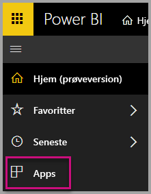
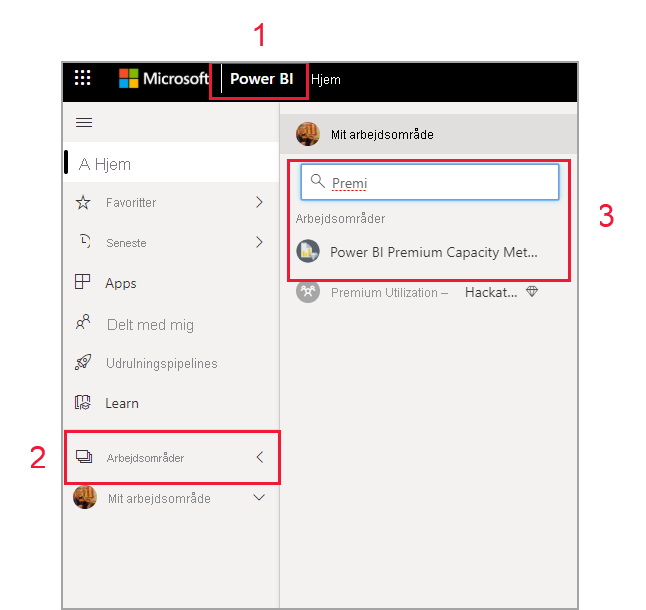
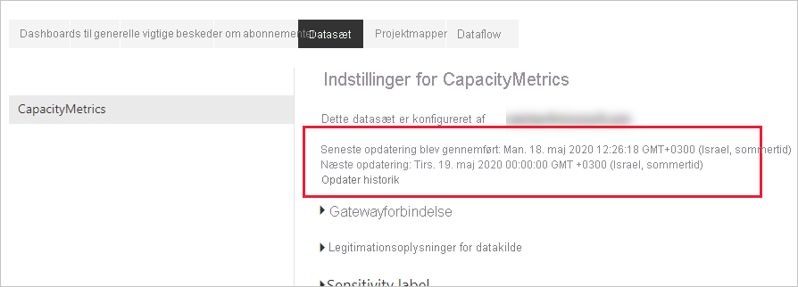
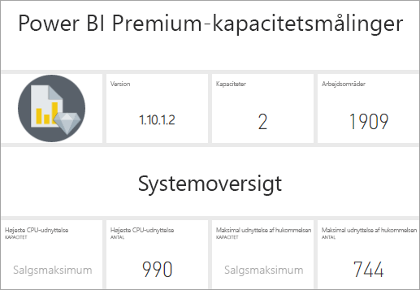
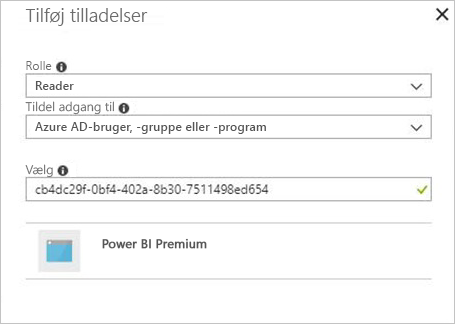

# Overvåg Premium-kapaciteter vha. appen

Overvågning af dine kapaciteter er afgørende for at træffe beslutninger om den bedste måde, du kan udnytte dine ressourcer i Premium-kapaciteten på. Du kan overvåge kapacitet via administrationsportalen eller programmet **Power BI Premium Capacity Metrics**. Denne artikel indeholder en beskrivelse af brugen af programmet Premium Capacity Metrics. Programmet giver de mest detaljerede oplysninger om ydeevnen af dine kapaciteter. Hvis du vil have et overblik over målepunkter for den gennemsnitlige brug på et højere niveau for de seneste syv dage, skal du bruge administrationsportalen. Du kan finde flere oplysninger om overvågning på portalen under [Overvåg Premium-kapaciteter på administrationsportalen](service-admin-premium-monitor-portal.md).

Programmet opdateres jævnligt med nye funktioner og funktionalitet. Sørg for, at du kører den nyeste version. Hvis en tidligere version af programmet allerede er installeret, er det bedst at slette den fra dine programmer og derefter trykke på CTRL + F5 for at opdatere.

> [!IMPORTANT]
> Hvis der er et højt forbrug af ressourcer i din Power BI Premium-kapacitet, hvilket medfører problemer med ydeevne eller pålidelighed, kan du modtage notifikationer via mail for at identificere og løse problemet. Dette kan være en strømlinet metode til fejlfinding af overbelastede kapaciteter. Se [notifikationer om kapacitet og pålidelighed](service-interruption-notifications.md#capacity-and-reliability-notifications) for at få flere oplysninger.

## Installér programmet

Du kan gå direkte til [programmet Premium Capacity Metrics](https://app.powerbi.com/groups/me/getapps/services/capacitymetrics) eller installere det på samme måde som med andre programmer i Power BI.

1. I Power BI skal du klikke på **Apps**.

    

2. I højre side skal du klikke på **Hent apps**.
3. I kategorien **Apps** skal du søge efter **Power BI-appen Capacity Metrics**.
4. Abonner for at installere appen.

Vær tålmodig. Det tager nogle få minutter at installere og opdatere målepunkterne. Hvis der vises tomme målepunkter i programmet, kan du trykke på F5 for at opdatere din browser.

## Få historik over programopdateringer

Hvis du vil kontrollere, hvornår programmet Premium Capacity Metrics sidst blev opdateret, skal du klikke på **Indstillinger** > **Datasæt** > **Power BI Premium Capacity Metrics** > **Opdateringshistorik**. 

Den seneste opdatering vises. Ellers skal du klikke på **Opdateringshistorik** for at se planlagte opdateringer og opdateringer efter behov.

## Overvåg kapaciteter vha. appen

Nu, hvor du har installeret programmet, kan du se målepunkter for kapaciteterne i din organisation. Appen indeholder et Dashboard med oversigter over målepunkter og detaljerede rapporter for målepunkter.

### Dashboard

Hvis du vil se et dashboard med en oversigt over de vigtigste målepunkter for kapaciteter, som du er administrator for, skal du under **Dashboards** klikke på **Capacity Metrics i Power BI Premium**. Der vises et dashboard.

Dashboardet indeholder følgende målepunkter:

#### Øverst

| Metrikværdi | Beskrivelse |
| --- | --- |
| Version | Appversion. | 
| Kapaciteter | Antallet af kapaciteter, som du er administrator for. | 
| Arbejdsområder | Antallet af arbejdsområder i dine kapaciteter, som rapporterer målepunkter.|
|||

#### Systemoversigt

| Metrikværdi | Beskrivelse |
| --- | --- |
| Kapacitet med højeste CPU-udnyttelse | Kapacitet med det maksimale antal gange, hvor CPU'en overskred 80 % af tærsklerne i løbet af de seneste syv dage. |
| Antal gange med højeste CPU-udnyttelse | Antal gange, hvor CPU'en for den navngivne kapacitet overskred 80 % af tærsklerne i løbet af de seneste syv dage. | 
| Kapacitet med maksimal udnyttelse af hukommelsen | Kapacitet med det maksimale antal gange, hvor den maksimale grænse for hukommelsen blev nået i løbet af de seneste syv dage opdelt i buckets på tre minutter.  |
| Antal gange med maksimal udnyttelse af hukommelsen| Antallet af gange, hvor den navngivne kapacitet nåede den maksimale grænse for hukommelsen i løbet af de seneste syv dage opdelt i buckets på tre minutter. |
|||

#### Oversigt over datasæt

| Metrikværdi | Beskrivelse |
| --- | --- |
| Datasæt | Det samlede antal datasæt på tværs af alle arbejdsområder i dine kapaciteter.|
| Den gennemsnitlige størrelse af datasæt (MB) | Den gennemsnitlige størrelse af datasæt på tværs af alle arbejdsområder i dine kapaciteter.|  
| Antal gennemsnitlige indlæste datasæt | Det gennemsnitlige antal datasæt, der indlæses i hukommelsen. |  
| Datasæt – gennemsnitligt aktivt datasæt (%)| Det gennemsnitlige antal aktive datasæt i løbet af de seneste syv dage. Et datasæt defineres som aktivt, hvis brugeren har interageret med visualiseringerne i løbet af de seneste tre minutter. |
| CPU – maksimale datasæt (%)| Det maksimale CPU-forbrug af arbejdsbelastninger i datasæt i løbet af de seneste syv dage. |
| CPU – gennemsnitlige datasæt (%)| Det gennemsnitlige CPU-forbrug af arbejdsbelastninger i datasæt i løbet af de seneste syv dage. |
| Hukommelse – gennemsnitlige datasæt (GB) | Det gennemsnitlige hukommelsesforbrug af arbejdsbelastninger i datasæt i løbet af de seneste syv dage. |
| Hukommelse – maksimale datasæt (GB) | Det maksimale hukommelsesforbrug af arbejdsbelastninger i datasæt i løbet af de seneste syv dage.|
| Fjernelser af datasæt | Det samlede antal datasæt, der er blevet fjernet pga. stort hukommelsesforbrug. |
| Antal gange med høj udnyttelse af DirectQuery/liveforbindelse| Antal gange, hvor DirectQuery/liveforbindelse overskred 80 % af tærsklerne i løbet af de seneste syv dage opdelt i buckets på tre minutter. |
| Antal gange med maksimal udnyttelse af DirectQuery/liveforbindelse| De fleste antal gange, hvor DirectQuery/liveforbindelser overskred 80 % i løbet af de seneste syv dage opdelt i buckets på én time. |
| Maksimal høj udnyttelse af DirectQuery/liveforbindelse | Det maksimale antal gange, hvor DirectQuery/liveforbindelser overskred 80 % af tærsklerne i løbet af de seneste syv dage opdelt i buckets på tre minutter.|
| Maksimalt antal forekomster af DirectQuery/liveforbindelse | UTC-tidspunkt, hvor DirectQuery/liveforbindelser overskred 80 % flest gange på én time. |
| Opdateringer i alt | Det samlede antal opdateringer i løbet af de seneste syv dage. |
| Opdateringspålidelighed (%) | Det samlede antal vellykkede opdateringer delt med det samlede antal opdateringer i løbet af de seneste syv dage. |
| Gennemsnitlig varighed af opdateringer (minutter) | Gennemsnitlig mængde tid brugt på at fuldføre opdateringen. |
| Gennemsnitlig ventetid for opdateringer (minutter)| Gennemsnitlig mængde tid, før opdateringen starter. |
| Forespørgsler i alt |  Det samlede antal forespørgsler, der er kørt i løbet af de seneste syv dage. |
| Samlet antal ventende forespørgsler | Det samlede antal forespørgsler, som skulle vente, før de blev udført. |
| Gennemsnitlig varighed af forespørgsler (ms) | Den gennemsnitlige tid, det tager at fuldføre forespørgsler. |
| Gennemsnitlig ventetid for forespørgsler (ms) | Den gennemsnitlige tid, som forespørgsler ventede på systemressourcer, før de blev udført. |
|||

#### Oversigt over dataflow

| Metrikværdi | Beskrivelse |
| --- | --- |
| Dataflow |  Det samlede antal dataflow på tværs af alle arbejdsområder i dine kapaciteter.|
| Opdateringer i alt | Det samlede antal opdateringer i løbet af de seneste syv dage.|  
| Gennemsnitlig varighed af opdateringer (minutter) | Den tid, det tager at fuldføre opdateringen. |
| Gennemsnitlige ventetider for opdateringer (minutter) | Den mellemliggende tid mellem det planlagte tidspunkt og det faktiske starttidspunkt for opdateringen.|
| CPU – maksimale dataflow (%) | Det maksimale CPU-forbrug af arbejdsbelastninger i dataflow i løbet af de seneste syv dage. |
| CPU – gennemsnitlige dataflow (%) | Det gennemsnitlige CPU-forbrug af arbejdsbelastninger i dataflow i løbet af de seneste syv dage. |
| Hukommelse – maksimale dataflow (GB) | Det maksimale hukommelsesforbrug af arbejdsbelastninger i dataflow i løbet af de seneste syv dage. |
| Hukommelse – gennemsnitlige dataflow (GB) | Det gennemsnitlige hukommelsesforbrug af arbejdsbelastninger i dataflow i løbet af de seneste syv dage. |
|||

#### Oversigt over sideinddelt rapport

| Metrikværdi | Beskrivelse |
| --- | --- |
| Sideinddelte rapporter |  Det samlede antal sideinddelte rapporter på tværs af alle arbejdsområder i dine kapaciteter. |
| Visninger i alt | Det samlede antal gange, som alle rapporter er blevet set af brugere. | 
| Rækker i alt | Det samlede antal rækker med data i alle rapporter.|
| Tid i alt | Den samlede tid, det tager for alle faser (datahentning, -behandling og -gengivelse) i alle rapporter, i millisekunder. |
| CPU – maksimalt forbrug for sideinddelte rapporter (%) | Det maksimale CPU-forbrug af arbejdsbelastninger i sideinddelte rapporter i løbet af de seneste syv dage. |
| CPU – gennemsnitligt forbrug for sideinddelte rapporter (%) | Det gennemsnitlige CPU-forbrug af arbejdsbelastninger i sideinddelte rapporter i løbet af de seneste syv dage. |
| Hukommelse – maksimalt forbrug for sideinddelte rapporter (GB) | Det maksimale hukommelsesforbrug af arbejdsbelastninger i sideinddelte rapporter i løbet af de sidste syv dage. |
| Hukommelse – gennemsnitligt forbrug for sideinddelte rapporter (GB) | Det gennemsnitlige hukommelsesforbrug af arbejdsbelastninger i sideinddelte rapporter i løbet af de sidste syv dage. |
|||

#### Oversigt over kunstig intelligens

| Metrikværdi | Beskrivelse |
| --- | --- |
| Funktionsudførelse med kunstig intelligens | Det samlede antal udførelser i løbet af de seneste syv dage. |
| Pålidelighed af funktionsudførelse med kunstig intelligens (%) | Antallet af vellykkede udførelser delt med det samlede antal udførelser i løbet af de seneste syv dage. |
| Maks. CPU (%)| Det maksimale CPU-forbrug af arbejdsbelastningen med kunstig intelligens i løbet af de seneste syv dage. |
| Maks. hukommelse (GB) | Det maksimale hukommelsesforbrug af arbejdsbelastningen med kunstig intelligens i løbet af de seneste syv dage.|
| Maks. ventetid for funktionsudførelse med kunstig intelligens (MS) | Den maksimale tid, der går, før udførelsen startes. |
| Gennemsnitlig ventetid for funktionsudførelse med kunstig intelligens (MS)| Den gennemsnitlige tid, der går, før udførelsen startes. |
| Maks. varighed af funktionsudførelse med kunstig intelligens (MS) | Den maksimale tid til at fuldføre udførelsen. |
| Gennemsnitlig varighed af funktionsudførelse med kunstig intelligens (MS)| Den gennemsnitlige tid til at fuldføre udførelsen. |
| | |

### Rapporter

Rapporter giver mere detaljerede målepunkter. Hvis du vil se rapporter for kapaciteter, som du er administrator for, skal du under **Rapporter** klikke på **Capacity Metrics i Power BI Premium**. Eller klik på en celle med et målepunkt på dashboardet for at gå til den underliggende rapport. 

Nederst i rapporten er der fem *faner*:

[**Datasæt**](#datasets) – Giver detaljerede målepunkter for tilstanden af Power BI-datasættene i dine kapaciteter.
[**Sideinddelte rapporter**](#paginated-reports) – Giver detaljerede målepunkter for tilstanden af sideinddelte rapporter i dine kapaciteter.
[**Dataflow**](#dataflows) – Giver detaljerede målepunkter for opdatering af dataflow i dine kapaciteter.
[**Kunstig intelligens**](#ai) – Giver detaljerede målepunkter for tilstanden af funktionerne med kunstig intelligens, som bruges i dine kapaciteter.
[**Ressourceforbrug**](#resource-consumption) – Giver detaljerede målepunkter for ressourcer, herunder hukommelse og høj CPU-udnyttelse.
[**Id'er og oplysninger**](#ids-and-info) – Indeholder navne, id'er og ejere for kapaciteter, arbejdsområder og arbejdsbelastninger.

Hver fane åbner en side, hvor du kan filtrere målepunkter efter kapacitet og datointerval. Hvis der ikke er valgt nogen filtre, viser rapporten som standard målepunkter for den seneste uge for alle kapaciteter, der rapporterer målepunkter. 

### Datasæt

På siden Datasæt er der forskellige *områder*, som indeholder **Opdateringer**, **Varighed af forespørgsler**, **Ventetider for forespørgsler** og **Datasæt**. Brug knapperne øverst på siden til at navigere til forskellige områder.

#### Området Opdateringer

| Rapportsektion | Metrikværdier |
| --- | --- |
| Opdateringer |  Antal i alt: Det samlede antal opdateringer for hvert datasæt.   Pålidelighed: Procentdelen af fuldførte opdateringer for hvert datasæt.   Gennemsnitlig ventetid: Den gennemsnitlige mellemliggende tid mellem det planlagte tidspunkt og starttidspunktet for en opdatering af datasættet i minutter.   Maksimal ventetid: Den maksimale ventetid for datasættet i minutter.   Gennemsnitlig varighed: Den gennemsnitlige varighed af opdateringen af datasættet i minutter.   Maksimal varighed: Varigheden af den længstvarende opdatering af datasættet i minutter. |
| Top 5-datasæt efter Gennemsnitlig varighed (minutter) |  De fem datasæt med den længstvarende gennemsnitlige opdateringsvarighed i minutter. |
| Top 5-datasæt efter Gennemsnitlig ventetid (minutter) |  De fem datasæt med den længstvarende gennemsnitlige opdateringsventetid i minutter. |
| Opdateringsantal og hukommelsesforbrug pr. time (GB) |  Succeser, fejl og hukommelsesforbrug opdelt i buckets af en times varighed rapporteret i UTC-tid. |
| Gennemsnitlig opdateringsventetid pr. time (minutter) |  Den gennemsnitlige opdateringsventetid opdelt i buckets på én time rapporteret i UTC-tid. Flere tilfælde af høje opdateringsventetider kan være tegn på, at kapaciteten snart er brugt op. |
|  |  |

#### Område for forespørgselsvarigheder

| Rapportsektion | Metrikværdier |
| --- | --- |
| Forespørgselsvarigheder |  Data i dette afsnit er opdelt i udsnit efter datasæt, arbejdsområde og buckets pr. time for de seneste syv dage.   I alt: Det samlede antal forespørgsler, der er kørt for datasættet.   Gennemsnit: Den gennemsnitlige varighed af forespørgsler for datasættet i millisekunder   Maksimum: Varigheden af den længstvarende forespørgsel i datasættet i millisekunder.|
| Distribution af forespørgselsvarighed |  Histogrammet med forespørgselsvarighed er opdelt i buckets efter forespørgselsvarigheder (i millisekunder) i følgende kategorier: intervaller af < = 30 ms, 30-100 ms, 100-300 ms, 300 ms-1 sek., 1-3 sek., 3-10 sek., 10-30 sek. og > 30 sek. Lange forespørgselsvarigheder og lange ventetider betyder, at kapaciteten er overbelastet. Det kan også betyde, at et enkelt datasæt forårsager problemer, og at der er behov for yderligere undersøgelser. |
| Top 5-datasæt efter Gennemsnitlig varighed |  De fem datasæt med den længstvarende gennemsnitlige forespørgselsvarighed i millisekunder. |
| Distributioner af forespørgselsvarighed pr. time |  Antallet af forespørgsler og gennemsnitlig varighed (i millisekunder) i forhold til hukommelsesforbrug i GB opdelt i buckets på én time rapporteret i UTC-tid. |
| DirectQuery/liveforbindelser (> 80 % udnyttelse) |  Det antal gange, en DirectQuery eller liveforbindelse overskred CPU-udnyttelsen på 80 % opdelt i buckets på én time rapporteret i UTC-tid. |
|  |  |

#### Område for ventetider for forespørgsler

| Rapportsektion | Metrikværdier |
| --- | --- |
| Forespørgselsventetider |  Data i dette afsnit er opdelt i udsnit efter datasæt, arbejdsområde og buckets pr. time for de seneste syv dage.   I alt: Det samlede antal forespørgsler, der er kørt for datasættet.   Antal ventende: Antallet af forespørgsler i datasættet, der har ventet på systemressourcer, før udførelsen startes.   Gennemsnit: Den gennemsnitlige ventetid for forespørgsler for datasættet i millisekunder.   Maksimum: Varigheden af den længstventende forespørgsel i datasættet i millisekunder.|
| Top 5 datasæt efter Gennemsnitlig ventetid |  De fem datasæt med den længstvarende gennemsnitlige ventetid inden udførelsen af en forespørgsel i millisekunder. |
| Distribution af ventetid |  Histogrammet med forespørgselsvarighed er opdelt i buckets efter forespørgselsvarigheder (i millisekunder) i følgende kategorier: intervaller af <= 50 ms, 50-100 ms, 100-200 ms, 200-400 ms, 400 ms-1 sek., 1-5 sek. og > 5 sek. |
| Distribution af forespørgselsventetid pr. time |  Mængde af forespørgselsventetid og den gennemsnitlige ventetid (i millisekunder) i forhold til hukommelsesforbrug i GB opdelt i buckets på én time rapporteret i UTC-tid. |
|  |  |

#### Området Datasæt

| **Rapportafsnit** | **Målepunkter** |
| --- | --- |
| Størrelser af datasæt  |  Maksimumstørrelse: Den maksimale størrelse af datasættet i MB for den viste periode. |
| Antal fjernelser af datasæt |  I alt: Det samlede antal *fjernelser* af datasættet for hver enkelt kapacitet. Når en kapacitet står over for øget hukommelsesforbrug, fjerner noden et eller flere datasæt fra hukommelsen. Datasæt, der er inaktive (uden forespørgsels-/opdateringshandlinger, der udføres i øjeblikket), ryddes først. Derefter er fjernelsesrækkefølgen baseret på en måling af 'mindst brugt for nylig'.|
| Antal indlæste datasæt pr. time |  Antal datasæt, der er indlæst i hukommelsen, i forhold til hukommelsesforbrug i GB opdelt i buckets på én time rapporteret i UTC-tid. |
| Fjernelser af datasæt og hukommelsesforbrug pr. time |  Fjernelser af datasæt i forhold til hukommelsesforbrug i GB opdelt i buckets på én time rapporteret i UTC-tid. |
| Procentdel af forbrugt hukommelse |  Samlet antal aktive datasæt i hukommelsen som en procentdel af den samlede hukommelse. Delta mellem Aktiv og Alle definerer datasæt, der kan fjernes. Vises pr. time for de seneste syv dage. |
|  |  |

### Sideinddelte rapporter

| **Rapportafsnit** | **Målepunkter** |
| --- | --- |
| Samlet forbrug |  Visninger i alt: Antallet af gange, som rapporten er blevet set af brugere.   Rækkeantal: Antallet af rækker med data i rapporten.   Hentning (gns.): Den gennemsnitlige mængde tid, det tager at hente data til rapporten, i millisekunder. Lange varigheder kan være et tegn på langsomme forespørgsler eller andre datakildeproblemer.    Behandling (gns.): Den gennemsnitlige mængde tid, det tager at behandle dataene til rapporten, i millisekunder.  Gengivelse (gns.): Den gennemsnitlige mængde tid, det tager at gengive en rapport i browseren, i millisekunder.   Tid i alt: Den mængde tid, det tager for alle faserne i rapporten, i millisekunder. |
| Top 5-rapporter efter Gennemsnitlig datahentningstid |  De fem rapporter med den længstvarende gennemsnitlige datahentningstid i millisekunder. |
| Top 5-rapporter efter Gennemsnitlig rapportbehandlingstid |  De fem rapporter med den længstvarende gennemsnitlige rapportbehandlingstid i millisekunder. |
| Resultater pr. time |  Succeser, fejl og hukommelsesforbrug opdelt i buckets på én time rapporteret i UTC-tid. |
| Varigheder pr. time |  Datahentning i forhold til behandlings- og gengivelsestid opdelt i buckets på én time rapporteret i UTC-tid. |
|  |  |

### Dataflow

| **Rapportafsnit** | **Målepunkter** |
| --- | --- |
| Opdateringer |  I alt: Det samlede antal opdateringer for hvert dataflow.   Pålidelighed: Procentdelen af fuldførte opdateringer for hvert dataflow.   Gennemsnitlig ventetid: Den gennemsnitlige mellemliggende tid mellem det planlagte tidspunkt og starttidspunktet for en opdatering af dataflowet i minutter.   Maksimal ventetid: Den maksimale ventetid for dataflowet i minutter.   Gennemsnitlig varighed: Den gennemsnitlige varighed af opdateringen af dataflowet i minutter.   Maksimal varighed: Varigheden af den længstvarende opdatering af dataflowet i minutter. |
| Top 5-dataflow efter Gennemsnitlig opdateringsvarighed |  De fem dataflow med den længstvarende gennemsnitlige opdateringsvarighed i minutter. |
| Top 5-dataflow efter Gennemsnitlig ventetid |  De fem dataflow med den længstvarende gennemsnitlige opdateringsventetid i minutter. |
| Gennemsnitlige opdateringsventetider pr. time |  Den gennemsnitlige opdateringsventetid opdelt i buckets på én time rapporteret i UTC-tid. Flere tilfælde af høje opdateringsventetider kan være tegn på, at kapaciteten snart er brugt op. |
| Opdateringsantal og hukommelsesforbrug pr. time |  Succeser, fejl og hukommelsesforbrug opdelt i buckets på én time rapporteret i UTC-tid. |
|  |  |

### AI

| **Rapportafsnit** | **Målepunkter** |
| --- | --- |
| Hukommelsesforbrug med kunstig intelligens | Hukommelsesforbrug i GB opdelt i buckets på én time rapporteret i UTC-tid. |
| Funktionsudførelse med kunstig intelligens og gennemsnitlig ventetid pr. time | Fuldførelser med kunstig intelligens og gennemsnitlig ventetid i millisekunder opdelt i buckets på én time rapporteret i UTC-tid. |
| Samlet forbrug | Samlet antal: Antallet af funktioner med kunstig intelligens i et arbejdsområde eller dataflow.   Pålidelighed af system: Procentdelen af fuldførte udførelser.  Gns. ventetid: Den gennemsnitlige mellemliggende tid mellem det planlagte tidspunkt og starttidspunktet for en udførelse i millisekunder.  Maksimal ventetid: Maksimal ventetid i millisekunder.  Gns. varighed: Den gennemsnitlige varighed af en udførelse i millisekunder.  Maksimal varighed: Varigheden af den længstvarende forespørgsel i millisekunder.  Gns. samlet størrelse: Den gennemsnitlige størrelse i byte af input- og outputdata for funktionen med kunstig intelligens. |
| | |

### Ressourceforbrug

| **Rapportafsnit** | **Målepunkter** |
| --- | --- |
| CPU-forbrug |  Maksimalt CPU-forbrug i timen efter arbejdsbelastning som en procentdel af den samlede CPU-kapacitet. Vises pr. time for de seneste syv dage. |
| Hukommelsesforbrug |  Det maksimale hukommelsesforbrug i timen i GB efter arbejdsbelastning (hele linjer) overlejret af grænser for arbejdsbelastning (stiplede linjer). Vises pr. time for de seneste syv dage. |
|  |  |

### Id'er og Oplysninger

Fanen **Id'er og oplysninger** indeholder områder for **Kapaciteter**, **Arbejdsområder**, **Datasæt**, **Sideinddelte rapporter** og **Dataflow**.

#### Området Kapaciteter

| Rapportsektion | Metrikværdier |
| --- | --- |
| Oplysninger om SKU og arbejdsbelastning | Indstillinger for SKU og arbejdsbelastninger for kapaciteten. |
| Administratorer | Navnene på administratorerne for kapaciteten. |
|||

#### Området Arbejdsområder

| Rapportsektion | Metrikværdier |
| --- | --- |
| Arbejdsområder | Navne og id'er for alle arbejdsområder. |
|||

#### Området Datasæt

| Rapportsektion | Metrikværdier |
| --- | --- |
| Datasæt | Navne og id'er for arbejdsområder for alle datasæt. |
|||

#### Området Sideinddelte rapporter

| Rapportsektion | Metrikværdier |
| --- | --- |
| Sideinddelte rapporter | Navne, navne på arbejdsområder og id'er for alle sideinddelte rapporter. |
|||

#### Området Dataflow

| Rapportsektion | Metrikværdier |
| --- | --- |
| Dataflow | Navne på dataflow og arbejdsområder samt id'er for alle dataflow. |
|||

## Overvåg Power BI Embedded-kapacitet

Du kan bruge programmet Power BI Premium Capacity Metrics til at overvåge *A SKU*-kapaciteter i Power BI Embedded. Disse kapaciteter vises i rapporten, hvis du er administrator af kapaciteten. Men opdatering af rapporten mislykkes, medmindre du tildeler visse tilladelser til Power BI på dine A SKU'er:

1. Åbn din kapacitet på Azure-portalen.

1. Klik på **Adgangskontrol (IAM)** , og føj derefter appen **Power BI Premium** til rollen Læser. Hvis du ikke kan finde appen ved hjælp af navnet, kan du også tilføje den ved hjælp af klientidentifikatoren: `cb4dc29f-0bf4-402a-8b30-7511498ed654`.

    

> [!NOTE]
> Du kan overvåge Power BI Embedded-kapacitetsforbrug i appen eller på Azure-portalen, men ikke på Power BI-administrationsportalen.

## Næste trin

> [!div class="nextstepaction"]
> [Optimering af kapaciteter i Power BI Premium](service-premium-capacity-optimize.md)
