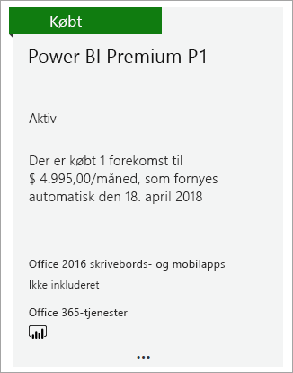
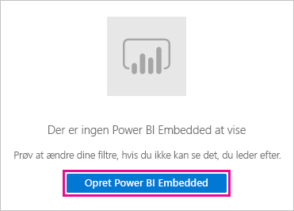
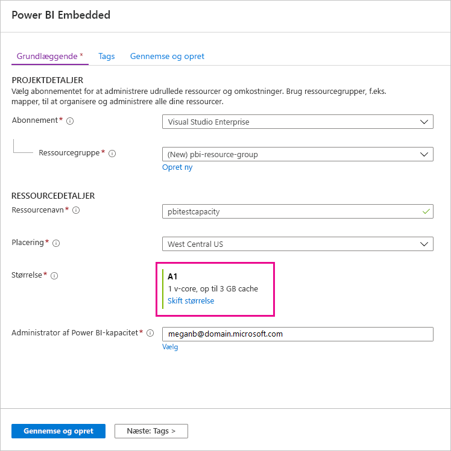
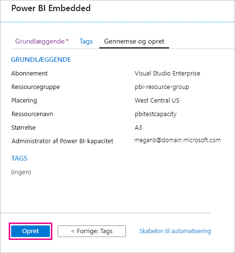
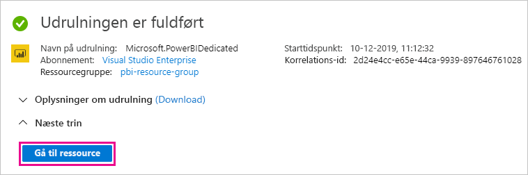
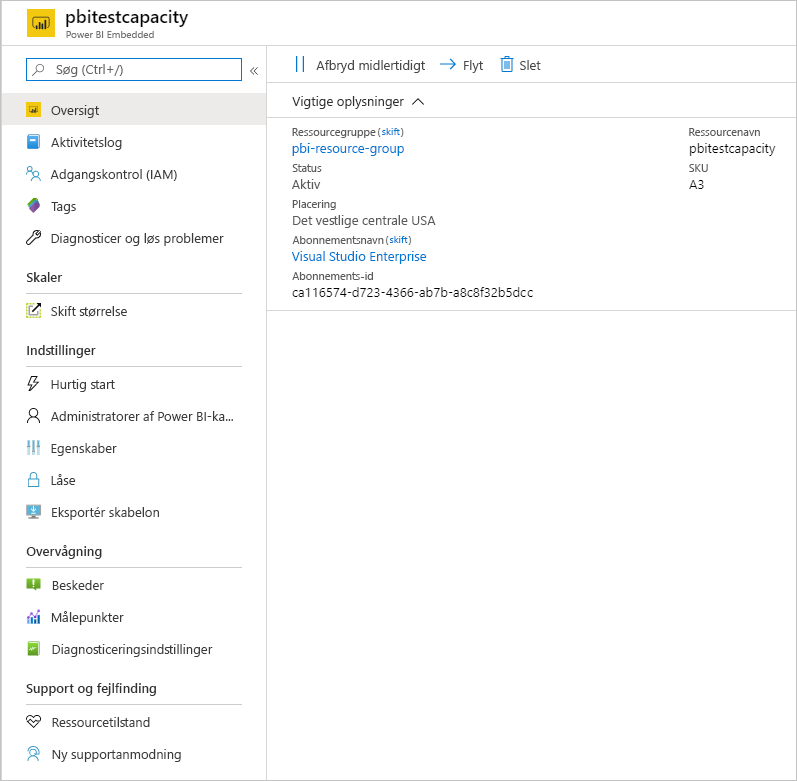

# Sådan køber du Power BI Premium

I denne artikel beskrives, hvordan du køber Power BI Premium-kapacitet til din organisation. Der dækkes to scenarier i artiklen:

- Brug af P-SKU'er til typiske produktionsscenarier. P-SKU'er kræver en månedlig eller årlig forpligtelse og faktureres hver måned.

- Brug af A-SKU'er til test af scenarier og i tilfælde, hvor du ikke har de nødvendige tilladelser til at købe P-SKU'er (rollen Global administrator eller rollen Faktureringsadministrator i Microsoft 365). A-SKU'er kræver ingen tidsforpligtelser og faktureres pr. time. Du køber A-SKU'er via [Azure Portal](https://portal.azure.com).

Du kan finde flere oplysninger om Power BI Premium under [Hvad er Power BI Premium?](service-premium-what-is.md). Du kan finde aktuelle priser og oplysninger om planlægning på [siden Priser for Power BI](https://powerbi.microsoft.com/pricing/) og under [Power BI Premium-beregner](https://powerbi.microsoft.com/calculator/). Indholdsforfattere skal stadig have en [Power BI Pro-licens](service-admin-purchasing-power-bi-pro.md), også selvom organisationen bruger Power BI Premium. Sørg for at købe mindst én Power BI Pro-licens til din organisation. Med A-SKU'er skal _alle brugere_, der forbruger indhold, også have Pro-licenser.

> [!NOTE]
> Hvis et Premium-abonnement udløber, har du 30 dages fuld adgang til din kapacitet. Derefter vil dit indhold igen blive en delt kapacitet. Modeller, der er større 1 GB, understøttes ikke i delt kapacitet.

## Køb P-SKU'er til typiske produktionsscenarier

Du kan oprette en ny lejer, hvor der er konfigureret en P1-SKU i Power BI Premium, eller du kan købe en Power BI Premium-kapacitet til en eksisterende organisation. I begge tilfælde kan du derefter tilføje kapacitet, hvis du har brug for det.

### Opret en ny lejer med Power BI Premium P1

Hvis du ikke har en eksisterende lejer og vil oprette en, kan du købe Power BI Premium samtidigt. Følgende link fører dig gennem processen med at oprette en ny lejer og giver dig mulighed for at købe Power BI Premium: [tilbud om Power BI Premium P1](https://signup.microsoft.com/Signup?OfferId=b3ec5615-cc11-48de-967d-8d79f7cb0af1). Når du opretter din lejer, får du automatisk tildelt rollen Global administrator for Microsoft 365 for den pågældende lejer.

Når du har købt kapacitet, kan du få mere at vide om, hvordan du [administrerer kapaciteter](service-admin-premium-manage.md#manage-capacity) og [tildeler arbejdsområder](service-admin-premium-manage.md#assign-a-workspace-to-a-capacity) til en kapacitet.

### Køb Power BI Premium-kapacitet til en eksisterende organisation

Hvis der allerede er registreret en organisation (lejer), skal du have rollen Global administrator eller Faktureringsadministrator for Microsoft 365 for at købe abonnementer og licenser. Du kan finde flere oplysninger i [Om administratorroller i Microsoft 365](https://support.office.com/article/About-Office-365-admin-roles-da585eea-f576-4f55-a1e0-87090b6aaa9d).

Følg disse trin for at købe Premium-kapacitet.

1. Vælg Microsoft 365-appvælgeren i Power BI-tjenesten, og vælg derefter **Administrator**.

    

    Du kan også navigere til Microsoft 365 Administration.

1. Vælg **Fakturering** > **Køb tjenester**.

1. Se efter Power BI Premium-tilbud under **Andre planer**. Det vises som P1 til P3, EM3 og P1 (for hver måned).

1. Hold over ellipsen ( **...** ), og vælg derefter **Køb nu**.

    

1. Følg trinnene for at gennemføre købet.

Når du har gennemført købet, kan du på siden **Køb tjenester** se, at elementet er købt og aktivt.

Når du har købt kapacitet, kan du få mere at vide om, hvordan du [administrerer kapaciteter](service-admin-premium-manage.md#manage-capacity) og [tildeler arbejdsområder](service-admin-premium-manage.md#assign-a-workspace-to-a-capacity) til en kapacitet.

### Køb ekstra kapacitet

Nu, hvor du har en kapacitet, kan du tilføje mere, i takt med at dit behov vokser. Du kan også bruge en hvilken som helst kombination af SKU'er for Premium-kapacitet (P1 til P3) i din organisation. De forskellige SKU'er giver forskellige ressourcemuligheder.

1. I Microsoft 365 Administration skal du vælge **Fakturering** > **Køb tjenester**.

1. Find det Power BI Premium-element, du vil købe flere af, under **Andre planer**.

1. Hold over **Flere indstillinger** (...), og vælg derefter **Skift antal licenser**.

    

1. Ret det antal forekomster, du vil have til dette element. Vælg derefter **Send**, når du er færdig.

   > [!IMPORTANT]
   > Hvis du vælger **Send**, opkræves det registrerede kreditkort.

Siden **Køb tjenester** angiver derefter det antal forekomster, som du har. I Power BI-administrationsportalen under **Kapacitetsindstillinger**, afspejler de tilgængelige v-kerner den nye kapacitet, der er købt.

### Opsig dit abonnement

Du kan opsige dit abonnementet via Microsoft 365 Administration. Gør følgende for at opsige dit Premium-abonnement.

1. Gå til Microsoft 365 Administration.

1. Vælg **Fakturering** > **Abonnementer**.

1. Vælg dit Power BI Premium-abonnement på listen.

1. Vælg **Flere handlinger** > **Annuller abonnement**.

1. Siden **Annuller abonnement** angiver, om du skal betale et [gebyr for tidlig opsigelse](https://support.office.com/article/early-termination-fees-6487d4de-401a-466f-8bc3-c0beb5cc40d3). På denne side får du også besked, når dataene slettes for abonnementet.

1. Læs oplysningerne igennem, og vælg **Annuller abonnement**, hvis du vil fortsætte.

#### Når du annullerer din licens, eller når den udløber

Når du annullerer dit Premium-abonnement, eller når din kapacitetslicens udløber, kan du fortsætte med at få adgang til dine Premium-kapaciteter i en periode på 30 dage fra datoen for licensens annullering eller udløb. Efter 30 dage kan du ikke længere få adgang til dine Premium-kapaciteter eller arbejdsområderne i dem.

## Køb A-SKU'er til test og andre scenarier

A-SKU'er er tilgængelige via Azure Power BI Embedded-tjenesten. Du kan bruge A-SKU'er på følgende måder:

- Aktivér integrering af Power BI i tredjepartsprogrammer. Se [Power BI Embedded](../developer/embedded/azure-pbie-what-is-power-bi-embedded.md) for at få flere oplysninger.

- Test Premium-funktionaliteten, før du køber en P-SKU.

- Opret udviklings- og testmiljøer sammen med et produktionsmiljø, der bruger P-SKU'er.

- Køb Power BI Premium, selvom du ikke har rollen Global administrator eller Faktureringsadministrator i Microsoft 365.

> [!NOTE]
> Hvis du køber en A4-SKU eller højere, kan du drage fordel af alle Premium-funktioner med undtagelse af ubegrænset deling af indhold. Med A-SKU'er skal _alle brugere_, der forbruger indhold, have Pro-licenser.

Følg disse trin for at købe A-SKU'er via Azure Portal:

1. Log på [Azure Portal](https://portal.azure.com) med en konto, hvor der mindst er tilladelser som administrator af Power BI-kapacitet.

1. Søg efter _Power BI Embedded_, og vælg tjenesten i søgeresultaterne.

    

1. Vælg **Opret Power BI Embedded**.

    

1. På oprettelsesskærmen i **Power BI Embedded** skal du angive følgende oplysninger:

    - Det **abonnement**, hvor Power BI Embedded-tjenesten skal oprettes.

    - Den fysiske **placering**, hvor den ressourcegruppe, der indeholder tjenesten, skal oprettes. For at opnå en bedre ydeevne skal denne placering ligge tæt på placeringen af din Azure Active Directory-lejer til Power BI.

    - Den eksisterende **ressourcegruppe** til brug, eller opret en ny, som vist i eksemplet.

    - **Administrator af Power BI-kapacitet**. Administratoren af kapacitet skal være en medlemsbruger eller en tjenesteprincipal i din Azure AD-lejer.

    

1. Hvis du vil bruge alle funktionerne i Power BI Premium (undtagen ubegrænset deling), skal du mindst bruge en A4-SKU. Vælg **Skift størrelse**.

    

1. Vælg en kapacitetsstørrelse på A4, A5 eller A6, der svarer til P1, P2 og P3.

    

1. Vælg **Gennemse + opret**, gennemse de indstillinger, du har valgt, og vælg derefter **Opret**.

    

1. Det kan tage et par minutter at fuldføre udrulningen. Når den er klar, skal du vælge **Gå til ressource**.

    

1. På administrationsskærmen skal du gennemse de indstillinger, du har til at administrere tjenesten, herunder afbryde tjenesten midlertidigt, når du ikke bruger den.

    

Når du har købt kapacitet, kan du få mere at vide om, hvordan du [administrerer kapaciteter](service-admin-premium-manage.md#manage-capacity) og [tildeler arbejdsområder](service-admin-premium-manage.md#assign-a-workspace-to-a-capacity) til en kapacitet.

## De næste trin

[Konfigurer og administrer kapaciteter i Power BI Premium](service-admin-premium-manage.md)\
[Side med Power BI-prisfastsættelse](https://powerbi.microsoft.com/pricing/)\
[Power BI Premium-beregner](https://powerbi.microsoft.com/calculator/)\
[Ofte stillede spørgsmål om Power BI Premium](service-premium-faq.md)\
[Hvidbog om planlægning af en Power BI Enterprise-installation](https://aka.ms/pbienterprisedeploy)

Har du flere spørgsmål? [Prøv at spørge Power BI-community'et](https://community.powerbi.com/)
