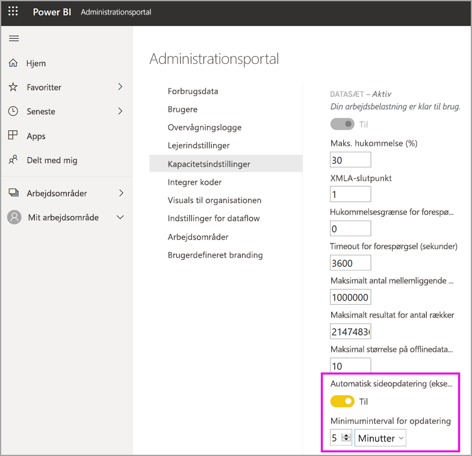

# Konfigurer arbejdsbelastninger i en Premium-kapacitet

I denne artikel beskrives, hvordan du aktiverer og konfigurerer arbejdsbelastninger for Power BI Premium-kapaciteter. Kapaciteter understøtter som standard kun de arbejdsbelastninger, der er tilknyttet kørende Power BI-forespørgsler. Du kan også aktivere og konfigurere yderligere arbejdsbelastninger for **[AI (Cognitive Services)](../transform-model/service-cognitive-services.md)** , **[Dataflow](../transform-model/service-dataflows-overview.md#dataflow-capabilities-on-power-bi-premium)** og **[Sideinddelte rapporter](../paginated-reports/paginated-reports-save-to-power-bi-service.md)** .

## Standardindstillinger for hukommelse

Arbejdsbelastninger for forespørgsler optimeres til og begrænses af de ressourcer, som er fastlagt af din SKU for Premium-kapacitet. Premium-kapaciteter understøtter også yderligere arbejdsbelastninger, der kan bruge din kapacitets ressourcer. Standardværdier for hukommelse for disse arbejdsbelastninger er baseret på de kapacitetsnoder, der er tilgængelige for din SKU. Det maksimale antal hukommelsesindstillinger kan ikke akkumuleres. Hukommelse op til den angivne maksimale værdi tildeles dynamisk for AI og dataflow, men tildeles statisk for sideinddelte rapporter.

|                   | EM1/A1                  | EM2/A2                  | EM3/A3                  | P1/A4                  | P2/A5                  | P3/A6                   |
|-------------------|---------------------------|---------------------------|---------------------------|--------------------------|--------------------------|---------------------------|
| AI                | Ikke-understøttet               | 40 % som standard, minimum 40 %  | 20 % som standard, minimum 20 %  | 20 % som standard, minimum 8 %  | 20 % som standard, minimum 4 %  | 20 % som standard, minimum 2 %   |
| Datasæt          | 100 % som standard, minimum 67 % | 100 % som standard, minimum 40 % | 100 % som standard, minimum 20 % | 100 % som standard, minimum 8 % | 100 % som standard, minimum 4 % | 100 % som standard, minimum 2 %  |
| Dataflow         | 40 % som standard, minimum 40 %  | 24 % som standard, minimum 24 %  | 20 % som standard, minimum 12 %  | 20 % som standard, minimum 5 %  | 20 % som standard, minimum 3 %  | 20 % som standard, minimum 2 %   |
| Sideinddelte rapporter | Ikke-understøttet               | Ikke-understøttet               | Ikke-understøttet               | 20 % som standard, minimum 10 % | 20 % som standard, minimum 5 %  | 20 % som standard, minimum 2,5 % |
|                   |                           |                           |                           |                          |                          |                           |

## Indstillinger for arbejdsbelastning

### Kunstig intelligens (prøveversion)

AI-arbejdsbelastningen gør det muligt for dig at bruge kognitive tjenester og automatiseret maskinel indlæring i Power BI. Brug følgende indstillinger til at styre funktionsmåden for arbejdsbelastninger.

| Navn på indstilling | Beskrivelse |
|---------------------------------|----------------------------------------|
| **Maks. hukommelse (%)** | Den maksimale procentdel af tilgængelig hukommelse, som AI-processer kan bruge i en kapacitet. |
| **Tillad brug fra Power BI Desktop** | Denne indstilling er reserveret til fremtidig brug og vises ikke i alle lejere. |
| **Tillad oprettelse af modeller til maskinel indlæring** | Angiver, om forretningsanalytikere kan oplære, validere og aktivere modeller til maskinel indlæring direkte i Power BI. Du kan få flere oplysninger i [Automatiseret maskinel indlæring i Power BI (prøveversion)](../transform-model/service-machine-learning-automated.md). |
| **Aktivér parallelitet for AI-anmodninger** | Angiver, om AI-anmodninger kan køre parallelt. |
|  |  |

### Datasæt

Arbejdsbelastningen for datasæt er som standard aktiveret og kan ikke deaktiveres. Brug følgende indstillinger til at styre funktionsmåden for arbejdsbelastninger. Der er flere brugsoplysninger under tabellen for nogle af indstillingerne.

| Navn på indstilling | Beskrivelse |
|---------------------------------|----------------------------------------|
| **Maks. hukommelse (%)** | Den maksimale procentdel af tilgængelig hukommelse, som datasæt kan bruge i en kapacitet. |
| **XMLA-slutpunkt** | Angiver, at forbindelser fra klientprogrammer overholder det medlemskab af sikkerhedsgrupper, der er angivet for arbejdsområdet og appniveauerne. Du kan få mere at vide i [Opret forbindelse til datasæt med klientprogrammer og -værktøjer](service-premium-connect-tools.md). |
| **Maks. antal mellemliggende rækker** | Det maksimale antal mellemliggende rækker, der blev returneret af DirectQuery. Standardværdien er 1000000, og det tilladte interval er mellem 100000 og 2147483647. |
| **Maksimal størrelse på offlinedatasæt (GB)** | Den maksimale størrelse på offlinedatasæt i hukommelsen. Dette er den komprimerede størrelse på disken. Standardværdien er 0, hvilket er den højeste grænse, der er defineret af SKU'et. Det tilladte interval er mellem 0 og kapacitetens størrelsesgrænse. |
| **Maks. antal resulterende rækker** | Det maksimale antal rækker, der returneres i en DAX-forespørgsel. Standardværdien er -1 (ingen grænse), og det tilladte interval er mellem 100000 og 2147483647. |
| **Grænse for forespørgselshukommelse (%)** | Den maksimale procentdel af tilgængelig hukommelse i arbejdsbelastningen, der kan bruges til at udføre en MDX- eller DAX-forespørgsel. Standardværdien er 0, hvilket medfører, at der anvendes en SKU-specifik, automatisk hukommelsesgrænse i forbindelse med forespørgsler. |
| **Timeout for forespørgsel (sekunder)** | Det maksimale tidsrum, før en forespørgsel udløber. Standarden er 3600 sekunder (1 time). Værdien 0 angiver, at der ikke opstår timeout for forespørgsler. |
| **Automatisk sideopdatering** | Til/fra-knap, der gør det muligt for Premium-arbejdsområder at have rapporter med automatisk sideopdatering på grundlag af faste intervaller. |
| **Minimumsinterval for opdatering** | Hvis automatisk sideopdatering er slået til, er der angivet et minimumsinterval for sideopdatering. Standardværdien er fem minutter, og den mindste tilladte værdi er ét sekund. |
| **Målingen Ændre registrering** | Til/fra-knap, der gør det muligt for Premium-arbejdsområder at have rapporter med automatisk sideopdatering på grundlag af registrering af ændringer. |
| **Minimuminterval for udførelse** | Hvis målingen Ændre registrering er slået til, ændres det tilladte minimuminterval for forespørgsel om dataændringer. Standardværdien er fem sekunder, og den tilladte minimumværdi er ét sekund. |
|  |  |  |

#### Maks. antal mellemliggende rækker

Brug denne indstilling til at styre effekten af ressourcetunge eller dårligt designede rapporter. Når en forespørgsel til et DirectQuery-datasæt resulterer i et omfattende resultat fra kildedatabasen, kan det medføre en stigning i hukommelsesforbrug og behandlingsomkostningerne. Denne situation kan føre til, at andre brugere og rapporter løber tør for ressourcer. Denne indstilling gør det muligt for kapacitetsadministratoren at justere, hvor mange rækker en individuel forespørgsel kan hente fra datakilden.

Hvis kapaciteten understøtter mere end standarden på 1.000.000 rækker, og du har et stort datasæt, kan du også øge denne indstilling for at hente flere rækker.

Bemærk, at denne indstilling kun påvirker DirectQuery-forespørgsler, mens [Maks. antal resulterende rækker](#max-result-row-set-count) påvirker DAX-forespørgsler.

#### Maksimal størrelse på offlinedatasæt

Brug denne indstilling for at undgå, at forfattere af rapporter publicerer et stort datasæt, der kan have negativ indvirkning på kapaciteten. Bemærk, at Power BI ikke kan bestemme den faktiske størrelse i hukommelsen, før datasættet indlæses i hukommelsen. Det er muligt, at et datasæt med en lille offlinestørrelse kan have et større hukommelsesforbrug end et datasæt med en stor offlinestørrelse.

Hvis du har et eksisterende datasæt, der er større end den størrelse, du angiver for denne indstilling, kan datasættet ikke indlæses, når en bruger forsøger at få adgang til det. Indlæsning af datasættet kan også mislykkes, hvis det er større end den maksimale hukommelse, der er konfigureret for datasættenes arbejdsbelastning.

For at beskytte systemets ydeevne er der anvendt et ekstra SKU-specifikt fast loft for den maksimale størrelse på et offlinedatasæt, uanset hvilken værdi der er konfigureret. Dette faste loft gælder ikke for Power BI-datasæt, der er optimeret til store datastørrelser. Du kan finde flere oplysninger i [Store modeller i Power BI Premium](service-premium-large-models.md).

|                                           | EM1/A1 | EM2/A2 | EM3/A3 | P1/A4 | P2/A5 | P3/A6 |   
|-------------------------------------------|----------|----------|----------|---------|---------|---------|
| Fast loft for maksimal størrelse på offlinedatasæt | 3 GB     | 5 GB     | 6 GB     | 10 GB   | 10 GB   | 10 GB   |
|                                           |          |          |          |         |         |         |

#### Maks. antal resulterende rækker

Brug denne indstilling til at styre effekten af ressourcetunge eller dårligt designede rapporter. Hvis denne grænse nås i en DAX-forespørgsel, får rapportbrugeren vist følgende fejl. De bør kopiere oplysninger om fejlen og kontakte en administrator.

Bemærk, at denne indstilling kun påvirker DAX-forespørgsler, mens [Maks. antal mellemliggende rækker](#max-intermediate-row-set-count) påvirker DirectQuery-forespørgsler.

#### Grænse for forespørgselshukommelse

Brug denne indstilling til at styre effekten af ressourcetunge eller dårligt designede rapporter. Nogle forespørgsler og beregninger kan resultere i mellemliggende resultater, der bruger meget hukommelse i kapaciteten. Denne situation kan medføre, at andre forespørgsler kører meget langsomt, at andre datasæt fjernes fra kapaciteten, og der opstår fejl i forbindelse med manglende hukommelse for andre brugere af kapaciteten.

Denne indstilling gælder for alle DAX-og MDX-forespørgsler, der udføres af Power BI-rapporter, Analysér i Excel-rapporter samt andre værktøjer, der kan oprette forbindelse via XMLA-slutpunktet.

Bemærk, at dataopdateringshandlinger muligvis også udfører DAX-forespørgsler som en del af opdatering af dashboardfelter og visualcachelagre, efter at dataene i datasættet er blevet opdateret. Sådanne forespørgsler kan også mislykkes på grund af denne indstilling, og det kan medføre, at dataopdateringshandlingen vises i fejltilstand, selvom dataene i datasættet er blevet opdateret.

Standardindstillingen er 0, hvilket medfører, at der anvendes følgende SKU-specifik, automatisk hukommelsesgrænse i forbindelse med forespørgsler.

|                              | EM1/A1 | EM2/A2 | EM3/A3 | P1/A4 | P2/A5 | P3/A6 |   
|------------------------------|----------|----------|----------|---------|---------|---------|
| Automatisk hukommelsesgrænse for forespørgsel | 1 GB     | 2 GB     | 2 GB     | 6 GB    | 6 GB    | 10 GB   |
|                              |          |          |          |         |         |         |

For at beskytte systemets ydeevne gennemtvinges et fast loft på 10 GB for alle forespørgsler, der udføres af Power BI-rapporter, uanset hvilken hukommelsesgrænse for forespørgslen der er konfigureret af brugeren. Dette faste loft gælder ikke for forespørgsler, der er udstedt af værktøjer, som bruger Analysis Services-protokollen (også kaldet XMLA). Brugerne bør overveje at forenkle forespørgslen eller dens beregninger, hvis forespørgslen bruger for meget hukommelse.

#### Timeout for forespørgsel

Du kan bruge denne indstilling til at sikre bedre kontrol over forespørgsler, der kører i lang tid, hvilket kan få rapporter til at blive indlæst langsomt for brugerne.

Denne indstilling gælder for alle DAX-og MDX-forespørgsler, der udføres af Power BI-rapporter, Analysér i Excel-rapporter samt andre værktøjer, der kan oprette forbindelse via XMLA-slutpunktet.

Bemærk, at dataopdateringshandlinger muligvis også udfører DAX-forespørgsler som en del af opdatering af dashboardfelter og visualcachelagre, efter at dataene i datasættet er blevet opdateret. Sådanne forespørgsler kan også mislykkes på grund af denne indstilling, og det kan medføre, at dataopdateringshandlingen vises i fejltilstand, selvom dataene i datasættet er blevet opdateret.

Denne indstilling gælder for en enkelt forespørgsel og ikke den tid, det tager at køre alle de forespørgsler, der er knyttet til opdatering af et datasæt eller en rapport. Se følgende eksempel:

- Indstillingen **Timeout for forespørgsel** er 1200 (20 minutter).
- Der er fem forespørgsler, der skal udføres, og hvert forespørgsel kører i 15 minutter.

Den samlede tid for alle forespørgsler er 75 minutter, men indstillingsgrænsen nås ikke, fordi alle de individuelle forespørgsler kører i mindre end 20 minutter.

Vær opmærksom på, at Power BI-rapporter tilsidesætter denne standard med en meget kortere timeout for hver forespørgsel til kapaciteten. Timeouten for hver forespørgsel er typisk ca. tre minutter.

#### Automatisk sideopdatering (prøveversion)

Når denne indstilling er aktiveret, gør automatisk sideopdatering det muligt for brugere i din Premium-kapacitet at opdatere sider i deres rapport med et angivet interval i forbindelse med DirectQuery-kilder. Som kapacitetsadministrator kan du gøre følgende:

- Slå automatisk sideopdatering til og fra.
- Definere et minimumsinterval for opdatering.

På følgende billede vises placeringen af indstillingen for intervallet for automatisk opdatering:

Forespørgsler, der er oprettet ved automatisk sideopdatering, går direkte til datakilden, så det er vigtigt at overveje pålideligheden og belastningen på disse kilder, når du tillader automatisk sideopdatering i din organisation. 

### Dataflow

Dataflowarbejdsbelastningen gør det muligt for dig at bruge selvbetjeningsforberedelse af data til dataflows for at overføre, transformere, integrere og forbedre data. Brug følgende indstillinger til at styre funktionsmåden for arbejdsbelastninger.

| Navn på indstilling | Beskrivelse |
|---------------------------------|----------------------------------------|
| **Maks. hukommelse (%)** | Den maksimale procentdel af tilgængelig hukommelse, som dataflows kan bruge i en kapacitet. |
| **Forbedret beregningsprogram til dataflows (prøveversion)** | Aktivér denne indstilling for at få op til 20 gange hurtigere beregning af beregnede enheder, når der arbejdes med store datamængder. **Du skal genstarte kapaciteten for at aktivere det nye program.** Du kan finde flere oplysninger i [Forbedret beregningsprogram til dataflows](#enhanced-dataflows-compute-engine). |
| **Størrelse af objektbeholder** | Den maksimale størrelse på den objektbeholder, som dataflows bruger til hver enhed i dataflowet. Standardværdien er 700 MB. Du kan finde flere oplysninger i [Størrelse af objektbeholder](#container-size). |
|  |  |

#### Forbedret beregningsprogram til dataflows

Hvis du vil drage fordel af det nye beregningsprogram, skal du opdele dataindtagelsen i separate dataflows og placere transformationslogik i beregnede enheder i forskellige dataflows. Denne fremgangsmåde anbefales, da beregningsprogrammet fungerer for dataflows, der refererer til et eksisterende dataflow. Det fungerer ikke på dataflows til indtagelse. Hvis du følger denne vejledning, kan du sikre, at det nye beregningsprogram håndterer transformationstrinnene, f.eks. joinforbindelser og sammenfletninger, for at opnå optimal ydeevne.

#### Størrelse af objektbeholder

Når du opdaterer et dataflow, opretter arbejdsbelastningen for dataflow en objektbeholder for hver enhed i dataflowet. Hver objektbeholder kan have hukommelse op til den mængde, der er angivet i indstillingen Størrelse af objektbeholder. Standarden for alle SKU'er er 700 MB. Det kan være en god idé at ændre denne indstilling, hvis:

- det tager for lang tid at opdatere dataflow, eller opdateringen af dataflow mislykkes pga. timeout.
- Dataflowenheder omfatter beregningstrin, f.eks. en joinforbindelse.  

Det anbefales, at du bruger appen [Power BI Premium Capacity Metrics](service-admin-premium-monitor-capacity.md) til at analysere ydeevnen af arbejdsbelastningen for dataflow.

I nogle tilfælde forbedres ydeevnen ikke ved at øge størrelsen af objektbeholderen. Hvis dataflowet for eksempel kun henter data fra en kilde uden at udføre væsentlige beregninger, hjælper det sandsynligvis ikke at ændre størrelsen på objektbeholderen. Det kan hjælpe at øge størrelsen af objektbeholderen, hvis det giver arbejdsbelastningen for dataflowet mulighed for at allokere mere hukommelse til opdateringshandlinger. Når der er allokeret mere hukommelse, kan det reducere den tid, det tager at opdatere beregningstunge enheder.

Værdien Størrelse på objektbeholder kan ikke overstige den maksimale hukommelse for arbejdsbelastningen for dataflow. En P1-kapacitet har f.eks. 25 GB hukommelse. Hvis Maks. hukommelse (%) for arbejdsbelastningen for dataflow er angivet til 20 %, kan Størrelse af objektbeholder (MB) ikke overstige 5000. I alle tilfælde kan Størrelse på objektbeholder ikke overstige Maks. hukommelse, heller ikke selvom du har angivet en højere værdi.

### Sideinddelte rapporter

Med arbejdsbelastningen for sideinddelte rapporter kan du køre sideinddelte rapporter, der er baseret på standardformatet for SQL Server Reporting Services i Power BI-tjenesten. Brug følgende indstilling til at styre funktionsmåden for arbejdsbelastninger.

| Navn på indstilling | Beskrivelse |
|---------------------------------|----------------------------------------|
| **Maks. hukommelse (%)** | Den maksimale procentdel af tilgængelig hukommelse, som sideinddelte rapporter kan bruge i en kapacitet. |
|  |  |

Sideinddelte rapporter indeholder de samme egenskaber, som SQL Server Reporting Services (SSRS)-rapporter gør i dag, herunder muligheden for, at rapportforfattere kan tilføje brugerdefineret kode.  Det giver forfattere mulighed for dynamisk at ændre rapporter, f. eks. ændre tekstfarver, på basis af kodeudtryk.  For at sikre korrekt isolering køres sideinddelte rapporter i en beskyttet sandkasse pr. kapacitet. Hvis rapporter kører med samme kapacitet, kan det medføre forskellige sideeffekter mellem dem. Vi anbefaler, at du på samme måde, som du begrænser de forfattere, der kan publicere indhold til en forekomst af SSRS, følger en lignende fremgangsmåde for sideinddelte rapporter. Sørg for, at organisationen har tillid til forfattere, der publicerer indhold til en kapacitet. Du kan desuden sikre dit miljø ved at klargøre flere kapaciteter og tildele forskellige forfattere til hver af dem. 

I nogle tilfælde kan arbejdsbelastningen for sideinddelte rapporter blive utilgængelig. I dette tilfælde vises der en fejltilstand for arbejdsbelastningen på administrationsportalen, og brugere får vist timeout for rapportgengivelse. Du kan afhjælpe dette problem ved at deaktivere arbejdsbelastningen og derefter aktivere den igen.

## Konfigurer arbejdsbelastninger

Maksimer din kapacitets tilgængelige ressourcer ved kun at aktivere arbejdsbelastninger, hvis de skal bruges. Rediger kun hukommelse og andre indstillinger, når du har fastslået, at standardindstillingerne ikke opfylder kravene til dine kapacitetsressourcer.

### Sådan konfigurerer du arbejdsbelastninger på Power BI-administrationsportalen

1. Under **Kapacitetsindstillinger** > **PREMIUM-KAPACITETER** skal du vælge en kapacitet.

1. Udvid **Arbejdsbelastninger** under **FLERE INDSTILLINGER**.

1. Aktivér en eller flere arbejdsbelastninger, og angiv en værdi for **Maks. hukommelse** og andre indstillinger.

1. Vælg **Anvend**.

### REST API

Arbejdsbelastninger kan aktiveres og tildeles til en kapacitet ved hjælp af REST API'erne for [Kapaciteter](https://docs.microsoft.com/rest/api/power-bi/capacities).

## Overvågning af arbejdsbelastninger

[Power BI Premium-appen Capacity Metrics](service-admin-premium-monitor-capacity.md) omfatter datasæt, dataflows og målepunkter i sideinddelte rapporter til overvågning af arbejdsbelastninger, der er aktiveret for dine kapaciteter. 

> [!IMPORTANT]
> Hvis der er et højt forbrug af ressourcer i din Power BI Premium-kapacitet, hvilket medfører problemer med ydeevne eller pålidelighed, kan du modtage notifikationer via mail for at identificere og løse problemet. Dette kan være en strømlinet metode til fejlfinding af overbelastede kapaciteter. Se [notifikationer om kapacitet og pålidelighed](service-interruption-notifications.md#capacity-and-reliability-notifications) for at få flere oplysninger.

## Næste trin

[Optimering af Power BI Premium kapaciteter](service-premium-capacity-optimize.md)
[Dataforberedelse via selvbetjening i Power BI med dataflow](../transform-model/service-dataflows-overview.md)
[Hvad er sideinddelte rapporter i Power BI Premium?](../paginated-reports/paginated-reports-report-builder-power-bi.md)
[Automatisk sideopdatering i Power BI Desktop (prøveversion)](../create-reports/desktop-automatic-page-refresh.md)

Har du flere spørgsmål? [Spørg Power BI-community'et](https://community.powerbi.com/)
