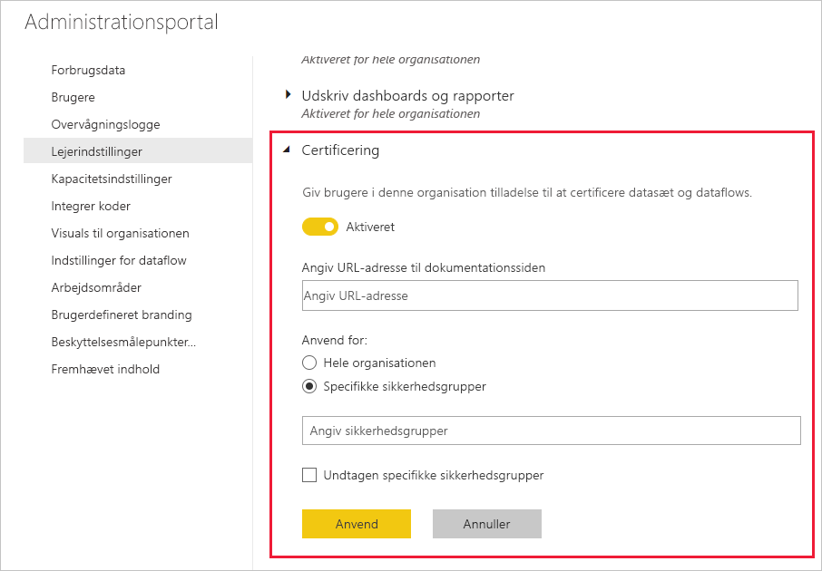

# Konfigurer certificering af datasæt og dataflow (prøveversion)

Din organisation kan certificere datasæt og dataflows, der er den autoritative kilde til vigtige oplysninger.

Du er som Power BI-lejeradministrator ansvarlig for at konfigurere certificeringsprocessen for din organisation. Det betyder følgende:
* Aktiverer af certificering på din lejer.
* Angivelse af definitioner af en liste over grupper og brugere, der har tilladelse til at certificere datasæt og dataflows.
* Angivelse af URL-adressen til organisationens certificeringspolitik for datasæt, hvis der findes en sådan.

Certificering af datasæt og dataflwos er en del *godkendelsen* af datasættet eller dataflowet. Se [godkendelse af datasæt](../connect-data/service-datasets-promote.md) og [godkendelse af dataflow](../transform-model/service-dataflows-promote-certify.md) for at få flere oplysninger.

## Konfiguration af certificering

1. Gå til lejerindstillingerne i administrationsportalen.
1. Under indstillinger for eksport og deling skal du udvide afsnittet Certificering.

   

1. Slå **Aktiveret** til.
1. Hvis din organisation har en offentliggjort certificeringspolitik for datasætcertificering, kan du angive dens URL-adresse her. Dette bliver linket til **at få mere at vide** afsnittet Certificering i [dialogboksen med indstillinger for godkendelsen](../connect-data/service-datasets-promote.md#request-dataset-certification) 
1. Angiv de grupper og brugere, der har tilladelse til at certificere datasæt og dataflows. Disse godkendte certificeringseksperter kan bruge knappen Certificering i afsnittet Certificering i dialogboksen med indstillinger for godkendelsen af [datasættet](../connect-data/service-datasets-promote.md#request-dataset-certification) eller [dataflowet](../transform-model/service-dataflows-promote-certify.md#certify-a-dataflow).
1. Klik på **Anvend**.

## De næste trin
* [Fremhæv datasæt](../connect-data/service-datasets-promote.md)
* [Certificer datasæt](../connect-data/service-datasets-certify.md)
* [Fremhæv datasæt](../transform-model/service-dataflows-promote-certify.md#promote-a-dataflow)
* [Certificer datasæt](../transform-model/service-dataflows-promote-certify.md#certify-a-dataflow)
* Har du nogen spørgsmål? [Prøv at spørge Power BI-community'et](https://community.powerbi.com/)
