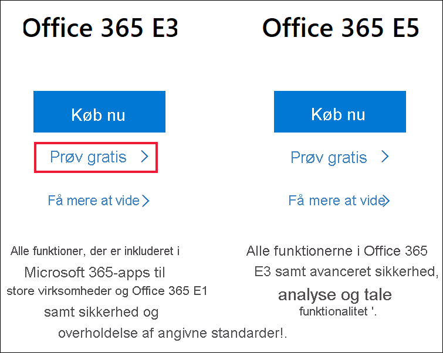
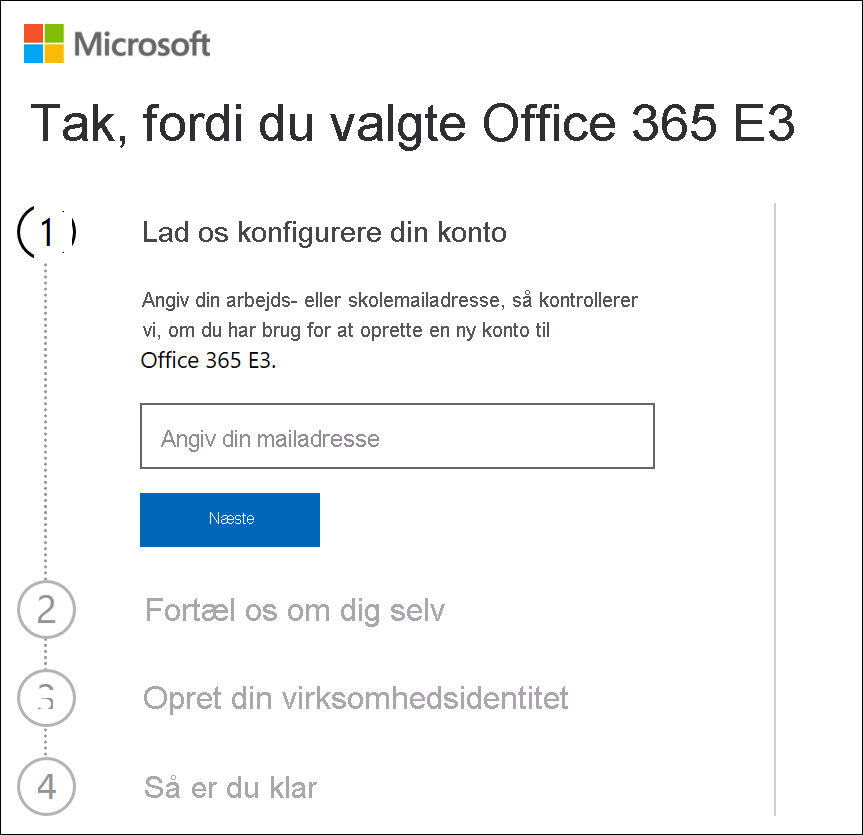
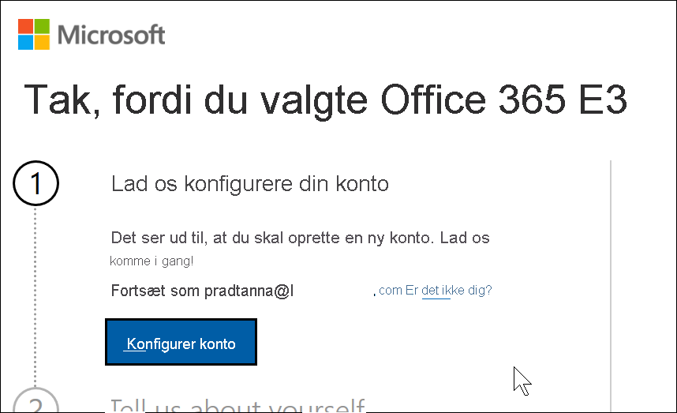
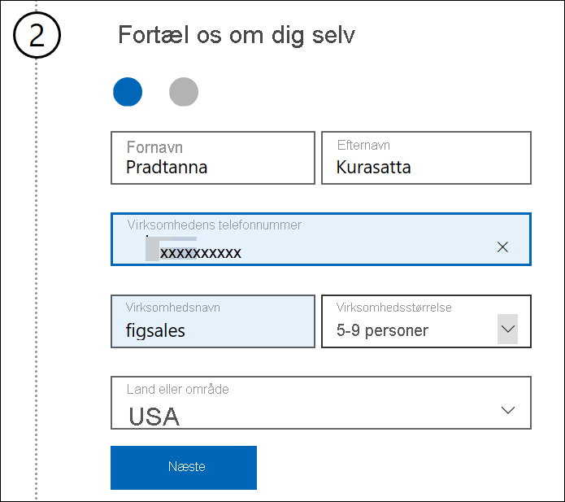
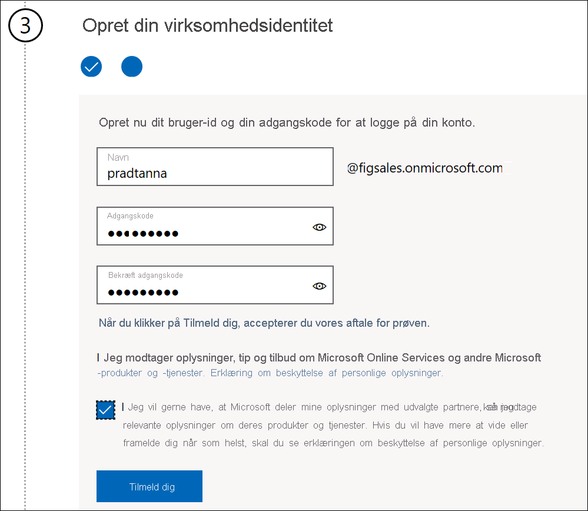
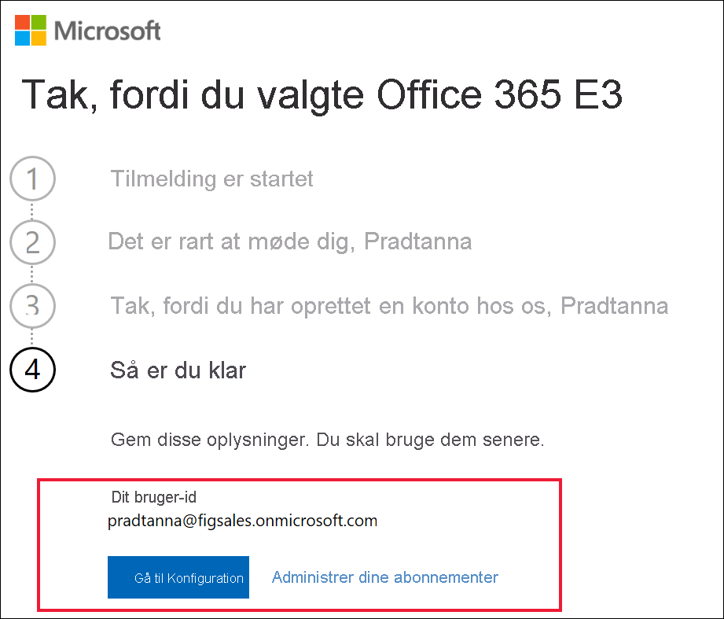

# Tilmelding til Power BI med en ny prøveversion af Microsoft 365

I denne artikel beskrives det, hvordan du kan tilmelde dig Power BI, hvis du ikke allerede har en arbejds- eller skolemailkonto.

Hvis du har problemer med at tilmelde dig Power BI med din mailadresse, skal du først kontrollere, at det er en [mailadresse, der kan bruges med Power BI](../fundamentals/service-self-service-signup-for-power-bi.md#supported-email-addresses). Hvis det ikke lykkes, kan du tilmelde dig en Microsoft 365-prøveversion og oprette en arbejdskonto. Derefter skal du bruge den nye arbejdskonto til at tilmelde dig Power BI-tjenesten. Du kan stadig bruge Power BI, efter prøveversionen af Microsoft 365 er udløbet.

> [!NOTE]
> Office 365 blev for nylig omdøbt til Microsoft 365. Du kan stadig støde på, at det omtales som Office 365, indtil alle vores artikler er opdateret.

## Tilmeld dig en Microsoft 365-prøveversion af Office
Tilmeld dig en Microsoft 365-prøveversion [på Microsoft 365-webstedet](https://www.microsoft.com/microsoft-365/business/compare-more-office-365-for-business-plans). Hvis du ikke allerede har en konto, guider Microsoft dig igennem trinnene til at oprette en. Da kommercielle mailkonti (f.eks. Hotmail og Gmail) ikke fungerer sammen med Microsoft 365, skal du oprette en ny konto, der gør.  Denne mailkonto vil ligne følgende *zalan@onmicrosoft.com* .

Hvis du vælger **Office 365 E5**, indeholder din prøveversion Power BI Pro. Prøveversionen af Power BI Pro udløber samtidig med prøveversionen af Office 365 E5, som i øjeblikket er 30 dage. Hvis du i stedet vælger **Office 365 E3**, kan du tilmelde dig Power BI som *gratis* bruger og opgradere til **Pro** og få en 60-dages prøveversion. 

1. Angiv din mailadresse. Microsoft giver dig besked om, om denne mailadresse fungerer sammen med Microsoft 365, eller om du har brug for at oprette en ny mailadresse.  

    Hvis du har brug for en ny mailadresse, guider Microsoft dig igennem trinnene. Første trin er at oprette en ny konto. Vælg **Konfigurer konto**.

    

2. Angiv oplysninger om den nye konto.

    

3. Opret din nye mailadresse og adgangskode. Opret et nyt logonnavn, der ligner you@yourcompany.onmicrosoft.com. Det er dette logon, du skal bruge med din nye Office 365-konto og med Power BI.

    

4. Det er det hele.  Du har nu en mailadresse, som du kan bruge til at tilmelde dig Power BI. Forsæt til [Tilmeld dig Power BI-tjenesten som enkeltperson](../service-self-service-signup-for-power-bi.md)

     

    Du skal muligvis vente, mens din nye lejer bliver oprettet.

## Vigtige overvejelser

Hvis du har problemer med at logge på med den nye konto, kan du prøve at bruge en privat browsersession.

Ved hjælp af denne metode til tilmelding opretter du en ny organisationslejer, og du bliver administrator for lejeren. Du kan finde flere oplysninger under [Hvad er Power BI-administration?](service-admin-administering-power-bi-in-your-organization.md). Du kan føje nye brugere til din lejer og derefter dele med dem, som beskrevet i [dokumentationen til Microsoft 365 Administration](https://support.office.com/article/Add-users-individually-to-Office-365---Admin-Help-1970f7d6-03b5-442f-b385-5880b9c256ec).

## Næste trin

[Hvad er Power BI-administration?](service-admin-administering-power-bi-in-your-organization.md)  
[Power BI-licenser i din organisation](service-admin-licensing-organization.md)  
[Tilmelding til Power BI som enkeltperson](../fundamentals/service-self-service-signup-for-power-bi.md)

Har du flere spørgsmål? [Prøv at spørge Power BI-community'et](https://community.powerbi.com/)
