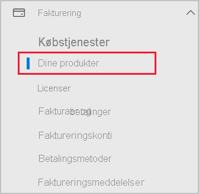

# Føj Power BI til et Microsoft 365-partnerabonnement

Microsoft 365 giver firmaer mulighed for at forhandle Microsoft 365 samlet og integreret med deres egne løsninger, hvilket giver kunderne et enkelt kontaktpunkt for køb, fakturering og support.

Hvis du er interesseret i at føje Power BI til dit Microsoft 365-abonnement, anbefaler vi, at du kontakter din partner for at gøre det. Hvis din partner ikke i øjeblikket tilbyder Power BI, kan du følge de indstillinger, der er beskrevet nedenfor.

## Arbejd sammen med din partner om at købe Power BI

Hvis du vil købe et abonnement på Power BI Pro eller Power BI Premium, skal du i samarbejde med din partner overveje, hvilke muligheder du har:

* Din partner kan acceptere at føje Power BI til sin portefølje, så du kan købe af den pågældende partner.

* Din partner kan lade dig overgå til en model, hvor du kan købe Power BI direkte af Microsoft eller en anden partner, som tilbyder Power BI.

## Køb fra Microsoft eller en anden kanal

Afhængigt af relationen med din partner kan du muligvis købe Power BI direkte fra Microsoft eller en anden partner. Du kan kontrollere, om du kan tilføje Power BI-abonnementer på Microsoft 365 Administration (kræver medlemskab med rollen Global administrator eller Faktureringsadministrator).

1. Gå til [Microsoft 365 Administration](https://admin.microsoft.com/AdminPortal/Home#/homepage).

1. Åbn **Fakturering** i menuen til venstre, og vælg derefter **Dine produkter**:

   

 1. Se efter **Abonnementer** som vist på billedet nedenfor. Hvis du kan se **Abonnementer**, kan du købe tjenesten direkte fra Microsoft, eller du kan kontakte en anden partner, der tilbyder Power BI.

    

    Hvis du ikke kan se **Abonnementer**, kan du ikke købe direkte fra Microsoft eller en anden partner.

Hvis din partner ikke tilbyder Power BI, og du ikke kan købe direkte fra Microsoft eller en anden partner, kan du overveje at tilmelde dig en gratis prøveversion.

## Tilmeld dig en gratis prøveversion

Du kan tilmelde dig en gratis prøveversion af Power BI. Hvis du ikke køber Power BI Pro i slutningen af prøveperioden, har du stadig en gratis licens, der indeholder mange af funktionerne i Power BI. Du kan finde flere oplysninger under [Tilmelding til Power BI som enkeltperson](../fundamentals/service-self-service-signup-for-power-bi.md).

### Aktivér ad hoc-abonnementer

Individuelle tilmeldinger (også kaldet ad hoc-abonnementer) er som standard deaktiveret. I dette tilfælde kan du se følgende meddelelse, når du forsøger at tilmelde dig: *Din it-afdeling har deaktiveret tilmelding til Microsoft Power BI*.

Hvis du vil aktivere ad hoc-abonnementer, kan du kontakte din partner og anmode om at få aktiveret dem. Hvis du er administrator for din lejer og ved, hvordan du bruger Azure Active Directory PowerShell-kommandoer, kan du selv aktivere ad hoc-abonnementer. Du kan finde flere oplysninger ved at følge fremgangsmåden i [Aktivér eller deaktiver køb via selvbetjening](service-admin-disable-self-service.md).

## Næste trin

* [Power BI-licenser i din organisation](service-admin-licensing-organization.md)
* [Køb og tildel Power BI Pro-licenser](service-admin-purchasing-power-bi-pro.md)

Har du flere spørgsmål? [Prøv at spørge Power BI-community'et](https://community.powerbi.com/)