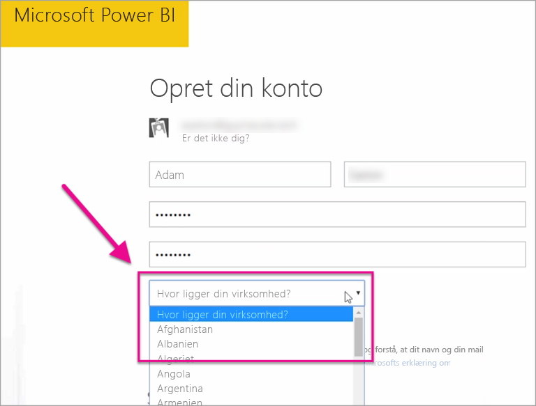

# Hvor er min Power BI-lejer placeret?

<iframe width="560" height="315" src="https://www.youtube.com/embed/0fOxaHJPvdM?showinfo=0" frameborder="0" allowfullscreen></iframe>

Find ud af, hvor din Power BI-lejer er placeret, og hvordan denne placering markeres. Det er vigtigt at forstå placeringen, da det kan påvirke de interaktioner, du har med tjenesten.

## Sådan afgør du, hvor din Power BI-lejer er placeret

Følg disse trin, for at finde det område din lejer befinder sig i.

1. Vælg hjælp ( **?** ) i den øverste menu i Power BI, og vælg derefter **Om Power BI**.

1. Søg efter værdien ud for **Dine data er lagret i**. Dette er det område, din lejer er placeret i. Værdien er også det område, hvor dine data er gemt, medmindre du bruger dedikerede kapaciteter i forskellige områder til dine arbejdsområder.

    

## Sådan vælges dataområdet

Dataområdet er baseret på det land, du vælger, når du opretter lejeren. Dette valg gælder for tilmelding til Microsoft 365 og Power BI, da disse oplysninger deles. Hvis dette er en ny lejer, skal du vælge det relevante land på listen, når du tilmelder dig.

Power BI vælger et dataområde, der er tættest på dette valg, hvilket afgør, hvor data for din lejer lagres.

> [!IMPORTANT]
> Du kan ikke ændre valget, efter du har oprettet lejeren.

Har du flere spørgsmål? [Prøv at spørge Power BI-community'et](https://community.powerbi.com/)

