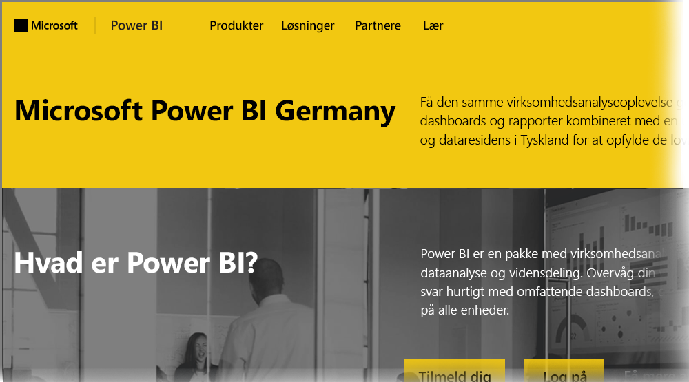

# Ofte stillede spørgsmål om Power BI til Germany Cloud-kunder
**Power BI-tjenesten** har en version, der er tilgængelig for EU/EFTA-kunder, ofte kaldet Microsoft Cloud Deutschland (MCD). Versionen af **Power BI-tjenesten**, der er beskrevet i denne artikel, er udviklet specielt til EU/EFTA-kunder og er separat og adskiller sig fra den kommercielle version af **Power BI-tjenesten** eller Power BI-tjenester, der leveres til regeringskunder.

## Spørgsmål og svar

Følgende spørgsmål og svar giver vigtige oplysninger om Power BI Pro-tjenesten i Microsoft Cloud Deutschland (MCD), som er den cloud-baserede Power BI-tjeneste specielt udviklet til EU/EFTA-kunder.

1. **Hvad er Power BI-tjenesten for Germany Cloud?**
   
   Power BI-tjenesten for EU/EFTA-kunder, også kaldet Microsoft Cloud Deutschland (MCD), er en skybaseret EU/EFTA-kompatibel tjeneste med Power BI-tjenesten leveret fra tyske datacentre. Alle kundedate i Power BI-tjenesten for EU/EFTA-clouden er lagret inaktivt i Tyskland med T-systemer fungerende som den uafhængige tyske datatillidshaver og med fysisk og logisk adgang til data kontrolleret i henhold til tysk lovgivning. Power BI-tjenesten for EU/EFTA-cloud kræver en entydig og separat konto i forhold til den kommercielle version af Power BI-tjenesten. Få mere at vide om Microsoft Cloud Deutschland [her](https://www.microsoft.com/trustcenter/cloudservices/nationalcloud).
2. **Hvor kan jeg finde pris- og tilmeldingsoplysninger til Power Germany Cloud?**
   
   Du kan finde mange oplysninger på [Power BI Germany Cloud-hjemmesiden](https://powerbi.microsoft.com/power-bi-germany/), herunder oplysninger om priser. På den pågældende side finder du også et tilmeldingslink til en 30-dages prøveversion af **Power BI Pro-tjenesten** med 25 brugerlicenser. Som en del af tilmeldingen til prøveversionen får du mulighed for at købe eller tilføje yderligere licenser efter behov. Vi tilbyder også priser på Enterprise Agreement (EA), til offentlige myndigheder og almennyttige organisationer. Kontakt din Microsoft-kunderepræsentant for at få flere oplysninger.
3. **Jeg har en Germany Cloud-lejer som en del af Azure Germany og/eller Office 365 Germany-abonnementer. Kan jeg bruge den eksisterende lejer til at tilmelde mig Power BI Germany?**
   
   Ja. Som en del af tilmeldingsprocessen får du mulighed for at logge på med en eksisterende Germany Cloud-lejeradministratorkonto og føje Power BI Pro-tjenestelicenserne til din eksisterende lejer i Germany Cloud. Vær opmærksom på, at Germany Cloud-lejere og brugerkonti er forskellige fra Power BI-tjenesten til Germany Cloud.
4. **Er der en gratis tjeneste i Power BI-tjenesten for Germany Cloud?**
   
   Nej. Vi tilbyder ikke versioner med gratis licens af Power BI-tjenesten for Germany Cloud. Men vi opfordrer dig til at tilmelde dig [den gratis version af Power BI i vores offentlige cloud](https://powerbi.microsoft.com/get-started/), hvis dine virksomhedsbehov opfyldes med den gratis version af Power BI.
5. **Kan jeg bruge Power BI Desktop, Power BI – Mobil, datagateway i det lokale miljø og Publisher til Excel med Power BI-tjenesten for Germany Cloud?**
   
   Ja. Vi har opdateret vores Power BI-klientprodukter, så de fungerer problemfrit med Power BI-tjenesten for Germany Cloud. Log på med din Power BI-tjeneste for Germany Cloud-konto for at begynde at bruge de samme klientprodukter med Power BI-tjenesten for Germany Cloud. Du kan hente den seneste version af klientprodukter på de følgende placeringer:
   
   * [Power BI Desktop](https://powerbi.microsoft.com/desktop/)
   * [Power BI Mobile](https://powerbi.microsoft.com/mobile/)
   * [On-premises data gateway (Datagateway i det lokale miljø)](https://powerbi.microsoft.com/gateway/)
   * [Power BI Publisher til Excel](https://powerbi.microsoft.com/excel-dashboard-publisher/)
6. **Er der nogen funktionsbegrænsninger i Power BI-tjenesten for Germany Cloud?**
   
   De følgende tjenestefunktioner er i øjeblikket ikke tilgængelige i Power BI-tjenesten for Germany Cloud:
   
   * Udgiv på internettet
   * ArcGIS maps af Esri
   * Power BI Embedded (særskilt forbrugsbaseret ISV-licensering bliver tilgængeligt gennem [Microsoft Azure Germany](https://azure.microsoft.com/overview/clouds/germany/) i fremtiden)
   * Logføring af aktivitet

7. **Hvor kan jeg finde Power BI-tjenesten for Germany Cloud-specifikke konfigurationsoplysninger for brug og integration i mine programmer?**
   
   Vi har opdateret vores [eksempler på SaaS-integration til udviklere](https://github.com/Microsoft/PowerBI-Developer-Samples) med Germany og andre specifikke konfigurationsoplysninger tilknyttet Power BI Clouds. Se mappen **Cloud Configs** for at få eksempler på cloudspecifikke konfigurationsslutpunkter. Den følgende tabel viser en oversigt over forskellige konfigurationsslutpunkter for Power BI-tjenesten for Germany Cloud (og Public Cloud for krydsreference).

| **Slutpunktnavn og/eller forbrug** | **Power BI-tjeneste for Germany cloud-URL** | **Tilsvarende URL i Public Cloud (for krydshenvisning)** |
| --- | --- | --- |
| Startside, Tilmelding og Logon |[https://powerbi.microsoft.com/power-bi-germany/](https://powerbi.microsoft.com/power-bi-germany/) |[https://powerbi.microsoft.com/](https://powerbi.microsoft.com/) |
| Power BI-tjenestens direkte logon |[https://app.powerbi.de/?noSignUpCheck=1](https://app.powerbi.de/?noSignUpCheck=1) |[https://app.powerbi.com/?noSignUpCheck=1](https://app.powerbi.com/?noSignUpCheck=1) |
| Service-API |[https://api.powerbi.de/](https://api.powerbi.de/) |[https://api.powerbi.com/](https://api.powerbi.com/) |
| Office-portal for brugerlicensadministration, tjenestetilstandsstatus og supportanmodninger af administratorer |[https://portal.office.de/](https://portal.office.de/) |[https://portal.office.com/](https://portal.office.com/) |
| AAD-myndighed Uri-adresse |[https://login.microsoftonline.de/common/oauth2/authorize/](https://login.microsoftonline.de/common/oauth2/authorize/) |[https://login.microsoftonline.com/common/oauth2/authorize/](https://login.microsoftonline.com/common/oauth2/authorize/) |
| Power BI-tjenesteressources Uri-adresse |[https://app.powerbi.com/apps](https://app.powerbi.com/apps) | |
| Bibliotek med Power BI-visuals |[https://app.powerbi.de/visuals/](https://app.powerbi.de/visuals/) |[https://app.powerbi.com/visuals/](https://app.powerbi.com/visuals/) |
| Registrering af et program til Power BI (til Embedded) |[https://app.powerbi.de/apps](https://app.powerbi.de/apps) |[https://app.powerbi.com/apps](https://app.powerbi.com/apps) |
| Azure-portal (til Embedded) |[https://portal.microsoftazure.de/](https://portal.microsoftazure.de/) |[https://portal.azure.com/](https://portal.azure.com/) |
| Community |[https://community.powerbi.com/](https://community.powerbi.com/) |[https://community.powerbi.com/](https://community.powerbi.com/) |

## Næste trin
Du kan gøre mange forskellige ting med Power BI. Yderligere oplysninger og læring, herunder en artikel, der viser, hvordan du tilmelder dig tjenesten, findes i følgende ressourcer:

* [Automatiseret læring til Power BI](../guided-learning/index.yml)
* [Kom i gang med Power BI-tjenesten](../fundamentals/service-get-started.md)
* [Hvad er Power BI Desktop?](../fundamentals/desktop-what-is-desktop.md)
