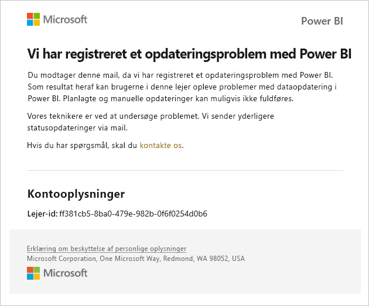
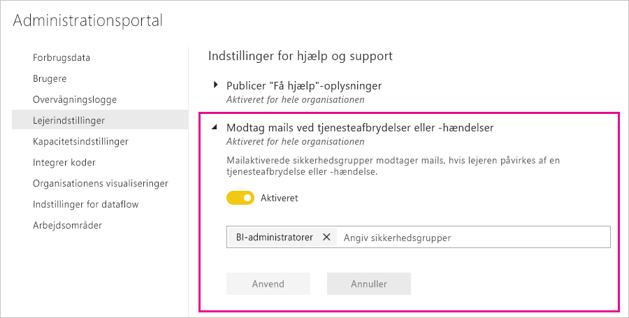

# Meddelelser om tjenesteafbrydelser

Det er vigtigt at have indsigt i tilgængeligheden af dine missionskritiske virksomhedsprogrammer. Power BI giver besked om hændelser, så du kan vælge at modtage mails, hvis der er en tjenesteafbrydelse eller -forringelse. Selvom serviceniveauaftalen på 99,9 % for Power BI sikrer, at dette sker sjældent, vil vi gerne sikre os, at du får besked om det. På følgende skærmbillede kan du se den type mail, du modtager, hvis du aktiverer meddelelser:

På nuværende tidspunkt sender vi mails for følgende _pålidelighedsscenarier_:

- Pålidelighed af åben rapport
- Pålidelighed af opdatering af model
- Pålidelighed af opdatering af forespørgsel

Der sendes meddelelser, når der er en _længere forsinkelse_ i handlinger såsom åbning af rapporter, opdateringer af datasæt eller udførelser af forespørgsler. Når en hændelse er løst, modtager du en opfølgningsmail.

> [!NOTE]
> Denne funktion er i øjeblikket kun tilgængelig for dedikerede kapaciteter i Power BI Premium. Den er ikke tilgængelig til delt eller integreret kapacitet.

## Notifikationer om kapacitet og pålidelighed

Når en Power BI Premium-kapacitet har længere perioder med et stort ressourceforbrug, der kan have indflydelse på pålideligheden, sendes der en notifikation via mail. Eksempler på sådanne indvirkninger omfatter store forsinkelser i handlinger, f.eks. åbning af en rapport, opdatering af datasæt og udførelse af forespørgsler. 

Notifikationen indeholder oplysninger om årsagen til det høje ressourceforbrug, herunder følgende:

* Datasæt-id for det ansvarlige datasæt
* Handlingstype
* Den CPU-tid, der er forbundet med det høje ressourceforbrug

Power BI sender også notifikationer via mail, når der registreres en overbelastning af en Power BI Premium-kapacitet. I mailen forklares den sandsynlige årsag til overbelastningen, hvilke handlinger der har genereret overbelastningen i de seneste 10 minutter, og hvor meget belastning hver handling har genereret. 

Hvis du har mere end én Premium-kapacitet, indeholder mailen oplysninger om disse kapaciteter i den overbelastede periode, så du kan overveje at flytte de arbejdsområder, der indeholder ressourceintensive elementer, til de kapaciteter, der har mindst belastning.

Mailnotifikationerne med oplysninger om overbelastning sendes kun, når overbelastningsgrænsen udløses. Du modtager ikke endnu en mail, når belastningen i den pågældende Premium-kapacitet vender tilbage til et niveau uden overbelastning.

På følgende billede vises et eksempel på en mailnotifikation:

## Aktivér meddelelser

En administrator af Power BI-lejeren aktiverer meddelelser på administrationsportalen:

1. Identificer eller opret en mailaktiveret sikkerhedsgruppe, der skal modtage meddelelserne.

1. På administrationsportalen skal du vælge **lejerindstillinger**. Under **indstillinger for hjælp og support** skal du udvide **Modtag meddelelser via mail for tjenesteafbrydelser eller -hændelser**.

1. Aktivér meddelelser, angiv en sikkerhedsgruppe, og vælg **Anvend**.

    

> [!NOTE]
> Power BI sender meddelelser fra kontoen no-reply-powerbi@microsoft.com. Sørg for, at denne konto er anført på hvidlisten, så meddelelserne ikke ender i en spammappe eller en mappe med uønsket post.

## Næste trin

[Supportmuligheder til Power BI Pro og Power BI Premium](service-support-options.md)

Har du flere spørgsmål? [Prøv at spørge Power BI-community'et](https://community.powerbi.com/)
