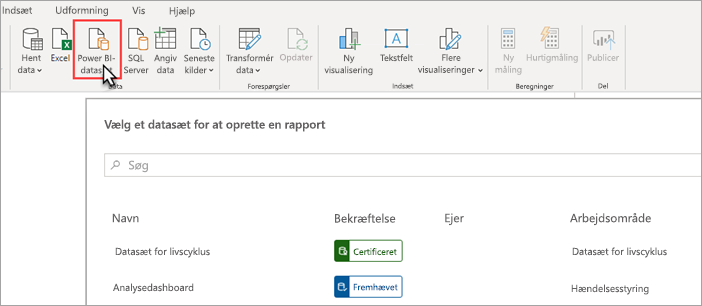
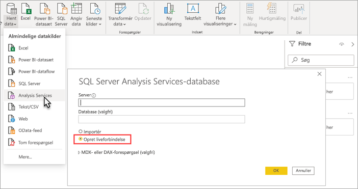

# Netværksmulighed for datasæt med XMLA-slutpunktet (prøveversion)

Power BI Premium-arbejdsområder og -datasæt på kompatibilitetsniveau 1500 og derover understøtter netværksmulighed til åbne platforme fra Microsoft og klientprogrammer og værktøjer fra tredjepart ved hjælp af et *XMLA-slutpunkt*.

> [!NOTE]
> Denne funktion er en **prøveversion**. Prøveversioner af funktioner må ikke bruges i et produktionsmiljø. Visse funktioner og dele af support og dokumentation er begrænset.  Du kan finde flere oplysninger i [vilkårene for Microsoft Online Services](https://www.microsoft.com/licensing/product-licensing/products?rtc=1).

## Hvad er et XMLA-slutpunkt?

I Power BI Premium bruges [XMLA](https://docs.microsoft.com/analysis-services/xmla/xml-for-analysis-xmla-reference?view=power-bi-premium-current)-protokollen (XML for Analysis) til kommunikation mellem klientprogrammer og det program, som administrerer dine Power BI-arbejdsområder og datasæt. Denne kommunikation sker via det, der ofte kaldes XMLA-slutpunkter. XMLA er den samme kommunikationsprotokol, der bruges af Microsoft Analysis Services-programmet, som under overfladen udfører semantisk modellering, styring, livscyklus og dataadministration i Power BI.

Som standard er *skrivebeskyttet* netværksmulighed ved hjælp af slutpunktet aktiveret for **arbejdsbelastningen for datasæt** i en kapacitet. Med skrivebeskyttet netværksmulighed kan datavisualiseringsprogrammer og -værktøjer forespørge datasætmodeldata, metadata, hændelser og skemaer. *Læse-/skrive*handlinger, der bruger slutpunktet, kan aktiveres, hvilket giver yderligere administration af datasæt, styring, avanceret semantisk modellering, fejlfinding og overvågning. Når læse-/skrive-handlinger er aktiveret, har Power BI Premium-datasæt mere paritet med Azure Analysis Services' og SQL Server Analysis Services' tabellariske modelleringsværktøjer og -processer i virksomhedsklasse.

> [!NOTE]
> Det anbefales, at du bruger den moderne arbejdsområdeoplevelse, især når du opretter forbindelse til dine datasæt ved hjælp af XMLA-slutpunktet. Handlinger som f.eks. oprettelse eller sletning af datasæt understøttes ikke med klassiske arbejdsområder. Hvis du vil opgradere klassiske arbejdsområder til den moderne oplevelse, skal du se [Opgrader klassiske arbejdsområder i Power BI](../collaborate-share/service-upgrade-workspaces.md).

## Datamodellerings- og administrationsværktøjer

Dette er nogle af de mest almindelige værktøjer, der bruges sammen med Azure Analysis Services og SQL Server Analysis Services og understøttes nu af Power BI Premium-datasæt:

**Visual Studio med Analysis Services-projekter** – også kendt som SQL Server Data Tools eller blot **SSDT**, er et modeloprettelsesværktøj i virksomhedsklasse til oprettelse af tabellariske Analysis Services-modeller. Analysis Services-projektudvidelser understøttes i alle Visual Studio 2017-udgaver og nyere udgaver, herunder den gratis Community-udgave. Udvidelsesversion 2.9.6 eller nyere er påkrævet for at udrulle tabellariske modeller i et Premium-arbejdsområde. Når du udruller til et Premium-arbejdsområde, skal modellen have et kompatibilitetsniveau på 1500 eller derover. Læse-/skriveadgang til XMLA er påkrævet til arbejdsbelastningen for datasæt. Du kan få mere at vide under [Værktøjer til Analysis Services](https://docs.microsoft.com/analysis-services/tools-and-applications-used-in-analysis-services?view=power-bi-premium-current).

**SQL Server Management Studio (SSMS)**   – understøtter DAX-, MDX- og XMLA-forespørgsler. Udfør detaljerede opdateringshandlinger og scripting af metadata for datasæt ved hjælp af [TMSL](https://docs.microsoft.com/analysis-services/tmsl/tabular-model-scripting-language-tmsl-reference) (Tabular Model Scripting Language). Skrivebeskyttet adgang er påkrævet til forespørgselshandlinger. Læse-/skriveadgang er påkrævet til scripting af metadata. Kræver SSMS-version 18.4 eller nyere. Download  [her](https://docs.microsoft.com/sql/ssms/download-sql-server-management-studio-ssms).

**SQL Server Profiler**  – Dette værktøj installeres sammen med SSMS og gør det muligt at spore og foretage fejlfinding af datasæthændelser. Profiler frarådes officielt til SQL Server, men er fortsat inkluderet i SSMS, og det understøttes stadig af Analysis Services og Power BI Premium. Skrivebeskyttet adgang til XMLA er påkrævet. Du kan få mere at vide under  [SQL Server Profiler for Analysis Services](https://docs.microsoft.com/analysis-services/instances/use-sql-server-profiler-to-monitor-analysis-services?view=power-bi-premium-current).

**Analysis Services-installationsguide** – Dette værktøj, der installeres sammen med SSMS, giver mulighed for udrulning af tabellariske modelprojekter, der er oprettet af Visual Studio, til Analysis Services og Power BI Premium-arbejdsområder. Det kan køres interaktivt eller automatiseret fra kommandolinjen. Læse-/skriveadgang til XMLA er påkrævet. Du kan få mere at vide under [Analysis Services-installationsguide](https://docs.microsoft.com/analysis-services/deployment/deploy-model-solutions-using-the-deployment-wizard?view=power-bi-premium-current).

**PowerShell-cmdletter** – Analysis Services-cmdlet'er kan bruges til at automatisere styring af datasæt, f. eks. opdateringshandlinger. Læse-/skriveadgang til XMLA er påkrævet. Version **21.1.18221** eller en nyere version af [modulet SqlServer-PowerShell](https://www.powershellgallery.com/packages/SqlServer/) er påkrævet. Azure Analysis Services-cmdlet'er i modulet Az. AnalysisServices understøttes ikke for Power BI Premium. Du kan få mere at vide under [Analysis Services PowerShell-reference](https://docs.microsoft.com/analysis-services/powershell/analysis-services-powershell-reference?view=power-bi-premium-current).

**Power BI Report Builder** – Et værktøj, der bruges til at oprette sideinddelte rapporter. Opret en rapportdefinition, der angiver, hvilke data der skal hentes, hvor du kan få dem, og hvordan de skal vises. Du kan få vist et eksempel på rapporten i Report Builder og derefter publicere den i Power BI-tjenesten. Skrivebeskyttet adgang til XMLA er påkrævet. Du kan få mere at vide under  [Power BI Report Builder](https://docs.microsoft.com/power-bi/report-builder-power-bi).

**Tabular Editor** – Et værktøj med åben kildekode til oprettelse, vedligeholdelse og administration af tabellariske modeller ved hjælp af en intuitiv, letvægtseditor. En hierarkisk visning viser alle objekter i din tabellariske model. Objekter organiseres efter visningsmapper med understøttelse af egenskabsredigering med flere valg og fremhævning af DAX-syntaks. Skrivebeskyttet adgang til XMLA er påkrævet til forespørgselshandlinger. Læse-/skriveadgang er påkrævet til metadatahandlinger. Du kan få mere at vide under [tabulareditor.github.io](https://tabulareditor.github.io/).

**DAX Studio** – Et værktøj med åben kildekode til DAX-oprettelse, -diagnosticering, -justering af ydeevne og analyse. Funktionerne omfatter objektgennemsyn, integreret sporing, udspecificering af udførelse af forespørgsler med detaljeret statistik, fremhævning og formatering af DAX-syntaks. Skrivebeskyttet adgang til XMLA er påkrævet til forespørgselshandlinger. Du kan få mere at vide under  [daxstudio.org](https://daxstudio.org/).

**ALM Toolkit** – Et værktøj til skemasammenligning med åben kildekode til Power BI-datasæt, der oftest bruges til ALM-scenarier (Application Lifecycle Management). Udfør udrulning på tværs af miljøer, og bevar historiske data med trinvis opdatering. Sammenlig og flet metadatafiler, forgreninger og lagre. Genbrug fælles definitioner på datasæt. Skrivebeskyttet adgang er påkrævet til forespørgselshandlinger. Læse-/skriveadgang er påkrævet til metadatahandlinger. Du kan få mere at vide under [alm-toolkit.com](http://alm-toolkit.com/).

**Microsoft Excel** – Excel-pivottabeller er et af de mest almindelige værktøjer, der bruges til at opsummere, analysere, udforske og præsentere oversigtsdata fra Power BI-datasæt. Skrivebeskyttet adgang er påkrævet til forespørgselshandlinger. Klik og Kør-versionen af Office 16.0.11326.10000 eller nyere er påkrævet.

**Tredjepart** – Omfatter programmer og værktøjer til visualisering af klientdata, der kan oprette forbindelse til, forespørge om og forbruge datasæt i Power BI Premium. De fleste værktøjer kræver de nyeste versioner af MSOLAP-klientbiblioteker, men nogle bruger muligvis ADOMD. XMLA-slutpunkter er skrivebeskyttet eller i læse-/skrivetilstand afhængigt af handlingerne.

### Klientbiblioteker

Klientprogrammer kommunikerer ikke direkte med XMLA-slutpunktet. De bruger i stedet *klient biblioteker* som abstraktionslag. Dette er de samme klientbiblioteksprogrammer, der bruges til at oprette forbindelse til Azure Analysis Services og SQL Server Analysis Services. Microsoft-programmer, f.eks. Excel, SSMS (SQL Server Management Studio) og Analysis Services-projektudvidelse til Visual Studio, installerer alle tre klientbiblioteker og opdaterer dem sammen med regelmæssige opdateringer af programmer og udvidelser. Udviklere kan også bruge klientbibliotekerne til at bygge brugerdefinerede programmer. I nogle tilfælde og især i forbindelse med tredjepartsprogrammer kan det være nødvendigt at installere nyere versioner af klientbibliotekerne, hvis de ikke installeres sammen med programmet. Klientbiblioteker opdateres hver måned. Du kan få mere at vide under  [Klientbiblioteker for oprettelse af forbindelse til Analysis Services](https://docs.microsoft.com/azure/analysis-services/analysis-services-data-providers).

## Understøttede skrivehandlinger

Metadata for datasæt fremvises via klientbiblioteker, der er baseret på en TOM (Tabular Object Model), så udviklere kan bygge brugerdefinerede programmer. Det gør det muligt for Visual Studio-og communityværktøjer med åben kildekode, f. eks. Tabular Editor, at levere yderligere datamodellering og udrulningsmuligheder, der understøttes af Analysis Services-programmet, men endnu ikke understøttes i Power BI Desktop. Yderligere funktionalitet til datamodellering omfatter:

- [Beregningsgrupper](https://docs.microsoft.com/analysis-services/tabular-models/calculation-groups?view=power-bi-premium-current), der giver mulighed for genanvendelse af beregninger og forenklet forbrug af komplekse modeller.

- [Metadataoversættelser](https://docs.microsoft.com/analysis-services/tabular-models/translations-in-tabular-models-analysis-services?view=power-bi-premium-current), der giver mulighed for at understøtte rapporter med flere sprog og datasæt.

- [Perspektiver](https://docs.microsoft.com/analysis-services/tabular-models/perspectives-ssas-tabular?view=power-bi-premium-current), der giver mulighed for at definere fokuserede, virksomhedsdomænespecifikke visninger af metadata for datasæt.

Sikkerhed på objektniveau understøttes endnu ikke i Power BI Premium-datasæt.

## Optimer datasæt for skrivehandlinger

Når du bruger XMLA-slutpunktet til administration af datasæt med skrivehandlinger, anbefales det, at du aktiverer datasættet til store modeller. Dette reducerer forbruget af skrivehandlinger, hvilket kan gøre dem betydeligt hurtigere. For datasæt på over 1 GB (efter komprimering) kan forskellen være væsentlig. Du kan få mere at vide under [Store modeller i Power BI Premium](service-premium-large-models.md).

## Aktivér læse/skriveadgang til XMLA

Som standard er XMLA-slutpunktets egenskabsindstilling aktiveret til skrivebeskyttet adgang for en Premium-kapacitet. Det betyder, at programmer kun kan forespørge et datasæt. Hvis programmer skal kunne udføre skrivehandlinger, skal XMLA-slutpunktets egenskabsindstilling være aktiveret til læse-/skriveadgang. XMLA-slutpunktets egenskabsindstilling for en kapacitet er konfigureret i **arbejdsbelastningen for datasæt**. Indstillingen for XMLA-slutpunktet gælder for *alle arbejdsområder og datasæt*, der er tildelt til kapaciteten.

### Sådan aktiverer du læse/skrive-adgang for en kapacitet

1. Klik på **Kapacitetsindstillinger** > **Power BI Premium** > kapacitetsnavn i administrationsportalen.
2. Udvid **Arbejdsbelastninger**. Vælg **Læsning og skrivning** i indstillingen **XMLA-slutpunkt**.

    

## Opret forbindelse til et Premium-arbejdsområde

Arbejdsområder, der er tildelt til en dedikeret kapacitet, har en forbindelsesstreng i URL-format som dette `powerbi://api.powerbi.com/v1.0/[tenant name]/[workspace name]`.

Programmer, der opretter forbindelse til arbejdsområdet, bruger URL-adressen, som om den var et Analysis Services-servernavn. For eksempel `powerbi://api.powerbi.com/v1.0/contoso.com/Sales Workspace`.

Brugere med UPN'er i den samme lejer (ikke B2B) kan erstatte lejernavnet med `myorg`. For eksempel  `powerbi://api.powerbi.com/v1.0/myorg/Sales Workspace`.

B2B-brugere skal angive deres organisations UPN i lejernavnet. For eksempel  `powerbi://api.powerbi.com/v1.0/fabrikam.com/Sales Workspace`.

### Sådan henter du URL-adressen til arbejdsområdet

Klik på **Kopiér** i arbejdsområdet **Indstillinger** > **Premium** > **Arbejdsområdeforbindelse**.

## Forbindelseskrav

### Oprindeligt katalog

For nogle funktioner, f.eks. SQL Server Profiler, skal du muligvis angive et *oprindeligt katalog*. Angiv et datasæt (en database) i dit arbejdsområde. Klik på **Indstillinger** > **Egenskaber for forbindelse** > **Opret forbindelse til database** i dialogboksen **Opret forbindelse til server**, og angiv datasættets navn.

### Identiske navne på arbejdsområder

[Nye arbejdsområder](../collaborate-share/service-new-workspaces.md) (oprettet ved hjælp af den nye arbejdsområdeoplevelse) i Power BI pålægger validering for ikke at tillade oprettelse eller omdøbning af arbejdsområder med identiske navne. Arbejdsområder, der ikke er overført, kan resultere i identiske navne. Når du opretter forbindelse til et arbejdsområde med det samme navn som et andet arbejdsområde, kan du få følgende fejl:

**Der kan ikke oprettes forbindelse til powerbi://api.powerbi.com/v1.0/ [lejernavn]/[navn på arbejdsområde].**

Hvis du vil undgå denne fejl, skal du ud over navnet på arbejdsområdet angive ObjectIDGuid, som kan kopieres fra arbejdsområdets objectID til URL-adressen. Føj objectID til URL-adressen til forbindelsen. F.eks.  
'powerbi://api.powerbi.com/v1.0/myorg/Contoso Sales – 9d83d204-82a9-4b36-98f2-a40099093830'.

### Duplikeret navn på datasæt

Når du opretter forbindelse til et datasæt med samme navn som et andet datasæt i det samme arbejdsområde, kan du føje datasættets GUID til datasættets navn. Du kan hente både datasættets navn og GUID, når du har forbindelse til arbejdsområdet i SSMS.

### Forsinkelse i visning af datasæt

Når du opretter forbindelse til et arbejdsområde, kan der gå nogle minutter, inden ændringer i nye, slettede og omdøbte datasæt vises.

### Ikke-understøttede datasæt

Følgende datasæt er ikke tilgængelige for XMLA-slutpunkter. Disse datasæt vises ikke under arbejdsområdet i SSMS eller i andre værktøjer:

- Datasæt, der er baseret på en direkte forbindelse til Azure Analysis Services eller SQL Server Analysis Services. 
- Datasæt, der er baseret på en direkte forbindelse til et Power BI-datasæt i et andet arbejdsområde. Du kan få mere at vide under [Introduktion til datasæt på tværs af arbejdsområder](../connect-data/service-datasets-across-workspaces.md).
- Datasæt med pushdata ved hjælp af REST-API'en.
- Datasæt for Excel-projektmapper.

## Sikkerhed

Ud over den egenskab for XMLA-slutpunktet, der aktiveres til læse-/skrivetilstand af kapacitetsadministratoren, skal indstillingen **Eksportér data** på lejerniveau i Power BI-administrationsportalen, som også er påkrævet for Analysér i Excel, være aktiveret.

Adgang via XMLA-slutpunktet overholder det medlemskab af sikkerhedsgrupper, der er angivet på arbejdsområde-/appniveau.

Bidragsydere i arbejdsområder og derover har skriveadgang til datasættet og svarer derfor til Analysis Services-databaseadministratorer. De kan udrulle nye datasæt fra Visual Studio og udføre TMSL-scripts i SSMS.

Handlinger, der kræver administratortilladelser til Analysis Services-serveren (i stedet for databaseadministrator), f. eks. serverniveausporinger og brugerrepræsentation ved hjælp af egenskaben [EffectiveUserName](https://docs.microsoft.com/analysis-services/instances/connection-string-properties-analysis-services?view=power-bi-premium-current#bkmk_auth) for forbindelsesstrenge, understøttes ikke i Power BI Premium på nuværende tidspunkt.

Andre brugere, der har [tilladelsen Opret](../connect-data/service-datasets-build-permissions.md) til et datasæt, svarer til Analysis Services-databaselæsere. De kan oprette forbindelse til og gennemse datasæt med henblik på dataforbrug og visualisering. Regler for sikkerhed på rækkeniveau overholdes, og de kan ikke se de interne metadata for datasæt.

### Modelroller

Metadata for datasæt via XMLA-slutpunktet kan oprette, redigere eller slette modelroller fra et datasæt, herunder angive sikkerhedsfiltre på rækkeniveau (RLS). Modelroller i Power BI bruges kun til sikkerhed på rækkeniveau. Brug Power BI-sikkerhedsmodellen til at styre tilladelser ud over sikkerhed på rækkeniveau.

Følgende begrænsninger gælder, når der arbejdes med datasætroller via XMLA-slutpunktet:

- **Under den offentlige prøveversion kan du ikke angive rollemedlemskab for et datasæt ved hjælp af XMLA-slutpunktet**. I stedet skal du angive rollemedlemmer på siden Sikkerhed på rækkeniveau for et datasæt i Power BI-tjenesten.
- Den eneste tilladelse for en rolle, der kan angives for Power BI-datasæt, er læsetilladelse. Oprettelsestilladelse til et datasæt er påkrævet for at få læseadgang via XMLA-slutpunktet, uanset om der findes datasætroller. Brug Power BI-sikkerhedsmodellen til at styre tilladelser ud over sikkerhed på rækkeniveau.
- Sikkerhed på objektniveau understøttes ikke i Power BI i øjeblikket.

### Angivelse af datakildens legitimationsoplysninger

De metadata, der er angivet via XMLA-slutpunktet, kan oprette forbindelse til datakilder, men kan ikke angive legitimationsoplysninger for datakilder. I stedet kan du angive legitimationsoplysninger på dataindstillingssiden i Power BI-tjenesten.

### Tjenesteprincipaler

Under den offentlige prøveversion understøttes oprettelse af forbindelse med XMLA-slutpunktet ved hjælp af en [tjenesteprincipal](https://docs.microsoft.com/azure/active-directory/develop/app-objects-and-service-principals) i automatiseringsscenarier endnu ikke.

## Udrul modelprojekter fra Visual Studio (SSDT)

Installation af et tabellarisk modelprojekt i Visual Studio til et Power BI Premium-arbejdsområde er stort set det samme som at udrulle til en Azure- eller SQL Server Analysis Services-server. De eneste forskelle er i egenskaben Installationsserver, der er angivet for projektet, og den måde legitimationsoplysninger til datakilden angives på, så behandlingshandlinger kan importere data fra datakilder til det nye datasæt i arbejdsområdet.

> [!IMPORTANT]
> Under den offentlige prøveversion kan rollemedlemskaber ikke angives af værktøjer ved hjælp af XMLA-slutpunktet. Hvis dit modelprojekt ikke kan udrulles, skal du sørge for, at der ikke er angivet nogen brugere i nogen roller. Når modellen er udrullet, skal du angive brugere for datasætroller i Power BI-tjenesten. Du kan få mere at vide under [Modelroller](#model-roles) tidligere i denne artikel.

Hvis du vil installere et tabellarisk modelprojekt, der er oprettet i Visual Studio, skal du først angive URL-adressen til arbejdsområdeforbindelsen i egenskaben **Installationsserver** for projektet. Højreklik på projektet > **Egenskaber** i **Løsningsoversigt** i Visual Studio. Indsæt URL-adressen til arbejdsområdeforbindelsen i egenskaben **Server**.

Når egenskaben Installationsserver er angivet, kan projektet udrulles.

**Når et projektet er udrullet første gang**, oprettes der et datasæt i arbejdsområdet ved hjælp af metadata fra model.bim. Som en del af udrulningshandlingen, kan behandling med henblik på indlæsning af data i datasættet fra datakilder ikke udføres, efter at datasættet er blevet oprettet i arbejdsområdet fra modelmetadata.

Behandlingen mislykkes, eftersom legitimationsoplysninger ikke kan angives som en del af udrulninghandlingen, når der udrulles til en Premium-arbejdsområdedatakilde. Dette er ikke tilfældet, når der udrulles til en Azure- eller SQL Server Analysis Server-instans, hvor der anmodes om legitimationsoplysninger som en del af udrulningshandlingen. I stedet angives legitimationsoplysninger for datakilden i Power BI Service i datasætindstillingerne, efter at metadataene er udrullet, og datasættet er oprettet. Klik på **Datasæt** > **Indstillinger** > **Legitimationsoplysninger for datakilde** > **Rediger legitimationsoplysninger** i arbejdsområdet.

Når der er angivet legitimationsoplysninger for datakilden, kan du opdatere datasættet i Power BI-tjenesten, konfigurere den planlagte opdatering eller proces (opdatering) fra SQL Server Management Studio for at indlæse data i datasættet.

Der tages højde for egenskaben **Behandlingsindstilling** for udrulningen, der er angivet i projektet i Visual Studio. Men hvis en datakilde endnu ikke har fået angivet legitimationsoplysninger i Power BI-tjenesten, mislykkes behandlingen, selv hvis udrulningen af metadata lykkes. Du kan angive egenskaben til **Behandl ikke**, hvilket forhindrer et forsøg på at udføre behandling som en del af udrulningen, men du kan angive egenskaben til **Standard** igen, eftersom behandlingen udføres som en del af de efterfølgende udrulningshandlinger, fordi legitimationsoplysningerne for datakilden er angivet i indstillingerne for datakilden for det nye datasæt.

## Opret forbindelse med SSMS

Brug af SSMS til at oprette forbindelse til et arbejdsområde svarer til at oprette forbindelse til en Azure- eller SQL Server Analysis Services-server. Den eneste forskel er, at du angiver URL-adressen til arbejdsområdet i servernavnet, og at du skal bruge godkendelse af typen **Active Directory – Universal med MFA**.

### Opret forbindelse til et arbejdsområde ved hjælp af SSMS

1. Klik på **Opret forbindelse** > **Opret forbindelse til server** i SQL Server Management Studio.

2. Vælg **Analysis Services** i **Servertype**. Angiv URL-adressen til arbejdsområdet i **Servernavn**. Vælg **Active Directory - Universal with MFA Support** under **Godkendelse**, og angiv derefter dit organisationsbruger-id i **Brugernavn**.

    

Når forbindelsen er oprettet, vises arbejdsområdet som en Analysis Services-server, og datasæt i arbejdsområdet vises som databaser.  

Du kan få mere at vide om, hvordan du bruger SSMS til at scripte metadata, under [Opret Analysis Services-scripts](https://docs.microsoft.com/analysis-services/instances/create-analysis-services-scripts-in-management-studio?view=power-bi-premium-current) og [TMSL (Tabular Model Scripting Language)](https://docs.microsoft.com/analysis-services/tmsl/tabular-model-scripting-language-tmsl-reference?view=power-bi-premium-current).

## Opdatering af datasæt

XMLA-slutpunktet giver mulighed for en lang række scenarier for detaljerede opdateringsfunktioner med SSMS, automatisering med PowerShell, [Azure Automation](https://docs.microsoft.com/azure/automation/automation-intro)og [Azure Functions](https://docs.microsoft.com/azure/azure-functions/functions-overview) ved hjælp af TOM. Du kan f. eks. opdatere bestemte historiske partitioner med [trinvis opdatering](service-premium-incremental-refresh.md) uden at skulle indlæse alle historiske data igen.

I modsætning til konfiguration af opdatering i Power BI-tjenesten er opdateringshandlinger via XMLA-slutpunktet er ikke begrænset til 48 opdateringer pr. dag, og [timeout for den planlagte opdatering](../connect-data/refresh-troubleshooting-refresh-scenarios.md#scheduled-refresh-timeout) er ikke pålagt.

## Dynamic Management-visninger (DMV'er)

Analysis Services-[DMV'er](https://docs.microsoft.com/analysis-services/instances/use-dynamic-management-views-dmvs-to-monitor-analysis-services) aktiverer synlighed for metadata for datasæt, dataafstamning og ressourcebrug. DMV'er, der er tilgængelige for forespørgsler i Power BI via XMLA-slutpunktet, er begrænset til dem, der kræver databaseadministratortilladelser. Nogle DMV'er er f. eks. ikke tilgængelige, fordi de kræver administratortilladelser til Analysis Services-server.

## Datasæt, der er oprettet i Power BI Desktop

### Forbedrede metadata

XMLA-skrivehandlinger i datasæt, der er oprettet i Power BI Desktop og publiceret i et Premium-arbejdsområde, kræver, at udvidede metadata er aktiveret. Du kan få mere at vide under [Forbedrede metadata for datasæt](../connect-data/desktop-enhanced-dataset-metadata.md).

> [!CAUTION]
> På nuværende tidspunkt forhindrer en skrivehandling i et datasæt, der er oprettet i Power BI Desktop, datasættet i at blive downloadet tilbage som en PBIX-fil. Sørg for at beholde den oprindelige PBIX-fil.

### Datakildeerklæring

Når du opretter forbindelse til datakilder og forespørger data, bruger Power BI Desktop Power Query-M-udtryk som indbyggede datakildeerklæringer. Indbyggede datakildeerklæringer i form af Power Query M-udtryk understøttes i Power BI Premium-arbejdsområder, men understøttes ikke af Azure Analysis Services eller SQL Server Analysis Services. I stedet opretter Analysis Services-værktøjer til datamodellering, f.eks. Visual Studio, metadata ved hjælp af *strukturerede* datakildeerklæringer og/eller *provider*datakildeerklæringer. Med XMLA-slutpunktet understøtter Power BI Premium også strukturerede datakilder og providerdatakilder, men ikke som en del af indbyggede datakildeerklæringer i form af Power Query M-udtryk i Power BI Desktop-modeller. Du kan få mere at vide under [Om providere](https://docs.microsoft.com/azure/analysis-services/analysis-services-datasource#understanding-providers).

### Power BI Desktop i tilstanden for liveforbindelse

Power BI Desktop kan oprette forbindelse til et Power BI Premium-datasæt ved hjælp af en liveforbindelse. Når du bruger en liveforbindelse, skal dataene ikke replikeres lokalt, hvilket gør det nemmere for brugerne at bruge semantiske modeller. Der er to måder, som brugerne kan oprette forbindelse på:

Ved at vælge **Power BI-datasæt** og derefter vælge et datasæt for at oprette en rapport. Dette er den **anbefalede** måde for brugerne at oprette en liveforbindelse til datasæt på. Denne metode giver en forbedret oplevelse i forbindelse med at finde godkendelsesniveauet for datasættene. Brugerne behøver ikke at finde og holde styr på URL-adresser til arbejdsområdet. For at finde et datasæt skal brugerne blot skrive navnet på datasættet eller rulle ned for at finde det datasæt, de leder efter.

Den anden måde, som brugerne kan bruge til at oprette en liveforbindelse på, er ved hjælp af **Hent data** > **Analysis Services**, ved at angive navnet på et Power BI Premium-arbejdsområde som en URL-adresse og vælge **Opret liveforbindelse**. Til sidst skal de vælge et datasæt i Navigator. I dette tilfælde bruger Power BI Desktop XMLA-slutpunktet til at oprette liveforbindelse til datasættet, som om det var en Analysis Services-datamodel. 

Organisationer, som har eksisterende rapporter med liveforbindelse til Analysis Services-datamodeller, der er beregnet til at blive overført til Power BI Premium-datasæt, skal kun ændre URL-adressen for servernavnet i **Omdan data** > **Indstillinger for datakilde**.

> [!NOTE]
> Publicering af en rapport til Power BI-tjenesten understøttes endnu ikke i forbindelse med den offentlige prøveversion af læsning/skrivning af XMLA, når Power BI Desktop bruges til at oprette forbindelse til et Power BI Premium-datasæt ved hjælp af **Hent data** > **Analysis Services** og valg af indstillingen **Opret liveforbindelse**.

## Overvågningslogge

Når programmer opretter forbindelse til et arbejdsområde, logføres adgang via XMLA-slutpunkter i Power BI-overvågningslogge med følgende handlinger:

|Brugervenligt handlingsnavn   |Handlingsnavn   |
|---------|---------|
|Der er oprettet forbindelse til Power BI-datasæt fra et eksternt program      |  ConnectFromExternalApplication        |
|Der er anmodet om opdatering af Power BI-datasæt fra et eksternt program      | RefreshDatasetFromExternalApplication        |
|Der er oprettet et Power BI-datasæt fra et eksternt program      |  CreateDatasetFromExternalApplication        |
|Power BI-datasæt er redigeret fra et eksternt program     |  EditDatasetFromExternalApplication        |
|Power BI-datasæt er slettet fra et eksternt program      |  DeleteDatasetFromExternalApplication        |

Du kan få mere at vide under  [Overvågning af Power BI](service-admin-auditing.md).

## Se også

Har du flere spørgsmål? [Prøv at spørge Power BI-community'et](https://community.powerbi.com/)

