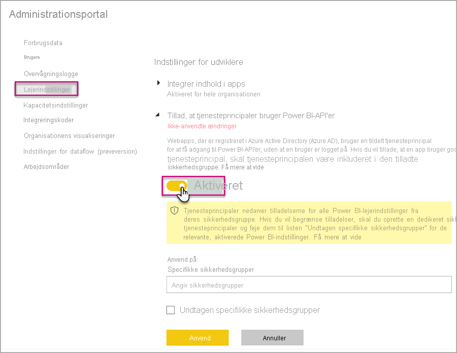
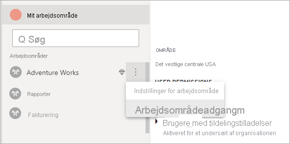

# <a name="automate-premium-workspace-and-dataset-tasks-with-service-principals"></a>Automatiser opgaver for arbejdsområder og datasæt i Premium med tjenesteprincipaler

Tjenesteprincipaler er en *appregistrering* i Azure Active Directory, som du opretter i din lejer for at udføre uovervågede handlinger på ressource- og tjenesteniveau. De er en unik type af brugeridentitet med et appnavn, applikations-id, lejer-id og *klienthemmelighed* eller certifikat som adgangskode.

Power BI Premium bruger den samme funktionalitet til tjenesteprincipaler som Power BI Embedded. Du kan finde flere oplysninger i [Integration af Power BI-indhold med tjenesteprincipaler](../developer/embedded/embed-service-principal.md).

I **Power BI Premium** kan tjenesteprincipaler også bruges med [XMLA-slutpunktet](service-premium-connect-tools.md) til at automatisere administrationsopgaver for datasæt, såsom klargøring af arbejdsområder, udrulning af modeller og opdatering af datasæt med:

- PowerShell
- Azure Automation
- Azure Logic Apps
- Brugerdefinerede klientapplikationer

Tjenesteprincipaler kan også bruges med XMLA-slutpunktet til [nye arbejdsområder](../collaborate-share/service-new-workspaces.md). Klassiske arbejdsområder understøttes ikke. En tjenesteprincipal har kun de tilladelser, der er nødvendige for at udføre opgaver for arbejdsområder, som den er tildelt. Tilladelser tildeles via Adgang til arbejdsområde – meget lig med almindelige UPN-konti.

Hvis du vil udføre skrivehandlinger, skal [XMLA-slutpunktet være aktiveret til læsning/skrivning](service-premium-connect-tools.md#enable-xmla-read-write) for kapacitetens **arbejdsbelastning for datasæt**. Funktionen [Forbedret format af metadata](../connect-data/desktop-enhanced-dataset-metadata.md) skal være aktiveret for datasæt, der publiceres via Power BI Desktop.

> [!NOTE]
> Funktionen for XMLA-slutpunktet i Power BI Premium er en **prøveversion**. Prøveversionsfunktioner bør ikke bruges i et produktionsmiljø. Visse funktioner og dele af support og dokumentation er begrænset.  Du kan finde flere oplysninger i [vilkårene for Microsoft Online Services](https://www.microsoft.com/licensing/product-licensing/products?rtc=1).

## <a name="create-a-service-principal"></a>Opret en tjenesteprincipal

Tjenesteprincipaler oprettes som en appregistrering på Azure Portal eller ved hjælp af PowerShell. Når du opretter tjenesteprincipalen, skal du sørge for at kopiere og gemme appnavnet, applikations-id'et (klient-id'et), mappe-id'et (lejer) og klienthemmeligheden separat. Du kan finde trin til, hvordan du opretter en tjenesteprincipal i følgende:

[Opret en tjenesteprincipal – Azure Portal](https://docs.microsoft.com/azure/active-directory/develop/howto-create-service-principal-portal)   
[Opret en tjenesteprincipal – PowerShell](https://docs.microsoft.com/azure/active-directory/develop/howto-authenticate-service-principal-powershell)

## <a name="create-an-azure-ad-security-group"></a>Opret en Azure AD-sikkerhedsgruppe

Tjenesteprincipaler har som standard adgang til alle de lejerindstillinger, de er aktiveret for. Afhængigt af administratorindstillingerne kan adgang omfatte specifikke sikkerhedsgrupper eller hele organisationen.

Hvis du vil begrænse tjenesteprincipalens adgang til specifikke lejerindstillinger, kan du tillade adgang til specifikke sikkerhedsgrupper. Du kan også oprette en dedikeret sikkerhedsgruppe til tjenesteprincipaler og udelukke den fra de ønskede lejerindstillinger. Du kan finde trin til, hvordan du opretter en sikkerhedsgruppe og tilføjer en tjenesteprincipal i [Opret en grundlæggende gruppe, og tilføj medlemmer ved hjælp af Azure Active Directory](https://docs.microsoft.com/azure/active-directory/fundamentals/active-directory-groups-create-azure-portal).

## <a name="enable-service-principals"></a>Aktivér tjenesteprincipaler

Før du bruger tjenesteprincipaler i Power BI, skal en administrator først aktivere adgang til tjenesteprincipaler på Power BI-administrationsportalen.

På Power BI-**administrationsportal** > **Lejerindstillinger** skal du udvide **Tillad, at tjenesteprincipaler bruger Power BI-API'er** og derefter klikke på **Aktiveret**. Du anvender tilladelser for en sikkerhedsgruppe ved at føje gruppenavnet til **Specifikke sikkerhedsgrupper**.



## <a name="workspace-access"></a>Adgang til arbejdsområde

Du skal tilføje tjenesteprincipalen som Medlem eller Administrator af arbejdsområdet, før den har de nødvendige tilladelser til at udføre handlinger for arbejdsområder og datasæt i Premium. Brug af Adgang til arbejdsområde i Power BI-tjenesten er beskrevet her, men du kan også bruge [REST API'en for tilføjelse af gruppebruger](https://docs.microsoft.com/rest/api/power-bi/groups/addgroupuser).

1. Vælg **Mere** > **Adgang til arbejdsområde** for et arbejdsområde i Power BI-tjenesten.

    

2. Søg efter applikationsnavn, og føj tjenesteprincipalen til arbejdsområdet som **Administrator** eller **Medlem**.

    

## <a name="connection-strings-for-the-xmla-endpoint"></a>Forbindelsesstrenge for XMLA-slutpunktet

Når du har oprettet en tjenesteprincipal, aktiveret tjenesteprincipaler for din lejer og føjet tjenesteprincipalen til Adgang til arbejdsområde, kan du bruge den som en brugeridentitet i forbindelsesstrenge med XMLA-slutpunktet. Forskellen er for parametrene Bruger-id og Adgangskode, som du angiver program-id, lejer-id og applikationshemmelighed for.

`Data Source=powerbi://api.powerbi.com/v1.0/myorg/<workspace name>; Initial Catalog=<dataset name>;User ID=app:<appId>@<tenantId>;Password=<app_secret>;`

### <a name="powershell"></a>PowerShell

#### <a name="using-sqlserver-module"></a>Brug af SQLServer-modulet

I følgende eksempel bruges applikations-id, lejer-id og applikationshemmelighed til at godkende en opdateringshandling for et datasæt:

```powershell
Param (
        [Parameter(Mandatory=$true)] [String] $AppId,
        [Parameter(Mandatory=$true)] [String] $TenantId,
        [Parameter(Mandatory=$true)] [String] $AppSecret
       )
$PWord = ConvertTo-SecureString -String $AppSecret -AsPlainText -Force

$Credential = New-Object -TypeName "System.Management.Automation.PSCredential" -ArgumentList $AppId, $PWord

Invoke-ProcessTable -Server "powerbi://api.powerbi.com/v1.0/myorg/myworkspace" -TableName "mytable" -Database "mydataset" -RefreshType "Full" -ServicePrincipal -ApplicationId $AppId -TenantId $TenantId -Credential $Credential
```

### <a name="amo-and-adomd"></a>AMO og ADOMD

Når du opretter forbindelse til klientprogrammer og webapps, understøtter [AMO-og ADOMD-klientbiblioteker](https://docs.microsoft.com/azure/analysis-services/analysis-services-data-providers) version 15.0.2 og nyere installerbare pakker fra NuGet tjenesteprincipaler i forbindelsesstrenge ved hjælp af følgende syntaks: `app:AppID` og adgangskode eller `cert:thumbprint`.

I følgende eksempel bruges `appID` og `password` til at udføre opdateringshandlingen for en modeldatabase:

```csharp
string appId = "xxx";
string authKey = "yyy";
string connString = $"Provider=MSOLAP;Data source=powerbi://api.powerbi.com/v1.0/<tenant>/<workspacename>;Initial catalog=<datasetname>;User ID=app:{appId};Password={authKey};";
Server server = new Server();
server.Connect(connString);
Database db = server.Databases.FindByName("adventureworks");
Table tbl = db.Model.Tables.Find("DimDate");
tbl.RequestRefresh(RefreshType.Full);
db.Model.SaveChanges();
```

## <a name="next-steps"></a>Næste trin

[Netværksmuligheder for datasæt med XMLA-slutpunktet](service-premium-connect-tools.md)  
[Azure Automation](https://docs.microsoft.com/azure/automation)  
[Azure Logic Apps](https://docs.microsoft.com/azure/logic-apps/)  
[REST-API'er til Power BI](https://docs.microsoft.com/rest/api/power-bi/)
