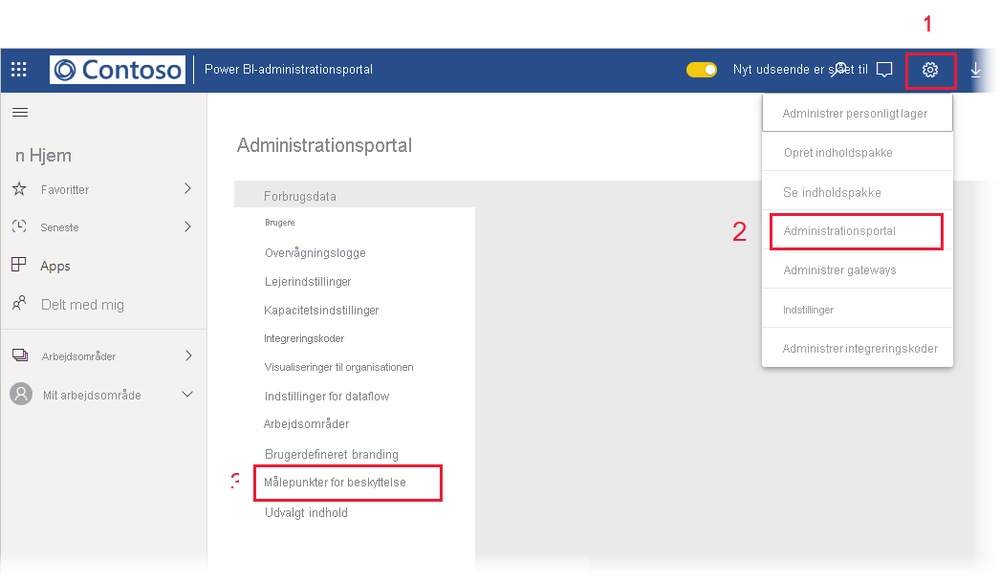

# Rapport over databeskyttelsesmålepunkter

## Hvad er rapporten over databeskyttelsesmålepunkter?
Rapporten over databeskyttelsesmålepunkter er en dedikeret rapport, som [Power BI-administratorer](../service-admin-role.md) kan bruge til at overvåge og registrere brug og anvendelse af følsomhedsmærkater i deres lejer.

 
Rapporten indeholder:
* Et 100 % stablet søjlediagram, der viser forbruget af daglige følsomhedsmærkater i lejeren for de seneste 7, 30 eller 90 dage. Dette diagram gør det nemt at spore den relative brug af de forskellige mærkattyper over tid.
* Kransediagrammer, der viser den aktuelle tilstand for brug af følsomhedsmærkater i lejeren for dashboards, rapporter, datasæt og dataflows.
* Et link til Cloud App Security-portalen, hvor Power BI-beskeder, brugere, der er i fare, aktivitetslogge og andre oplysninger er tilgængelige. Du kan få flere oplysninger under [Brug af Microsoft Cloud App Security-kontrolelementer i Power BI](./service-security-using-microsoft-cloud-app-security-controls.md).

Rapporten opdateres hver 24. time.

## Visning af rapporten over databeskyttelsesmålepunkter

Du skal have en [Power BI-administratorrolle](../service-admin-role.md) for at åbne og få vist rapporten.
Hvis du vil have vist rapporten, skal du gå til **Indstillinger > Administrationsportal** og vælge **Beskyttelsesmålepunkter**.

 
 
Første gang du åbner rapporten over databeskyttelsesmålepunkter, kan det tage et par sekunder at indlæse den. En rapport og et datasæt, der er berettiget til **Databeskyttelsesmålepunkter (genereret automatisk)** , oprettes i dit private miljø under "Mit arbejdsområde". Vi anbefaler ikke, at du ser den her – det er ikke den komplette rapport. Du kan i stedet få vist rapporten på administrationsportalen som beskrevet ovenfor.

> [!CAUTION]
> Undlad at ændre rapporten eller datasættet på nogen måde, da nye versioner af rapporten lanceres fra tid til anden, og eventuelle ændringer, du har foretaget i den oprindelige rapport, bliver overskrevet, hvis du opdaterer til den nye version.

## Rapportopdateringer

Forbedrede versioner af rapporten over databeskyttelsesmålepunkter frigives regelmæssigt. Når du åbner rapporten, bliver du spurgt, om du vil åbne den nye version, hvis der er en ny version tilgængelig. Hvis du siger "ja", vil den nye version af rapporten blive indlæst og overskrive den gamle version. Eventuelle ændringer, du har foretaget i den gamle rapport og/eller det pågældende datasæt, går tabt. Du kan vælge ikke at åbne den nye version, men i så fald kan du ikke drage fordel af den nye versions forbedringer. 
## Noter og overvejelser
* Hvis rapporten over databeskyttelsesmålepunkter skal genereres, skal [Information Protection](./service-security-enable-data-sensitivity-labels.md) være aktiveret på din lejer, og [følsomhedsmærkater skal være blevet anvendt](./service-security-apply-data-sensitivity-labels.md). 
* For at få adgang til Cloud App Security-oplysninger skal din organisation have den relevante [Cloud App Security-licens](https://docs.microsoft.com/power-bi/admin/service-security-using-microsoft-cloud-app-security-controls#microsoft-cloud-app-security-licensing).
* Hvis du beslutter at dele oplysninger fra rapporten over databeskyttelsesmålepunkter med en bruger, der ikke er Power BI-administrator, skal du være opmærksom på, at denne rapport indeholder følsomme oplysninger om din organisation.
* Rapporten over databeskyttelsesmålepunkter er en speciel type rapport og vises ikke på listerne "Delt med mig", "Seneste" og "Favoritter".
* Rapporten over databeskyttelsesmålepunkter er ikke tilgængelig for [eksterne brugere (Azure Active Directory B2B-gæstebrugere)](../service-admin-azure-ad-b2b.md).
## Næste trin
* [Følsomhedsmærkater i Power BI](./service-security-sensitivity-label-overview.md)
* [Brug af Microsoft Cloud App Security-kontrolelementer i Power BI](service-security-using-microsoft-cloud-app-security-controls.md)
* [Om rollen Power BI-tjenesteadministrator](service-admin-role.md)
* [Aktivér følsomhedsmærkater i Power BI](service-security-enable-data-sensitivity-labels.md)