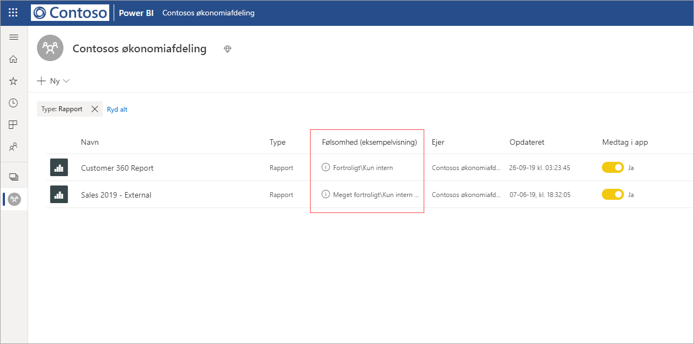
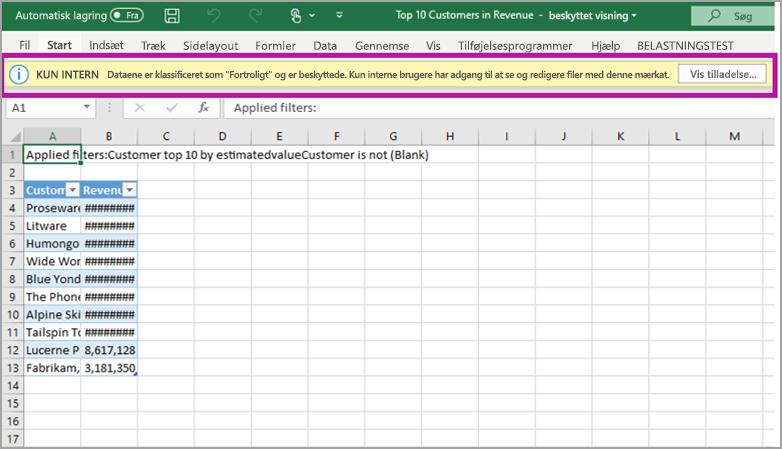

# Databeskyttelse i Power BI

Moderne virksomheder har strenge forretningsregler og krav til, hvordan de håndterer og beskytter følsomme data. For at give kontrol med og synlighed over sådanne data er Power BI integreret med Microsoft Azure Information Protection og Microsoft Cloud App Security. Det giver dig mulighed for følgende:
* Brug [følsomhedsmærkater](https://docs.microsoft.com/microsoft-365/compliance/sensitivity-labels?view=o365-worldwide) fra Microsoft Information Protection til at klassificere og navngive indhold (dashboards, rapporter, datasæt og dataflow) i Power BI-tjenesten ved hjælp af den samme taksonomi, der bruges til at klassificere og beskytte filer i Office 365.
* Anvend følsomhedsmærkater fra Microsoft Information Protection og beskyttelse af data, når de eksporteres til Excel-, PowerPoint- eller PDF-filer.
* Brug Microsoft Cloud App Security til at overvåge aktiviteter i Power BI, undersøge sikkerhedsproblemer og beskytte indhold i Power BI med Appobjekt til betinget adgang i Microsoft Cloud App Security.

**Vigtige noter**
* Følsomhedsmærkater påvirker **ikke** adgangen til indhold i Power BI – adgangen til indhold i Power BI styres udelukkende af Power BI-tilladelser. Selvom mærkaterne er synlige, anvendes eventuelle tilknyttede krypteringsindstillinger (konfigureret enten i [Microsoft 365 Security Center](https://security.microsoft.com/) eller [Microsoft 365 Compliance Center](https://compliance.microsoft.com/)) ikke. De anvendes kun på de data, der eksporteres til Excel-, PowerPoint- og PDF-filer.
* Følsomhedsmærkater og filkryptering anvendes **ikke** i andre eksportstier end eksport til Excel, PowerPoint og PDF. Power BI-lejeradministratoren kan deaktivere enhver eller alle eksportstier, der ikke understøtter anvendelsen af følsomhedsmærkater og de tilknyttede indstillinger for filkryptering.

## Følsomhedsmærkater i Power BI

Følsomhedsmærkater oprettes og administreres enten i [Microsoft 365 Security Center](https://security.microsoft.com/) eller [Microsoft 365 Compliance Center](https://compliance.microsoft.com/).

Hvis du vil have adgang til følsomhedsmærkater i et af disse centre, skal du navigere til **Klassificering > Følsomhedsmærkater**. Disse følsomhedsmærkater kan bruges af flere Microsoft-tjenester, f.eks. Microsoft Azure Information Protection, Office-programmer og Office 365-tjenester.

> [!Important]
> Hvis din organisation bruger følsomhedsmærkater fra Azure Information Protection, skal du [overføre](https://docs.microsoft.com/azure/information-protection/configure-policy-migrate-labels) dem til en af de tidligere angivne tjenester, før følsomhedsmærkaterne kan bruges i Power BI.

> [!NOTE]
> Følsomhedsmærkater understøttes kun for lejere i offentlige cloudmiljøer, og de understøttes ikke for lejere i cloudmiljøer, f.eks. nationale cloudmiljøer.

## Sådan fungerer følsomhedsmærkater i Power BI

Når du anvender en følsomhedsmærkat på et dashboard, en rapport, et datasæt eller et dataflow i Power BI, svarer det til at anvende et mærke for den pågældende ressource, der har følgende fordele:
* **Kan tilpasses** – Du kan oprette kategorier for forskellige niveauer af følsomt indhold i din organisation, f.eks. Personlig, Offentlig, Generelt, Fortrolig og Meget fortroligt.
* **Klartekst** – Da mærkater er i klartekst, er det nemt for brugerne at forstå, hvordan de skal behandle indholdet i henhold til retningslinjerne for følsomhedsmærkater.
* **Fast** – når en følsomhedsmærkat er blevet anvendt på indhold, følger den dette indhold, når den eksporteres til Excel-, PowerPoint- og PDF-filer, og den bliver grundlaget for anvendelse og håndhævelse af politikker.

Det betyder, at følsomhedsmærkaterne følger indholdet, når den eksporteres til Excel-, PowerPoint- og PDF-filer, og bliver grundlaget for anvendelse og håndhævelse af politikker.

Power BI-lejeradministratorer kan kontrollere [eksport til Excel](service-admin-portal.md#export-to-excel) og [eksport til PowerPoint og PDF](service-admin-portal.md#export-reports-as-powerpoint-presentations-or-pdf-documents) på [Power BI-administrationsportalen](service-admin-portal.md).

## Eksempel på følsomhedsmærkat

Her er et hurtigt eksempel på, hvordan en følsomhedsmærkat i Power BI kan fungere.
1. I Power BI-tjenesten er følsomhedsmærkaten **Meget fortroligt** anvendt på en rapport.

   
   
1. Når data eksporteres til en Excel-fil fra denne rapport, anvendes følsomhedsmærkaten og beskyttelsen for den eksporterede Excel-fil.

   

I Microsoft Office-programmer vises en følsomhedsmærkat som et mærke for mailen eller dokumentet ligesom det, der er vist på billedet ovenfor. Du kan også tildele en klassificering til indhold (f.eks. et klistermærke), der bevares og følger med indholdet, i takt med at det bruges og deles i Power BI. Du kan bruge denne klassificering til at generere forbrugsrapporter og se aktivitetsdata for dit følsomme indhold. På baggrund af disse oplysninger kan du altid senere vælge at anvende beskyttelsesindstillinger.

## Krav til brug af følsomhedsmærkater i Power BI

Før dine følsomhedsmærkater kan aktiveres og bruges i Power BI, skal du først fuldføre følgende forudsætninger:
* Sørg for, at der er defineret følsomhedsmærkater enten i [Microsoft 365 Security Center](https://security.microsoft.com/) eller [Microsoft 365 Compliance Center](https://compliance.microsoft.com/).
* [Aktivér følsomhedsmærkater](service-security-enable-data-sensitivity-labels.md) i Power BI.
* Sørg for, at brugerne har de [rette licenser](#licensing).
* Hvis du bruger Microsoft Cloud App Security med Power BI, skal du sørge for at have de [relevante licenser](service-security-using-microsoft-cloud-app-security-controls.md#cloud-app-security-licensing).

## Beskyt indhold ved hjælp af Microsoft Cloud App Security

Du kan beskytte indhold i Power BI mod utilsigtede lækager eller brud ved hjælp af Microsoft Cloud App Security. Når Microsoft Cloud App Security er angivet og konfigureret, kan administratorer af sikkerhed overvåge brugeradgang og -aktivitet, udføre risikoanalyse i realtid og angive mærkatspecifikke kontrolelementer.

Organisationer kan f.eks. bruge Microsoft Cloud App Security til at konfigurere en politik, der forhindrer brugere i at downloade følsomme data fra Power BI til enheder, der ikke administreres. En sådan konfiguration gør det muligt for brugerne at forblive produktive og oprette forbindelse til Power BI overalt, samtidig med at de bruger Microsoft Cloud App Security til at forhindre, at brugerhandlinger bliver kompromitteret – alt sammen i realtid.

**Krav**

Før Microsoft Cloud App Security kan bruges til dine følsomhedsmærkater, skal følgende forudsætninger være opfyldt:
* Cloud App Security og Microsoft Azure Information Protection [skal være aktiveret for din lejer](https://docs.microsoft.com/cloud-app-security/azip-integration).
* Programmet [skal have forbindelse til Microsoft Cloud App Security](https://docs.microsoft.com/cloud-app-security/enable-instant-visibility-protection-and-governance-actions-for-your-apps).

## Licensering

* Der kræves en Premium P1- eller Premium P2-licens til Microsoft Azure Information Protection for at anvende og få vist følsomhedsmærkater fra Microsoft Azure Information Protection i Power BI. Microsoft Azure Information Protection kan købes enten separat eller via en af Microsoft-licenspakkerne. Du kan finde flere oplysninger under [Priser på Microsoft Azure Information Protection](https://azure.microsoft.com/pricing/details/information-protection/).
* Der er [licenskrav](https://docs.microsoft.com/microsoft-365/compliance/get-started-with-sensitivity-labels#subscription-and-licensing-requirements-for-sensitivity-labels) for visning og anvendelse af mærkater i Office-programmer.
* Brugeren skal have en Power BI Pro-licens foruden en af de ovenfor nævnte licenser til Microsoft Azure Information Protection, før vedkommende kan anvende mærkater på Power BI-indhold.
* Du skal have de [nødvendige licenser til Microsoft Cloud App Security](https://docs.microsoft.com/power-bi/admin/service-security-using-microsoft-cloud-app-security-controls#microsoft-cloud-app-security-licensing), hvis du vil bruge det til at beskytte Power BI-indhold mod utilsigtede lækager og brud på dem.

## Overvejelser og begrænsninger

Følgende liste indeholder nogle begrænsninger for følsomhedsmærkater i Power BI:

**Generelt**
* Følsomhedsmærkater kan kun anvendes på dashboards, rapporter, datasæt og dataflow. De er i øjeblikket ikke tilgængelige til [sideinddelte rapporter](../paginated-reports/report-builder-power-bi.md) og projektmapper.
* Følsomhedsmærkater på Power BI-aktiver kan kun ses på listen over arbejdsområder og linjevisninger, Favoritter, Seneste og programvisninger. Mærkater er i øjeblikket ikke synlige i visningen Delt med mig. Bemærk dog, at en mærkat, som er anvendt på et Power BI-aktiv, altid bevares for data, der eksporteres til Excel-, PowerPoint- og PDF-filer, også selvom mærkaten ikke er synlig.
* Følsomhedsmærkater understøttes kun for lejere i det globale cloudmiljø (offentligt). Følsomhedsmærkater understøttes ikke for lejere i andre cloudmiljøer.
* Følsomhedsmærkater for data understøttes ikke for skabelonapps. Følsomhedsmærkater, der er angivet af opretteren af skabelonprogrammet, fjernes, når programmet udtrækkes og installeres. Følsomhedsmærkater, der føjes til artefakter i et installeret skabelonprogram af programbrugeren, mistes (nulstilles til ingenting), når programmet opdateres.
* Power BI understøtter ikke følsomhedsmærkater for beskyttelsestyperne [Videresend ikke](https://docs.microsoft.com/microsoft-365/compliance/encryption-sensitivity-labels?view=o365-worldwide#let-users-assign-permissions) og [brugerdefineret](https://docs.microsoft.com/microsoft-365/compliance/encryption-sensitivity-labels?view=o365-worldwide#let-users-assign-permissions) og [HYOK](https://docs.microsoft.com/azure/information-protection/configure-adrms-restrictions). Beskyttelsestyperne Videresend ikke og brugerdefineret henviser til de mærkater, der er defineret i [Microsoft 365 Security Center](https://security.microsoft.com/) eller [Microsoft 365 Compliance Center](https://compliance.microsoft.com/).
* Det anbefales ikke at gøre det muligt for brugerne at anvende overordnede mærkater i Power BI. Hvis der anvendes en overordnet mærkat til indhold, kan eksport af data fra dette indhold til en fil (Excel, PowerPoint og PDF) mislykkes. Se [Undermærkater (grupperingsmærkater)](https://docs.microsoft.com/microsoft-365/compliance/sensitivity-labels?view=o365-worldwide#sublabels-grouping-labels).

**Eksportér**
* Mærkat- og beskyttelseskontrolelementer gennemtvinges kun, når data eksporteres til Excel-, PowerPoint- og PDF-filer. Mærkat og beskyttelse gennemtvinges ikke, når data eksporteres til .csv- eller .pbix-filer, Analysér i Excel eller andre typer eksportstier.
* Anvendelse af et følsomhedsmærkat og beskyttelse til en eksporteret fil tilføjer ikke indholdsmarkering til filen. Men hvis mærkaten er konfigureret til at anvende indholdsmarkering, anvendes de automatisk af Azure Information Protection Unified-navngivningsklienten, når filen åbnes i Office Desktop-apps. Indholdsmærkaterne anvendes ikke automatisk, når du bruger indbygget navngivning til skrivebords-, mobil- eller webapps. Se [Når Office-apps anvender indholdsmarkering og kryptering](https://docs.microsoft.com/microsoft-365/compliance/sensitivity-labels-office-apps?view=o365-worldwide#when-office-apps-apply-content-marking-and-encryption) for at få flere oplysninger.
* En bruger, der eksporterer en fil fra Power BI, har tilladelse til at tilgå og redigere filen i henhold til indstillingerne for følsomhedsmærkaten. Den bruger, der eksporterer dataene, får ikke ejerens tilladelser til filen.
* Eksporten mislykkes, hvis en mærkat ikke kan anvendes, når der eksporteres data til en fil. Hvis du vil kontrollere, om eksporten mislykkedes, fordi mærkaten ikke kunne anvendes, skal du klikke på navnet på rapporten eller dashboardet i midten af titellinjen og se, om der står "Følsomhedsmærkat kan ikke indlæses" på den rulleliste, der åbnes. Dette kan ske, hvis den anvendte mærkat er blevet fjernet eller slettet af sikkerhedsadministratoren eller som følge af et midlertidigt systemproblem.

## Næste trin

Denne artikel indeholdt en oversigt over databeskyttelse i Power BI. Følgende artikler indeholder flere oplysninger om databeskyttelse i Power BI. 

* [Aktivér datafølsomhedsmærkater i Power BI](service-security-enable-data-sensitivity-labels.md)
* [Anvend datafølsomhedsmærkater i Power BI](../collaborate-share/service-security-apply-data-sensitivity-labels.md)
* [Brug af Microsoft Cloud App Security-kontrolelementer i Power BI](service-security-using-microsoft-cloud-app-security-controls.md)
* [Rapport over databeskyttelsesmålepunkter](service-security-data-protection-metrics-report.md)