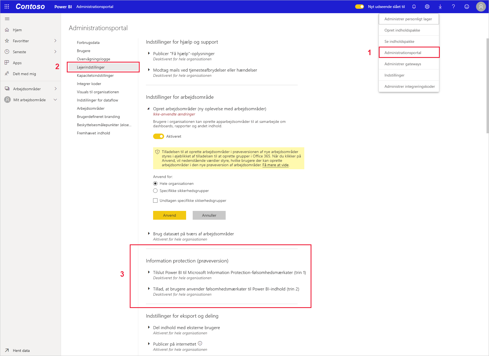
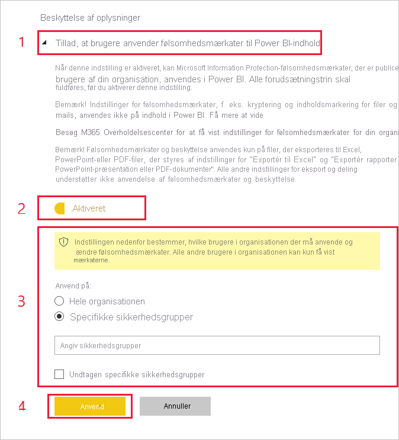

# Aktivér datafølsomhedsmærkater i Power BI (prøveversion)

Når [datafølsomhedsmærkater fra Microsoft Azure Information Protection](https://docs.microsoft.com/microsoft-365/compliance/sensitivity-labels) er aktiveret i Power BI, gælder følgende:

* Visse brugere og sikkerhedsgrupper i en organisation kan klassificere og [anvende følsomhedsmærkater](../designer/service-security-apply-data-sensitivity-labels.md) på dashboards, i rapporter, for datasæt og for dataflow i Power BI (i det følgende kaldet *aktiver*).
* Alle medlemmer af organisationen kan se disse mærkater.

Datafølsomhedsmærkater fremmer databeskyttelse ved at gøre det muligt for Power BI-forfattere og -forbrugere at være opmærksomme på datafølsomhed, samtidig med at de får oplysninger om, hvad klassificeringen betyder, og hvordan data, der har den pågældende klassificering, skal håndteres.

Når Power BI-data, der er forsynet med en datafølsomhedsmærkat, eksporteres til en Excel-, PowerPoint- eller PDF-fil, følger datafølsomhedsmærkaten med. Det betyder, at en bruger, som ikke har tilladelse til at tilgå data, der er forsynet med en mærkat, på grund af politikker for følsomhedsmærkater, ikke kan åbne filerne *uden for* Power BI (i Excel-, PowerPoint- eller PDF-programmer).

Aktivering af datafølsomhedsmærkater kræver en licens til Microsoft Azure Information Protection. Du kan finde flere oplysninger under [Licensering](#licensing).

## Aktivér datafølsomhedsmærkater

Du aktiverer brugen af datafølsomhedsmærkater fra Microsoft Azure Information Protection i Power BI ved at gå til Power BI Administrationsportal, åbne ruden Lejerindstillinger og finde afsnittet Information Protection.

I afsnittet **Information Protection** skal du udføre følgende trin:
1.  Aktivér til/fra-knappen for **Aktivér følsomhedmærkater fra Microsoft Azure Information Protection**, og tryk på **Anvend**. Dette trin gør *kun* følsomhedsmærkater synlige for hele organisationen; der anvendes ingen mærkater. Hvis du vil definere, hvem der kan anvende disse mærkater i Power BI, skal du fuldføre Trin 2.
2.  Definer, hvem der kan anvende og ændre følsomhedsmærkater i Power BI-aktiver. Dette trin omfatter tre handlinger:
    1.  Aktivér til/fra-knappen for **Angiv følsomhedsmærkater for Power BI-indhold og -data**.
    2.  Vælg den eller de relevante sikkerhedsgrupper. Alle i din organisation kan som standard anvende følsomhedsmærkater. Du kan dog vælge kun at aktivere angivelse af følsomhedsmærkater for bestemte brugere eller sikkerhedsgrupper. Når du har valgt enten hele organisationen eller specifikke sikkerhedsgrupper, kan du udelade bestemte delmængder af brugere eller sikkerhedsgrupper.
    * Når følsomhedsmærkater er aktiveret for hele organisationen, er undtagelsen typisk sikkerhedsgrupper.
    * Når følsomhedsmærkater kun er aktiveret for bestemte brugere eller sikkerhedsgrupper, er undtagelsen normalt specifikke brugerne.  
    Denne fremgangsmåde gør det muligt at forhindre visse brugere i at anvende følsomhedsmærkater i Power BI, selvom de tilhører en gruppe, der har tilladelse til at gøre det.
    
    3. Tryk på **Anvend**.

> [!IMPORTANT]
> Det er kun Power BI Pro-brugere, som har tilladelse til at *oprette* og *redigere* aktivet, og som er en del af den relevante sikkerhedsgruppe, der blev angivet i dette afsnit, der kan angive og redigere følsomhedsmærkaterne. Brugere, der ikke er en del af denne gruppe, kan ikke angive eller redigere mærkaten. 

## Overvejelser og begrænsninger

Power BI bruger følsomhedsmærkater fra Microsoft Azure Information Protection. Så hvis du får vist en fejlmeddelelse, når du forsøger at aktivere følsomhedsmærkater, kan det skyldes en af følgende årsager:

* Du har ikke en [licens](#licensing) til Microsoft Azure Information Protection.
* Følsomhedsmærkaterne er ikke blevet migreret til den version af Microsoft Azure Information Protection, som understøttes af Power BI. Få mere at vide om [migrering af følsomhedsmærkater](https://docs.microsoft.com/azure/information-protection/configure-policy-migrate-labels).
* Der er ikke defineret nogen følsomhedsmærkater fra Microsoft Azure Information Protection i organisationen. Derudover skal en mærkat være en del af en publiceret politik, før den kan anvendes. [Få mere at vide om følsomhedsmærkater](https://docs.microsoft.com/Office365/SecurityCompliance/sensitivity-labels), eller gå til [Microsoft Security and Compliance Center](https://sip.protection.office.com/sensitivity?flight=EnableMIPLabels) for at se, hvordan du definerer mærkater og publicerer politikker for din organisation.

## Licenser

* Brugerne skal have en Premium P1- eller Premium P2-licens til Microsoft Azure Information Protection for at få vist eller anvende mærkater fra Microsoft Azure Information Protection i Power BI. Microsoft Azure Information Protection kan købes enten separat eller via en af Microsoft-licenspakkerne. Du kan finde flere oplysninger under [Priser på Microsoft Azure Information Protection](https://azure.microsoft.com/pricing/details/information-protection/).
* Brugere, der skal anvende mærkater på Power BI-aktiver, skal have en Power BI Pro-licens.

## De næste trin

Denne artikel indeholdt en beskrivelse af, hvordan du aktiverer datafølsomhedsmærkater i Power BI. Følgende artikler indeholder flere oplysninger om databeskyttelse i Power BI. 

* [Oversigt over databeskyttelse i Power BI](service-security-data-protection-overview.md)
* [Anvend datafølsomhedsmærkater i Power BI](../designer/service-security-apply-data-sensitivity-labels.md)
* [Brug af Microsoft Cloud App Security-kontrolelementer i Power BI](service-security-using-microsoft-cloud-app-security-controls.md)
* [Rapport over databeskyttelsesmålepunkter](service-security-data-protection-metrics-report.md)