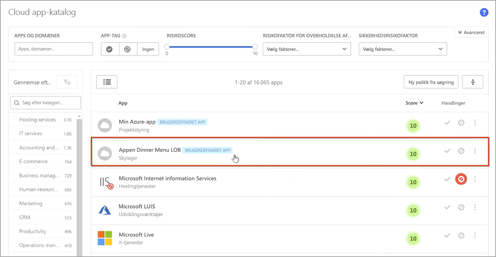
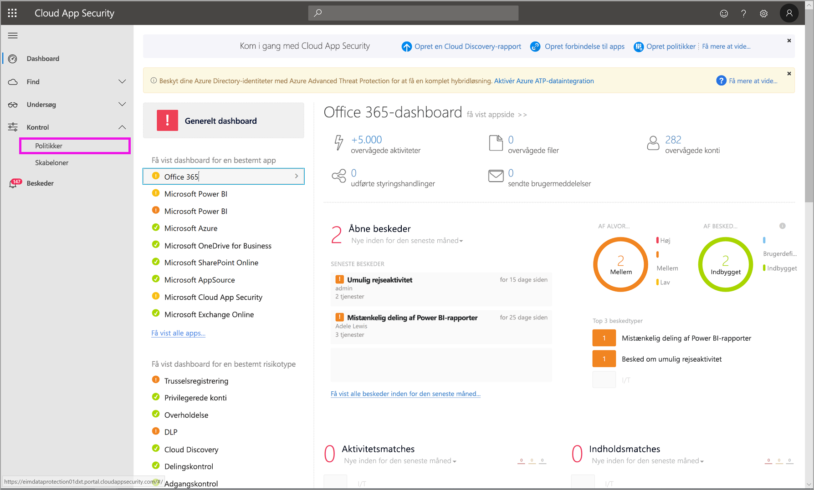
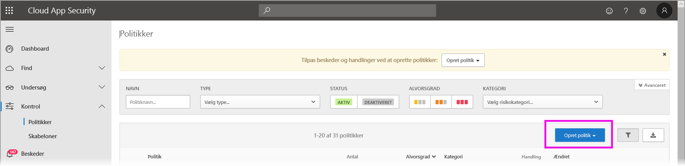
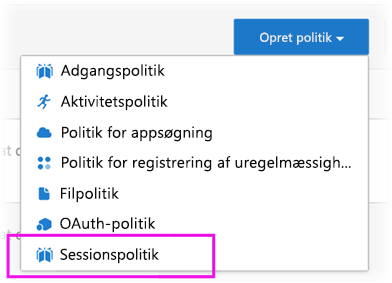
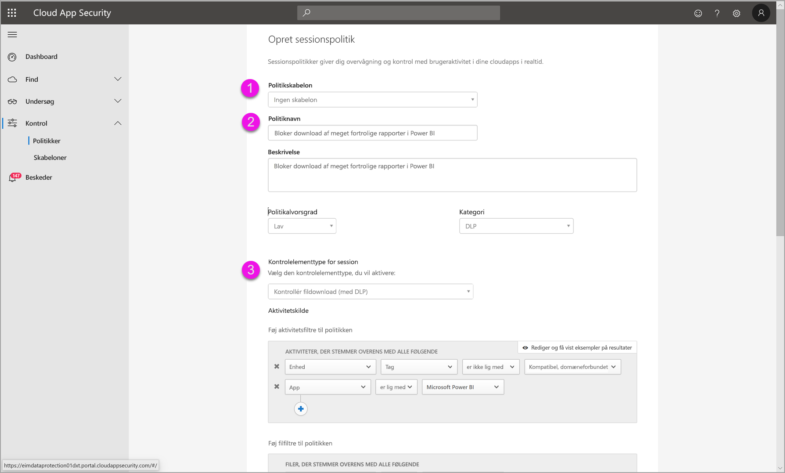
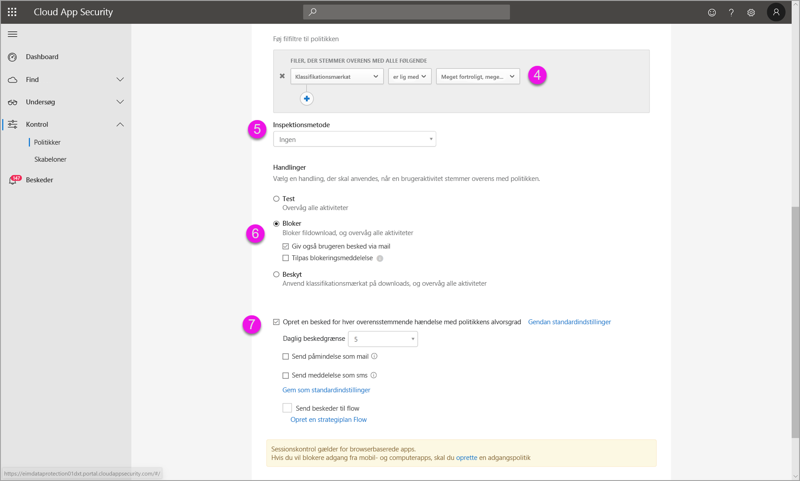
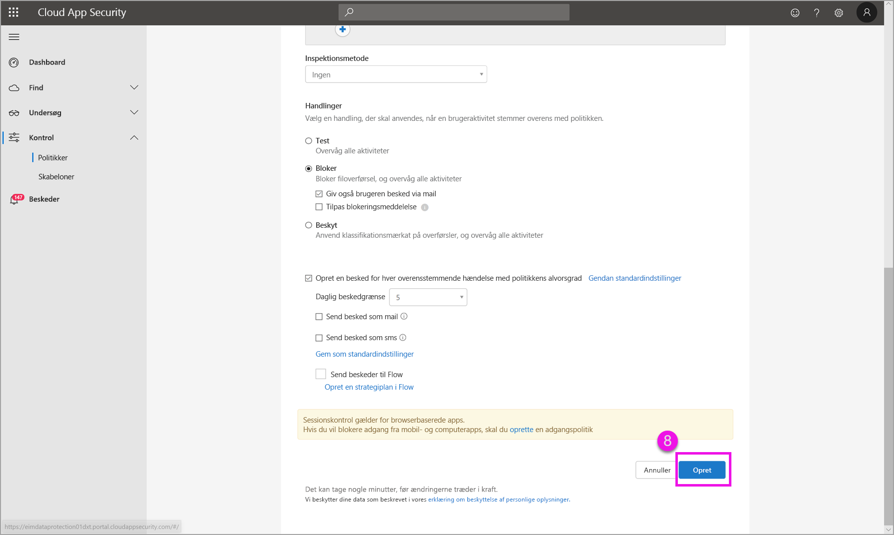

# Brug af Microsoft Cloud App Security-kontrolelementer i Power BI

Når du bruger Cloud App Security med Power BI, kan du hjælpe med at beskytte dine Power BI-rapporter, -data og -tjenester mod utilsigtede lækager eller brud. Med Cloud App Security kan du oprette politikker for betinget adgang for din organisations data ved hjælp af kontrolelementerne for sessioner i realtid i Azure Active Directory (Azure AD), der hjælper med at sikre, at din Power BI-analyse er sikker. Når disse politikker er angivet, kan administratorer overvåge brugeradgang og -aktivitet, udføre risikoanalyse i realtid og angive mærkatspecifikke kontrolelementer. 

Du kan konfigurere Cloud App Security for mange forskellige slags programmer og tjenester og ikke kun Power BI. Du skal konfigurere Cloud App Security for at kunne arbejde med Power BI, så du kan drage fordel af Cloud App Security-beskyttelsen til dine Power BI-data og -analyser. Du kan finde flere oplysninger om Cloud App Security, herunder en oversigt over dashboardet og scorer for programrisici, samt hvordan det fungerer, i dokumentationen til [Cloud App Security](https://docs.microsoft.com/cloud-app-security/).

## Brug af Cloud App Security med Power BI

Hvis du vil bruge Cloud App Security med Power BI, skal du bruge og konfigurere relevante Microsoft-sikkerhedstjenester, hvoraf nogle findes uden for Power BI.

### Licenser til Cloud App Security

For at have Cloud App Security i din lejer skal du have en af følgende [licenser](https://query.prod.cms.rt.microsoft.com/cms/api/am/binary/RE2NXYO):
* Microsoft Cloud App Security: Leverer Cloud App Security-funktioner til alle understøttede apps, en del af EMS E5- og Microsoft 365 E5-pakker.
* Office 365 Cloud App Security: Leverer kun Cloud App Security-egenskaber til Office 365, som er en del af Office 365 E5-pakken.
* Azure Active Directory Premium P1 for at kunne drage fordel af de større Cloud App Security-egenskaber.

I afsnittene nedenfor beskrives trinnene til brug af Cloud App Security i Power BI.

### Angiv sessionspolitikker i Azure AD (påkrævet)
De trin, der er nødvendige for at angive sessionskontrolelementer, fuldføres på portalerne til Azure AD og Cloud App Security. På Azure AD-portalen opretter du en politik for betinget adgang i Power BI og dirigerer sessioner, der bruges i Power BI, via Cloud App Security-tjenesten. 

Cloud App Security kører ved hjælp af en omvendt proxyarkitektur og er integreret i betinget adgang i Azure AD for at overvåge Power BI-brugeraktivitet i realtid. Følgende trin er angivet her for at hjælpe dig med at forstå processen, og detaljerede trinvise instruktioner findes i det indhold, der linkes til, for hvert af følgende trin. Du kan også læse denne [artikel om Cloud App Security](https://docs.microsoft.com/cloud-app-security/proxy-deployment-aad), der indeholder en beskrivelse af hele processen.

1.  [Opret en testpolitik for betinget adgang i Azure AD](https://docs.microsoft.com/cloud-app-security/proxy-deployment-aad#add-azure-ad)
2.  [Log på hvert enkelt program ved hjælp af en bruger, der er beregnet til politikken](https://docs.microsoft.com/cloud-app-security/proxy-deployment-aad#sign-in-scoped)
3.  [Kontrollér, at programmerne er konfigureret til at bruge adgangs- og sessionskontrolelementerne](https://docs.microsoft.com/cloud-app-security/proxy-deployment-aad#portal)
4.  [Test udrulningen](https://docs.microsoft.com/cloud-app-security/proxy-deployment-aad#step-4-test-the-deployment)

Processen til angivelse af sessionspolitikker er beskrevet i detaljer i artiklen [Sessionspolitikker](https://docs.microsoft.com/cloud-app-security/session-policy-aad). 

### Angiv politikker for registrering af uregelmæssigheder for at overvåge Power BI-aktiviteter (anbefales)
Du kan definere politikker for registrering af uregelmæssigheder i Power BI, der kan tildeles uafhængigt af hinanden, så de kun gælder for de brugere og grupper, du vil inkludere og ekskludere i politikken. [Få mere at vide](https://docs.microsoft.com/cloud-app-security/anomaly-detection-policy#scope-anomaly-detection-policies).

Cloud App Security indeholder også to dedikerede, indbyggede registreringer til Power BI. [Du kan finde flere oplysninger under afsnittet senere i dette dokument](#built-in-cloud-app-security-detections-for-power-bi).

### Brug følsomhedsmærkater fra Microsoft Azure Information Protection (anbefales)

Med følsomhedsmærkater kan du klassificere og hjælpe med at beskytte følsomt indhold, så personer i din organisation kan samarbejde med partnere uden for din organisation, men stadig være påpasselige og opmærksomme på følsomt indhold og data. 

Du kan læse artiklen om [følsomhedsmærkater i Power BI](service-security-sensitivity-label-overview.md), der indeholder detaljer om processen med at bruge følsomhedsmærkater i Power BI. Nedenfor kan du se et [eksempel på en Power BI-politik, der er baseret på følsomhedsmærkater](#example).

## Indbygget Cloud App Security-registreringer til Power BI

Cloud App Security-registreringer giver administratorer mulighed for at overvåge bestemte aktiviteter i et overvåget program. Der er i øjeblikket to dedikerede, indbyggede Cloud App Security-registreringer i Power BI: 

* **Mistænkelig deling** – registrerer, når en bruger deler en følsom rapport med en ukendt mail (uden for organisationen). En følsom rapport er en rapport, hvis følsomhedsmærkat er angivet til **KUN INTERNT** eller højere. 

* **Massedeling af rapporter** – registrerer, når en bruger deler et massivt antal af rapporter i en enkelt session.

Indstillinger for disse registreringer konfigureres på Cloud App Security-portalen. [Få mere at vide](https://docs.microsoft.com/cloud-app-security/anomaly-detection-policy#unusual-activities-by-user). 

## Power BI-administratorrolle i Cloud App Security

Der oprettes en ny rolle til Power BI-administratorer, når Cloud App Security bruges med Power BI. Når du logger på [Cloud App Security-portalen](https://portal.cloudappsecurity.com/) som Power BI-administrator, har du begrænset adgang til relevante data, vigtige beskeder, brugere i risiko, aktivitetslogge og andre oplysninger, der er relevante for Power BI.

## Overvejelser og begrænsninger 
Brug af Cloud App Security med Power BI er designet til hjælpe dig med at beskytte din organisations indhold og data med registreringer, der overvåger brugersessioner og deres aktiviteter. Når du bruger Cloud App Security med Power BI, er der et par overvejelser og begrænsninger, du skal være opmærksom på:

* Cloud App Security kan kun fungere på Excel-, PowerPoint- og PDF-filer.
* Hvis du vil bruge egenskaber for følsomhedsmærkater i dine sessionspolitikker til Power BI, skal du have en Premium P1- eller Premium P2-licens til Microsoft Azure Information Protection. Microsoft Azure Information Protection kan købes enten separat eller via en af Microsoft-licenspakkerne. Du kan finde flere oplysninger under [Priser på Microsoft Azure Information Protection](https://azure.microsoft.com/pricing/details/information-protection/). Derudover skal der være brugt følsomhedsmærkater på dine Power BI-aktiver.
* Sessionskontrol er tilgængelig til enhver browser på enhver større platform på et hvilket som helst operativsystem. Vi anbefaler, at du bruger Internet Explorer 11, Microsoft Edge (nyeste), Google Chrome (nyeste), Mozilla Firefox (nyeste) eller Apple Safari (nyeste). Offentlige API-kald i Power BI og andre sessioner, der ikke er baseret på browsere, understøttes ikke som en del af Cloud App Security-sessionskontrol. [Se flere oplysninger](https://docs.microsoft.com/cloud-app-security/proxy-intro-aad#supported-apps-and-clients).

> [!CAUTION]
> * Politikken for *indholdskontrol* for Cloud App Security er i øjeblikket ikke tilgængelig i Power BI, når der anvendes en politik på en Excel-fil, så undlad at angive denne politik for Power BI.
> * I sessionspolitikken under delen "Handling" kan egenskaben "Beskyt" kun bruges, hvis der ikke findes nogen mærkater på elementet. Hvis der allerede findes en mærkat, kan handlingen "Beskyt" ikke anvendes. Du kan ikke tilsidesætte en eksisterende mærkat, der allerede er blevet anvendt på et element i Power BI.

## Eksempel

I følgende eksempel kan du se, hvordan du opretter en ny sessionspolitik ved hjælp af Cloud App Security med Power BI.

Først skal du oprette en ny sessionspolitik. Vælg **Politikker** i menuen til venstre på **Cloud App Security**-portalen.

I det viste vindue skal du vælge rullelisten **Opret politik**.

På listen over indstillinger på rullelisten skal du vælge **Sessionspolitik**.

I det viste vindue skal du oprette sessionspolitikken. De nummererede trin beskriver indstillingerne for følgende billede.

  1. På rullelisten **Politikskabelon** skal du vælge *Ingen skabelon*.
  2. Angiv et relevant navn på din sessionspolitik i feltet **Politiknavn**.
  3. For **Sessionskontroltype** skal du vælge *Downloadet kontrolfil (med DLP)* .

      I afsnittet **Aktivitetskilde** skal du vælge relevante blokeringspolitikker. Vi anbefaler blokering af enheder, der ikke administreres og ikke overholder angivne standarder. Vælg at blokere downloads, når sessionen er i Power BI.

        

        Når du ruller ned, kan du se flere indstillinger. På følgende billede vises disse indstillinger med yderligere eksempler. 

  4. Vælg *Fortrolighedsmærkat* som *Meget fortrolig*, eller hvad der passer bedst til din organisation.
  5. Skift **Kontrolmetoden** til *ingen*.
  6. Vælg den **Bloker**-indstilling, der passer til dine behov.
  7. Kontrollér, at du har oprettet en vigtig besked for sådan en handling.

        

        

  8. Sørg til sidst for at få klikket på knappen **Opret** for at oprette sessionspolitikken.

        

> [!CAUTION]
> Sørg for, at du ikke opretter en politik for **Indholdskontrol** på Excel-filer i Power BI. Dette er en kendt begrænsning for denne funktion.

## Næste trin
Denne artikel indeholdt en beskrivelse af, hvordan Cloud App Security kan sikre beskyttelse af data og indhold i Power BI. Du kan også være interesseret i følgende artikler, der indeholder beskrivelser af databeskyttelse til Power BI og understøttende indhold til Azure-tjenester, der gør det muligt.

* [Oversigt over følsomhedsmærkater i Power BI](service-security-sensitivity-label-overview.md)
* [Aktivér følsomhedsmærkater i Power BI](service-security-enable-data-sensitivity-labels.md)
* [Sådan anvendes følsomhedsmærkater i Power BI](../collaborate-share/service-security-apply-data-sensitivity-labels.md)

Du vil måske også være interesseret i følgende Azure- og sikkerhedsartikler:

* [Beskyt programmer med Appobjekt til betinget adgang i Microsoft Cloud App Security](https://docs.microsoft.com/cloud-app-security/proxy-intro-aad)
* [Udrul Appobjekt til betinget adgang for udvalgte programmer](https://docs.microsoft.com/cloud-app-security/proxy-deployment-aad)
* [Sessionspolitikker](https://docs.microsoft.com/cloud-app-security/session-policy-aad)
* [Oversigt over følsomhedsmærkater](https://docs.microsoft.com/microsoft-365/compliance/sensitivity-labels)
* [Rapport over databeskyttelsesmålepunkter](service-security-data-protection-metrics-report.md)