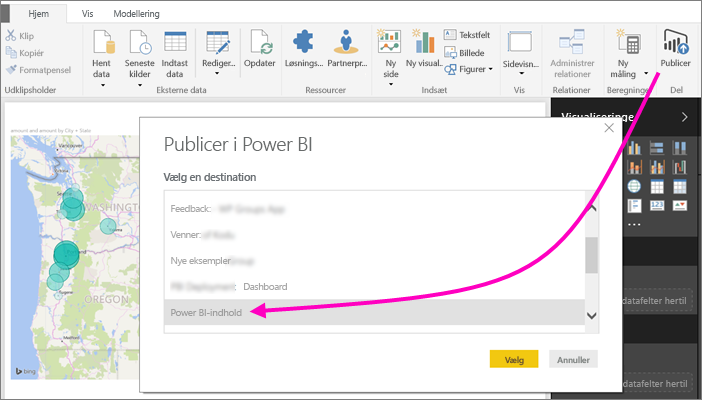
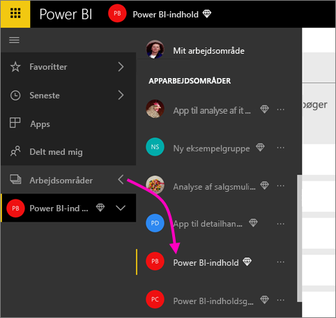
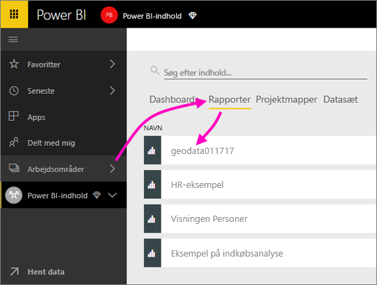
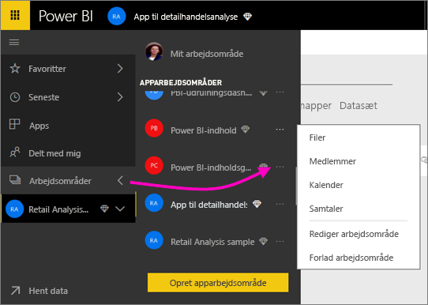
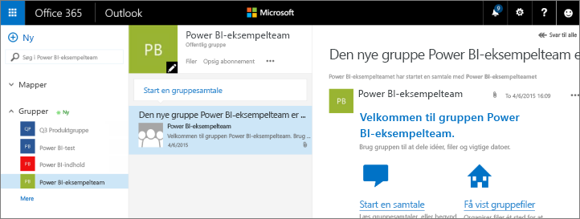
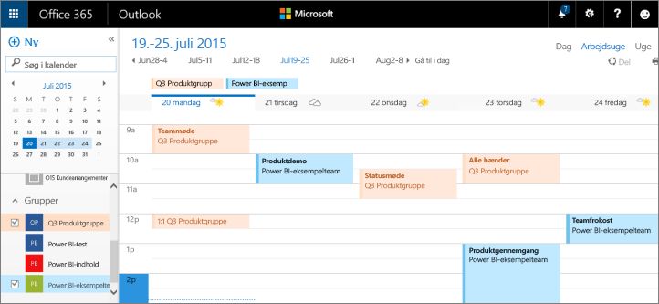

# Samarbejd i et klassisk arbejdsområde
Power BI-arbejdsområder er fantastiske steder, hvor du kan samarbejde med dine kolleger om dashboards, rapporter og datasæt for at oprette *apps*. Denne artikel omhandler de oprindelige, *klassiske* arbejdsområder.  

Samarbejde slutter ikke med arbejdsområder i Power BI. Når du opretter et af de klassiske arbejdsområder i Power BI, opretter du automatisk en Microsoft 365-gruppe i baggrunden. Microsoft 365 tilbyder andre gruppetjenester såsom deling af filer på OneDrive for Business, samtaler i Exchange, delte kalendere og opgaver osv. Læs mere om [grupper i Microsoft 365](https://support.office.com/article/Create-a-group-in-Office-365-7124dc4c-1de9-40d4-b096-e8add19209e9).

> [!NOTE]
> Den nye arbejdsområdeoplevelse ændrer relationen mellem Power BI-arbejdsområder og Microsoft 365-grupper. Når du opretter et af de nye arbejdsområder i Power BI, opretter du ikke længere automatisk en Microsoft 365-gruppe i baggrunden. Du kan finde flere oplysninger under [Opret de nye arbejdsområder i Power BI](service-create-the-new-workspaces.md).

Du skal have en [Power BI Pro-licens](../fundamentals/service-features-license-type.md) for at oprette et arbejdsområde.

## Samarbejd om Power BI Desktop-filer i et arbejdsområde
Når du har oprettet en Power BI Desktop-fil, kan du publicere den i et arbejdsområde, så alle i arbejdsområdet kan samarbejde om den.

1. Vælg **Publicer** på båndet **Hjem** i Power BI Desktop, og vælg derefter arbejdsområdet i feltet **Vælg en destination**.
   
    
2. I Power BI-tjenesten skal du vælge pilen ud for **Arbejdsområder** > og derefter vælge arbejdsområdet.
   
    
3. Vælg fanen **Rapporter**, og vælg derefter din rapport.
   
    
   
    Herfra er det som enhver anden rapport i Power BI. Du og andre i arbejdsområdet kan redigere rapporten og gemme felter på et dashboard efter eget valg.

## Samarbejd i Microsoft 365
Samarbejde i Microsoft 365 starter fra det klassiske arbejdsområde i Power BI.

1. I Power BI-tjenesten skal du vælge pilen ud for **Arbejdsområder** > og vælge **Flere indstillinger** (…) ud for navnet på dit arbejdsområde. 
   
   
2. I denne menu kan du samarbejde med din gruppe på nogle få måder: 
   
   * Hav en [gruppesamtale i Microsoft 365](#have-a-group-conversation-in-microsoft-365).
   * [Planlæg en begivenhed](#schedule-an-event-on-the-group-workspace-calendar) i kalenderen for gruppearbejdsområdet.
   
   Første gang, du går til gruppearbejdsområdet i Microsoft 365, kan det tage noget tid. Giv det 15 til 30 minutter, og opdater derefter din browser.

## Hav en gruppesamtale i Microsoft 365
1. Vælg **Flere indstillinger** (...) ud for navnet på dit arbejdsområde \> **Samtaler**. 
   
    
   
   Mail- og samtalewebstedet for dit gruppearbejdsområde åbnes i Outlook til Microsoft 365.
   
   
2. Læs mere om [gruppesamtaler i Outlook til Microsoft 365](https://support.office.com/Article/Have-a-group-conversation-a0482e24-a769-4e39-a5ba-a7c56e828b22).

## Planlæg en begivenhed i kalenderen for gruppearbejdsområdet
1. Vælg **Flere indstillinger** (...) ud for navnet på arbejdsområdet \> **Kalender**. 
   
   
   
   Kalenderen for dit gruppearbejdsområde åbnes i Outlook til Microsoft 365.
   
   
2. Læs mere om [gruppekalendere i Outlook i Microsoft 365](https://support.office.com/Article/Add-edit-and-subscribe-to-group-events-0cf1ad68-1034-4306-b367-d75e9818376a).

## Administrer et klassisk arbejdsområde
Hvis du er ejer eller administrator af et arbejdsområde, kan du også tilføje eller fjerne medlemmer af arbejdsområdet. Læs mere om [administration af et Power BI-arbejdsområde](service-manage-app-workspace-in-power-bi-and-office-365.md).

## Næste trin
* [Publicer apps i Power BI](service-create-distribute-apps.md).
* Har du flere spørgsmål? [Prøv at spørge Power BI-community'et](https://community.powerbi.com/).
* Har du feedback? Besøg [Power BI Ideas](https://ideas.powerbi.com/forums/265200-power-bi).
