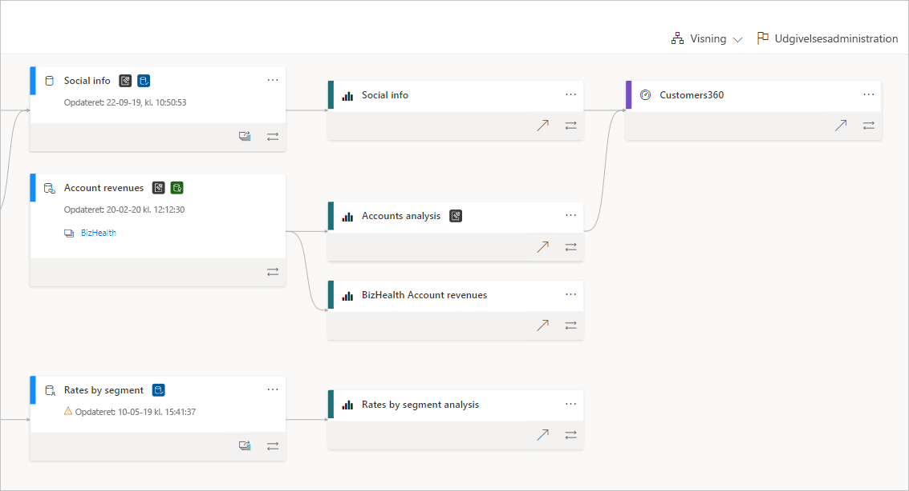
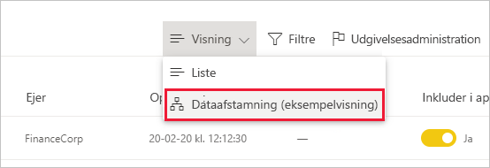
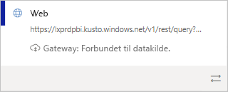
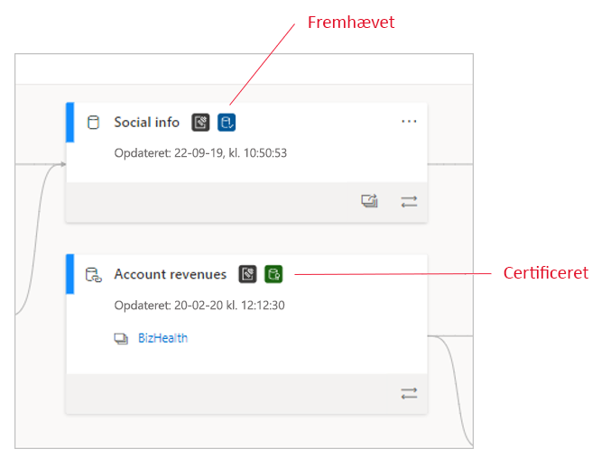
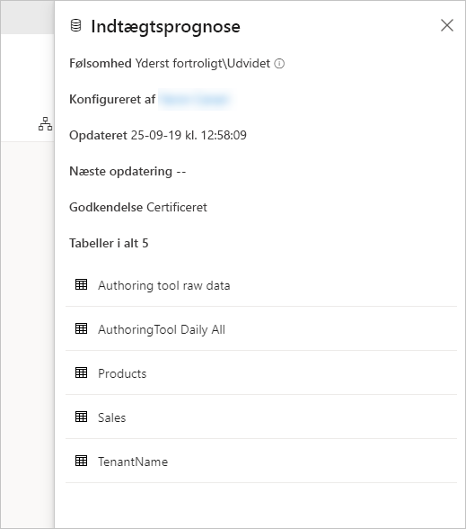
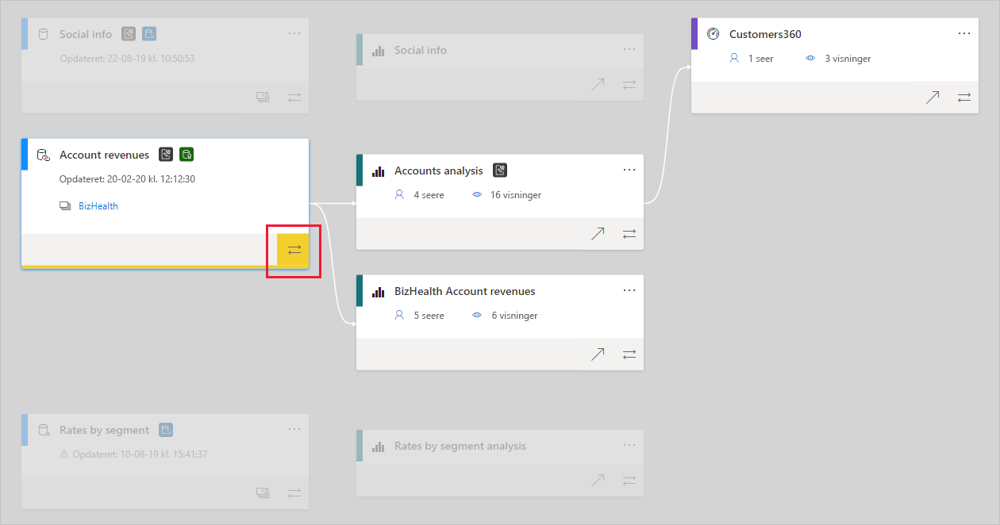

# Dataafstamning
I moderne BI-projekter (Business Intelligence) kan det være en udfordring for mange kunder at forstå flowet af data fra datakilden til destinationen. Udfordringen er endnu større, hvis du har oprettet avancerede analyseprojekter, der strækker sig over flere datakilder, artefakter og afhængigheder. Spørgsmål som "Hvad sker der, hvis jeg ændrer disse data?" eller "Hvorfor er denne rapport ikke ajourført?" kan være vanskelige at besvare. Det kan være nødvendigt med et team af eksperter eller en grundig undersøgelse for at forstå dem. Vi har designet en dataafstamningsvisning for at hjælpe dig med at besvare disse spørgsmål.

 
Power BI har flere artefakttyper, f.eks. dashboards, rapporter, datasæt og dataflows. Mange datasæt og dataflows har forbindelse til eksterne datakilder, f.eks. SQL Server, og til eksterne datasæt i andre arbejdsområder. Når et datasæt er eksternt for et arbejdsområde, som du ejer, kan det være i et arbejdsområde, der ejes af en person i it-afdelingen eller en anden analytiker. Eksterne datakilder og datasæt gør det i sidste ende svært at vide, hvor dataene kommer fra. I forbindelse med mere eller mindre komplekse projekter introducerer vi afstamningsvisningen.

I afstamningsvisningen kan du få vist afstamningsrelationer mellem alle artefakterne i et arbejdsområde og alle dens eksterne afhængigheder. Den viser forbindelser mellem alle arbejdsområdeartefakter, herunder forbindelser til dataflows, både upstream og downstream.

## Udforsk afstamningsvisningen

Hvert arbejdsområde, uanset om det er nyt eller klassisk, har automatisk en afstamningsvisning. Du skal mindst have rollen som bidragyder i arbejdsområdet for at kunne få vist visningen. Se [Tilladelser](#permissions) i denne artikel for at få flere oplysninger.

* Du åbner afstamningsvisning ved at gå til listevisningen i arbejdsområdet. Tryk på pilen ud for **Listevisning**, og vælg **Afstamningsvisning**.

   

I denne visning kan du se alle arbejdsområdeartefakter, og hvordan dataene flyder fra artefakt til artefakt.

**Datakilder**

Du får vist de datakilder, som datasæt og dataflows henter deres data fra. På datakildekortene får du vist flere oplysninger, der kan hjælpe med at identificere kilden. For Azure SQL Server får du f.eks. også vist navnet på databasen.

 
**Gateways**

Hvis en datakilde har forbindelse via en gateway i det lokale miljø, føjes gatewayoplysningerne til datakildekortet. Hvis du har tilladelser som enten gatewayadministrator eller som datakildebruger, får du vist flere oplysninger, f.eks. gatewaynavnet.

**Datasæt og dataflows**
 
I datasæt og dataflow kan du se tidspunktet for den seneste opdatering, og om datasættet eller dataflowet er certificeret eller fremhævet.

 
Hvis en rapport i arbejdsområdet er baseret på et datasæt eller et dataflow i et andet arbejdsområde, får du vist navnet på kildearbejdsområdet på kortet for datasættet eller dataflowet. Vælg navnet på kildearbejdsområdet for at gå til det pågældende arbejdsområde.

* For en hvilken som helst artefakt skal du vælge **Flere indstillinger** (...) for at få vist menuen med indstillinger. Den indeholder alle de samme handlinger, der er tilgængelige i listevisningen.

Hvis du vil have vist flere metadata for en vilkårlig artefakt, skal du vælge selve artefaktkortet. Der vises flere oplysninger om artefakten i en siderude. På billedet nedenfor vises sideruden med metadataene for et markeret datasæt.

 
## Vis afstamning for alle artefakter 

Lad os sige, at du vil have vist afstamningen for en bestemt artefakt.

* Vælg dobbeltpilene under artefakten.

   

   Power BI fremhæver alle de artefakter, der er relateret til denne artefakt, og nedtoner resten. 

## Navigation og fuld skærm 

Afstamningsvisning er et interaktivt lærred. Du kan bruge musen og touchpad'en til at navigere på lærredet samt til at zoome ind eller ud.

* Hvis du vil zoome ind og ud, skal du enten bruge menuen i det nederste højre hjørne eller din mus eller touchpad.
* Hvis du vil have mere plads til selve grafen, skal du bruge indstillingen til fuld skærm i nederste højre hjørne. 

    

## Tilladelser

* Du skal have en Power BI Pro-licens for at få vist afstamningsvisningen.
* Afstamningsvisningen er kun tilgængelig for brugere med adgang til arbejdsområdet.
* Brugerne skal have rollen som administrator, medlem eller bidragyder i arbejdsområdet. Brugere med læseadgang kan ikke skifte til afstamningsvisning.

## Overvejelser og begrænsninger

- Afstamningsvisning er ikke tilgængelig i Internet Explorer. Se [Understøttede browsere til Power BI](../fundamentals/power-bi-browsers.md) for at få mere at vide.

## De næste trin

* [Introduktion til datasæt på tværs af arbejdsområder (prøveversion)](../connect-data/service-datasets-across-workspaces.md)
* [Effektanalyse af datasæt](service-dataset-impact-analysis.md)
