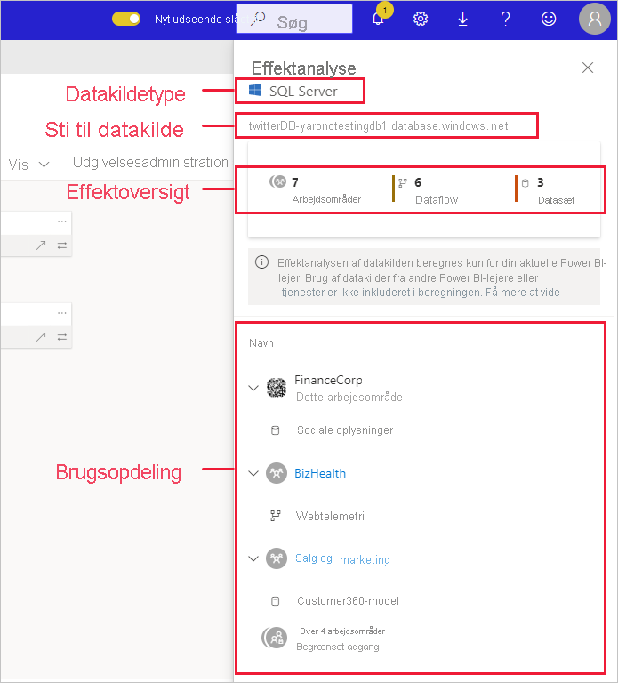
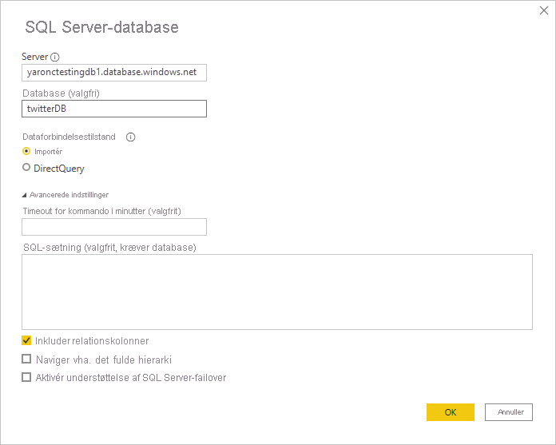

# Effektanalyse af datakilder

Effektanalyse af datakilder hjælper dig med at se, hvor din datakilde bruges i hele organisationen. Dette kan være nyttigt, når datakilden midlertidigt eller permanent er offline, og du gerne vil have en idé om, hvem der er berørt af det. Analysen viser dig, hvor mange arbejdsområder, dataflow og datasæt der bruger datakilden, og giver dig mulighed for nemt at gå til de arbejdsområder, hvor de berørte dataflow og datasæt er placeret, så du kan undersøge dem nærmere.

Effektanalyse af datakilder kan også hjælpe dig med at opdage dublerede data i lejeren, f.eks. når flere forskellige brugere bygger ens modeller oven på den samme datakilde. Ved at hjælpe dig med at registrere disse redundante datasæt og dataflow understøtter effektanalysen af datakilder målet med at have "en enkelt kilde til sandheden".

## Udfør en effektanalyse af datakilder

Sådan udfører du en effektanalyse af datakilder:

1. Gå til det arbejdsområde, der indeholder den datakilde, du er interesseret i, og åbn [dataafstamningsvisningen](service-data-lineage.md).
1. Find datakildens kort, og klik på ikonet for effektanalyse.

    
 
Sidepanelet for effektanalyse åbnes.

 
* **Datakildetype**: Angiver datakildetypen
* **Sti til datakilde**: Stien til datakilden, som den er defineret i Power BI Desktop. På ovenstående billede er stien til datakilden til SQL Server-databasen f.eks. forbindelsesstrengen "twitterDB-yaronctestingdb1.database.windows.net" som defineret i Power BI Desktop (vist nedenfor). Den består af databasenavnet "twitterDB" og servernavnet "yaronctestingdb1.database.windows.net".

    
 
* **Effektoversigt**: Viser antallet af potentielt påvirkede arbejdsområder, dataflow og datasæt. Dette antal omfatter arbejdsområder, som du ikke har adgang til.
* **Brugsopdeling**: Viser navnet på de påvirkede dataflow og datasæt for hvert arbejdsområde. Hvis du vil undersøge effekten på et bestemt arbejdsområde, skal du klikke på navnet på arbejdsområdet for at åbne arbejdsområdet. Når du er i det berørte arbejdsområde, skal du bruge [effektanalysen af datasæt](service-dataset-impact-analysis.md) for at se oplysninger om tilknyttede rapporter og dashboards.

## Beskyttelse af personlige oplysninger

I sideruden for effektanalyse får du kun vist navnene på de arbejdsområder, datasæt og dataflow, som du har adgang til. De elementer, du ikke har adgang til, er angivet under Begrænset adgang. Det skyldes, at nogle elementnavne kan indeholde personlige oplysninger.
Antallet af påvirkede elementer omfatter alle påvirkede dataflow og datasæt, også dem, der befinder sig i arbejdsområder, som du ikke har adgang til.

## Begrænsninger

Effektanalyse af datakilder understøttes endnu ikke for sideinddelte rapporter, så du kan ikke se, om datakilden har en direkte effekt på disse typer rapporter i lejeren.

## Næste trin

* [Effektanalyse af datasæt](service-dataset-impact-analysis.md)
* [Dataafstamning](service-data-lineage.md)