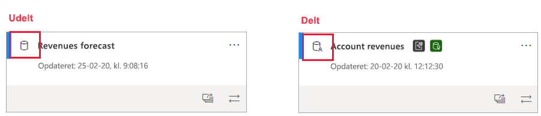
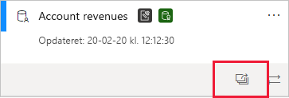
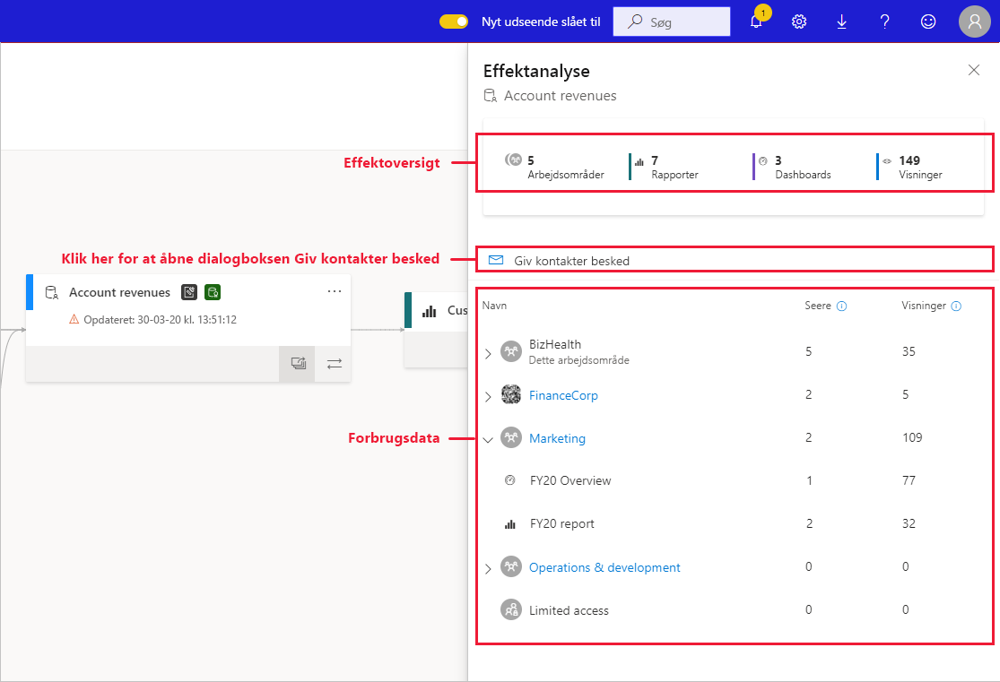
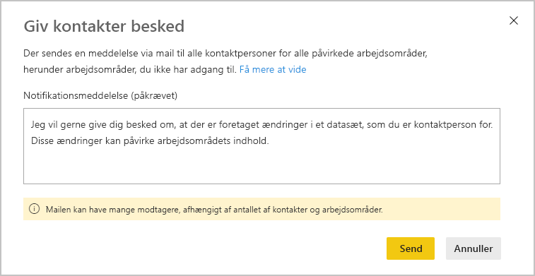
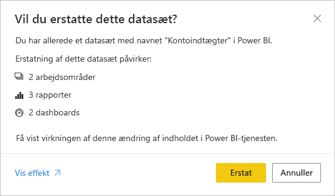

# Effektanalyse af datasæt

Når du foretager ændringer af et datasæt, eller hvis du overvejer at foretage ændringer, er det vigtigt, at du kan vurdere, hvilken effekt de pågældende ændringer vil have på downstream-rapporter og -dashboards, der er afhængige af det pågældende datasæt. **Effektanalyse af datasæt** giver dig oplysninger, der kan hjælpe dig med at foretage denne vurdering.
* Analysen viser dig, hvor mange arbejdsområder, rapporter og dashboards der kan blive påvirket af din ændring, og giver dig mulighed for nemt at gå til de arbejdsområder, hvor de berørte rapporter og dashboards er placeret, så du kan undersøge dem nærmere.
* Den viser, hvor mange entydige besøgende og hvor mange visninger der er for de potentielt påvirkede elementer. Dette hjælper dig med at bestemme den samlede effekt af ændringen for downstream-elementet. Det er f.eks. vigtigere at undersøge effekten af en ændring i en rapport, der har 20.000 entydige læsere, end det er at undersøge effekten af ændringen i en rapport, der har tre læsere.
* Analysen indeholder også en nem måde at underrette de relevante personer om en ændring, du har foretaget, eller som du påtænker at foretage.

Effektanalysen af datasættet kan nemt igangsættes fra [dataafstamningsvisningen](service-data-lineage.md).

## Identifikation af delte datasæt

Du kan udføre effektanalyse af datasæt på både delte og ikke-delte datasæt. Det er dog især nyttigt for datasæt, der deles på tværs af arbejdsområder, hvor det er meget vanskeligere at få et tydeligt billede af downstream-afhængigheder, end det er med ikke-delte datasæt, hvor alle afhængigheder er placeret i samme arbejdsområde som selve datasættet.

I afstamningsvisningen angives forskellen mellem delte datasæt og ikke-delte datasæt af det ikon, der vises i øverste venstre hjørne af datasættets kort.

## Udfør effektanalyse af datasæt

Du kan udføre effektanalyser af et vilkårligt datasæt i arbejdsområdet, uanset om det er delt eller ej. Du kan ikke udføre effektanalyse af eksterne datasæt, der vises i afstamningsvisning, men som rent faktisk er placeret i et andet arbejdsområde. Hvis du vil udføre en effektanalyse af et eksternt datasæt, skal du gå til kildearbejdsområdet.

Hvis du vil foretage en effektanalyse af datasættet, skal du klikke på knappen for effektanalyse på datasættets kort.

Sidepanelet for effektanalyse åbnes.

* **Effektoversigten** viser dig, hvor mange arbejdsområder, rapporter og dashboards der kan være påvirket, samt det samlede antal visninger for alle downstream-rapporter og -dashboards, der er knyttet til datasættet.
* Hvis du vælger linket **Giv kontaktpersoner besked**, åbnes en dialogboks, hvor du kan oprette og sende en meddelelse om de ændringer af datasæt, du foretager, til kontaktlisterne for de berørte arbejdsområder. 
* **Fordeling af forbrug** viser det samlede antal visninger i hvert arbejdsområde for de potentielt påvirkede rapporter og dashboards, det indeholder, og det samlede antal læsere og visninger for hver rapport og hvert dashboard, hvor
   * Læsere: Antallet af særskilte brugere, der fik vist en rapport eller et dashboard.
   * Visninger: Antallet af visninger for en rapport eller et dashboard.

Forbrugsdataene relaterer til de seneste 30 dage, eksklusive dags dato. Antallet omfatter brug, der kommer via relaterede apps. Du kan bruge målepunkterne til at forstå brugen af datasæt på tværs af lejeren samt vurdere effekten af ændringer af dit datasæt.

## Giv kontakter besked

Hvis du har foretaget en ændring af et datasæt eller påtænker at gøre det, kan det være en god idé at kontakte de relevante brugere for at fortælle dem om det. Når du giver kontakterne besked, sendes der en mail til [lister over kontakter](../collaborate-share/service-create-the-new-workspaces.md#create-a-contact-list) for alle de påvirkede arbejdsområder. Dit navn vises på mailen, så kontakterne kan finde dig og besvare dig i en ny mailtråd. 

1. Klik på **Giv kontakter besked** i ruden Effektanalyse. Dialogboksen Giv kontakter besked vises.

   

1. I tekstfeltet kan du angive oplysninger om ændringen.
1. Når meddelelsen er klar, skal du klikke på **Send**.

> [!NOTE]
> Det er ikke muligt at give kontaktpersoner besked, hvis det datasæt, du udfører effektanalysen for, er placeret i et klassisk arbejdsområde.

## Beskyttelse af personlige oplysninger

Hvis du vil udføre en effektanalyse af et datasæt, skal du have skriverettigheder til det. I ruden Effektanalyse får du kun vist navnene på de arbejdsområder, rapporter og dashboards, som du har adgang til. De elementer, du ikke har adgang til, er angivet under **Begrænset adgang**. Det skyldes, at nogle elementnavne kan indeholde personlige oplysninger.

Selvom du ikke har adgang til visse arbejdsområder, vil du stadig kunne se de opsummerede forbrugsdata for disse arbejdsområder, og meddelelserne med beskeder til kontaktpersonerne vises på kontaktlisterne for disse arbejdsområder.

## Effektanalyse fra Power BI Desktop

Når du foretager en ændring af et datasæt i Power BI Desktop og derefter publicerer det igen til Power BI-tjenesten, vises der en meddelelse om, hvor mange arbejdsområder, rapporter og dashboards der potentielt kan blive påvirket af ændringen, og du bliver bedt om at bekræfte, at du vil erstatte det aktuelt udgivne datasæt med det, du har ændret. Meddelelsen indeholder også et link til hele effektanalysen af datasættet i Power BI-tjenesten, hvor du kan se flere oplysninger og foretage en handling for at afhjælpe risikoen ved ændringen.

> [!NOTE]
> De oplysninger, der vises i meddelelsen, indikerer kun en potentiel effekt – de angiver ikke nødvendigvis, at noget er blevet brudt. Ændringer i datasæt har ofte ingen negativ effekt på de tilhørende downstream-rapporter og -dashboards. Du får dog alligevel vist denne meddelelse, der giver dig besked om en eventuel påvirkning.
>
>I meddelelsen vises antallet af arbejdsområder kun, hvis mere end ét arbejdsområde indeholder rapporter og dashboards, der påvirkes.

## Begrænsninger

* Forbrugsdata understøttes ikke i øjeblikket for klassiske og personlige arbejdsområder.

## Næste trin

* [Introduktion til datasæt på tværs af arbejdsområder (prøveversion)](../connect-data/service-datasets-across-workspaces.md)
* [Dataafstamning](service-data-lineage.md)

