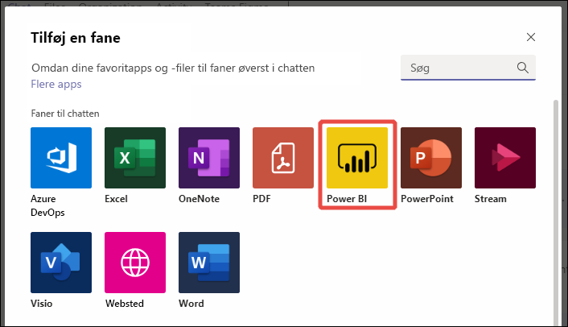
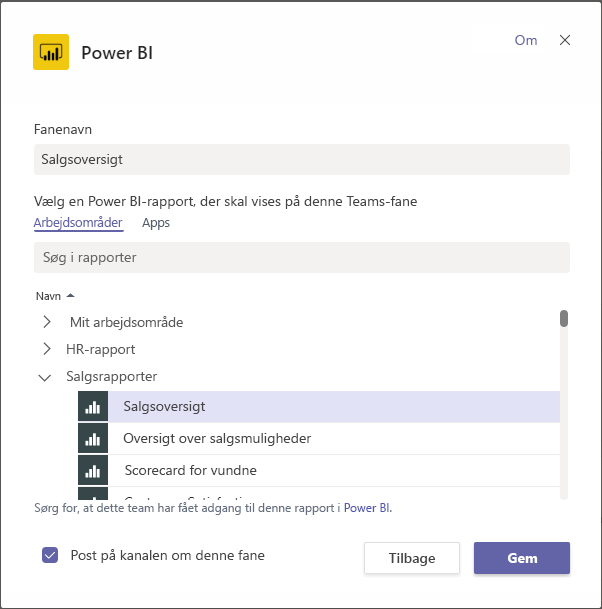
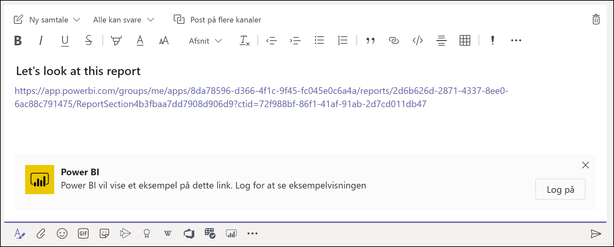
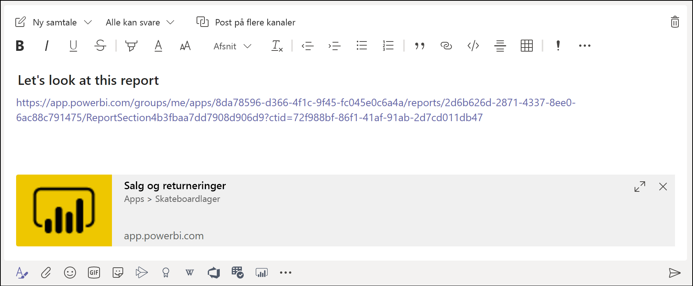
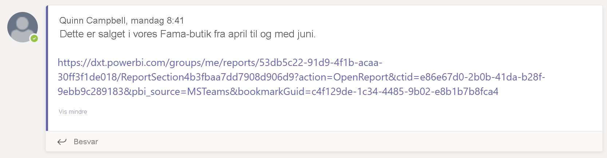
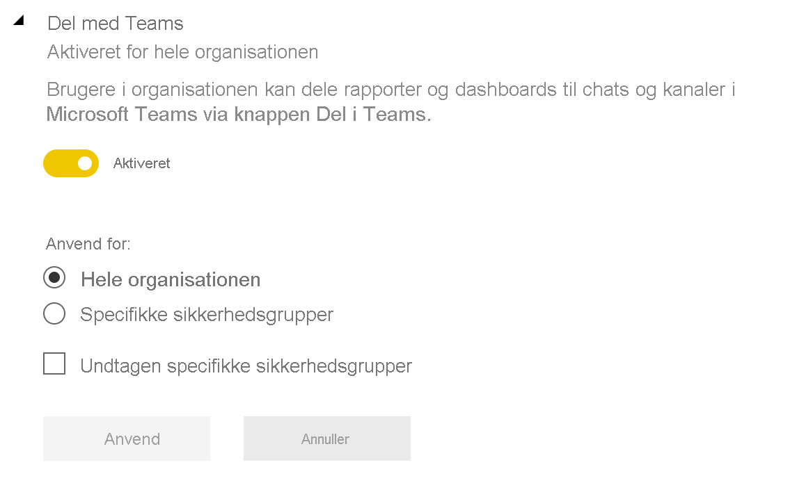

# Samarbejd i Microsoft Teams med Power BI

Med den opdaterede **Power BI**-fane til Microsoft Teams kan du nemt integrere interaktive rapporter i Microsoft Teams-kanaler og -chats. Brug **Power BI**-fanen til Microsoft Teams til at hjælpe dine kolleger med at finde de data, som dit team bruger, og til at diskutere dataene i dine teamkanaler. Når du indsætter et link til dine rapporter, dashboards og apps i Microsoft Teams-meddelelsesfeltet, viser der oplysninger om elementerne i linkeksempelet. Brug **Del i Teams**-knapperne til hurtigt at starte samtaler, når du får vist rapporter og dashboards i Power BI.

## Krav

Kontrollér følgende, der sikrer, at **Power BI**-fanen til Microsoft Teams fungerer:

- At brugerne har en Power BI Pro-licens, eller at rapporten er indeholdt i en [Power BI Premium-kapacitet (EM- eller P-SKU)](../admin/service-premium-what-is.md) med en Power BI-licens.
- Microsoft Teams har **Power BI**-fanen.
- Brugerne er logget på Power BI-tjenesten for at aktivere deres Power BI-licens, så de kan bruge rapporten.
- Hvis du vil tilføje en rapport i Microsoft Teams via **Power BI**-fanen, skal du mindst have rollen Læser i det arbejdsområde, der hoster rapporten. Se [Roller i de nye arbejdsområder](service-new-workspaces.md#roles-in-the-new-workspaces) for at få oplysninger om de forskellige roller.
- Brugerne skal have tilladelse til at få vist rapporten, før de kan se den under **Power BI**-fanen til Microsoft Teams.
- Brugere skal være Microsoft Team-brugere med adgang til kanaler og chats.

Hvis linkeksempler skal kunne fungere, skal du også sikre, at:

- Brugerne opfylder kravene til at bruge **Power BI**-fanen til Microsoft Teams.
- Brugerne har logget på Power BI.

Følgende forudsætninger skal være opfyldt, for at **Del i Teams**-knapperne fungerer:

- Brugerne opfylder kravene til at bruge **Power BI**-fanen til Microsoft Teams.
- Brugerne har logget på Power BI.
- Power BI administratorer har ikke deaktiveret lejerindstillingen **Del i Teams**.

## Integrer din rapport

Hvis du vil integrere din rapport i en Microsoft Teams-kanal eller -chat, skal du benytte denne fremgangsmåde.

1. Åbn en kanal eller chat i Microsoft Teams, og vælg ikonet **+** .

    

1. Vælg **Power BI**-fanen.

    

1. Du kan benytte indstillingerne til at vælge en rapport fra et arbejdsområde eller en Power BI-app.

    

1. Fanenavnet opdateres automatisk, så det passer til rapportnavnet, men du kan ændre det.

1. Vælg **Gem**.

## Understøttede rapporter til integrering af Power BI-fanen

Du kan integrere følgende typer rapporter på **Power BI**-fanen:

- Interaktive og sideinddelte rapporter.
- Rapporter i **Mit arbejdsområde**, i den nye arbejdsområdeoplevelse og i klassiske arbejdsområder.
- Rapporter i Power BI-apps.

## Få et linkeksempel

Følg disse trin for at få et linkeksempel af indhold i Power BI-tjenesten.

1. Kopiér et link til en rapport, et dashboard eller en app i Power BI-tjenesten. Du kan f.eks. kopiere linket fra browserens adresselinje.

1. Indsæt linket i meddelelsesfeltet i Microsoft Teams. Log på tjenesten til linkeksempler, hvis du bliver bedt om det. Du skal muligvis vente et par sekunder på, at linkeksemplet indlæses.

    

1. Det grundlæggende linkeksempel vises, når du er logget på.

    

1. Vælg ikonet **Udvid** for at få vist kortet med en detaljeret eksempelvisning.

    

1. Kortet med et detaljeret linkeksempel viser linket og de relevante handlingsknapper.

    

1. Send meddelelsen.

## Knappen Del i Teams i Power BI-tjenesten

Følg disse trin for at dele links med Microsoft Teams-kanaler og -chats, når du får vist rapporter eller dashboards i Power BI-tjenesten.

1. Brug **Del i Teams**-knapperne på handlingslinjen eller i genvejsmenuen på et bestemt visual.

   * Knappen **Del i Teams** på handlingslinjen:

       
    
   * Knappen **Del i Teams** i visualgenvejsmenuen:
    
      

1. Vælg den kanal eller de personer, du vil sende linket til, i dialogboksen **Del med Microsoft Teams**. Du kan tilføje en meddelelse, hvis du vil. Du bliver muligvis bedt om at logge på Microsoft Teams først.

    

1. Vælg **Del** for at sende linket.
    
1. Linket føjes til eksisterende samtaler eller starter en ny chat.

    

1. Vælg linket for at åbne elementet i Power BI-tjenesten.

1. Hvis du har brugt genvejsmenuen for et bestemt visual, fremhæves visual'et, når rapporten åbnes.

    
    

## Giv adgang til rapporter

Integrering af en rapport i Microsoft Teams eller afsendelse af et link til et element giver ikke automatisk brugerne tilladelse til at få vist rapporten. Du skal [give brugerne tilladelse til at få vist rapporten i Power BI](service-share-dashboards.md). Du kan bruge en Microsoft 365-gruppe til dit team for at gøre det nemmere.

> [!IMPORTANT]
> Sørg for at gennemse, hvem der kan få vist rapporten, i Power BI-tjenesten, og giv adgang til dem, der er ikke angivet.

Du kan f.eks. sikre, at alle i et team har adgang til rapporter, ved at placere rapporterne i et enkelt arbejdsområde og give Microsoft 365-gruppen for dit team adgang til det.

## Linkeksempler

Der er angivet linkeksempler for følgende elementer i Power BI:
- Rapporter
- Dashboards
- Apps

Tjenesten til linkeksempler kræver, at brugerne logger på. Hvis du vil logge af, skal du vælge **Power BI**-ikonet nederst i meddelelsesfeltet. Vælg derefter **Log af**.

## Start en samtale

Når du føjer en Power BI-rapportfane til Microsoft Teams, opretter Teams automatisk en fanesamtale til rapporten.

- Vælg ikonet **Vis fanesamtale** i øverste højre hjørne.

    

    Den første kommentar er et link til rapporten. Alle i den pågældende Microsoft Teams-kanal kan se og diskutere rapporten i samtalen.

    
    
## Lejerindstillingen Del i Teams

Lejerindstillingen **Del i Teams** i Power BI-administrationsportalen giver organisationer mulighed for at skjule **Del i Teams**-knapperne. Når den er angivet til deaktiveret, kan brugerne ikke se **Del i Teams**-knapper på handlingslinjen eller i genvejsmenuer, når de får vist rapporter og dashboards i Power BI-tjenesten.

## Kendte problemer og begrænsninger

- Power BI understøtter ikke de samme oversatte sprog som Microsoft Teams. Derfor ser du muligvis ikke den korrekte oversættelse i den integrerede rapport.
- Power BI-dashboards kan ikke integreres i **Power BI**-fanen til Microsoft Teams.
- Brugere uden en Power BI-licens eller en adgangstilladelse til rapporten, får vist meddelelsen "Indholdet er ikke tilgængeligt".
- Du har muligvis problemer med dette, hvis du bruger Internet Explorer 10. <!--You can look at the [browsers support for Power BI](../consumer/end-user-browsers.md) and for [Microsoft 365](https://products.office.com/office-system-requirements#Browsers-section). -->
- [URL-filtre](service-url-filters.md) understøttes ikke med **Power BI**-fanen til Microsoft Teams.
- Den nye **Power BI**-fane ikke tilgængelig i de nationale cloudmiljøer. Der er muligvis en ældre version tilgængelig, som ikke understøtter den nye arbejdsområdeoplevelse eller rapporter i Power BI-apps.
- Når du har gemt fanen, kan du ikke ændre navnet på fanen under fanen Indstillinger. Du kan bruge funktionen **Omdøb** for at ændre navnet.
- Enkeltlogon understøttes ikke for tjenesten til linkeksempler.
- Linkeksempler fungerer ikke i forbindelse med mødechat eller private kanaler.
- **Del i Teams**-knapperne fungerer muligvis ikke, hvis din browser bruger strenge indstillinger for beskyttelse af personlige oplysninger. Brug indstillingen **Har du problemer? Prøv at åbne i et nyt vindue**, hvis dialogboksen ikke åbnes korrekt.
- **Del i Teams** omfatter ikke et linkeksempel.
- Linkeksempler og **Del i Teams** giver ikke brugere tilladelse til at få vist elementet. Tilladelser skal administreres separat.
- Knappen **Del i Teams** er ikke tilgængelig i visualgenvejsmenuer, når en rapportforfatter angiver indstillingen **Mere** til *Fra* for visual'et.

## Næste trin

- [Del et dashboard med kolleger og andre](service-share-dashboards.md)
- [Opret og distribuer en app i Power BI](service-create-distribute-apps.md)
- [Hvad er Power BI Premium?](../admin/service-premium-what-is.md)

Har du flere spørgsmål? [Prøv at spørge Power BI-community'et](https://community.powerbi.com/).
