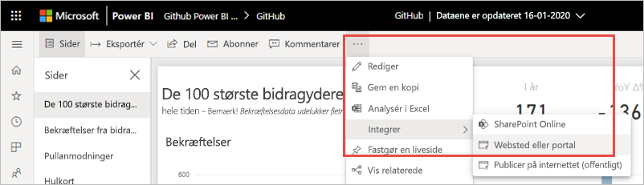

# <a name="embed-a-report-in-a-secure-portal-or-website"></a>Integrer en rapport på en sikker portal eller et websted

Med den nye **Integrer**-indstilling i Power BI kan du nemt og sikkert integrere rapporter på interne webportaler. Disse portaler kan være **cloudbaserede** eller **hostet i det lokale miljø**, f.eks. SharePoint 2019. Integrerede rapporter overholder alle elementtilladelser og datasikkerheden via [sikkerhed på rækkeniveau](../admin/service-admin-rls.md). De integrerer ingen kode på nogen portal, der accepterer en URL-adresse eller iFrame. 

Indstillingen **Integrer** understøtter [Filtre for URL-adresser](service-url-filters.md) og indstillinger for URL-adresser. Den giver dig mulighed for at integrere på portaler ved hjælp af en strategi med begrænset kode, der kun kræver grundlæggende kendskab til HTML og JavaScript.

## <a name="how-to-embed-power-bi-reports-into-portals"></a>Sådan integrerer du Power BI-rapporter på portaler

1. Åbn en rapport i Power BI-tjenesten.

2. I menuen **Flere indstillinger (...)** skal du vælge **Integrer** >  **Websted eller portal**.

    

2. Vælg indstillingen **Integrer** for at åbne en dialogboks, der indeholder et link og en iFrame, som du kan bruge til at integrere rapporten på en sikker måde.

    

3. Der kræves godkendelse, uanset om en bruger åbner en URL-adresse til en rapport direkte eller en, der er integreret på en webportal. Følgende skærm vises, hvis en bruger ikke er logget på Power BI i vedkommendes browsersession. Når brugeren vælger på **Log på**, åbnes der muligvis et nyt browservindue eller en ny fane. Få vedkommende til at kontrollere, om blokering af pop op-vinduer er aktiveret, hvis vedkommende ikke bliver bedt om at logge på.

    

4. Når brugeren er logget på, åbnes rapporten, som viser dataene og muliggør navigering mellem sider og angivelse af filtre. Det er kun brugere med visningstilladelse, der kan se rapporten i Power BI. Alle regler for [sikkerhed på rækkeniveau](../admin/service-admin-rls.md) anvendes også. Desuden skal brugeren have en korrekt licens – det kræver enten en Power BI Pro-licens, eller at rapporten er placeret i et arbejdsområde, der har Power BI Premium-kapacitet. Brugeren skal logge på, hver gang vedkommende åbner et nyt browservindue. Men når vedkommende er logget på, indlæses andre rapporter automatisk.

    

5. Når du bruger en iFrame, skal du muligvis redigere **højden** og **bredden**, så den passer til portalens webside.

    

## <a name="granting-report-access"></a>Tildeling af adgang til rapport

Indstillingen **Integrer** giver ikke automatisk brugere tilladelse til at få vist rapporten. Visningstilladelser angives i Power BI-tjenesten.

I Power BI-tjenesten kan du dele integrerede rapporter med brugere, der skal have adgang. Hvis du bruger en Office 365-gruppe, kan du angive brugeren som medlem af et arbejdsområde. Hvis du vil have flere oplysninger, kan du se, hvordan du [administrerer dit arbejdsområde i Power BI og Office 365](service-manage-app-workspace-in-power-bi-and-office-365.md).

## <a name="licensing"></a>Licensering

For at få vist den integrerede rapport skal brugere enten have en Power BI Pro-licens, eller indholdet skal være placeret i et arbejdsområde, som er i [Power BI Premium-kapacitet (EM eller P SKU)](../admin/service-admin-premium-purchase.md).

## <a name="customize-your-embed-experience-using-url-settings"></a>Tilpas din integrerede oplevelse ved hjælp af URL-indstillinger

Du kan tilpasse brugeroplevelsen ved hjælp af inputindstillingerne for URL-adressen til integrering. I den angivne iFrame kan du opdatere URL-adressens **src**-indstillinger.

| Egenskab  | Beskrivelse  |  |  |  |
|--------------|-----------------------------------------------------------------------------------------------------------------------------------------------------------------------------------------------------------------------|---|---|---|
| pageName  | Du kan bruge parameteren **pageName** for forespørgselsstrengen til angive, hvilken side i rapporten der skal åbnes. Du kan finde denne værdi i slutningen af URL-adressen til rapporten, når du får vist en rapport i Power BI-tjenesten, som vist i eksemplet nedenfor. |  |  |  |
| URL-filtre  | Du kan bruge [Filtre for URL-adresser](service-url-filters.md) i den URL-adresse til integrering, du modtog fra brugergrænsefladen i Power BI, til at filtrere integreret indhold. På denne måde kan du skabe integrationer, der kun kræver begrænset kode og helt grundlæggende erfaring med HTML og JavaScript.  |  |  |  |

## <a name="set-which-page-opens-for-an-embedded-report"></a>Angiv, hvilken side der skal åbnes for en integreret rapport 

Du kan finde værdien **pageName** i slutningen af URL-adressen til rapporten, når du får vist en rapport i Power BI-tjenesten.

1. Åbn rapporten fra Power BI-tjenesten i din webbrowser, og kopiér derefter URL-adressen fra adresselinjen.

    

2. Tilføj indstillingen **pageName** i slutningen af URL-adressen.

    

## <a name="filter-report-content-using-url-filters"></a>Filtrer rapportens indhold ved hjælp af URL-filtre 

Du kan bruge [Filtre for URL-adresser](service-url-filters.md) til at angive forskellige rapportvisninger. I eksemplet nedenfor filtrerer URL-adressen rapporten, så der kun vises data for energibranchen.

Der kan opnås en stor effekt ved at kombinere **pageName** og [URL-filtre](service-url-filters.md). Du kan skabe specifikke oplevelser ved hjælp af grundlæggende HTML og JavaScript.

I dette eksempel kan du f.eks. se en knap, du kan føje en knap til en HTML-side:

```html
<button class="textLarge" onclick='show("ReportSection", "Energy");' style="display: inline-block;">Show Energy</button>
```

Når der trykkes på knappen, kalder den en funktion, der opdaterer din iFrame med en opdateret URL-adresse, som indeholder filteret for energibranchen.

```javascript
function show(pageName, filterValue)

{

var newUrl = baseUrl + "&pageName=" + pageName;

if(null != filterValue && "" != filterValue)

{

newUrl += "&$filter=Industries/Industry eq '" + filterValue + "'";

}

//Assumes there's an iFrame on the page with id="iFrame"

var report = document.getElementById("iFrame")

report.src = newUrl;

}
```


Du kan tilføje lige så mange knapper, du vil, og på den måde skabe en brugerdefineret oplevelse med begrænset kode. 

## <a name="considerations-and-limitations"></a>Overvejelser og begrænsninger

* Sideinddelte rapporter understøttes med sikre integrerede scenarier, og sideinddelte rapporter med URL-parametre understøttes også. Du kan læse mere om [at overføre rapportparametre i en URL-adresse for en sideinddelt rapport](../paginated-reports/report-builder-url-pass-parameters.md).

* Understøtter ikke eksterne gæstebrugere med Azure business-to-business (B2B).

* Sikker integration fungerer for rapporter, der er publiceret til Power BI-tjenesten.

* Brugeren skal logge på for at få vist rapporten, når vedkommende åbner et nyt browservindue.

* Visse browsere kræver, at du opdaterer siden efter logon, især når du bruger InPrivate- eller Inkognito-tilstand.

* Du kan støde på problemer, hvis du bruger browserversioner, der ikke understøttes. Power BI understøtter [følgende liste over browsere](../fundamentals/power-bi-browsers.md).

* Den klassiske SharePoint Server understøttes ikke, da den kræver Internet Explorer-versioner, der er ældre end 11, eller aktivering af tilstanden Kompatibilitetsvisning.

* Hvis du vil have en oplevelse med enkeltlogon, skal du bruge indstillingen [Integrer i SharePoint Online](service-embed-report-spo.md) eller skabe en brugerdefineret integration ved hjælp af integreringsmetoden [brugeren ejer data](../developer/embedded/embed-sample-for-your-organization.md). 

* Muligheden for automatisk godkendelse, der er tilgængelig med indstillingen **Integrer** fungerer ikke sammen med Power BI JavaScript API. Til JavaScript-API til Power BI skal du bruge integreringsmetoden [brugeren ejer dataene](../developer/embedded/embed-sample-for-your-organization.md). 

* Levetiden for godkendelsestokenet styres ud fra dine AAD-indstillinger. Når godkendelsestokenet udløber, skal brugeren opdatere sin browser for at få et opdateret godkendelsestoken. Standardlevetiden er én time, men den kan være kortere eller længere i din organisation.

## <a name="next-steps"></a>Næste trin

* [Måder at dele dit arbejde på i Power BI](service-how-to-collaborate-distribute-dashboards-reports.md)

* [Filtrer en rapport ved hjælp af parametre for forespørgselsstrengen i URL-adressen](service-url-filters.md)

* [Integrer med rapportwebdelen i SharePoint Online](service-embed-report-spo.md)

* [Publicer på internettet fra Power BI](service-publish-to-web.md)
