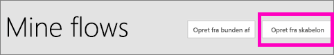
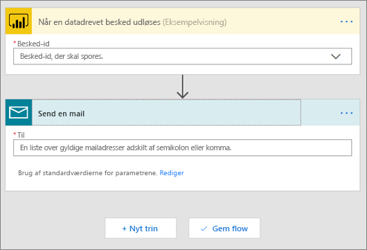
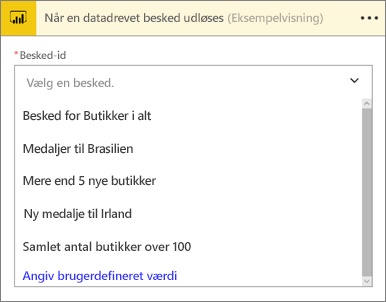
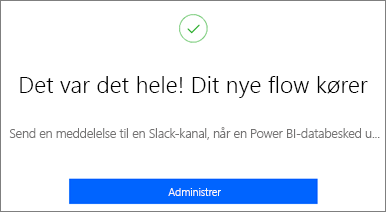
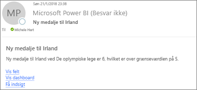
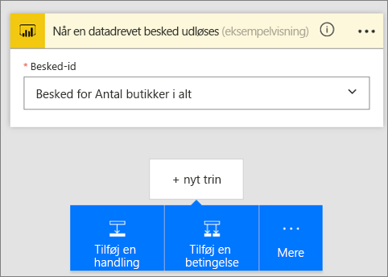
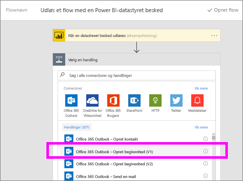

# Power Automate og Power BI

[Power Automate](https://docs.microsoft.com/power-automate/getting-started) er et SaaS-tilbud til automatisering af arbejdsprocesser på tværs af det stigende antal programmer og tjenester, som erhvervsbrugere er afhængige af. Med Power Automate kan du automatisere opgaver ved at integrere dine foretrukne apps og tjenester (herunder Power BI) for at få meddelelser, synkronisere filer, indsamle data og meget mere. Gentagne opgaver bliver nemme med automatisering af arbejdsprocessen.

[Kom godt i gang med at bruge Power Automate nu.](https://docs.microsoft.com/power-automate/getting-started)

Se, hvordan Sirui opretter et Power Automate-flow, der sender en detaljeret mail til kolleger, når der udløses en besked i Power BI. Følg derefter en trinvis vejledning under videoen for at prøve det selv.

<iframe width="560" height="315" src="https://www.youtube.com/embed/YhmNstC39Mw" frameborder="0" allowfullscreen></iframe>

## Opret et flow, der udløses af databeskeder i Power BI

### Forudsætninger
Denne vejledning viser, hvordan du opretter to forskellige flows; et fra en skabelon og et fra bunden. Hvis du vil følge med, skal du [oprette en databesked i Power BI](../create-reports/service-set-data-alerts.md), oprette en gratis Slack-konto og [tilmelde dig Power Automate](https://flow.microsoft.com/#home-signup) (det er gratis!).

## Opret et flow, der bruger Power BI – fra en skabelon
I denne opgave skal vi bruge en skabelon til at oprette et enkelt flow, der udløses af en databesked i Power BI (meddelelse).

1. Log på Power Automate (flow.microsoft.com).
2. Vælg **Mine flow**.
   
   
3. Vælg **Opret fra skabelon**.
   
    
4. Brug søgefeltet til at finde Power BI-skabeloner, og vælg **Send en mail til en målgruppe, når en Power BI-databesked udløses > Fortsæt**.
   
    

### Byg flowet
Denne skabelon indeholder en udløser (Power BI-databesked om nye olympiske medaljer til Irland) og en handling (send en mail). Når du vælger et felt, viser Power Automate dynamisk indhold, du kan inkludere.  I dette eksempel inkluderer vi feltværdien og feltets URL-adresse i meddelelsens brødtekst.

1. Vælg Power BI-databeskeden fra rullemenuen i udløseren. Vælg **Ny medalje til Irland**. Hvis du vil vide mere om, hvordan du opretter en besked, skal du læse [Databeskeder i Power BI](../create-reports/service-set-data-alerts.md).
   
   
2. Angiv en eller flere gyldige mailadresser, og vælg derefter **Rediger** (vist nedenfor) eller **Tilføj dynamisk indhold**. 
   
   

3. Power Automate opretter en titel og meddelelse for dig, som du kan beholde eller ændre. Alle de værdier, du angav, da du oprettede beskeden i Power BI, er tilgængelige til brug – du skal bare placere markøren og vælge i det område, der er fremhævet med gråt. 

   

1.  Hvis du f.eks. har oprettet en beskedtitel i Power BI af typen **Vi har vundet endnu en medalje**, kan du vælge **Beskedtitel** for at føje teksten til emnefeltet i din mail.

    

    Du kan også acceptere standardbrødteksten i mailen eller oprette din egen. Ovenstående eksempel indeholder nogle få ændringer af meddelelsen.

1. Når du er færdig, skal du vælge **Opret flow** eller **Gem flow**.  Flowet er oprettet og vurderet.  Power Automate giver dig besked, hvis det finder fejl.
2. Hvis der er fundet fejl, skal du vælge **Rediger flow** for at løse dem, ellers skal du vælge **Udført** for at køre det nye flow.
   
   
5. Når databeskeden udløses, sendes der en mail til de angivne adresser.  
   
   

## Opret et Power Automate-flow, der bruger Power BI – fra bunden
I denne opgave skal vi oprette et enkelt flow fra bunden, der udløses af en databesked i Power BI (meddelelse).

1. Log på Power Automate.
2. Vælg **Mine flow** > **Opret fra bunden af**.
   
   
3. Brug søgefeltet til at finde en Power BI-udløser, og vælg **Power BI – når en datadrevet besked udløses**.

### Opret dit flow
1. Vælg navnet på beskeden på rullelisten.  Hvis du vil vide mere om, hvordan du opretter en besked, skal du læse [Databeskeder i Power BI](../create-reports/service-set-data-alerts.md).
   
    
2. Vælg **Nyt trin** > **Tilføj en handling**.
   
   
3. Søg efter **Outlook**, og vælg **Opret begivenhed**.
   
   
4. Udfyld begivenhedens felter. Når du vælger et felt, viser Power Automate dynamisk indhold, du kan inkludere.
   
   
5. Vælg **Opret flow**, når du er færdig.  Power Automate gemmer og evaluerer flowet. Vælg **Udført** for at køre dette flow, hvis der ikke er nogen fejl.  Det nye flow er føjet til din side **Mine flow**.
   
   
6. Når flowet udløses af Power BI-databeskeden, modtager du en Outlook-begivenhedsmeddelelse svarende til denne.
   
    

## De næste trin
* [Kom i gang med Power Automate](https://docs.microsoft.com/power-automate/getting-started/)
* [Indstil databeskeder i Power BI-tjenesten](../create-reports/service-set-data-alerts.md)
* [Indstil databeskeder på din iPhone](../consumer/mobile/mobile-set-data-alerts-in-the-mobile-apps.md)
* [Indstil databeskeder i Power BI-mobilappen til Windows 10](../consumer/mobile/mobile-set-data-alerts-in-the-mobile-apps.md)
* Har du flere spørgsmål? [Prøv at spørge Power BI-community'et](https://community.powerbi.com/)
