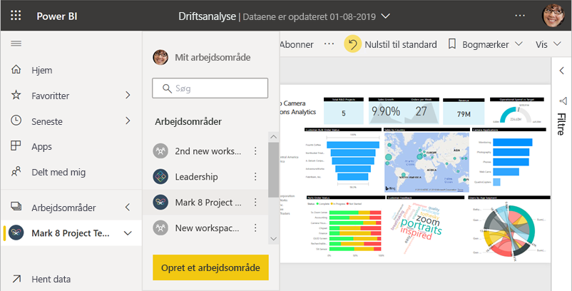
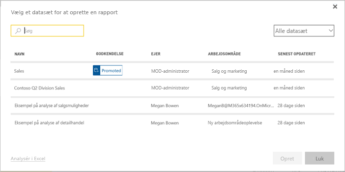
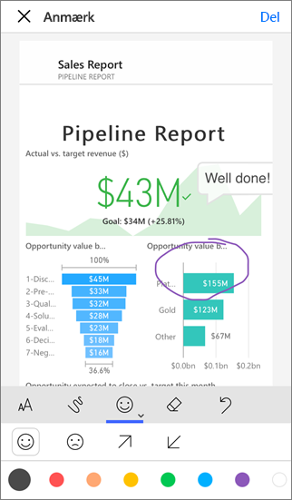

# Måder at dele dit arbejde i Power BI på

Du har oprettet dashboards og rapporter. Måske har du også samarbejdet med kolleger om dem. Du vil du gerne have, at andre kan få adgang til dem. Hvordan distribueres de på bedste vis? I denne artikel sammenligner vi disse muligheder for at samarbejde og dele i Power BI:

* Samarbejd med kolleger om at oprette relevante rapporter og dashboards i *arbejdsområder*.
* Gruppér disse dashboards og rapporter i *apps*, og distribuer dem til en større gruppe eller hele organisationen.
* Opret *delte datasæt*, som dine kolleger kan bruge som udgangspunkt for deres egne rapporter i deres egne arbejdsområder.
* Del dashboards eller rapporter med nogle få personer fra tjenesten eller Power BI-mobilapps.
* Anmærk og del fra Power BI-mobilapps.
* Integrer en rapport i Microsoft Teams.
* Udskriv rapporter.
* *Integrer* rapporter på sikre portaler eller offentlige websteder.
* Opret en *skabelonapp*, som du kan distribuere til eksterne Power BI-brugere via Microsoft AppSource.

Uanset hvilken indstilling du vælger, skal du bruge en [Power BI Pro-licens](../fundamentals/service-features-license-type.md) for at dele dit indhold, ellers skal indholdet være i en [Premium-kapacitet](../admin/service-premium-what-is.md). Licenskrav varierer alt efter de kolleger, der får vist dine dashboards, afhængigt af den valgte indstilling. De følgende afsnit går længere ned i detaljen. 

*Apps i Power BI-tjenesten*

## Samarbejde i et arbejdsområde

Når teams arbejder sammen, skal de have adgang til de samme dokumenter, så de kan samarbejde hurtigere. I arbejdsområder i Power BI mødes teams og deler ejerskabet og administrationen af de dashboards, rapporter, datasæt og projektmapper, der er vigtige for dem. Nogle gange organiserer Power BI-brugere deres arbejdsområder baseret på organisationens strukturer, og andre gange opretter de dem til specifikke projekter. Andre organisationer bruger stadig flere arbejdsområder til at gemme forskellige versioner af rapporter eller dashboards, de bruger. 

I arbejdsområder findes der roller, der bestemmer, hvilke tilladelser dine kolleger har. Du kan bruge disse roller til at bestemme, hvem der kan administrere hele arbejdsområdet eller redigere og distribuere dets indhold.

Du kan selvfølgelig lægge indhold i Mit arbejdsområde og dele det derfra. Arbejdsområder er mere velegnede til samarbejde end Mit arbejdsområde, da de gør det muligt at eje indhold i fællesskab. Du og hele dit team kan nemt foretage opdateringer eller give andre adgang. Mit arbejdsområde er mest velegnet til enkeltpersoner til skiftende eller personligt indhold.

Lad os forestille os, at du har et færdigt dashboard, du skal dele med dine kolleger. Hvordan kan du bedst give dem adgang til dashboardet? Svaret afhænger af en række faktorer. 

- Hvis kolleger skal holde dashboardet opdateret eller skal have adgang til alt indholdet i arbejdsområdet, kan du overveje at føje dem til arbejdsområdet. 
- Hvis kolleger bare skal have vist dashboardet og ikke alt indholdet i arbejdsområdet, kan du igen vælge mellem en række alternativer. Hvis nogle få personer har brug for dette ene dashboard, kan deling af dashboardet være den bedste løsning.
- Hvis dashboardet er en del af et større indholdssæt, du skal distribuere til mange kolleger, er den bedste løsning sandsynligvis at publicere en *app*.

Power BI har en ny arbejdsområdeoplevelse. Læs [Opret nye arbejdsområder](service-create-the-new-workspaces.md) for at se, hvordan arbejdsområder er blevet ændret. 

## Distribuer indsigt i en app

Lad os sige, at du gerne vil distribuere dit dashboard til en bred målgruppe i organisationen. Du og dine kolleger har oprettet et *arbejdsområde*, derefter har I oprettet og forfinet dashboards, rapporter og datasæt i arbejdsområdet. Nu skal du vælge de dashboards og rapporter, du vil have, og publicere dem som en app enten til en gruppe eller til hele organisationen.

Det er nemt at finde og installere apps i Power BI-tjenesten ([https://app.powerbi.com](https://app.powerbi.com)). Du kan sende virksomhedens brugere et direkte link til appen, eller de kan søge efter den i AppSource. Hvis din Power BI-administrator giver dig tilladelser, kan du automatisk installere en app på dine kollegers Power BI-konti. Læs mere om at [publicere dine apps](service-create-distribute-apps.md).

Efter de har installeret en app, kan de få den vist i deres browser eller mobilenhed.

Dine brugere kan få vist din app ved enten også at have Power BI Pro-licens, eller ved at appen er lagret i en Power BI Premium-kapacitet. Læs [Hvad er Power BI Premium?](../admin/service-premium-what-is.md) for at få flere oplysninger.

Du kan også publicere apps til personer uden for organisationen. De kan få vist og interagere med appindholdet, men de kan ikke dele det med andre. Du kan nu oprette *skabelonapps* og udrulle dem til Power BI-kunder.

## Deling af et datasæt

Lad os indrømme det, nogle personer er bare bedre til at oprette veludformede datamodeller i høj kvalitet i deres rapporter. Måske er det dig? Hele organisationen kan drage nytte af at benytte de samme veludformede datamodeller. *Delte datasæt* udfylder denne rolle. Når du opretter en rapport med en datamodel, som alle skal bruge, kan du gemme rapporten i Power BI-tjenesten og give tilladelse til at bruge den til de rette personer. De kan derefter bygge deres rapporter på dit datasæt. På den måde baserer alle deres rapporter på de samme data og ser den samme "version af sandheden".

Læs mere om [oprettelse og brug af delte datasæt](../connect-data/service-datasets-across-workspaces.md).

## Del dashboards og rapporter

Lad os sige, at du har færdiggjort et dashboard og en rapport i dit eget Mit arbejdsområde eller i et arbejdsområde, og du vil give få personer adgang til indholdet. Du kan vælge at *dele* indholdet. 

Du skal have en Power BI Pro-licens for at dele dit indhold, og det samme skal de personer, du deler med, eller også skal indholdet være tilgængeligt i et arbejdsområde i [Premium-kapacitet](../admin/service-premium-what-is.md). Når du deler et dashboard eller en rapport, kan modtagerne få det vist og interagere med indholdet, men de kan ikke redigere det. De kan se de samme data, som du kan se i dashboardet eller rapporten og få adgang til alle dataene i det underliggende datasæt, medmindre [sikkerhed på rækkeniveau (RLS)](../admin/service-admin-rls.md) anvendes. Kollegerne, du deler indholdet med, kan dele det med deres kolleger, hvis du giver dem lov til det. 

Du kan også dele med brugere uden for din organisation. De kan også få vist og interagere med dashboardet eller rapporten, men de kan ikke dele det. 

Flere oplysninger om [deling af dashboards og rapporter ](service-share-dashboards.md) fra Power BI-tjenesten. Du kan også føje et filter til et link og [dele en filtreret visning af din rapport](service-share-reports.md).

## Anmærk og del fra Power BI-mobilapps

Du kan i Power BI-mobilapps til iOS- og Android-enheder anmærke et felt, rapport eller visuelt element og derefter dele det med alle pr. mail.

Du kan dele et snapshot af feltet, rapporten eller dit visual, og modtagerne ser det, præcist som det var, da du sendte mailen. Mailen indeholder også et link til dashboardet eller rapporten. Hvis modtagerne har en Power BI Pro-licens, eller hvis indholdet er i [Premium-kapacitet](../admin/service-premium-what-is.md), og du allerede har delt objektet med dem, kan de åbne det. Du kan sende snapshots af felter til alle – ikke kun til kolleger på samme maildomæne.

Flere oplysninger om [anmærkning og deling af felter, rapporter og visuelle elementer](../consumer/mobile/mobile-annotate-and-share-a-tile-from-the-mobile-apps.md) fra iOS- og Android-mobilapps.

Du kan også [dele et snapshot af et felt](../consumer/mobile/mobile-windows-10-phone-app-get-started.md) fra Power BI-appen til Windows 10-enheder.

## Integrer en rapport i Microsoft Teams

Øg det databaserede samarbejde i din organisation ved at integrere dine Power BI-rapporter og sideinddelte Power BI-rapporter i Microsoft Teams. Du kan tilføje separate Power BI-faner for hver enkelt rapport og give hver fane rapportens navn eller et andet navn. Dine kollegaer kan få vist dine rapporter under Power BI-fanerne i Teams. De kan også åbne vinduet Samtale og kommentere rapporten direkte i Teams. Læs mere om [integration af en rapport i Microsoft Teams](service-embed-report-microsoft-teams.md).

## Udskriv eller gem som pdf-fil eller en anden statisk fil

Du kan udskrive eller gemme som pdf-fil (eller andre statiske filformatet), et helt dashboard, dashboardfelt, rapportside eller visualisering fra Power BI-tjenesten. Rapporter kan kun udskrives med én side ad gangen – du kan ikke udskrive hele rapporten på en gang. Mere om at [udskrive eller gemme som en statisk fil](../consumer/end-user-print.md).

## Integrer rapporter i sikre portaler eller på offentlige websteder

### Integrer i sikre portaler

Du kan integrere Power BI-rapporter i portaler eller på websteder, hvor dine brugere forventer at se dem.  
Indstillingerne **Integrer i SharePoint Online** og **Integrer** i Power BI-tjenesten giver dig mulighed for at integrere rapporter for dine interne brugere på en sikker måde. 

- **Integrer i SharePoint Online** fungerer sammen med Power BI-webdelen til SharePoint Online. Indstillingen giver en enkeltlogon-oplevelse med kontrol over, hvordan rapporten er integreret. 
- Indstillingen **Integrer** fungerer sammen med en hvilken som helst portal eller et hvilket som helst websted, der understøtter integrering af indhold ved hjælp af en URL-adresse eller en iFrame. 

Uanset hvilken indstilling du vælger, gennemtvinger Power BI alle tilladelser og al datasikkerhed, før brugerne kan få vist indholdet. Den person, der får vist rapporten, skal have den rette licens. Flere oplysninger om indstillingerne [Integrer i SharePoint Online](service-embed-report-spo.md) og [Integrer](service-embed-secure.md) i Power BI.

### Publicer på offentlige websteder

Med **Publicer på internettet** kan du publicere Power BI-rapporter på hele internettet ved at integrere interaktive visualiseringer i blogindlæg, på websteder, på sociale medier og andre steder til onlinekommunikation på en hvilken som helst enhed. Alle på internettet kan få vist dine rapporter, og du har ingen kontrol over, hvem der kan se, hvad du har publiceret. Modtagerne skal ikke bruge en Power BI-licens. Publicering til internettet er kun tilgængeligt for rapporter, som du kan redigere. Du kan ikke publicere rapporter til internettet, hvis de er delt med dig, eller hvis de er i en app. Mere om [publicering på internettet](service-publish-to-web.md).

>[!Warning]
>Brug kun [Publicer på internettet](service-publish-to-web.md), hvis du vil dele indhold offentligt, ikke til deling internt.

## Opret og udrul skabelonapps

*Skabelonapps* er designet til at blive distribueret offentligt, ofte i Microsoft AppSource. Du opretter en app, og med kun lidt eller ingen kode kan du udrulle den til Power BI-kunder. Dine kunder opretter forbindelse til deres egne data og bruger deres egne konti. Læs mere om [Power BI-skabelonapps](../connect-data/service-template-apps-overview.md).

## Næste trin

* [Del dashboards med kolleger og andre](service-share-dashboards.md)
* [Opret og publicer en app i Power BI](service-create-distribute-apps.md)
* [Integrer en rapport på en sikker portal eller et websted](service-embed-secure.md)

Har du feedback? Indsend dine forslag på [webstedet for Power BI-community'et](https://community.powerbi.com/).

Har du flere spørgsmål? [Prøv at spørge Power BI-community'et](https://community.powerbi.com/)
