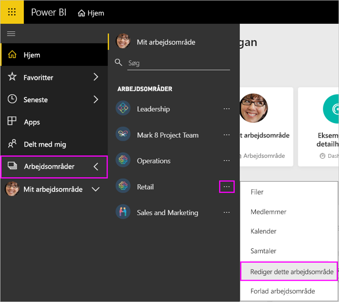
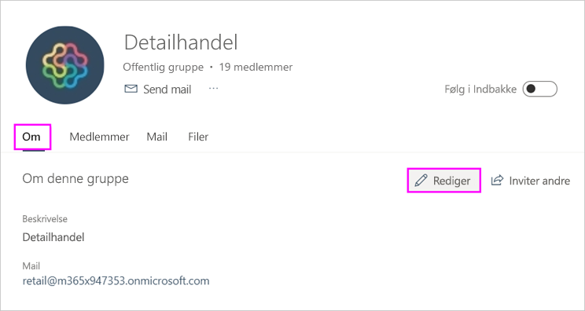
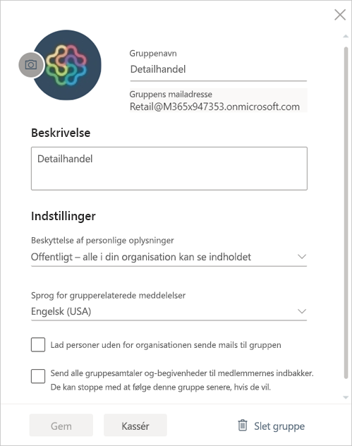

# Administrer dit arbejdsområde i Power BI og Microsoft 365

Som opretter eller administrator af et [arbejdsområde i Power BI](service-create-distribute-apps.md) eller Microsoft 365 kan du administrere visse aspekter af arbejdsområdet i Power BI. Andre aspekter du kan administrere i Microsoft 365.

> [!NOTE]
> Den nye arbejdsområdeoplevelse ændrer relationen mellem Power BI-arbejdsområder og Microsoft 365-grupper. Du opretter ikke automatisk en Microsoft 365-gruppe, hver gang du opretter et af de nye arbejdsområder. Læs om [oprettelse af nye arbejdsområder](service-create-the-new-workspaces.md).

I **Power BI** kan du:

* Tilføje eller fjerne medlemmer af arbejdsområdet, herunder udnævnelse af et medlem af arbejdsområdet til administrator.
* Redigere navnet på arbejdsområdet.
* Slette arbejdsområdet, hvilket også sletter Microsoft 365-gruppen.

I **Microsoft 365** kan du:

* Tilføje eller fjerne gruppemedlemmer af arbejdsområdet, herunder udnævnelse af et medlem til ejer.
* Redigere gruppenavn, billede, beskrivelse og andre indstillinger.
* Se gruppens mailadresse.
* Slette gruppen.

Du skal bruge en [Power BI Pro-licens](../fundamentals/service-features-license-type.md) for at være administrator eller medlem af et arbejdsområde. Dine appbrugere skal også have en Power BI Pro-licens, medmindre dit arbejdsområde befinder sig i en Power BI Premium-kapacitet. Læs [Hvad er Power BI Premium?](../admin/service-premium-what-is.md) for at få flere oplysninger.

## Rediger dit arbejdsområde i Power BI

1. I Power BI-tjenesten skal du vælge pilen ud for **Arbejdsområder** > vælge **Flere indstillinger** (...) ud for navnet på dit arbejdsområde > **Rediger dette arbejdsområde**.

   

   > [!NOTE]
   > Du kan kun se **Rediger dette arbejdsområde**, hvis du er administrator af arbejdsområdet.

1. Her kan du omdøbe arbejdsområdet, tilføje eller fjerne medlemmer eller slette apparbejdsområdet.

   

1. Vælg **Gem** eller **Annuller**.

## Rediger egenskaberne for Power BI-arbejdsområder i Microsoft 365

Du kan også redigere aspekter af et arbejdsområde direkte i Outlook til Microsoft 365.

### Rediger medlemmerne af gruppen for arbejdsområdet

1. I Power BI-tjenesten skal du vælge pilen ud for **Arbejdsområder** > og vælge **Flere indstillinger** (…) ud for navnet på dit arbejdsområde > **Medlemmer**.

   

   Dette åbner gruppevisningen i Outlook til Microsoft 365 af dit arbejdsområde. Du skal muligvis logge på din firmakonto.

1. Vælg rollen ud for teammedlemmets navn for at udnævne personen til **Medlem** eller **Ejer**. Vælg **X** for at fjerne personen fra gruppen.

   

### Tilføj et billede, og angiv andre egenskaber for arbejdsområdet

Når du distribuerer din app fra arbejdsområdet, bliver det billede, du tilføjer her, billedet for din app. Se afsnittet [Føj et billede til dit Microsoft 365-arbejdsområde](service-create-workspaces.md#add-an-image-to-your-microsoft-365-workspace-optional) i artiklen **Opret de nye arbejdsområder**.

1. I visningen Outlook til Microsoft 365 i dit arbejdsområde skal du gå til fanen **Om** og vælge **Rediger**.

    
1. Du kan redigere navnet, beskrivelsen og sproget for grupperelaterede meddelelser. Du kan også tilføje et billede og angive andre egenskaber her.

   

1. Vælg **Gem** eller **Fjern**.

## Næste trin

* [Publicer en app i Power BI](service-create-distribute-apps.md)

* Har du flere spørgsmål? [Prøv at spørge Power BI-community'et](https://community.powerbi.com/)
