# Overvåg forbrugsdata i den nye arbejdsområdeoplevelse

At vide, hvordan dit indhold bruges, hjælper dig med at demonstrere din indvirkning og prioritere din indsats. Dine forbrugsdata kan vise, at en af dine rapporter bruges dagligt af en meget stor del af organisationen, og de kan vise, at et dashboard, du oprettede, slet ikke bruges. Denne type feedback er uvurderlig til styring af din arbejdsindsats.

Hvis du opretter rapporter i moderne arbejdsområder, har du adgang til forbedrede rapporter med forbrugsdata, der giver dig mulighed for at finde ud af, hvordan disse rapporter bruges i hele organisationen, og hvem der bruger dem. Du kan også identificere problemer med ydeevnen på højt niveau. De forbedrede forbrugsrapporter i den moderne arbejdsområdeoplevelse erstatter eksisterende rapporter med forbrugsdata, som dokumenteret i [Overvåg forbrugsdata for Power BI-dashboards og -rapporter](service-usage-metrics.md).

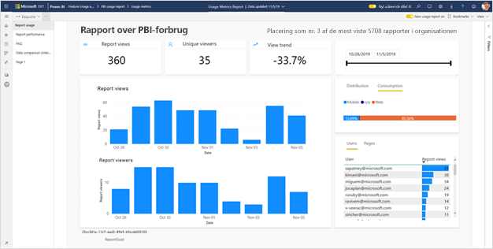

> [!NOTE]
> Du kan kun køre forbrugsdatarapporter i Power BI-tjenesten. Men hvis du gemmer en rapport med forbrugsdata eller fastgør den til et dashboard, kan du åbne og interagere med denne rapport på mobilenheder.

## Forudsætninger

- Du skal have en Power BI Pro-licens for at køre og få adgang til forbrugsdata. Forbrugsdatafunktionen henter dog forbrugsoplysninger fra alle brugere, uanset hvilken licens de er tildelt.
- For at få adgang til forbedrede forbrugsdata for en rapport skal rapporten være placeret i et moderne arbejdsområde, og du skal have adgang til at redigere den pågældende rapport.
- Din Power BI-administrator skal have aktiveret forbrugsdata for indholdsforfattere. Din Power BI-administrator kan også have aktiveret indsamling af brugerspecifikke data i forbrugsdata. Få mere at vide om, hvordan du [aktiverer disse indstillinger på administrationsportalen](../admin/service-admin-portal.md#control-usage-metrics).

## Opret og få vist en forbedret rapport med forbrugsdata

Det er kun brugere med rettigheder som administrator, medlem eller bidragyder, der kan få vist den forbedrede rapport med forbrugsdata. Det er ikke nok at have seerrettigheder. Hvis du som minimum er bidragyder i et moderne arbejdsområde, hvor rapporten er placeret, kan du bruge følgende procedure til at få vist de forbedrede forbrugsdata:

1. Åbn det arbejdsområde, der indeholder rapporten med de forbrugsdata, du vil analysere.
2. Åbn kontekstmenuen for rapporten fra indholdslisten for arbejdsområdet, og vælg **Få vist rapport med forbrugsdata**. Alternativt kan du åbne rapporten og derefter åbne kontekstmenuen på kommandolinjen og til sidst åbne **Forbrugsdata**.

    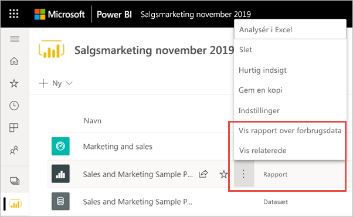

1. Den første gang, du gør dette, opretter Power BI rapporten med forbrugsdata og giver dig besked, når den er klar.

    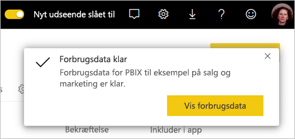

1. Vælg **Få vist forbrugsdata** for at se resultaterne.
2. Hvis det er første gang, du gør dette, åbner Power BI muligvis den gamle rapport med forbrugsdata. Hvis du vil have den forbedrede rapport med forbrugsdata vist, skal du i øverste højre hjørne slå til/fra-knappen Nye forbrugsdata **Til**.

    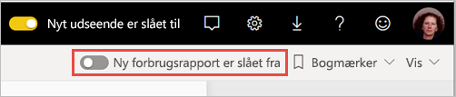

    > [!NOTE]
    > Du kan kun se knappen Nye forbrugsdata, hvis rapporten er placeret i et moderne arbejdsområde. Ældre arbejdsområder tilbyder ikke forbedrede rapporter med forbrugsdata.

## Om den forbedrede rapport med forbrugsdata

Når du får vist den forbedrede rapport med forbrugsdata ved at følge ovenstående procedure, genererer Power BI en færdigbygget rapport med forbrugsdata for det pågældende indhold for de sidste 30 dage. Rapporten ligner de Power BI-rapporter, du allerede kender. Du kan oprette udsnit baseret på, hvordan dine slutbrugere fik adgang, om de fik adgang via internettet eller mobilapp osv. Rapporten med forbrugsdata udvikler sig, i takt med at din rapport udvikler sig, og den opdateres hver dag med nye data.

> [!NOTE]
> Rapporter med forbrugsdata vises ikke i Seneste, Arbejdsområder, Favoritter eller på andre indholdslister. De kan ikke føjes til en app. Hvis du fastgør et felt fra en forbrugsdatarapport til et dashboard, kan du ikke føje det pågældende dashboard til en app.

### Datasæt til rapport med forbrugsdata

Den forbedrede rapport med forbrugsdata er afhængig af datasæt til rapporten med forbrugsdata, som Power BI opretter automatisk, når du starter den forbedrede rapport med forbrugsdata første gang. Power BI opdaterer derefter dette datasæt dagligt. Selvom du ikke kan ændre opdateringsplanen, kan du opdatere de legitimationsoplysninger, som Power BI bruger til at opdatere forbrugsdataene. Dette kan være nødvendigt for at genoptage den planlagte opdatering, hvis legitimationsoplysningerne udløb, eller hvis du fjernede den bruger, som startede rapporten med forbrugsdata første gang fra arbejdsområdet, hvor datasættet er placeret.

### Sider i rapporten med forbrugsdata

Den forbedrede rapport med forbrugsdata indeholder følgende rapportsider:

- **Rapportanvendelse** Indeholder oplysninger om rapportvisninger og rapportseere, f.eks. hvor mange brugere der fik vist rapporten efter dato.
- **Rapportydeevne** Viser de typiske åbningstider for rapporten opdelt efter forbrugsmetode og browsertyper.
- **Ofte stillede spørgsmål** Indeholder svar på ofte stillede spørgsmål, f.eks. Hvad er en "seer", og hvad er en "visning"?

### Hvilke forbrugsdata rapporteres?

| **Side** | **Målepunkt** | **Beskrivelse** |
| --- | --- | --- |
| Rapportanvendelse | Rapportvisninger | Der registreres en rapportvisning, hver gang en person åbner en rapport. Bemærk, at definitionen af en visning adskiller sig fra tidligere rapporter med forbrugsdata. Ændring af rapportsider anses ikke længere for at være en yderligere visning. |
| Rapportanvendelse | Unikke seere | En seer er en person, der har åbnet rapporten mindst én gang i tidsperioden (baseret på AAD-brugerkontoen). |
| Rapportanvendelse | Visningstendens | Visningstendensen afspejler ændringer i antallet af visninger over tid. Den første halvdel af den valgte tidsperiode sammenlignes med den anden halvdel. |
| Rapportanvendelse | Datoudsnit | Du kan ændre tidsperioden for siden Rapportanvendelse, f.eks. for at beregne ugentlige tendenser eller tendenser for hver anden uge. I nederste venstre hjørne af siden Rapportanvendelse kan du bestemme den tidligste og seneste dato, hvor forbrugsdata er tilgængelige for den valgte rapport. |
| Rapportanvendelse | Rangering | På baggrund af antallet af visninger viser rangeringen rapportens popularitet sammenlignet med alle andre rapporter i organisationen.   |
| Rapportanvendelse | Rapportvisninger pr. dag | Samlet antal visninger pr. dag. |
| Rapportanvendelse | Rapportseere pr. dag | Samlet antal forskellige brugere, der fik vist rapporten (baseret på AAD-brugerkontoen). |
| Rapportanvendelse | Distributionsmetode | Hvordan brugerne fik adgang til rapporten, f.eks. ved at være medlem af et arbejdsområde, ved at få rapporten delt med dem eller ved at installere en app. |
| Rapportanvendelse | Platformudsnit | Om rapporten blev tilgået via Power BI-tjenesten (powerbi.com), Power BI Embedded eller en mobilenhed. |
| Rapportanvendelse | Brugere med rapportvisninger | Viser listen over brugere, der åbnede rapporten, sorteret efter antal visninger. |
| Rapportanvendelse | Sider | Hvis rapporten indeholder mere end 1 side, skal du opdele rapporten efter de sider, der blev vist. Hvis du får vist en listeindstilling for "Tom", betyder det, at en rapportside blev tilføjet for nylig (inden for 24 timer vises det faktiske navn på den nye side på listen over udsnit), og/eller at rapportsider er blevet slettet. "Tom" henter disse typer situationer. |
| Rapportydeevne | Typisk åbningstid | Den typiske åbningstid for rapporten svarer til 50. fraktil af den tid, det tager at åbne rapporten. Med andre ord, så er det den tid nedenfor, hvor 50 % af handlingerne for åbning af rapporten blev udført. Siden Rapportydeevne opdeler også den typiske åbningstid for rapporten efter forbrugsmetode og browsertype.   |
| Rapportydeevne | Tendens for åbningstid | Tendens for åbningstid afspejler ændringer i ydeevnen for åbning af rapporten over tid. Åbningstiderne for rapporten for den første halvdel af den valgte tidsperiode sammenlignes med åbningstiderne for den anden halvdel. |
| Rapportydeevne | Datoudsnit | Du kan ændre tidsperioden på siden Rapportydeevne, f.eks. for at beregne ugentlige tendenser eller tendenser for hver anden uge. I nederste venstre hjørne af siden Rapportydeevne kan du bestemme den tidligste og seneste dato, hvor forbrugsdata er tilgængelige for den valgte rapport. |
| Rapportydeevne | Daglig ydeevne | Ydeevnen for 10 %, 50 % og 90 % af handlingerne for åbning af rapporten beregnet for hver enkelt dag. |
| Rapportydeevne | 7-dages ydeevne | Ydeevnen for 10 %, 50 % og 90 % af handlingerne for åbning af rapporten beregnet for de sidste 7 dage for hver dato. |
| Rapportydeevne | Forbrugsmetode | Hvordan brugerne åbnede rapporten, f.eks. via Power BI-tjenesten (powerbi.com), Power BI Embedded eller en mobilenhed. |
| Rapportydeevne | Browsere | Hvilken browser brugerne brugte til at åbne rapporten, f.eks. Firefox, Edge og Chrome. |

## Opdater legitimationsoplysningerne for rapporten med forbrugsdata

Brug følgende procedure til at overtage et datasæt til en rapport med forbrugsdata, og opdater legitimationsoplysningerne.

1. Åbn det arbejdsområde, der indeholder den rapport, du vil opdatere datasættet til rapporten med forbrugsdata for.
2. I den sorte header øverst skal du vælge ikonet **Indstillinger** og derefter vælge **Indstillinger**.

    

3. Skift til fanen **Datasæt**.

1. Vælg datasættet til rapporten med forbrugsdata. 

    
    
    Hvis du ikke er ejeren af det aktuelle datasæt, skal du overtage ejerskabet, før du kan opdatere legitimationsoplysningerne for datakilden. 
    
5. Vælg knappen **Overtag**, og i dialogboksen **Overtag indstillinger for datasæt** skal du vælge **Overtag** igen.

1. Under **Legitimationsoplysninger for datakilde** skal du vælge **Rediger legitimationsoplysninger**.

    

2. I dialogboksen **Konfigurer rapport med forbrugsdata** skal du vælge **Log på**.

    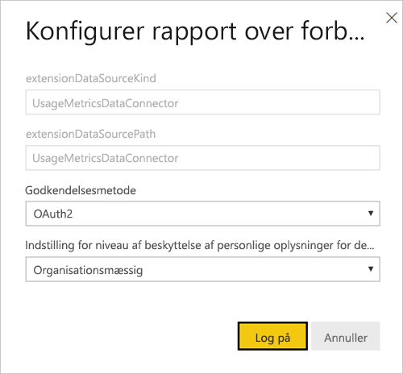

1. Fuldfør logonsekvensen, og bemærk meddelelsen om, at datakilden blev opdateret.

    > [!NOTE]
    > Datasættet til rapporten med forbrugsdata indeholder forbrugsdata for de sidste 30 dage. Det kan tage op til 24 timer, før de nye forbrugsdata er importeret. Du kan ikke udløse en manuel opdatering ved hjælp af Power BI-brugergrænsefladen.

## Deaktiver rapport med forbrugsdata

Rapporter med forbrugsdata er en funktion, som Power BI- eller Microsoft 365-administratoren kan slå til eller fra. Administratorer har detaljeret kontrol over, hvilke brugere der har adgang til forbrugsdata. De er slået til som standard for alle brugere i organisationen. Få mere at vide om disse indstillinger under [Kontrollér forbrugsdata](../admin/service-admin-portal.md#control-usage-metrics) i artiklen om administrationsportalen.

> [!NOTE]
> Kun administratorer for Power BI-lejeren kan se administrationsportalen og redigere indstillingerne.

## Udelad brugeroplysninger fra rapporter med forbrugsdata

Brugerspecifikke data er som standard aktiveret for forbrugsdata, og kontooplysninger om forbrugere af indhold indgår i rapporten med forbrugsdata. Hvis administratorerne ikke vil afsløre disse oplysninger for nogle eller alle brugere, kan de udelade brugeroplysningerne fra rapporten med forbrugsdata ved at deaktivere Brugerspecifikke data i forbrugsdata for indholdsforfattere under indstillingerne på Power BI-administrationsportalen for specifikke sikkerhedsgrupper eller for hele organisationen.

1. Under fanen **Lejerindstillinger** på administrationsportalen under **Indstillinger for overvågning og forbrug** skal du udvide **Brugerspecifikke data under metrikværdier for indholdsforfattere** og vælge **Deaktiveret**.

2. Bestem, om du vil bruge indstillingen **Slet alle eksisterende brugerspecifikke data i indhold for aktuelle forbrugsdata**, og vælg **Anvend**.

    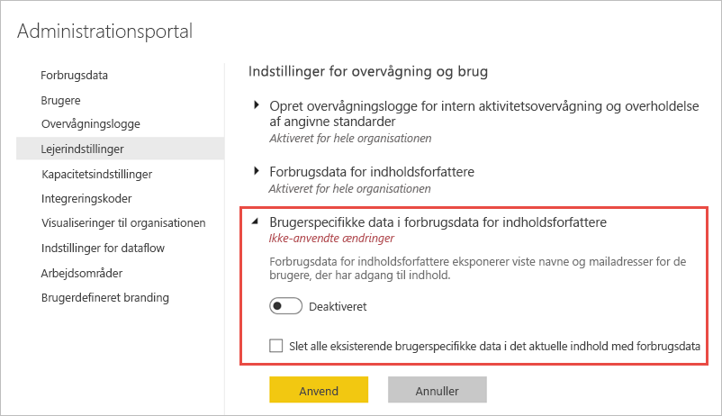

Hvis brugeroplysningerne udelades, henviser forbrugsrapporten til brugerne som Unavngivne.

Når administratorer deaktiverer forbrugsdata for hele organisationen, kan de bruge indstillingen Slet alt eksisterende indhold i forbrugsdata til at slette alle eksisterende rapporter og dashboardfelter, der blev oprettet ved hjælp af rapporter med forbrugsdata. Denne indstilling fjerner al adgang til forbrugsdata for alle brugere i organisationen, som muligvis allerede anvender dem. Sletning af eksisterende forbrugsdataindhold kan ikke fortrydes.

> [!NOTE]
> Det er kun administratorer af Power BI-lejeren, der kan se administrationsportalen og konfigurere Brugerspecifikke data i forbrugsdata under indstillinger for indholdsforfattere.

## Tilpas rapporten med forbrugsdata

Du har adskillige muligheder for at grave ned i rapporten eller skabe dine egne rapporter ud fra de underliggende datasæt:

- **[Opret en kopi af rapporten](#create-a-copy-of-the-usage-report) i Power BI-tjenesten.**   Brug **Gem en kopi** til at oprette en separat forekomst af rapporten med forbrugsdata, som du kan tilpasse, så den passer til dine specifikke behov.
- **[Opret forbindelse til datasættet](#create-a-new-usage-report-in-power-bi-desktop) med en ny rapport.**   For hvert arbejdsområde har datasættet navnet "Rapport med forbrugsdata", som forklaret tidligere i afsnittet [Datasæt til rapport med forbrugsdata](#usage-metrics-report-dataset). Du kan bruge Power BI Desktop til at skabe tilpassede rapporter med forbrugsdata baseret på det underliggende datasæt.
- **[Brug Analysér i Excel](#analyze-usage-data-in-excel).**   Du kan også benytte funktioner til pivottabeller, diagrammer og udsnit i Microsoft Excel 2010 SP1 eller nyere til at analysere Power BI-forbrugsdata. Læs mere om funktionen [Analysér i Excel](service-analyze-in-excel.md).

### Opret en kopi af forbrugsrapporten

Når du opretter en kopi af den skrivebeskyttede, færdigbyggede forbrugsrapport, opretter Power BI en redigerbar forekomst af rapporten. Umiddelbart ligner den originalen. Du kan dog nu åbne rapporten i redigeringsvisning, tilføje nye visualiseringer, filtre og sider samt redigere eller slette eksisterende visualiseringer m.m. Power BI gemmer den nye rapport i det aktuelle arbejdsområde.

1. I den nye rapport med forbrugsdata skal du vælge menuen **Flere indstillinger** (...) og derefter vælge **Gem en kopi**.

    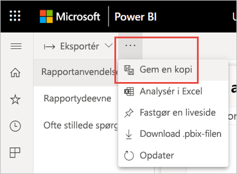

2. I dialogboksen **Gem rapporten** skal du angive et navn og derefter vælge **Gem**.

    Power BI opretter en redigerbar Power BI-rapport, der er gemt i det aktuelle arbejdsområde, og åbner kopien af rapporten. 

3. Vælg menuen **Flere indstillinger** (…), og vælg derefter **Rediger** for at skifte til Redigeringsvisning. 

    Du kan f.eks. ændre filtre, tilføje nye sider, oprette nye visualiseringer og formatere skrifttyper og farver osv.

1. Den nye rapport gemmes under fanen Rapporter i det aktuelle arbejdsområde og føjes til indholdslisten Seneste.

    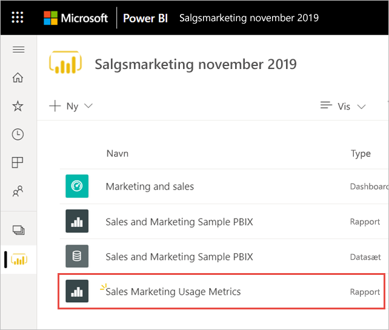

### Opret en ny forbrugsrapport i Power BI Desktop

Du kan oprette en ny forbrugsrapport i Power BI Desktop baseret på datasæt til rapporten med forbrugsdata. Du skal være logget på Power BI-tjenesten i Power BI Desktop for at etablere en forbindelse til datasættet til rapporten med forbrugsdata og oprette din egen rapport. 

1. Åbn Power BI Desktop.

2. Hvis du ikke er logget på Power BI-tjenesten, skal du i menuen **Filer** vælge **Log på**.

1. For at oprette forbindelse til datasættet til rapporten med forbrugsdata skal du på båndet **Start** vælge **Hent data**.

4. Vælg **Power Platform** i ruden til venstre, og vælg derefter **Power BI-datasæt** > **Opret forbindelse**.

    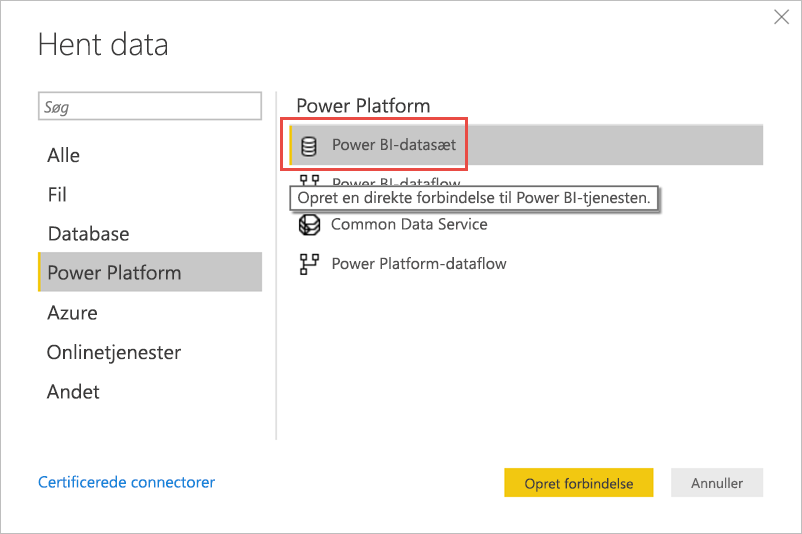

1. Rul ned til det ønskede datasæt, eller skriv *Rapport til forbrugsdata* i søgefeltet. 

6. Bekræft, at du vælger det korrekte datasæt i kolonnen Arbejdsområde, og vælg derefter **Opret**. 

    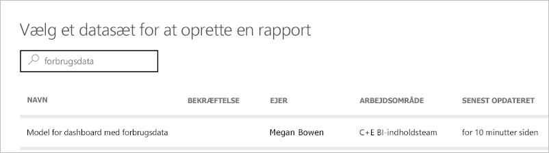

7. Markér listen Felter i Power BI Desktop, hvilket giver dig adgang til tabellerne, kolonnerne og målingerne i det valgte datasæt.

    

1. Nu kan du oprette og dele forbrugsrapporter – alt sammen fra det samme datasæt til rapporten med forbrugsdata.

### Analysér forbrugsdata i Excel

Når du opretter forbindelse til forbrugsdata i Excel, kan du oprette pivottabeller, der bruger de foruddefinerede målinger. Bemærk, at pivottabeller i Excel ikke understøtter træk og slip-sammenlægning af numeriske felter, når der oprettes forbindelse til et Power BI-datasæt.

1. For det første skal du [oprette en kopi af rapporten med forbrugsdata](#create-a-copy-of-the-usage-report), hvis du ikke allerede har gjort det. 

2. Åbn den nye rapport med forbrugsdata, vælg menuen **Flere indstillinger** (…), og vælg **Analysér i Excel**.

    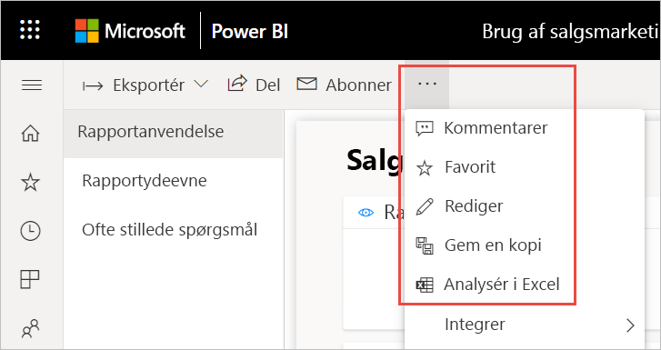

1. Hvis du ser dialogboksen **Først skal du bruge nogle Excel-opdateringer**, skal du vælge **Download** og installere de nyeste opdateringer til Power BI-forbindelsen eller vælge **Jeg har allerede installeret disse opdateringer**.

    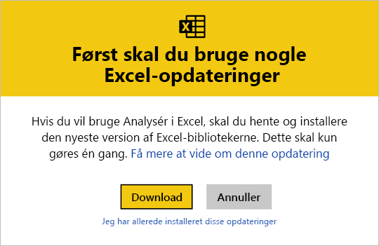

    > [!NOTE]
    > Nogle organisationer har muligvis regler for gruppepolitik, der forhindrer installation i Excel af de krævede opdateringer til Analysér i Excel. Hvis du ikke kan installere opdateringerne, skal du kontakte din administrator.

1. Vælg **Åbn** i den dialogboks i browseren, hvor du bliver spurgt om, hvad du vil gøre med .odc-filen til rapporten med forbrugsdata.

    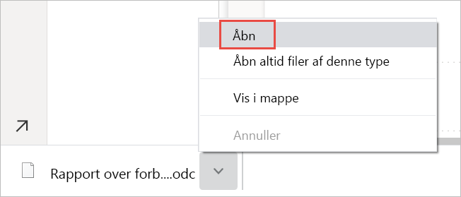

1. Power BI starter Excel. Bekræft filnavnet og stien for .odc-filen, og vælg derefter **Aktivér**.

    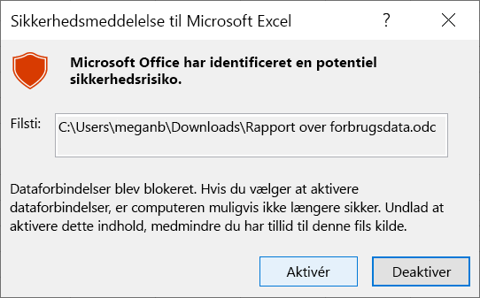

1. Nu, hvor Excel er blevet åbnet, og du har en tom pivottabel, kan du trække felter til Rækker, Kolonner, Filtre og Værdier og oprette brugerdefinerede visninger for dine forbrugsdata.

    

## Forbrugsværdier i nationale cloudmiljøer

Power BI fås med forskellige nationale cloudmiljøer. Disse cloudmiljøer giver samme sikkerhedsniveau, beskyttelse af personlige oplysninger, overholdelse af angivne standarder og gennemsigtighed som den globale version af Power BI, kombineret med en unik model for lokale bestemmelser om levering af tjenester, dataopbevaring, adgang og kontrol. På grund af denne unikke model til opfyldelse af lokale lovkrav er forbrugsdata er ikke tilgængelige i nationale cloudmiljøer. Du kan få flere oplysninger under [nationale cloudmiljøer](https://powerbi.microsoft.com/clouds/).

## Overvejelser og begrænsninger

Det er vigtigt at forstå, at der kan opstå forskelle, når du sammenligner den forbedrede rapport med forbrugsdata med den forrige. Især at forbrugsdataene for rapporten nu er baseret på aktivitetsdata, der indsamles fra Power BI-tjenesten. Tidligere versioner af rapporten med forbrugsdata var afhængige af telemetri, som ikke altid matcher de forbrugsdata, der indsamles fra tjenesten. Desuden bruges der en anden definition for en "visning" i den forbedrede rapport med forbrugsdata. En visning er en hændelse, hvor rapporten åbnes, som registreres i tjenesten, hver gang nogen åbner en rapport. Ændring af rapportsider anses ikke længere for at være en yderligere visning.

> [!NOTE]
> Da den forbedrede rapport med forbrugsdata er afhængig af aktivitetsdata, der indsamles fra Power BI-tjenesten, matcher forbrugsdataene nu det sammenlagte antal aktiviteter i overvågningslogge og aktivitetslogge. For mange eller for få optællinger af aktiviteter pga. uensartede netværksforbindelser, programmer til blokering af annoncer eller andre problemer på klientsiden forvrænger ikke længere optællingerne af seere og visninger.

Foruden ovenstående forskelle mellem tidligere og forbedrede rapporter med forbrugsdata skal du bemærke følgende begrænsninger for udgivelsen af prøveversionen:

- Forbrugsdata for dashboardet er stadig afhængig af den tidligere version af rapporterne med forbrugsdata.
- Forbedrede rapporter med forbrugsdata er kun tilgængelige for rapporter i moderne arbejdsområder. Rapporter i ældre arbejdsområder understøtter kun den tidligere version af rapporter med forbrugsdata.
- Metrikværdier for rapportydeevne er baseret på klienttelemetri. Visse typer visninger er ikke inkluderet i målingerne af ydeevne. Når en bruger f.eks. vælger et link til en rapport i en mail, er der taget højde for visningen i rapportforbruget, men der er ingen hændelse i metrikværdierne for ydeevnen.
- Metrikværdier for rapportydeevne er ikke tilgængelige for sideinddelte rapporter. Der vises ikke data for disse typer rapporter under fanen Sider på siden Rapportforbrug samt diagrammerne på siden Rapportydeevne.
- Brugermaskering fungerer ikke som forventet, når der bruges indlejrede grupper. Hvis organisationen har deaktiveret Brugerspecifikke data i forbrugsdata for indholdsforfattere under lejerindstillingerne på Power BI-administrationsportalen, er det kun medlemmerne på det øverste niveau, som maskeres. Medlemmer af undergrupper er stadig synlige.
- Det kan tage nogle få minutter at initialisere datasættet til rapporten med forbrugsdata, hvilket resulterer i visning af en tom rapport med forbrugsdata, fordi Power BI-brugergrænsefladen ikke venter på, at opdateringen fuldføres. Kontrollér opdateringshistorikken under indstillingerne for datasættet til rapporten med forbrugsdata for at bekræfte, at opdateringshandlingen lykkedes.
- Initialiseringen af datasættet til rapporten med forbrugsdata mislykkes muligvis, hvis der opstår timeout under opdateringen. Se afsnittet Fejlfinding herunder for at løse dette problem.

## Ofte stillede spørgsmål

Ud over ovenstående overvejelser og begrænsninger kan følgende spørgsmål og svar om forbrugsdata være nyttige for brugere og administratorer:

**Spørgsmål:** Jeg kan ikke køre forbrugsdata for en rapport.

**Svar:** Du kan kun se forbrugsdata for rapporter, som du ejer eller har tilladelser til at redigere.

**Spørgsmål:** Hvorfor kan jeg ikke se til/fra-knappen Ny forbrugsrapport i øverste højre hjørne i min eksisterende rapport med forbrugsrapport?

**Svar:** Den forbedrede rapport med forbrugsdata er kun tilgængelig for rapporter i moderne arbejdsområder.

**Spørgsmål:** Hvilken tidsperiode dækkes af rapporten?

**Svar:** Forbrugsrapporten er baseret på aktivitetsdata for de sidste 30 dage, eksklusive aktiviteter for den aktuelle dag. Du kan indsnævre tidsperioden ved hjælp af Datoudsnit på siden Rapportanvendelse, f.eks. for kun at analysere sidste uges data.

**Spørgsmål:** Hvornår kan jeg se de nyeste aktivitetsdata?

**Svar:** Forbrugsrapporten indeholder aktivitetsdata frem til den sidste hele dag baseret på UTC-tidszonen. De data, der vises i rapporten, afhænger også af opdateringstiden for datasættet. Power BI opdaterer datasættet én gang om dagen.

**Spørgsmål:** Dataene ser ikke ud til at være opdateret.

**Svar:** Bemærk, at det kan tage op til 24 timer, før de nye aktivitetsdata vises i forbrugsrapporten.

**Spørgsmål:** Hvad er datakilden til forbrugsdataene?

**Svar:** Datasættet til rapporten med forbrugsdata importerer data fra interne forbrugsdata i Power BI ved hjælp af en brugerdefineret connector til forbrugsdata. Du kan opdatere legitimationsoplysningerne for connectoren til forbrugsdata på siden med indstillinger for rapporten med forbrugsdata.

**Spørgsmål:** Hvordan opretter jeg forbindelse til data? Eller ændrer standardrapporten?

**Svar:** Du kan oprette en kopi af den skrivebeskyttede, færdigbyggede forbrugsrapport. Kopien af rapporten opretter forbindelse til det samme datasæt til rapporten med forbrugsdata og giver dig mulighed for at redigere rapportoplysningerne.

**Spørgsmål:** Hvad er en "seer", og hvad er en "visning"?

**Svar:** En seer er en person, der har åbnet rapporten mindst én gang i tidsperioden. En visning er en hændelse, hvor rapporten åbnes. Der registreres en rapportvisning, hver gang en person åbner en rapport.

Bemærk, at definitionen af en visning adskiller sig fra tidligere rapporter med forbrugsdata. Ændring af rapportsider anses ikke længere for at være en yderligere visning.

**Spørgsmål:** Hvordan beregnes "visningstendensen"?

**Svar:** Visningstendensen afspejler ændringer i antallet af visninger over tid. Den første halvdel af den valgte tidsperiode sammenlignes med den anden halvdel. Du kan ændre tidsperioden ved hjælp af Datoudsnit på siden Rapportanvendelse, f.eks. for at beregne ugentlige tendenser eller tendenser for hver anden uge.

**Spørgsmål:** Hvad betyder "distribution" og "platform"?

**Svar:** Distribution viser, hvordan seerne fik adgang til en rapport: om den blev delt direkte, om adgangen skete via et arbejdsområde eller via en app.

Platformen angiver den teknologi, som en seer brugte til at åbne rapporten: via PowerBI.com, en mobilenhed eller Embedded.

**Spørgsmål:** Hvordan fungerer rapportrangering?

**Svar:** På baggrund af antallet af visninger viser rangeringen rapportens popularitet sammenlignet med alle andre rapporter i organisationen.

**Spørgsmål:** Hvad er "unavngivne brugere"?

**Svar:** Din organisation kan beslutte, om brugeroplysninger skal udelades fra din forbrugsrapport. Hvis de udelades, henviser forbrugsrapporten til brugerne som Unavngivne.

**Spørgsmål:** Hvad er "den typiske åbningstid for rapporten"?

**Svar:** Den typiske åbningstid for rapporten svarer til 50. fraktil af den tid, det tager at åbne rapporten. Med andre ord, så er det den tid nedenfor, hvor 50 % af handlingerne for åbning af rapporten blev udført. Siden Rapportydeevne opdeler også den typiske åbningstid for rapporten efter forbrugsmetode og browsertype.

**Spørgsmål:** Hvordan beregnes "tendens for åbningstid"?

**Svar:** Tendens for åbningstid afspejler ændringer i ydeevnen for åbning af rapporten over tid. Åbningstiderne for rapporten for den første halvdel af den valgte tidsperiode sammenlignes med åbningstiderne for den anden halvdel. Du kan ændre tidsperioden ved hjælp af Datoudsnit på siden Rapportydeevne, f.eks. for at beregne ugentlige tendenser eller tendenser for hver anden uge.

**Spørgsmål:**  Der er fire rapporter i den tidligere version af rapporten med forbrugsdata, men der vises kun tre i den forbedrede version.

**Svar:**  Den forbedrede rapport med forbrugsdata indeholder kun rapporter, der er blevet åbnet inden for de sidste 30 dage, mens den tidligere version dækker de sidste 90 dage. Hvis en rapport ikke inkluderes i den forbedrede rapport med forbrugsdata, har den sandsynligvis ikke været brugt i mere end 30 dage.

## Foretag fejlfinding: Slet datasættet

Hvis du har mistanke om, at der er problemer med ensartede data eller opdateringer, kan det være en god idé at slette eksisterende datasæt til rapporten med forbrugsdata. Du kan derefter køre Vis forbrugsdata igen for at generere et nyt datasæt med dets tilknyttede forbedrede rapporter med forbrugsdata. Følg disse trin:

### Slet datasættet

1. Åbn det arbejdsområde, der indeholder den rapport, du vil nulstille datasættet til rapporten med forbrugsdata for.

2. I den sorte header øverst skal du vælge ikonet **Indstillinger** og derefter vælge **Indstillinger**.

    

3. Skift til fanen **Datasæt**, og vælg datasættet til rapporten med forbrugsdata. 

    

5. Kopiér id'erne for arbejdsområdet og datasættet fra den URL-adresse, der vises i browserens adresselinje.

    

1. Gå til [https://docs.microsoft.com/rest/api/power-bi/datasets/deletedatasetingroup](https://docs.microsoft.com/rest/api/power-bi/datasets/deletedatasetingroup) i din browser, og vælg knappen **Prøv det**.

    

1. Log på Power BI, indsæt id'et for arbejdsområdet i tekstfeltet **groupId** og id'et for datasættet i tekstfeltet **datasetId**, og vælg derefter **Kør**. 

    

1. Under knappen **Kør** skal du bekræfte, at tjenesten returnerer svarkoden **200**. Denne kode angiver, at datasættet og dets tilknyttede rapporter med forbrugsdata er blevet slettet.

    

### Opret en ny rapport med forbrugsdata

1. Tilbage i Power BI-tjenesten kan du se, at datasættet er væk.

    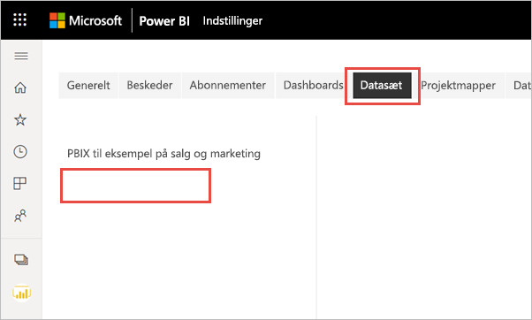

2. Hvis du stadig ser rapporten med forbrugsdata på listen Rapporter, skal du opdatere browseren.

3. [Opret en ny rapport med forbrugsdata](#create--view-an-improved-usage-metrics-report).

## Næste trin

[Administrer Power BI på administrationsportalen](../admin/service-admin-portal.md)

Har du flere spørgsmål? [Prøv at spørge Power BI-community'et](https://community.powerbi.com/)
