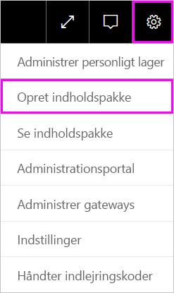
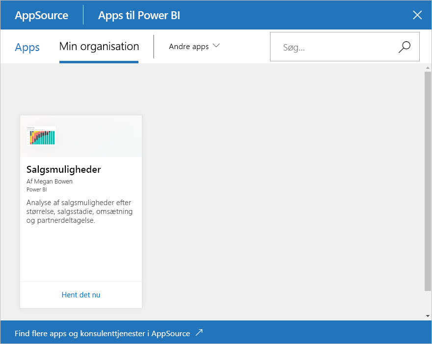

# Selvstudium: Opret og publicer en organisationsindholdspakke til Power BI

I dette selvstudium opretter du en organisationsindholdspakke, giver adgang til en bestemt gruppe og publicerer den i biblioteket til din organisationsindholdspakke i Power BI.

Oprettelse af indholdspakker adskiller sig fra deling af dashboards eller samarbejde på dem i en gruppe. Læs [Måder at dele dit arbejde i Power BI](service-how-to-collaborate-distribute-dashboards-reports.md) for at afgøre, hvad der passer bedst til din situation.

Oprettelse af en organisationsindholdspakke kræver en [Power BI Pro-konto](https://powerbi.microsoft.com/pricing) til dig og dine kollegaer.

> [!NOTE]
> Du kan ikke oprette eller installere organisationsindholdspakker i de nye arbejdsområdeoplevelser. Hvis du ikke er startet endnu, er det et godt tidspunkt at opgradere dine indholdspakker til apps. Få [mere at vide om den nye arbejdsområdeoplevelse](service-create-the-new-workspaces.md).

## Opret og udgiv en indholdspakke

Antag, at du er Release Manager hos Contoso, og at du er ved at gøre klar til lancering af et nyt produkt.  Du har oprettet et dashboard med rapporter, som du vil dele. Andre medarbejdere, der administrerer lanceringen, kan finde dem nyttige. Du vil gerne samle dashboardet og rapporterne som en løsning, som dine kollegaer kan bruge.

Vil du følge med? Gå til [Mit arbejdsområde](https://powerbi.com) i **Power BI-tjenesten**. Gå derefter til **Hent data** > **Eksempler** > **Eksempel på analyse af salgsmuligheder** > **Opret forbindelse** for at få din egen kopi.

1. Vælg **Arbejdsområder** > **Mit arbejdsområde** i navigationsruden.

1. Vælg tandhjulsikonet  i den øverste navigationsrude. > **Opret indholdspakke**.

   

1. I vinduet **Opret indholdspakke** skal du angive følgende oplysninger.  

   Vær opmærksom på, at din organisations bibliotek med indholdspakker kan blive fyldt hurtigt op. Biblioteket kan ende med at have hundredvis af indholdspakker, der er publiceret for organisationen eller for grupperne. Brug lidt tid på at give indholdspakken et navn, der giver mening, tilføje en god beskrivelse og vælge den rette målgruppe.  Brug ord, der vil gøre det nemt at finde din indholdspakke i søgninger. Det gør det nemmere at finde dem fremover.

      

    1. Vælg **Bestemte grupper**.

    1. Angiv de komplette mailadresser til enkeltpersoner, [Office 365-grupper](https://support.office.com/article/Create-a-group-in-Office-365-7124dc4c-1de9-40d4-b096-e8add19209e9), distributionsgrupper eller sikkerhedsgrupper. For eksempel: salesmgrs@contoso.com; sales@contoso.com

        Til dette selvstudium kan du prøve at bruge din gruppes mailadresse.

    1. Navngiv indholdspakken *Salgsmuligheder*.

        > [!TIP]
        > Overvej at lade navnet på dashboardet indgå i navnet på indholdspakken. På den måde kan dine kolleger nemmere finde dashboardet, når der oprettes forbindelse til din indholdspakke.

    1. Anbefalet: Tilføj en beskrivelse. På den måde kan kolleger nemmere finde de indholdspakker, de skal bruge. Ud over en beskrivelse kan du tilføje nøgleord, som dine kolleger kan bruge til at søge efter denne indholdspakke. Medtag kontaktoplysninger, hvis dine kolleger har spørgsmål eller brug for hjælp.

    1. Upload et billede eller et logo for at gøre det nemmere for gruppemedlemmer at finde indholdspakken.

        Det er hurtigere at scanne efter et billede end at scanne efter tekst. Skærmbilledet viser et billede af feltet med søjlediagrammet **Optælling af salgsmuligheder**.

    1. Vælg dashboardet **Eksempel på analyse af salgsmuligheder** for at føje det til indholdspakken.

        Power BI tilføjer automatisk den tilknyttede rapport og det tilknyttede datasæt. Du kan tilføje andre, hvis du vil.

       > [!NOTE]
       > Power BI viser kun de dashboards, rapporter, datasæt og projektmapper, som du kan redigere. Derfor viser appen ingen elementer, der er delt med dig.

   1. Hvis du har Excel-projektmapper, kan du se dem under **Rapporter** med et Excel-ikon. Du kan også føje dem til indholdspakken.

      

      > [!NOTE]
      > Hvis medlemmer af gruppen ikke kan se Excel-projektmappen, må du eventuelt [dele projektmappen med dem i OneDrive for Business](https://support.office.com/article/Share-documents-or-folders-in-Office-365-1fe37332-0f9a-4719-970e-d2578da4941c).

1. Vælg **Publicer** for at føje indholdspakken til gruppens bibliotek med organisationsindholdspakker.  

   Der vises en meddelelse, når den publiceres korrekt.

1. Når medlemmer af din gruppe går til **Hent data** > **Organisationsindholdspakker**, får de vist din indholdspakke.

   

   > [!TIP]
   > Den URL-adresse, der vises i din browser, er en entydig adresse til denne indholdspakke.  Vil du fortælle dine kolleger om denne nye indholdspakke?  Indsæt URL-adressen i en mail.

1. Når dine gruppemedlemmer vælger **Opret forbindelse**, kan de [få vist og arbejde med din indholdspakke](service-organizational-content-pack-copy-refresh-access.md).

## Næste trin

* [Introduktion til organisationsindholdspakker i Power BI](service-organizational-content-pack-introduction.md).

* [Administrer, opdater og slet organisationsindholdspakker](service-organizational-content-pack-manage-update-delete.md).

* [Publicer en app i Power BI](service-create-distribute-apps.md).

* [Hvad er OneDrive for Business?](https://support.office.com/article/What-is-OneDrive-for-Business-187f90af-056f-47c0-9656-cc0ddca7fdc2)

* Har du flere spørgsmål? [Prøv at spørge Power BI-community'et](https://community.powerbi.com/)
