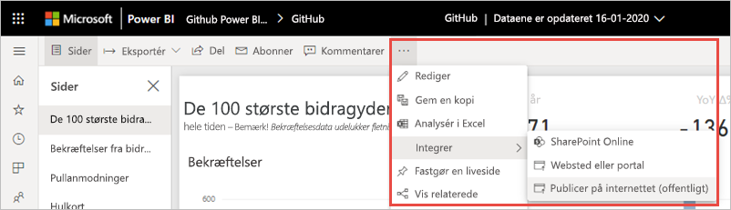
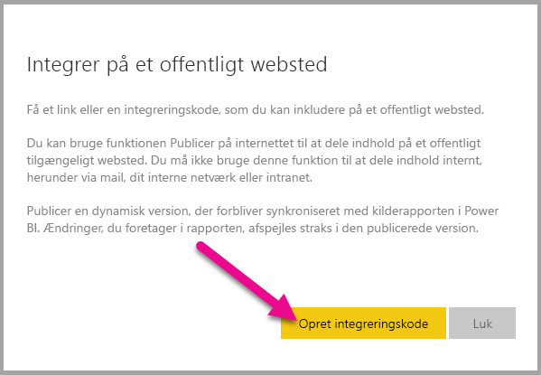
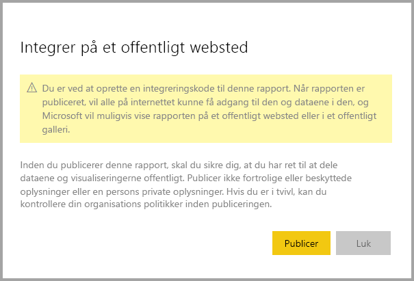
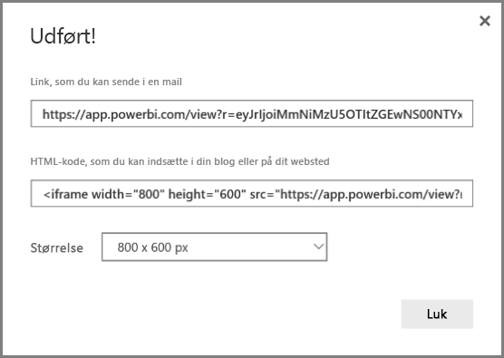
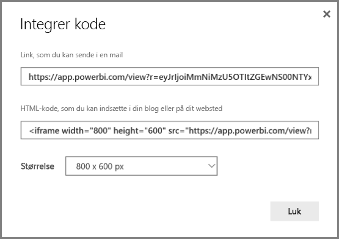
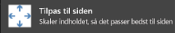
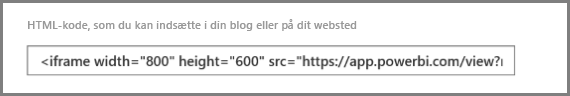
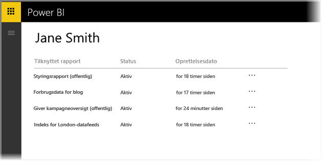
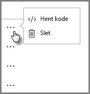
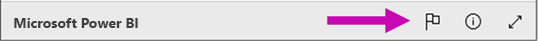

# Publicer på internettet fra Power BI

Med indstillingen **Publicer på internettet** i Power BI kan du nemt integrere interaktivt Power BI-indhold i blogindlæg, på websteder, i mail eller på de sociale medier. Du kan også nemt redigere, opdatere eller stoppe deling af dine publicerede visualiseringer.

> [!WARNING]
> Når du bruger **Publicer på internettet**, kan alle på internettet se den rapport eller det visuelle element, som du har publiceret. Visning kræver ingen godkendelse. Dette omfatter visning af data på detaljeniveau, der er aggregeret i dine rapporter. Inden du publicerer en rapport, skal du sikre dig, at du har ret til at dele dataene og visualiseringerne offentligt. Du må ikke publicere fortrolige eller beskyttede oplysninger. Hvis du er i tvivl, kan du kontrollere din organisations politikker inden publiceringen.

>[!Note]
>Du kan integrere dit indhold på en sikker måde på en intern portal eller et internt websted. Brug indstillingerne [Integrer](service-embed-secure.md) eller [Integrer i SharePoint Online](service-embed-report-spo.md). Disse indstillinger sikrer, at alle tilladelser og datasikkerhed håndhæves, når brugerne får vist dine interne data.

## Opret integreringskoder med Publicer på internettet

**Publicer på internettet** er tilgængelig for rapporter, som du kan redigere i dine personlige arbejdsområder eller gruppearbejdsområder.  Indstillingen er ikke tilgængelig for rapporter, der er delt med dig, eller dem, der bruger sikkerhed på rækkeniveau til at beskytte data. Se afsnittet [**Begrænsninger**](#limitations) herunder for at få vist en fuldstændig liste over situationer, hvor **Publicer på internettet** ikke understøttes. Gennemgå **advarslen** tidligere i denne artikel, før du bruger **Publicer på internettet**.

I følgende korte video kan du se, hvordan denne funktion virker. Prøv det derefter selv i nedenstående trin.

<iframe width="560" height="315" src="https://www.youtube.com/embed/UF9QtqE7s4Y" frameborder="0" allowfullscreen></iframe>

I fremgangsmåden nedenfor beskrives det, hvordan du bruger **Publicer på internettet**.

1. Åbn en rapport i et arbejdsområde, som du kan redigere, og vælg **Flere indstillinger (...)**   > **Integrer** > **Publicer på internettet (offentlig)** .

   
   
2. Hvis din Power BI-administrator ikke har gjort det muligt for dig at oprette integreringskoder, skal du muligvis kontakte vedkommende.

   
   
   Hvis du vil have hjælp til at finde den person, der kan aktivere Publicer på internettet i din organisation, kan du se [Sådan finder du Power BI-administratoren](#find-your-power-bi-administrator) senere i denne artikel.

3. Gennemse dialogboksens indhold, og vælg **Opret integreringskode**.

   

4. Gennemgå advarslen, som vises her, og bekræft, at det er i orden at integrere dataene på et offentligt websted. Vælg **Publicer**, hvis det er tilfældet.

   

5. Der vises en dialogboks med et link. Vælg linket for at sende det i en mail, eller kopiér HTML-filen. Du kan integrere linket i kode, f.eks. en iFrame-kode, eller indsætte det direkte på en webside eller i en blog.

   

6. Hvis du tidligere har oprettet en integreringskode for en rapport, og du vælger **Publicer på internettet**, kan du ikke se dialogboksene i trin 2-4. I stedet vises dialogboksen **Integreringskode**:

   

   Du kan kun oprette én integreringskode til hver enkelt rapport.

### Tip til visningstilstande

Når du integrerer indhold i et blogindlæg, skal det typisk passe inden for en bestemt skærmstørrelse.  Du kan tilpasse højden og bredden i iFrame-koden efter behov. Men du skal sikre, at din rapport passer inden for det angivne iFrame-område, så du skal også angive en passende visningstilstand, når du redigerer rapporten.

Følgende tabel indeholder vejledning om visningstilstanden, og hvordan den vises, når den er integreret.

| Visningstilstand | Sådan ser den ud, når den er integreret |
| --- | --- |
|  |**Tilpas til siden** beskytter sidehøjden og -bredden i din rapport. Hvis du indstiller siden til *dynamiske* forhold, f.eks. 16:9 eller 4:3, skaleres indholdet, så det passer inden for iFrame-koden. Ved integration i en iFrame kan brug af **Tilpas til siden** resultere i *letterboxing*, hvor en grå baggrund vises i iFrame-områder, efter at indholdet er skaleret til at passe inden for iFrame. Du minimerer letterboxing ved at angive passende højde og bredde for din iFrame. |
|  |**Faktisk størrelse** sikrer, at rapporten bevarer sin størrelse som angivet på rapportsiden. Dette kan medføre, at der vises rullepaneler i din iFrame. Angiv højden og bredden på iFrame for at undgå rullepaneler. |
|  |**Tilpas til bredde** sikrer, at indholdet fylder det vandrette område i din iFrame. Der vises stadig en kant, men indholdet skaleres til at bruge al tilgængelig vandret plads. |

### Tip til højde og bredde i iFrame

En integreringskode for **Publicer på internettet** ser ud som vist i følgende eksempel:

 
Du kan redigere bredden og højden manuelt for at sikre, at den er præcis, som du vil have den, så den passer på den side, du integrerer den på.

For at opnå en mere perfekt pasform kan du prøve at føje 56 pixel til højden på din iFrame for at imødekomme den aktuelle størrelse af den nederste linje. Hvis rapportsiden bruger den dynamiske størrelse, indeholder tabellen herunder nogle størrelser, du kan bruge til at opnå en tilpasning uden letterboxing.

| Forhold | Størrelse | Dimension (bredde x højde) |
| --- | --- | --- |
| 16:9 |Lille |640 x 416 px |
| 16:9 |Mellem |800 x 506 px |
| 16:9 |Stor |960 x 596 px |
| 4:3 |Lille |640 x 536 px |
| 4:3 |Mellem |800 x 656 px |
| 4:3 |Stor |960 x 776 px |

## Administrer integreringskoder

Når du har oprettet en integreringskode for **Publicer på internettet**, kan du administrere dine koder fra menuen **Indstillinger** i Power BI. Administration af integreringskoder gør det muligt at fjerne destinationens visuelle element eller rapport for en kode (hvilket gør integreringskoden ubrugelig) eller at hente integreringskoden.

1. Du administrerer dine integreringskoder for **Publicer på internettet** ved at åbne tandhjulet **Indstillinger** og vælge **Håndter indlejringskoder**.

   

2. Dine integreringskoder vises.

   

3. Du kan enten hente eller slette en integreringskode. Hvis du sletter den, deaktiveres links til rapporten eller det visuelle element.

   

4. Hvis du vælger **Slet**, bliver du bedt om en bekræftelse.

   

## Opdateringer af rapporter og data

Når du har oprettet din integreringskode for **Publicer på internettet** og deler den, opdateres rapporten med de ændringer, du foretager, og linket til integreringskoden bliver straks aktivt. Alle, der åbner linket, kan se den. Men efter denne indledende handling kan det dog vare to til tre timer, før opdateringer af rapporter eller visualiseringer bliver synlige for dine brugere. Se afsnittet [**Sådan fungerer det**](#howitworks) senere i denne artikel, hvis du vil vide mere. 

### Opdatering af data

Dataopdateringer afspejles automatisk i din integrerede rapport eller det visuelle element. Det kan tage ca. én time, før opdaterede data kan ses fra integreringskoder. Du kan deaktivere automatisk opdatering ved at vælge **Opdater ikke** i tidsplanen for det datasæt, der bruges af rapporten.  

## Power BI-visualiseringer

Power BI-visuals understøttes i **Publicer på internettet**. Når du bruger **Publicer på internettet**, behøver de brugere, som du deler din publicerede visualisering med, ikke at aktivere Power BI-visualiseringer for at få vist rapporten.

## Om kolonnen med status for integreringskoder

>[!Note]
>Gennemse de integreringskoder, du har publiceret ofte. Fjern alle dem, der ikke længere behøver at være tilgængelige offentligt.

Siden **Administrer integreringskoder** indeholder en statuskolonne. Som standard er integreringskoder **aktive**, men de kan også have en af de statusser, der er anført nedenfor.

| Status | Beskrivelse |
| --- | --- |
| **Aktiv** |Rapporten er tilgængelig, og internetbrugere kan få vist og interagere med den. |
| **Blokeret** |Indholdet af rapporten er i strid med [Power BI Servicebetingelser](https://powerbi.microsoft.com/terms-of-service). Microsoft har blokeret for det. Hvis du mener, at indholdet blev blokeret ved en fejl, kan du kontakte support. |
| **Understøttes ikke** |Rapportens datasæt bruger sikkerhed på rækkeniveau, eller en anden konfiguration, der ikke understøttes. Se afsnittet [**Begrænsninger**](#limitations) for at få vist en fuldstændig liste. |
| **Krænket** |Integreringskoden er ikke omfattet af den definerede lejerpolitik. Denne status finder typisk sted, når en integreringskode blev oprettet, og lejerindstillingen **Publicer på internettet** blev ændret for at udelade den bruger, der ejer integreringskoden. Hvis lejerindstillingen er deaktiveret, eller brugeren ikke længere har tilladelse til at oprette integreringskoder, vises status for eksisterende integreringskoder som **Krænket**. Se afsnittet [Find din Power BI-administrator](#find-your-power-bi-administrator) i denne artikel for at få flere oplysninger. |

## Rapportér et problem med indhold via Publicer på internettet

Hvis du vil rapportere et problem, der er relateret til indhold via **Publicer på internettet**, som er integreret på et websted eller en blog, skal du bruge **flagikonet** nederst i rapporten **Publicer på internettet**.

Du bliver bedt om at sende en mail til Microsoft med en beskrivelse af problemet. Microsoft evaluerer indholdet baseret på [Power BI Servicebetingelser](https://powerbi.microsoft.com/terms-of-service) og træffer de nødvendige foranstaltninger.

## Licensering

Du skal være Microsoft Power BI-bruger for at anvende **Publicer på internettet**. Læserne af din rapport behøver ikke at være Power BI-brugere.

## Sådan fungerer det (tekniske detaljer)

Når du opretter en integreringskode ved hjælp af **Publicer på internettet**, bliver rapporten synlig for brugere på internettet. Den er offentligt tilgængelig, så du kan forvente, at brugerne nemt kan dele rapporten via sociale medier på et senere tidspunkt. Når brugere får vist rapporten, enten ved at åbne den direkte offentlige URL-adresse eller se den integreret på en webside eller blog, cachelagrer Power BI rapportdefinitionen og resultaterne af de forespørgsler, der kræves for at få vist rapporten. Denne cachelagring sikrer, at tusindvis af samtidige brugere kan se rapporten, uden at det påvirker ydeevnen.

Cachen har en lang levetid. Hvis du opdaterer rapportdefinitionen (f.eks. hvis du ændrer dens visningstilstand) eller opdaterer rapportdataene, kan det tage cirka en time, før ændringerne afspejles i den version af rapporten, der ses af brugerne. Da hvert element og dataværdi cachelagres uafhængigt af hinanden, når en dataopdatering finder sted, kan der vises en kombination af aktuelle og tidligere værdier for en bruger. Det anbefales derfor, at du planlægger dit arbejde på forhånd og først opretter integreringskoden for **Publicer på internettet**, når du er tilfreds med indstillingerne. Hvis dine data opdateres, skal du minimere antallet af opdateringer og udføre opdateringerne uden for arbejdstiden.

## Find din Power BI-administrator

Power BI-administrationsportalen har indstillinger, der styrer, hvem der kan udgive på internettet. Du kan arbejde sammen med din organisations [Power BI-administrator](../admin/service-admin-role.md), hvis du vil ændre [lejerindstillingerne for Publicer på internettet](../admin/service-admin-portal.md#publish-to-web).

Mindre organisationer eller enkeltpersoner, der har tilmeldt sig Power BI, har muligvis endnu ikke en Power BI-administrator. Følg vores [proces for overtagelse af lejeradministrator](https://docs.microsoft.com/azure/active-directory/users-groups-roles/domains-admin-takeover). Når du har en Power BI-administrator, kan vedkommende aktivere oprettelse af integreringskoder for dig.

Etablerede organisationer har normalt allerede en Power BI-administrator. Personer med en af følgende roller kan fungere som Power BI-administrator:

- Globale administratorer
- Brugere med rollen Power BI-tjenesteadministrator i Azure Active Directory

Du skal [finde en af disse personer](https://docs.microsoft.com/office365/admin/admin-overview/admin-overview#who-has-admin-permissions-in-my-business) i organisationen og bede vedkommende om at opdatere [lejerindstillingerne for Publicer på internettet](../admin/service-admin-portal.md#publish-to-web) i administrationsportalen.

## Begrænsninger

**Publicer på internettet** understøttes for langt de fleste datakilder og rapporter i Power BI-tjenesten. Følgende typer rapporter understøttes dog ikke i øjeblikket eller er ikke tilgængelige med **Publicer på internettet**:

- Rapporter med sikkerhed på rækkeniveau.
- Rapporter, der bruger en vilkårlig Live Connection-datakilde, herunder Analysis Services Tabular, der hostes i det lokale miljø, Analysis Service Multidimensional og Azure Analysis Services.
- Rapporter, der bruger et [delt datasæt](../connect-data/service-datasets-across-workspaces.md), som er gemt i et andet arbejdsområde end rapporten.
- [Delte og certificerede datasæt](../connect-data/service-datasets-share.md).
- Rapporter, der er delt med dig direkte eller via en organisationsindholdspakke.
- Rapporter i et arbejdsområde, hvor du ikke er redigeringsmedlem.
- Visuelle "R"-elementer understøttes i øjeblikket ikke i **Publicer på internettet**-rapporter.
- Eksport af data fra visualiseringer i en rapport, som er publiceret på internettet.
- ArcGIS Maps til Power BI-visualiseringer.
- Rapporter med DAX-målinger på rapportniveau.
- Forespørgselsmodeller for enkeltlogon til data.
- Fortrolige eller beskyttede oplysninger.
- Muligheden for automatisk godkendelse, der er tilgængelig med indstillingen **Integrer** fungerer ikke sammen med Power BI JavaScript API. Til Power BI JavaScript API kan du bruge den strategi til integreringen, at [brugeren ejer dataene](../developer/embedded/embed-sample-for-your-organization.md).

## Næste trin

- [Webdel til rapporten SharePoint Online](service-embed-report-spo.md) 

- [Integrer en rapport på en sikker portal eller et websted](service-embed-secure.md)

Har du flere spørgsmål? [Prøv at spørge Power BI-community'et](https://community.powerbi.com/)

