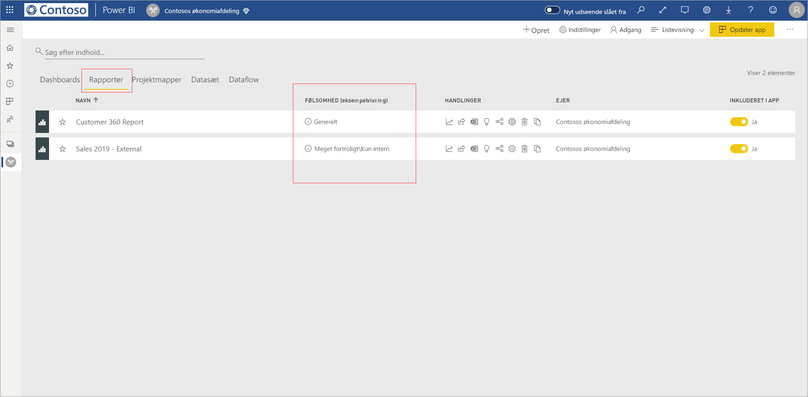
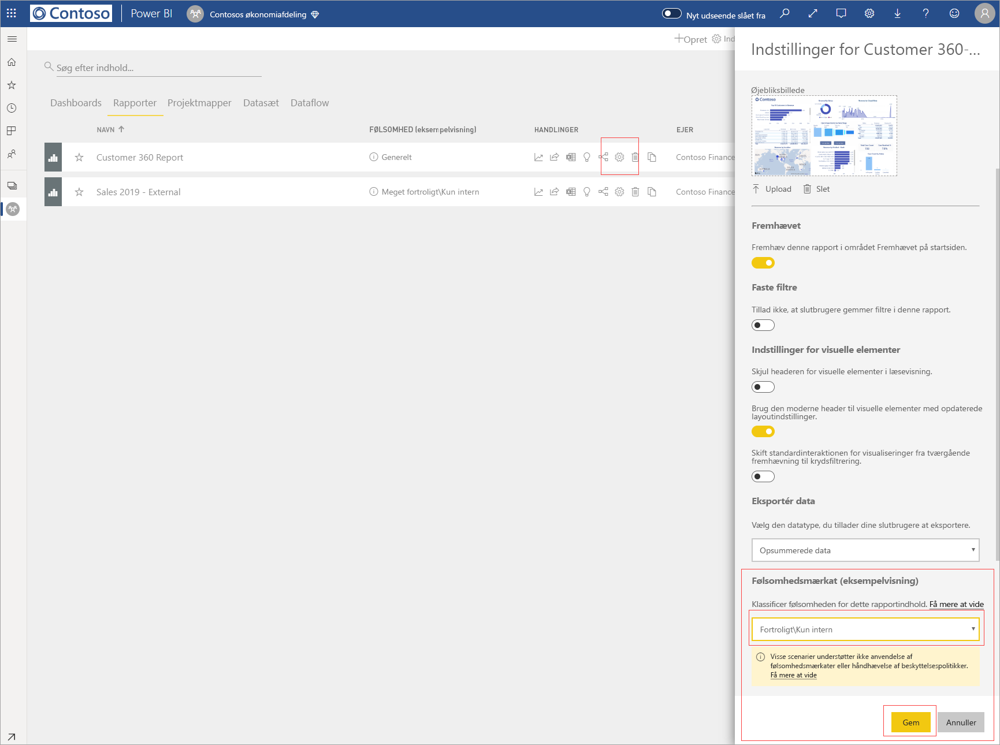
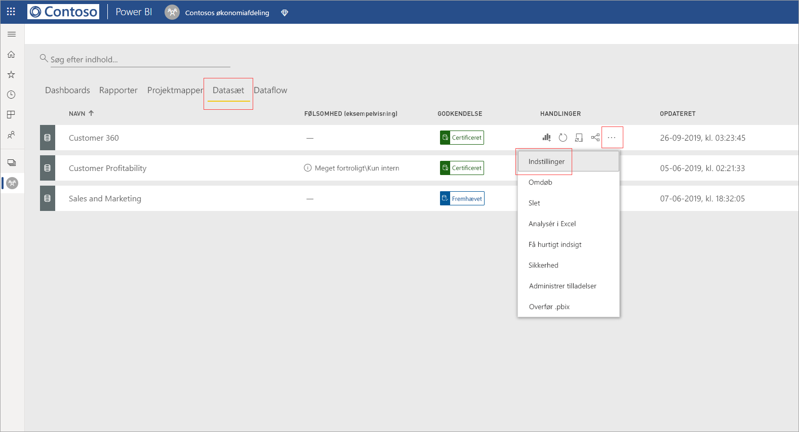
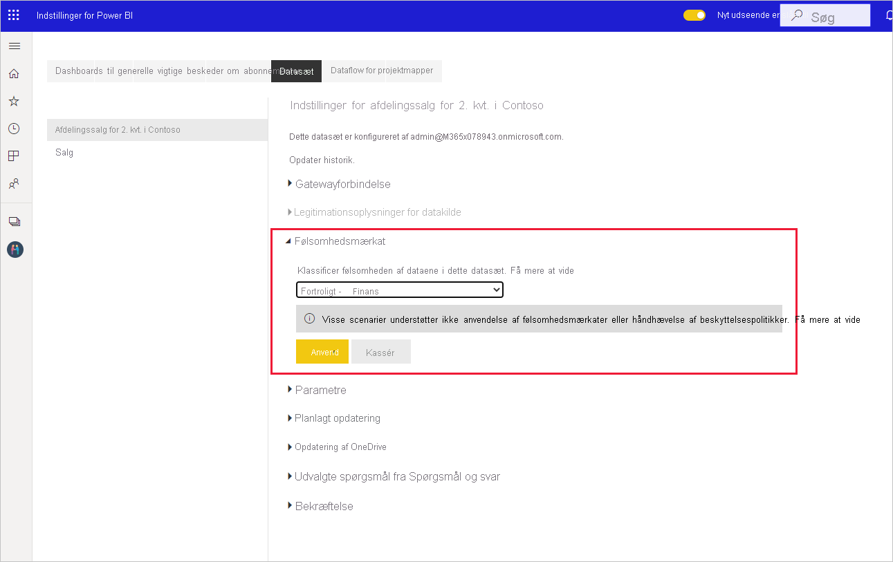
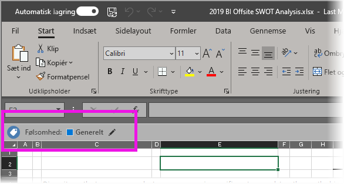

# Anvend datafølsomhedsmærkater i Power BI

Microsoft Information Protection-følsomhedsmærkater til dine rapporter, dashboards, datasæt og dataflows kan beskytte dit følsomme indhold mod uautoriseret adgang til data og lækage. Hvis du forsyner dine data med datafølsomhedsmærkater korrekt, sikrer du, at det kun er godkendte personer, som kan få adgang til dine data. I denne artikel kan du se, hvordan du anvender følsomhedsmærkater i dit indhold.

Sådan kan du anvende følsomhedsmærkater i Power BI:
* Du skal have en Power BI Pro-licens og redigeringstilladelser til det indhold, du vil forsyne med en mærkat.
* Du skal tilhøre en sikkerhedsgruppe, der har tilladelse til at anvende datafølsomhedsmærkater, som beskrevet i artiklen med titlen [Aktivér datafølsomhedsmærkater i Power BI](../admin/service-security-enable-data-sensitivity-labels.md#enable-data-sensitivity-labels).
* Alle [forudsætninger](../admin/service-security-data-protection-overview.md#requirements-for-using-sensitivity-labels-in-power-bi) og [licenskrav](../admin/service-security-data-protection-overview.md#licensing) skal være opfyldt.

Du kan få flere oplysninger om datafølsomhedsmærkater i Power BI under [Oversigt over databeskyttelse i Power BI](../admin/service-security-data-protection-overview.md).

## Datafølsomhedsmærkater

Når databeskyttelse er aktiveret på din lejer, vises følsomhedsmærkater i kolonnen med følsomhed i listevisningen af dashboards, rapporter, datasæt og dataflow.

**Sådan anvender eller ændrer du en følsomhedsmærkat på en rapport eller et dashboard**
1. Klik på **Flere indstillinger (...)** .
1. Vælg **Indstillinger**.
1. I ruden med indstillinger skal du vælge den relevante følsomhedsmærkat.
1. Gem indstillingerne.

Følgende billede illustrerer disse trin i en rapport

**Sådan anvender eller ændrer du en følsomhedsmærkat på et datasæt eller dataflow**

1. Klik på **Flere indstillinger (...)** .
1. Vælg **Indstillinger**.
1. I ruden med indstillinger skal du vælge den relevante følsomhedsmærkat.
1. Anvend indstillingerne.

De følgende to billeder illustrerer disse trin i et datasæt.

Vælg **Flere indstillinger (...)** og derefter **Indstillinger**.

Åbn afsnittet med følsomhedsmærkater på siden Indstillinger, vælg den ønskede følsomhedsmærkat, og klik på **Anvend**.

## Fjernelse af følsomhedsmærkater
Hvis du vil fjerne en følsomhedsmærkat fra en rapport, et dashboard, et datasæt eller et dataflow, skal du følge [samme fremgangsmåde som for at anvende mærkater](#applying-sensitivity-labels), men du kan vælge **(Ingen)** , når du bliver bedt om at klassificere dataenes følsomhed. 

## Databeskyttelse i eksporterede filer

Den databeskyttelse, der er knyttet til følsomhedsmærkater, anvendes kun på data, når de eksporteres til Excel-, PowerPoint- og PDF-filer. Det understøttes ikke for Analysér i Excel, eksport til .csv, overførsler af datasæt (.pbix), Power BI Service Live Connect eller andre eksportformater. Indstillinger for dataeksport styres af Power BI-lejeradministrator [eksportindstillinger](../service-admin-portal.md#export-and-sharing-settings).

Når du [eksporterer data fra en rapport](https://docs.microsoft.com/power-bi/consumer/end-user-export), der har en følsomhedsmærkat til en Excel-, PowerPoint- eller PDF-fil, nedarves følsomhedsmærkaten af den genererede fil. Følsomhedsmærkaten er synlig i filen, og adgangen til filen begrænses til dem, der har tilstrækkelige tilladelser.

## Overvejelser og begrænsninger

Følgende liste indeholder nogle begrænsninger for følsomhedsmærkater i Power BI:

**Generelt**
* Følsomhedsmærkater kan kun anvendes på dashboards, rapporter, datasæt og dataflow. De er i øjeblikket ikke tilgængelige til [sideinddelte rapporter](../paginated-reports/report-builder-power-bi.md) og projektmapper.
* Følsomhedsmærkater på Power BI-aktiver kan kun ses på listen over arbejdsområder og linjevisninger, Favoritter, Seneste og programvisninger. Mærkater er i øjeblikket ikke synlige i visningen Delt med mig. Bemærk dog, at en mærkat, som er anvendt på et Power BI-aktiv, altid bevares for data, der eksporteres til Excel-, PowerPoint- og PDF-filer, også selvom mærkaten ikke er synlig.
* Følsomhedsmærkater understøttes kun for lejere i det globale cloudmiljø (offentligt). Følsomhedsmærkater understøttes ikke for lejere i andre cloudmiljøer.
* Følsomhedsmærkater for data understøttes ikke for skabelonapps. Følsomhedsmærkater, der er angivet af opretteren af skabelonprogrammet, fjernes, når programmet udtrækkes og installeres. Følsomhedsmærkater, der føjes til artefakter i et installeret skabelonprogram af programbrugeren, mistes (nulstilles til ingenting), når programmet opdateres.
* Power BI understøtter ikke følsomhedsmærkater for beskyttelsestyperne [Videresend ikke](https://docs.microsoft.com/microsoft-365/compliance/encryption-sensitivity-labels?view=o365-worldwide#let-users-assign-permissions) og [brugerdefineret](https://docs.microsoft.com/microsoft-365/compliance/encryption-sensitivity-labels?view=o365-worldwide#let-users-assign-permissions) og [HYOK](https://docs.microsoft.com/azure/information-protection/configure-adrms-restrictions). Beskyttelsestyperne Videresend ikke og brugerdefineret henviser til de mærkater, der er defineret i [Microsoft 365 Security Center](https://security.microsoft.com/) eller [Microsoft 365 Compliance Center](https://compliance.microsoft.com/).

**Eksportér**
* Mærkat- og beskyttelseskontrolelementer gennemtvinges kun, når data eksporteres til Excel-, PowerPoint- og PDF-filer. Mærkat og beskyttelse gennemtvinges ikke, når data eksporteres til .csv- eller .pbix-filer, Analysér i Excel eller andre typer eksportstier.
* Anvendelse af et følsomhedsmærkat og beskyttelse til en eksporteret fil tilføjer ikke indholdsmarkering til filen. Men hvis mærkaten er konfigureret til at anvende indholdsmarkering, anvendes de automatisk af Azure Information Protection Unified-navngivningsklienten, når filen åbnes i Office Desktop-apps. Indholdsmærkaterne anvendes ikke automatisk, når du bruger indbygget navngivning til skrivebords-, mobil- eller webapps. Se [Når Office-apps anvender indholdsmarkering og kryptering](https://docs.microsoft.com/microsoft-365/compliance/sensitivity-labels-office-apps?view=o365-worldwide#when-office-apps-apply-content-marking-and-encryption) for at få flere oplysninger.
* En bruger, der eksporterer en fil fra Power BI, har tilladelse til at tilgå og redigere filen i henhold til indstillingerne for følsomhedsmærkaten. Den bruger, der eksporterer dataene, får ikke ejerens tilladelser til filen.
* Eksporten mislykkes, hvis en mærkat ikke kan anvendes, når der eksporteres data til en fil. Hvis du vil kontrollere, om eksporten mislykkedes, fordi mærkaten ikke kunne anvendes, skal du klikke på navnet på rapporten eller dashboardet i midten af titellinjen og se, om der står "Følsomhedsmærkat kan ikke indlæses" på den rulleliste, der åbnes. Dette kan ske, hvis den anvendte mærkat er blevet fjernet eller slettet af sikkerhedsadministratoren eller som følge af et midlertidigt systemproblem.

## Næste trin

Denne artikel indeholdt en beskrivelse af, hvordan du anvender datafølsomhedsmærkater i Power BI. Følgende artikler indeholder flere oplysninger om databeskyttelse i Power BI. 

* [Oversigt over databeskyttelse i Power BI](../admin/service-security-data-protection-overview.md)
* [Aktivér datafølsomhedsmærkater i Power BI](../admin/service-security-enable-data-sensitivity-labels.md)
* [Brug af Microsoft Cloud App Security-kontrolelementer i Power BI](../admin/service-security-using-microsoft-cloud-app-security-controls.md)