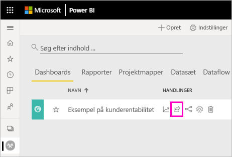
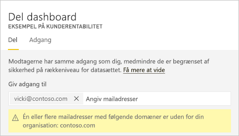
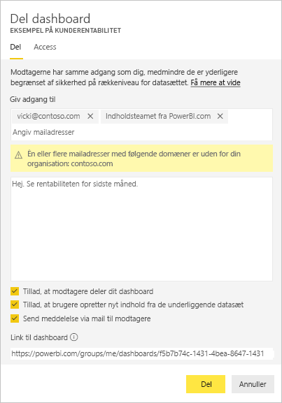
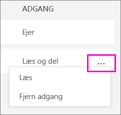
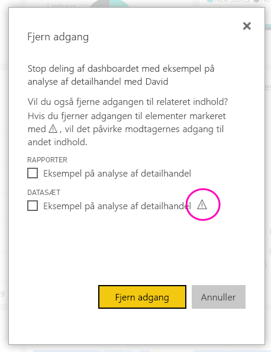
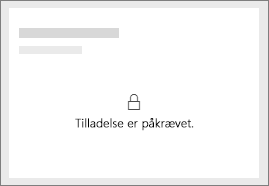
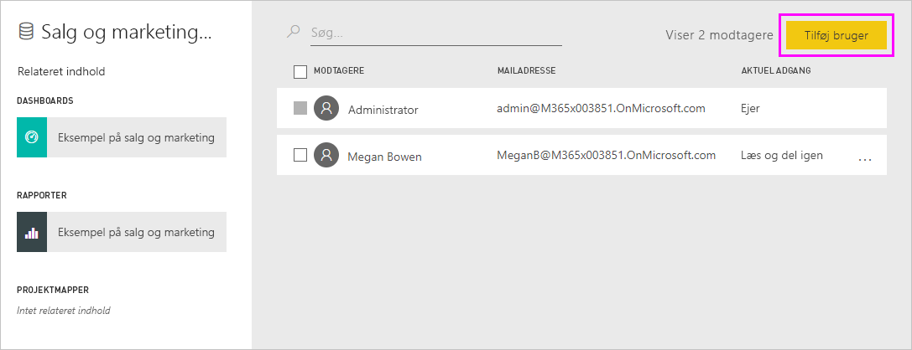
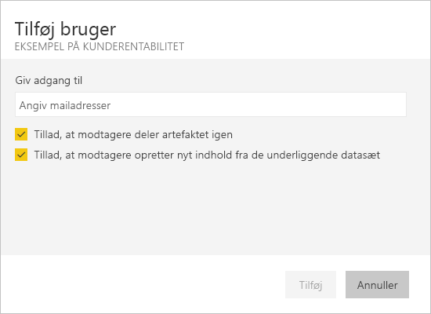

# Del Power BI-dashboards og -rapporter med kolleger og andre
*Deling* er velegnet til at give nogle få personer adgang til dine dashboards og rapporter. Med Power BI får du også [adskillige andre måder at samarbejde om og distribuere dashboards og rapporter på](service-how-to-collaborate-distribute-dashboards-reports.md).

Du skal bruge en [Power BI Pro-licens](../fundamentals/service-features-license-type.md), uanset om du deler indhold i eller uden for din organisation. Dine modtagere skal også bruge en Power BI Pro-licens, medmindre indholdet er i en [Premium-kapacitet](../admin/service-premium-what-is.md). 

Du kan dele dashboards og rapporter fra de fleste steder i Power BI-tjenesten: Favoritter, seneste, Mit arbejdsområde og delt med mig, hvis ejeren tillader det. Du kan også dele fra andre arbejdsområder, hvis du har rollen som [administrator, medlem eller bidragyder](service-new-workspaces.md#roles-in-the-new-workspaces) i arbejdsområdet. 

Når du deler et dashboard eller en rapport, kan de personer, du deler med, få det/den vist og interagere med det/den, men ikke redigere det/den. De kan se de samme data som dig i dashboardet eller rapporten, medmindre [sikkerhed på rækkeniveau (RLS)](../admin/service-admin-rls.md) anvendes. De kolleger, du deler med, kan også dele med deres kolleger, hvis du giver dem lov til det. Personer uden for organisationen kan få vist og interagere med dashboardet eller rapporten, men kan ikke dele det/den. 

Du kan ikke *dele* direkte fra Power BI Desktop. Du kan [publicere rapporter fra Power BI Desktop](../create-reports/desktop-upload-desktop-files.md) til Power BI-tjenesten. Du kan dog [dele et dashboard fra Power BI-mobilapps](../consumer/mobile/mobile-share-dashboard-from-the-mobile-apps.md).  

## Video: Del et dashboard
Se Amanda dele sit dashboard med kolleger i og uden for sin virksomhed. Følg derefter den trinvise vejledning under videoen for at prøve det selv.

<iframe width="560" height="315" src="https://www.youtube.com/embed/0tUwn8DHo3s?list=PL1N57mwBHtN0JFoKSR0n-tBkUJHeMP2cP" frameborder="0" allowfullscreen></iframe>

## Del et dashboard eller en rapport

1. Vælg **Del**  på en liste over dashboards eller rapporter eller i et åbent dashboard eller en åben rapport.

2. Angiv i det øverste felt de komplette mailadresser til enkeltpersoner, distributionsgrupper eller sikkerhedsgrupper. Du kan ikke dele med dynamiske distributionslister. 
   
   Du kan dele med brugere, hvis adresser er uden for din organisation, men du får vist en advarsel. Læs mere om [at dele uden for din organisation](#share-a-dashboard-or-report-outside-your-organization) i denne artikel.
   
    
 
   >[!NOTE]
   >Tekstfeltet understøtter højst 100 separate brugere eller grupper. Se [Del med flere end 100 brugere](#share-with-more-than-100-separate-users) i denne artikel for at få mere at vide om måder at dele med flere brugere på.

3. Tilføj en meddelelse, hvis du vil. Det er valgfrit.
4. Hvis du vil tillade dine kolleger at dele dit indhold med andre, skal du markere **Tillad, at modtagerne må dele dette dashboard (eller rapport)** .
   
   Det kaldes *gendeling* at give andre tilladelse til at dele. Hvis du giver dem tilladelse, kan de dele igen fra Power BI-tjenesten og mobilapperne eller videresende mailinvitationen til andre i din organisation. Invitationen udløber efter én måned. Personer uden for din organisation kan ikke dele igen. Som ejer af indholdet kan du slå videredeling fra eller tilbagekalde videredeling individuelt. Se [Stop eller rediger deling](#stop-or-change-sharing) i denne artikel.

5. Hvis du vælger **Tillad at brugerne opretter nyt indhold ved hjælp af de underliggende datasæt**, kan de oprette deres egne rapporter i andre arbejdsområder, der er baseret på datasættet for dette dashboard. Læs mere om [oprettelse af rapporter ud fra datasæt fra forskellige arbejdsområder](../connect-data/service-datasets-discover-across-workspaces.md).

1. Vælg **Del**.
   
     
   
   Power BI sender en mailinvitation til enkeltpersoner, men ikke til grupper, med et link til det delte indhold. Du kan se meddelelse om, at handlingen**blev udført**. 
   
   Når modtagere i din organisation klikker på linket, føjer Power BI dashboardet eller rapporten til siden med listen **Delt med mig**. De kan vælge dit navn for at få vist alt det indhold, du har delt med dem. 
   
   
   
   Når modtagere uden for din organisation klikker på linket, kan de se dashboardet eller rapporten, men ikke på den sædvanlige Power BI-portal. Læs mere om [at dele med personer uden for din organisation](#share-a-dashboard-or-report-outside-your-organization) i denne artikel.

## Se, hvem har adgang til et dashboard eller en rapport, som du har delt
Du har nogle gange brug for at få vist de personer, du har delt med, og hvem de har videredelt med.

1. Vælg **Del**  på listen over dashboards og rapporter eller på selve dashboardet eller i selve rapporten. 
2. Vælg **Adgang** i dialogboksen **Del dashboard** eller **Del rapport**.
   
    

    Personer uden for din organisation er anført som **Gæst**.

    I denne visning kan du [stoppe eller ændre delingstilladelser](#stop-or-change-sharing) i denne artikel. 

## Del et dashboard eller en rapport med personer uden for din organisation
Når du deler med personer uden for din organisation, modtager de en mail med et link til det delte dashboard eller den delte rapport. De skal logge på Power BI for at se, hvad du har delt. Hvis de ikke har en Power BI Pro-licens, kan de tilmelde sig en, når de klikker på linket.

Når de har logget på, kan de se det delte dashboard eller den delte rapport i et separat browservindue og ikke i deres normale Power BI-portal. Hvis de vil have adgang til dette dashboard eller denne rapport på et senere tidspunkt, skal de forsyne linket med et bogmærke.

De kan ikke redigere indhold i dette dashboard eller rapporten. De kan interagere med diagrammerne og skifte filtre eller udsnit, men de kan ikke gemme ændringer. 

Det er kun dine direkte modtagere, der kan se det delte dashboard eller den delte rapport. Hvis du f.eks. har sendt mailen til Vicki@contoso.com, er det kun Vicki, der kan se dashboardet. Ingen andre kan se dashboardet, selvom Vicki sender et link til dem. Vicki skal bruge den samme mailadresse for at få adgang til det. Hvis Vicki logger på med en anden mailadresse, har hun ikke adgang til dashboardet.

Personer uden for din organisation kan slet ikke se nogen data, hvis sikkerhed på rolle- eller rækkeniveau er implementeret på Analysis Services-tabelmodeller i det lokale miljø.

Brug en sikkerhedsgruppe, ikke en distributionsgruppe, til at dele med en gruppe, der omfatter personer med eksterne mailadresser. Personer med eksterne mails i en distributionsgruppe kan ikke se det indhold, du deler, medmindre de er Azure Active Directory (Azure AD) B2B-gæstebrugere. Få mere at vide om [Azure AD B2B-gæstebrugere](../admin/service-admin-azure-ad-b2b.md).

Hvis du sender et link fra en Power BI-mobilapp til personer uden for din organisation, åbnes dashboardet i en browser, når de klikker på linket, og ikke i Power BI-mobilappen.

### Tillad eksterne brugere at redigere indhold

Din Power BI-administrator kan tillade, at eksterne brugere kan redigere og administrere indhold i organisationen. Hvis det er tilfældet, kan dine eksterne brugere ikke kun forbruge indholdet. De kan også redigere og administrere indhold i din organisation. Få mere at vide om at [distribuere Power BI-indhold til eksterne gæstebrugere med Azure AD B2B](../admin/service-admin-azure-ad-b2b.md).

## Stop eller rediger deling
Det er kun ejeren af dashboardet eller rapporten, der kan slå videredeling til og fra.

### Hvis du ikke har sendt invitationen til deling endnu
* Fjern markeringen i afkrydsningsfeltet **Tillad, at modtagerne må dele dit dashboard (eller rapport)** nederst i invitationen, før du sender den.

### Hvis du allerede har delt dashboardet eller rapporten
1. Vælg **Del**  på listen over dashboards og rapporter eller på selve dashboardet eller i selve rapporten. 
2. Vælg **Adgang** i dialogboksen **Del dashboard** eller **Del rapport**.
   
    
3. Vælg ellipsen ( **...** ) ud for **Læs og del igen**, og vælg:
   
   
   
   * **Læs** for at forhindre vedkommende i at dele med andre.
   * **Fjern adgang** for at forhindre vedkommende i overhovedet at se det delte indhold.

4. I dialogboksen **Fjern adgang** skal du beslutte, om du også vil fjerne adgangen til relateret indhold som f.eks. rapporter og datasæt. Hvis du fjerner elementer med et advarselsikon , er det bedst at fjerne relateret indhold. I modsat fald vises det ikke korrekt.

    

## Begrænsninger og overvejelser
Ting, du skal være opmærksom på angående deling af dashboards og rapporter:

* Generelt kan se du og dine kolleger se de samme data på dashboardet eller i rapporten. Hvis du derfor har tilladelse til at se flere data, end de har, vil de kunne se alle dine data på dashboardet eller i rapporten. Men hvis [sikkerhed på rækkeniveau (RLS)](../admin/service-admin-rls.md) er anvendt på datasættet, der er underliggende for et dashboard eller en rapport, afgør den enkelte persons legitimationsoplysninger, hvilke data vedkommende kan få adgang til.
* Alle, som du deler dashboardet med, kan se det og interagere med de relaterede rapporter i [Læsevisning](../consumer/end-user-reading-view.md#reading-view). Generelt kan de ikke oprette rapporter eller gemme ændringer af eksisterende rapporter. Hvis du dog vælger **Tillad at brugerne opretter nyt indhold ved hjælp af de underliggende datasæt**, kan de oprette deres egne rapporter i andre arbejdsområder, der er baseret på datasættet for dette dashboard eller denne rapport.
* Selvom ingen kan se eller downloade datasættet, kan de få adgang til datasættet direkte ved hjælp af funktionen Analysér i Excel. En administrator kan begrænse muligheden for at bruge Analysér i Excel for alle i en gruppe. Begrænsningen er dog for alle i den pågældende gruppe og for hvert arbejdsområde, gruppen tilhører.
* Alle kan manuelt [opdatere dataene](../connect-data/refresh-data.md).
* Hvis du bruger Office 365 til mail, kan du dele med medlemmer af en distributionsgruppe ved at angive den mailadresse, der er knyttet til distributionsgruppen.
* Kolleger, der deler det samme maildomæne, og kolleger, hvis domæner er anderledes, men registreret i den samme lejer, kan dele dashboardet med andre. Lad os for eksempel antage, at domænerne contoso.com og contoso2.com er registreret i den samme lejer, og din mailadresse er konrads@contoso.com. Både ravali@contoso.com og gustav@contoso2.com kan dele dit dashboard, så længe du giver dem tilladelse til at dele.
* Hvis dine kolleger allerede har adgang til et bestemt dashboard eller en bestemt rapport, kan du sende et direkte link ved blot at kopiere URL-adressen, når du er på dashboardet eller i rapporten. For eksempel: `https://powerbi.com/dashboards/g12466b5-a452-4e55-8634-xxxxxxxxxxxx`.
* Hvis dine kolleger allerede har adgang til et bestemt dashboard, kan du på samme måde [sende et direkte link til den underliggende rapport](service-share-reports.md). 

### Del med flere end 100 separate brugere

Du kan dele med højst 100 brugere eller grupper i en enkelt delingshandling. Du kan imidlertid give mere end 500 brugere adgang til et element. Her er nogle forslag:

- Del flere gange ved at angive brugerne enkeltvist.
- Del med en brugergruppe, der indeholder alle brugerne. 
- Opret rapporten eller dashboardet i et arbejdsområde, og opret derefter en app fra arbejdsområdet. Du kan dele appen med mange flere personer. Læs mere om [publicering af apps i Power BI](service-create-distribute-apps.md).

## Fejlfinding af deling

### Mine dashboardmodtagere ser et låseikon i et felt eller en meddelelse med "Tilladelse påkrævet"

De personer, du deler med, kan få vist et låst felt i et dashboard eller meddelelsen "Tilladelse påkrævet", når de forsøger at få vist en rapport.

Her er du nødt til at give brugerne tilladelse til at tilgå det underliggende datasæt.

1. Gå til fanen **Datasæt** på listen over indhold.

1. Vælg ellipsen ( **...** ) ud for datasættet, og vælg derefter **Administrer tilladelser**.

    

1. Vælg **Tilføj bruger**.

    

1. Angiv de komplette mailadresser til enkeltpersoner, distributionsgrupper eller sikkerhedsgrupper. Du kan ikke dele med dynamiske distributionslister.

    

1. Vælg **Tilføj**.

### Jeg kan ikke dele et dashboard eller en rapport

Hvis du vil dele et dashboard eller en rapport, skal du have tilladelse til at dele det underliggende indhold igen, dvs. alle relaterede rapporter og datasæt. Hvis du får vist en meddelelse, hvor der står, at du ikke må dele, skal du bede rapportens forfatter om at give dig tilladelse til at dele rapporterne og datasættene igen.

## Næste trin

* [Hvordan kan jeg samarbejde på og dele dashboards og rapporter?](service-how-to-collaborate-distribute-dashboards-reports.md)
* [Del en filtreret Power BI-rapport](service-share-reports.md)
* Har du spørgsmål? [Prøv at spørge Power BI-community'et](https://community.powerbi.com/)
