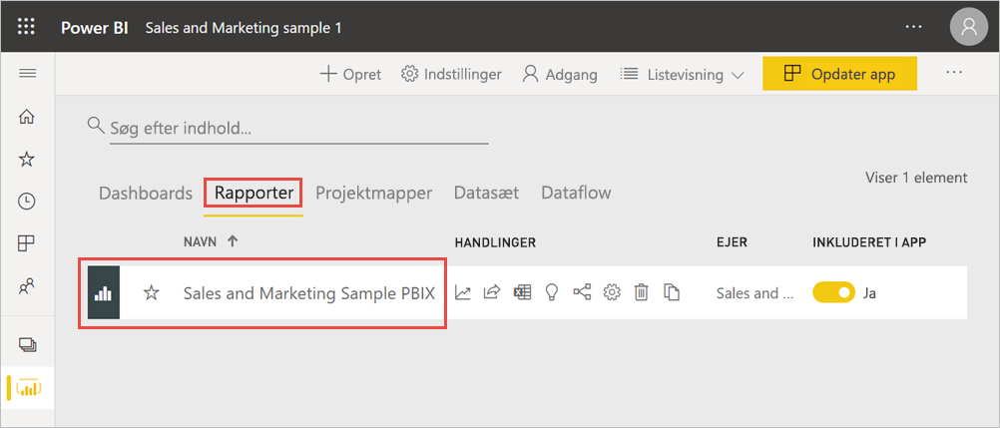
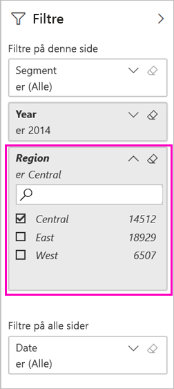
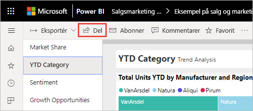
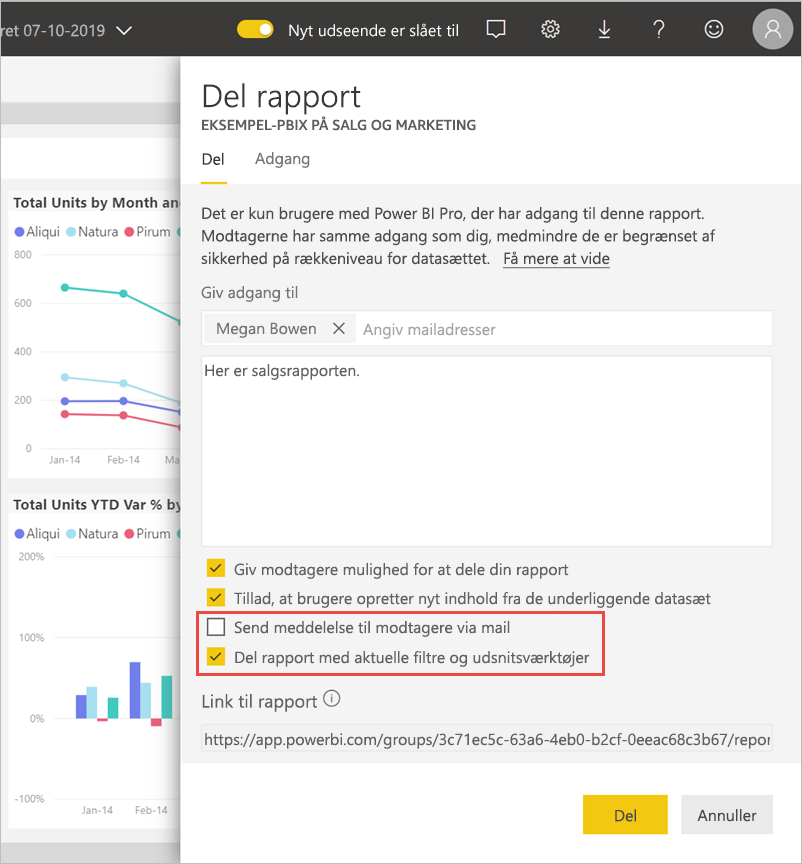
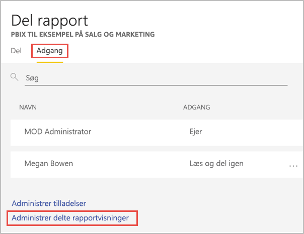

# Filtrer og del en Power BI-rapport
*Deling* er velegnet til at give nogle få personer adgang til dine dashboards og rapporter. Hvad nu hvis du vil dele en filtreret version af en rapport? Måske vil du have, at der kun vises data for en bestemt by eller sælger eller et bestemt år, i rapporten. I denne artikel forklares det, hvordan du filtrerer en rapport og deler den filtrerede version af rapporten. En anden måde at dele en filtreret rapport på er at [føje forespørgselsparametre til rapportens URL-adresse](service-url-filters.md). I begge tilfælde filtrers rapporten, når modtagerne åbner den. De kan rydde filtervalgene i rapporten.

Med Power BI får du [andre måder at samarbejde om og distribuere dine rapporter på](service-how-to-collaborate-distribute-dashboards-reports.md). Til deling skal du og dine modtagere bruge en [Power BI Pro-licens](../fundamentals/service-features-license-type.md), eller indholdet skal være i en [Premium-kapacitet](../admin/service-premium-what-is.md). 

## Følg med via eksempeldataene

I denne artikel bruges appen med eksempelskabelonen Marketing and Sales. Vil du prøve det? 

1. Installer [appen med eksempelskabelonen Marketing and Sales](https://appsource.microsoft.com/product/power-bi/microsoft-retail-analysis-sample.salesandmarketingsample?tab=Overview).
2. Vælg appen, og vælg **Udforsk app**.

   

3. Vælg blyantsikonet for at åbne det arbejdsområde, du installerede sammen med appen.

    

4. Vælge **Rapporter** på listen med indhold i arbejdsområdet, og vælg derefter rapporten **PBIX-eksempelfilen Sales and Marketing**.

    

    Nu er du klar til at følge med.

## Angiv et filter i rapporten

Åbn en rapport i [redigeringsvisning](../consumer/end-user-reading-view.md), og anvend et filter.

I dette eksempel filtrerer vi siden YTD Category i skabeloneksemplet Marketing & Sales for kun at få vist de værdier, hvor **Region** er lig med **Central**. 
 

Gem rapporten.

## Del den filtrerede rapport

1. Vælg **Del**.

   

2. Ryd **Send meddelelse via mail til modtagere**, så du kan sende et filtreret link i stedet ved at vælge **Del rapport med aktuelle filtre og udsnitsværktøjer**, og vælg derefter **Del**.

    

4. Vælg **Del** igen.

   

5. Vælg fanen **Adgang**, og vælg derefter **Administrer delte rapportvisninger**.

    

6. Højreklik på den ønskede URL-adresse, og vælg **Kopiér link**.

    

7. Når du deler dette link, kan modtagerne se din filtrerede rapport. 

## De næste trin
* [Måder at dele dit arbejde på i Power BI](service-how-to-collaborate-distribute-dashboards-reports.md)
* [Del et dashboard](service-share-dashboards.md)
* Har du flere spørgsmål? [Prøv Power BI-community'et](https://community.powerbi.com/).
* Har du feedback? Indsend dine forslag på [webstedet for Power BI-community'et](https://community.powerbi.com/).
