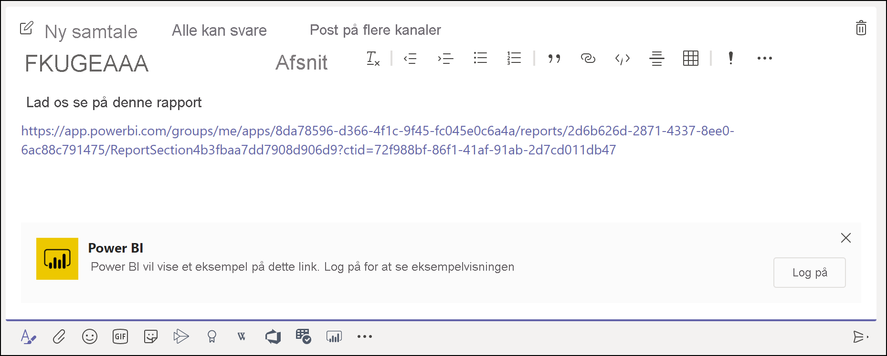
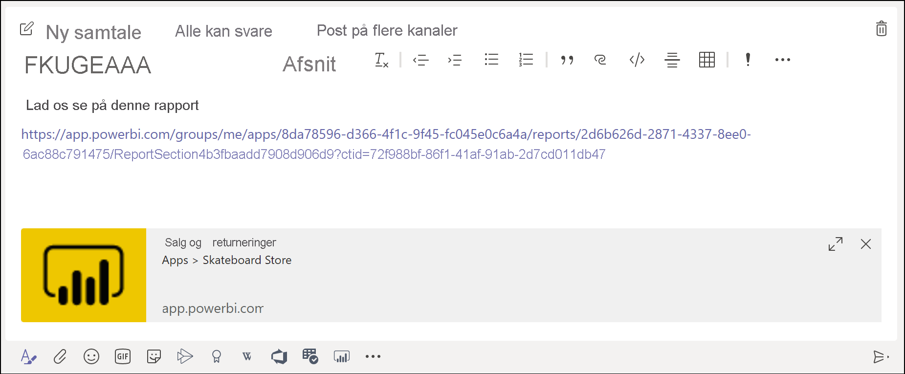
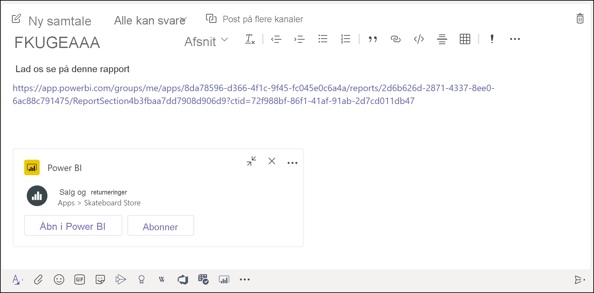

# Få vist et eksempel på et Power BI-link i Microsoft Teams

Når du indsætter et link til dine rapporter, dashboards og apps i Microsoft Teams-meddelelsesfeltet, viser der oplysninger om elementerne i linkeksempelet. Der er angivet linkeksempler for følgende elementer i Power BI:

- Rapporter
- Dashboards
- Apps

Tjenesten til linkeksempler kræver, at brugerne logger på. Hvis du vil logge af, skal du vælge **Power BI**-ikonet nederst i meddelelsesfeltet. Vælg derefter **Log af**.

Under [Samarbejd i Microsoft Teams med Power BI](service-collaborate-microsoft-teams.md) kan du se, hvordan Power BI og Teams arbejder sammen, herunder de krav, der skal være opfyldt.

## Få et linkeksempel

Følg disse trin for at få et linkeksempel af indhold i Power BI-tjenesten.

1. Kopiér et link til en rapport, et dashboard eller en app i Power BI-tjenesten. Du kan f.eks. kopiere linket fra browserens adresselinje.

1. Indsæt linket i meddelelsesfeltet i Microsoft Teams. Log på tjenesten til linkeksempler, hvis du bliver bedt om det. Du skal muligvis vente et par sekunder på, at linkeksemplet indlæses.

    

1. Det grundlæggende linkeksempel vises, når du er logget på.

    

1. Vælg ikonet **Udvid** for at få vist kortet med en detaljeret eksempelvisning.

    

1. Kortet med et detaljeret linkeksempel viser linket og de relevante handlingsknapper.

    

1. Send meddelelsen.

## Kendte problemer og begrænsninger

- Enkeltlogon understøttes ikke for tjenesten til linkeksempler.
- Linkeksempler fungerer ikke i forbindelse med mødechat eller private kanaler.
- I afsnittet [Kendte problemer og begrænsninger](service-collaborate-microsoft-teams.md#known-issues-and-limitations) i artiklen "Samarbejd i Microsoft Teams" kan du finde andre problemer.

## Næste trin

- [Samarbejd i Microsoft Teams med Power BI](service-collaborate-microsoft-teams.md)

Har du flere spørgsmål? [Prøv at spørge Power BI-community'et](https://community.powerbi.com/).
