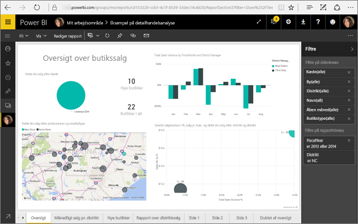
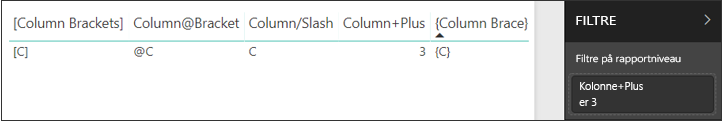

# <a name="filter-a-report-using-query-string-parameters-in-the-url"></a>Filtrer en rapport ved hjælp af parametre for forespørgselsstrengen i URL-adressen

Når du åbner en rapport i Power BI-tjenesten, har hver side i rapporten sin egen entydige URL-adresse. Hvis du vil filtrere denne rapportside, kan du bruge ruden Filtre på rapportcanvasset.  Eller du kan føje forespørgselsstrengparametre til URL-adressen for at filtrere rapporten. Du har måske en rapport, du vil vise til kollegaer, og du vil filtrere den på forhånd for dem. En måde, du kan filtrere på, er ved at starte med URL-standardadressen til rapporten, føje filterparametrene til URL-adressen og derefter sende hele den nye URL-adresse til dem via mail.


## <a name="uses-for-query-string-parameters"></a>Anvendelsesområder for forespørgselsstrengparametre

Forestil dig, at du arbejder i Power BI Desktop. Du vil gerne oprette en rapport, der indeholder links til andre Power BI-rapporter, men vil kun vise nogle af oplysningerne i de andre rapporter. Start med at filtrere rapporterne ved hjælp af forespørgselsstrengparametre, og gem URL-adresserne. Derefter skal du oprette en tabel i Desktop med de nye URL-adresser til rapporterne.  Derefter skal du publicere og dele rapporten.

Et andet anvendelsesområde for forespørgselsstrengparametre er ved oprettelse af en avanceret Power BI-løsning.  Ved hjælp af DAX kan der oprettes en rapport, der dynamisk genererer en URL-adresse til en filtreret rapport på baggrund af de valg, kunden foretager i den aktuelle rapport. Når kunderne vælger URL-adressen, får de kun vist de relevante oplysninger. 

## <a name="query-string-parameter-syntax-for-filtering"></a>Syntaks til parametre for forespørgselsstreng til filtrering

Med parametre kan du filtrere rapporten efter en eller flere værdier. Værdierne kan indeholde mellemrum eller specialtegn. Den grundlæggende syntaks er forholdsvis enkel. Start med URL-adressen til rapporten, tilføj et spørgsmålstegn, og tilføj derefter din filtersyntaks.

*URL*?filter=*Table*/*Field* eq '*value*'


* I navnene for **Tabel** og **Felt** skelnes der mellem store og små bogstaver, men ikke i **værdi**.
* Felter, der er skjult i rapportvisningen, kan stadig filtreres.

### <a name="reports-in-apps"></a>Rapporter i apps

Hvis du vil føje et filter for URL-adresse til en rapport i en app, er formateringen lidt anderledes. Links til rapporter i en app har en forespørgselsparameter (ctid), der føjes til URL-adressen. Adskil forespørgselsparametrene med et &-tegn. Bevar "?filter=", og flyt ctid-parameteren til slutningen af URL-adressen med et &-tegn foran. 

Som i dette eksempel:

app.powerbi.com/groups/me/apps/*app-id*/reports/*report-id*/ReportSection?filter=*Table*/*Field* eq '*value*'&ctid=*ctid*

### <a name="field-types"></a>Felttyper

Felttypen kan være et tal, dato og klokkeslæt eller streng, og typen skal stemme overens med den type, der er angivet i datasættet.  Du kan f.eks. ikke angive en tabelkolonne af typen "streng", hvis du skal finde dato og klokkeslæt eller en numerisk værdi i et datasæt, der er indstillet som en dato, f.eks. Table/StringColumn eq 1.

* **Strenge** skal være indeholdt i enkelte anførselstegn, f.eks. 'styringsnavn'.
* **Tal** kræver ingen særlig formatering. Se [numeriske datatyper](#numeric-data-types) i denne artikel for at få flere oplysninger.
* **Datoer og klokkeslæt** Se [Datodatatyper](#date-data-types) i denne artikel. 

Hvis det stadig er forvirrende, kan du fortsætte med at læse og vi undersøger det nærmere.  

## <a name="filter-on-a-field"></a>Filtrer på et felt

Lad os antage, at URL-adressen til rapporten er følgende.


Og vi kan se i vores kortvisualisering (ovenfor), at vi har butikker i North Carolina.

>[!NOTE]
>Dette eksempel er baseret på [eksemplet på detailhandelsanalyse](../create-reports/sample-datasets.md).
> 

Hvis du vil filtrere rapporten, så der kun vises data for butikker i "NC" (North Carolina), skal du tilføje følgende i URL-adressen:

?filter=Store/Territory eq 'NC'


>[!NOTE]
>*NC* er en værdi, som er lagret i feltet **Territory** i tabellen **Store**.
> 

Nu er rapporten filtreret for North Carolina, så alle visualiseringer på rapportsiden viser kun data for North Carolina.



## <a name="filter-on-more-than-one-value-in-a-field"></a>Filtrer efter mere end én værdi i et felt

Hvis du vil filtrere efter mere end én værdi i et enkelt felt, skal du bruge operatoren **in** i stedet for operatoren **and**. Syntaksen er:

*URL*?filter=*Table*/*Field* **in** ('*value1*', '*value2*')

Hvis du i dette eksempel vil filtrere rapporten, så der kun vises data for butikker i "NC" (North Carolina) eller "TN" (Tennessee), skal du føje følgende til URL-adressen:

?filter=Store/Territory in ('NC', 'TN')

Se tabellen[Operatorer](#operators) senere i artiklen for at få vist en liste over andre nyttige operatorer.

## <a name="filter-on-multiple-fields"></a>Filtrer på flere felter

Du kan også filtrere på flere felter ved at føje yderligere parametre til din URL-adresse. Lad os gå tilbage til vores oprindelige filterparameter.

```
?filter=Store/Territory eq 'NC'
```

Hvis du vil filtrere flere felter, skal du tilføje et "**and**" og et andet felt i samme format som ovenfor. Her er et eksempel.

```
?filter=Store/Territory eq 'NC' and Store/Chain eq 'Fashions Direct'
```

## <a name="operators"></a>Operatorer

Power BI understøtter mange operatorer ud over "**and**". I nedenstående tabel vises disse operatorer sammen med den indholdstype, de understøtter.

|operator  | definition | streng  | tal | Dato |  Eksempel|
|---------|---------|---------|---------|---------|---------|
|**and**     | og |  ja      | ja |  ja|  produkt/pris le 200 and pris gt 3,5 |
|**eq**     | er lig med |  ja      | ja   |  ja       | Adresse/By eq 'Redmond' |
|**ne**     | ikke lig med |   ja      | ja  | ja        |  Adresse/By ne 'London' |
|**ge**     |  større end eller lig med       | nej | ja |ja |  produkt/pris ge 10
|**gt**     | større end        |nej | ja | ja  | produkt/pris gt 20
|**le**     |   mindre end eller lig med      | nej | ja | ja  | produkt/pris le 100
|**lt**     |  mindre end       | nej | ja | ja |  produkt/pris lt 20
|**in\*\***     |  inklusive       | ja | ja |  ja | Studerende/alder in (27, 29)


\*\*Når du bruger **in**, kan værdierne til højre for **in** være en kommasepareret liste angivet i parenteser, eller det kan være et enkelt udtryk, der returnerer en samling.

### <a name="numeric-data-types"></a>Numeriske datatyper

Et URL-filter i Power BI kan inkludere tal i følgende formater.

|Taltype  |Eksempel  |
|---------|---------|
|**integer**     |   5      |
|**long**     |   5 L eller 5 l      |
|**double**     |   5,5 eller 55e-1 eller 0,55e+1 eller 5D eller 5d eller 0,5e1D eller 0,5e1d eller 5,5D eller 5,5d eller 55e-1D eller 55e-1d     |
|**decimal**     |   5 M eller 5 m eller 5,5 M eller 5,5 m      |
|**float**     | 5 F eller 5 f eller 0,5e1 F eller 0,5e-1 d        |

### <a name="date-data-types"></a>Datodatatyper

Power BI understøtter både OData V3 og V4 for datatyperne **Date** og **DateTimeOffset**. For OData V3 skal datoer være indeholdt i enkelte anførselstegn og have ordet DateTime foranstillet. Enkelte anførselstegn og ordet DateTime er ikke nødvendige i OData V4. 
  
Datoer repræsenteres vha. EDM-formatet (2019-02-12T00:00:00): Når du angiver en dato som ÅÅÅÅ-MM-DD, vil Power BI fortolke den som 'ÅÅÅÅ-MM-DDT00:00:00'. Sørg for, at måned og dag er to cifre, MM og DD.

Hvorfor er den forskel vigtig? Lad os sige, at du opretter en parameter for en forespørgselstreng af typen **Tabel/Dato gt "2018-08-03"** .  Inkluderer resultaterne 3. august 2018, eller starter de med 4. august 2018? Power BI oversætter din forespørgsel til **Table/Date gt '2018-08-03T00:00:00'** . Derfor omfatter resultaterne alle datoer, der har en tidsdel, der ikke er nul, da disse datoer ville være større end **'2018-08-03T00:00:00'.**

Der er andre forskelle mellem V3 og V4. OData V3 understøtter ikke datoer, kun DateTime. Så hvis du bruger V3-formatet, skal du kvalificere det med hele datoen og klokkeslættet. Datokonstanter, f.eks. "DateTime'2019-05-20'", understøttes ikke i V3-notation. Men du kan bare skrive den som "2019-05-20" i V4-notationen. Her er to tilsvarende filterforespørgsler i V3 og V4:

- OData V4-format: filter = Table/Date gt 2019-05-20
- OData V3-format: filter = Table/Date gt datetime'2019-05-20T00:00:00'


## <a name="special-characters-in-url-filters"></a>Specialtegn i URL-filtre

### <a name="special-characters-in-table-and-column-names"></a>Specialtegn i tabel- og kolonnenavne

Specialtegn og mellemrum i tabel- og kolonnenavne kræver yderligere formatering. Når din forespørgsel indeholder mellemrum, tankestreger eller andre tegn, der ikke er ASCII, skal du foranstille en *escape-kode*, der starter med et understregningstegn og et X ( **_x**) og derefter angive den firecifrede **Unicode** efterfulgt af endnu et understregningstegn. Hvis Unicode-værdien består af færre end fire tegn, skal du foranstille den med nuller. Her vises nogle eksempler.

|Identifikator  |Unicode-værdi  | Kode til Power BI  |
|---------|---------|---------|
|**Tabelnavn**     | Området er 0x20        |  Navn_x0020_på_x0020_tabel       |
|**Kolonne**@**tal**     |   @ er 0x40     |  Kolonne_x0040_tal       |
|**[Kolonne]**     |  [er 0x005B] er 0x005D       |  _x005B_Column_x005D_       |
|**Kolonne+Plus**     | + er 0x2B        |  Kolonne_x002B_Plus       |

Navn_x0020_på_x0020_tabel/Kolonne_x002B_Plus eq 3 


Tabel_x0020_specialtegn/_x005B_Kolonne_x0020_Kantparenteser_x005D_ eq '[C]' 

### <a name="special-characters-in-values"></a>Specialtegn i værdier

Filtre for URL-adresser understøtter allerede alle specialtegn i feltværdier undtagen enkelt anførselstegn ('). Det er det eneste tegn, du skal angive "escape" for. Hvis du vil søge efter et enkelt anførselstegn, skal du bruge to enkelte anførselstegn (''). 

Eksempel:

- `?filter=Table/Name eq 'O''Brien'` bliver: 

    :::image type="content" source="media/service-url-filters/power-bi-url-filter-obrien.png" alt-text="Navnet er O'Brien":::

- `?filter=Table/Name eq 'Lee''s Summit'` bliver:

    :::image type="content" source="media/service-url-filters/power-bi-url-filter-lees.png" alt-text="Lees møde":::

- `in`-operatoren understøtter også denne angivelse af "escape": `?filter=Table/Name in ('Lee''s Summit', 'O''Brien')` bliver:

    :::image type="content" source="media/service-url-filters/power-bi-url-filter-in.png" alt-text="Lees møde eller O'Brien":::

## <a name="use-dax-to-filter-on-multiple-values"></a>Brug DAX til at filtrere efter flere værdier

En anden metode til at filtrere på flere felter er at oprette en beregnet kolonne, som sammenkæder to felter til en enkelt værdi. Derefter kan du filtrere på denne værdi.

Vi har f.eks. to felter: Territory og Chain. [Opret en ny beregnet kolonne](../transform-model/desktop-tutorial-create-calculated-columns.md) (felt) med navnet TerritoryChain i Power BI Desktop. Husk, at navnet på **Felt** ikke må indeholde mellemrum. Her er DAX-formlen for den pågældende kolonne.

TerritoryChain = [Territory] & " - " & [Chain]

Publicer rapporten på Power BI-tjenesten, og brug derefter URL-forespørgselsstrengen til at filtrere og kun vise data for Lindseys-butikker i NC.

    https://app.powerbi.com/groups/me/reports/8d6e300b-696f-498e-b611-41ae03366851/ReportSection3?filter=Store/TerritoryChain eq 'NC – Lindseys'

## <a name="pin-a-tile-from-a-filtered-report"></a>Fastgør et felt fra en filtreret rapport

Når du har filtreret rapporten ved hjælp af parametre for forespørgselsstrengen, kan du kan fastgøre visualiseringer fra denne rapport til dit dashboard.  Feltet på dashboardet viser de filtrerede data, og når dette dashboardfelt vælges, åbnes den rapport, der blev brugt til at oprette det.  Den filtrering, du udførte ved hjælp af URL-adressen, gemmes dog ikke i rapporten. Når du vælger dashboardfeltet, åbnes rapporten i ufiltreret tilstand.  De data, der vises på dashboardfeltet, svarer derfor ikke til de data, der vises i rapportvisualiseringen.

Denne uoverensstemmelse er nyttig, når du vil se forskellige resultater: filtreret på dashboardet og ufiltreret i rapporten.

## <a name="considerations-and-troubleshooting"></a>Overvejelser og fejlfinding

Der er et par ting, du skal være opmærksom på, når du bruger parametre for forespørgselsstrengen.

* Når du bruger operatoren *in*, skal værdierne til højre for *in* være en kommasepareret liste angivet i parenteser.    
* Power BI-rapportserver understøtter også muligheden for at angive yderligere filtre ved hjælp af URL-parameteren "filter". Her er et eksempel på, hvordan URL-adressen kan se ud i Power BI-rapportserver: `https://reportserver/reports/powerbi/Store Sales?rs:Embed=true&filter= Store/Territory eq 'NC' and Store/Chain eq 'Fashions Direct'`
* URL-adresse-filtre for rapporter har en grænse på 10-udtryk (10 filtre, der er forbundet med OG).
* Datatypen long er (2^53-1) på grund af begrænsninger i JavaScript.

URL-filtre understøttes i nogle integrationsscenarier og ikke i andre.

- [Integration af en rapport i en sikker portal eller et sikkert websted](service-embed-secure.md) understøttes.
- URL-filtre understøttes i Power BI Embedded. Se [Avancerede filterfunktioner for URL-adresser i Power BI Embedded](https://azure.microsoft.com/updates/power-bi-embedded-advanced-url-filtering-capabilities) for at få flere oplysninger.
- Filtrering af forespørgselsstrengen fungerer ikke sammen med [Publicer på internettet](service-publish-to-web.md) eller [Eksportér til PDF](../consumer/end-user-pdf.md).
- [Integrer med rapportwebdelen i SharePoint Online](service-embed-report-spo.md) understøtter ikke URL-adressefiltre.
- Teams tillader ikke angivelse af en URL-adresse.

## <a name="next-steps"></a>Næste trin

[Fastgør en visualisering til et dashboard](../create-reports/service-dashboard-pin-tile-from-report.md)  
[Tilmeld dig en gratis prøveversion](https://powerbi.microsoft.com/get-started/)

Har du flere spørgsmål? [Prøv at spørge Power BI-community'et](https://community.powerbi.com/)


