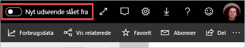

# Tilmed dig det nye udseende af arbejdsområder (prøveversion)

Arbejdsområder har fået et nyt udseende, der falder sammen med Power BI-tjenestens [nye udseende](../service-new-look.md). Alle der bruger Power BI-tjenesten (app.powerbi.com) kan tilmelde sig. Når du aktiverer det **nye udseende** på den sorte overskriftslinje, vælger du det nye udseende for rapporter og arbejdsområder. Alle arbejdsområder, både klassiske og nye, kan drage fordel af det nye udseende.

Leder du efter oplysninger om det nye udseende af **Power BI Desktop**? Se under [Brug det opdaterede bånd i Power BI Desktop](../desktop-ribbon.md).

## Funktioner i det nye udseende

:::image type="content" source="media/service-workspaces-new-look/power-bi-workspace-new-look-numbered.png" alt-text="Det nye udseende til arbejdsområder med billedforklaringsnumre":::

|Tal  |Sådan fungerer det |
|---------|---------|
|    | **Hent data**: Det er lettere at føje indhold til dit arbejdsområde. Vælg knappen **+ Ny** for at oprette forbindelse til data, åbne filer og oprette rapporter, dashboards med mere.  |
|   | **Få vist skifter**: Hvis du vil se forbindelserne mellem dataflow, datasæt, rapporter og dashboards og deres forbindelser til andre datakilder, skal du skifte mellem visningerne **Liste** og **Afstamning**. |
|  | **Søg i et arbejdsområde**: Søg i alt indhold i et arbejdsområde ved hjælp af det nye søgefelt.  |
|   | **Liste og faner**: Alt indhold i et arbejdsområde vises på en simpel liste over dashboards, rapporter, datasæt osv., f.eks. SharePoint. Du åbner ikke længere et arbejdsområde på en potentielt tom **Dashboards**-fane og undrer dig over, hvor dit indhold er. Her er den nye fanerækkefølge:  **Alle**: Viser alt indhold (dashboards, rapporter, projektmapper, sideinddelte rapporter, datasæt og dataflow) i arbejdsområdet.  **Indhold**: Indsamler alt indhold, der er oprettet til forbrug (dashboards, rapporter, projektmapper og sideinddelte rapporter) i arbejdsområdet.  **Datasæt + dataflow**: Samler alle datasæt og dataflow i arbejdsområdet til lettere dataadministration. |
|  | **Filtre**: I forbindelse med arbejdsområder med hundredvis af artefakter kan du filtrere indholdet i ruden Filtre. Når et filter er anvendt, kan du se filteret oven på indholdslisten. |

**Hurtige handlinger**: Når du holder markøren over indholdet på listen, kan du se de mest almindelige handlinger for det pågældende element plus andre, der er tilgængelige i menuen **Flere muligheder** (...).

:::image type="content" source="media/service-workspaces-new-look/power-bi-workspace-new-look-quick-actions.png" alt-text="Hurtige handlinger i det nye arbejdsområde":::

## Tilmeld dig det nye udseende

Alle brugere af Power BI-tjenesten kan vælge det nye udseende. Du skal blot skubbe **Nyt udseende fra** til **Nyt udseende til**.

Hvis du har brug for at vende tilbage til det gamle udseende, skal du blot skubbe tilbage til **fra** for . Hvis du ikke kan se indstillingen, skal du vælge ellipsemenuen i øverste højre hjørne.

## Næste trin

- [Brug det opdaterede bånd i Power BI Desktop](../desktop-ribbon.md)
- [Det "nye udseende" af Power BI-tjenesten](../service-new-look.md)
- Har du spørgsmål? [Prøv at spørge Power BI-community'et](https://community.powerbi.com/)

