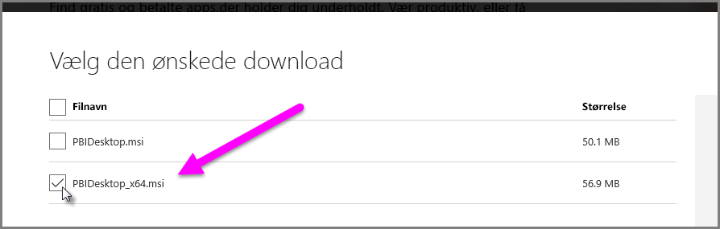

# Fejlfind import af .xls-filer i Access og Excel i Power BI Desktop

I Power BI Desktop bruger både Access-databaser og tidligere versioner af Excel-projektmapper (.xls-filer af typen Excel 97-2003) *Access-databaseprogrammet*. Der er tre almindelige situationer, som kan forhindre Access-databaseprogrammet i at fungere korrekt.

## Situation 1: Der er ikke installeret noget Access-databaseprogram

Hvis der i fejlmeddelelsen i Power BI Desktop står, at Access-databaseprogrammet ikke er installeret, skal du installere den version af Access-databaseprogrammet, enten 32-bit eller 64-bit, der svarer til din version af Power BI Desktop. Du kan installere Access-databaseprogrammet fra [downloadsiden](https://www.microsoft.com/download/details.aspx?id=13255).

>[!NOTE]
>Hvis den installerede version af Access-databaseprogrammet har en anden bit-version end din installation af Microsoft Office, kan Office-programmerne ikke bruge Access-databaseprogrammet.

## Situation 2: Bit-versionen (32-bit eller 64-bit) af Access-databaseprogrammet er forskellig fra bit-versionen af Power BI Desktop

Denne situation opstår ofte, når den installerede version af Microsoft Office er 32-bit, og den installerede version af Power BI Desktop er 64-bit. Det modsatte kan også forekomme, og i begge tilfælde vil der være en uoverensstemmelse mellem bit-versionerne. Hvis du bruger et Microsoft 365-abonnement, skal du se [Situation 3](#situation-3-trouble-using-access-or-xls-files-with-a-microsoft-365-subscription) for at se et andet problem og en anden løsning. En af følgende løsninger kan løse problemet med uoverensstemmende bit-versioner:

### Løsning 1

Skift versionen af Power BI Desktop, så den svarer til bit-versionen af din Microsoft Office-installation. 

1. Du kan ændre bit-versionen af Power BI Desktop ved at fjerne Power BI Desktop og derefter installere den version af Power BI Desktop, der svarer til din installation af Office. 

1. Du vælger en version af Power BI Desktop ved at vælge **Avancerede downloadindstillinger** på downloadsiden til Power BI Desktop.
   
   
   
1. Vælg dit sprog på den downloadside, der vises, og vælg derefter knappen **Download**. 
 
1. På den viste skærm skal du markere afkrydsningsfeltet ud for PBIDesktop.msi for 32-bit versionen eller PBIDesktop_x64.msi for 64-bit versionen. 

   På følgende skærmbillede er 64-bit versionen valgt.
   
   
   
   >[!NOTE]
   >Hvis du bruger 32-bit versionen af Power BI Desktop, og du opretter meget store datamodeller, kan du opleve problemer med manglende hukommelse.

### Løsning 2

Skift bit-versionen af Microsoft Office, så den svarer til bit-versionen af din Power BI Desktop-installation:

1. Fjern Microsoft Office

2. Installér den version af Office, der stemmer overens med din Power BI Desktop-installation.

### Løsning 3

Hvis fejlen opstår under forsøg på at åbne en .xls-fil (en Excel 97-2003-projektmappe), kan du undgå at bruge Access-databaseprogrammet ved at åbne .xls-filen i Excel og gemme den som en .xlsx-fil.

### Løsning 4

Hvis de foregående tre løsninger ikke er brugbare, er det muligt at installere begge versioner af Access-databaseprogrammet. Denne løsning anbefales dog ikke. Selvom installation af begge versioner kan løse problemet for Power Query til Excel og Power BI Desktop, medfører det fejl og problemer for alle programmer, der automatisk (som standard) bruger den bit-version af Access-databaseprogrammet, som blev installeret først. 

Hvis du vil installere begge bit-versioner af Access-databaseprogrammet, skal du følge disse trin:

1. Installér begge bit-versioner af Access-databaseprogrammet fra [downloadsiden](https://www.microsoft.com/download/details.aspx?id=13255). 

1. Kør hver version af Access-database programmet ved at bruge parameteren */passive*. Eksempel:
   
       c:\users\joe\downloads\AccessDatabaseEngine.exe /passive
   
       c:\users\joe\downloads\AccessDatabaseEngine_x64.exe /passive

## Situation 3: Problemer med at bruge Access- eller .xls-filer med et Microsoft 365-abonnement

Hvis du bruger et Microsoft 365-abonnement, uanset om det er **Office 2013** eller **Office 2016**, er udbyderen af Access-databaseprogrammet registreret på en virtuel placering i registreringsdatabasen, som *kun* Microsoft Office-processer har adgang til. Miksprogrammet (der er ansvarlig for at køre Excel, som ikke er i Office 365, og Power BI Desktop, som ikke er en Office-proces) kan ikke bruge udbyderen af Access-databaseprogrammet.

Du kan løse problemet ved at [downloade og installere den videredistribuerbare version af Access-databaseprogrammet](https://www.microsoft.com/download/details.aspx?id=13255), der stemmer overens med bit-versionen af din installation af Power BI Desktop. Du kan finde flere oplysninger om bit-versioner i de tidligere afsnit i denne artikel.

## Andre situationer, der kan medføre importproblemer

Vi bestræber os på at dække så mange af de problemer, der kan opstå i forbindelse med Access- og .xls-filer, som muligt. Hvis der opstår et problem, som ikke er beskrevet i denne artikel, kan du sende et spørgsmål om problemet til [Support til Power BI](https://powerbi.microsoft.com/support/). Vi kigger jævnligt på problemer, der kan påvirke mange kunder, og inkluderer dem i vores artikler.

