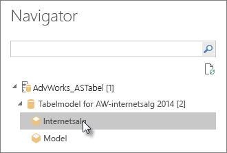

# Opret forbindelse til Analysis Services-tabeldata i Power BI Desktop
Med Power BI Desktop er der to måder, du kan oprette forbindelse til og hente data fra dine SQL Server Analysis Services-tabelmodeller: Du kan udforske ved hjælp af en direkte forbindelse, eller du kan vælge elementer og importere dem til Power BI Desktop.

Lad os se nærmere på det.

**Udforsk ved hjælp af en direkte forbindelse**: Når du bruger en direkte forbindelse, vises elementer i din tabelmodel eller dit tabelperspektiv, f.eks. tabeller, kolonner og målinger, på listen **Felter** i Power BI Desktop. Du kan bruge Power BI Desktops avancerede visualiserings- og rapportværktøjer til at udforske din tabelmodel på nye, meget interaktive måder.

Der importeres ingen data fra tabelmodellen i Power BI Desktop, når du opretter en direkte forbindelse. Hver gang du interagerer med en visualisering, sendes der en forespørgsel i Power BI Desktop til tabelmodellen, og det resultat, du får vist, beregnes. Du får altid vist de nyeste data i tabelmodellen. De stammer enten fra den seneste behandling eller fra DirectQuery-tabeller i tabelmodellen. 

Husk på, at tabelmodeller er meget sikre. Elementer, der vises i Power BI Desktop, afhænger af dine tilladelser for den tabelmodel, du har oprettet forbindelse til.

Når du har oprettet dynamiske rapporter i Power BI Desktop, kan du dele dem ved at publicere dem på dit Power BI-websted. Når du publicerer en Power BI Desktop-fil med en direkte forbindelse i en tabelmodel på dit Power BI websted, skal en administrator have installeret og konfigureret en datagateway i det lokale miljø. Du kan finde flere oplysninger under [Datagateway i det lokale miljø](service-gateway-onprem.md).

**Vælg elementer, og importér til Power BI Desktop**: Når du opretter forbindelse ved hjælp af denne indstilling, kan du vælge elementer som tabeller, kolonner og målinger i din tabelmodel eller dit tabelperspektiv og indlæse dem i en Power BI Desktop-model. Brug Power BI Desktops Power Query-editor til yderligere at forme det, du ønsker, og dens modelleringsfunktioner for yderligere at udforme dataene. Da der ikke vedligeholdes en direkte forbindelse mellem Power BI Desktop, og tabelmodellen, kan du derefter udforske din Power BI Desktop-model offline eller publicere Power BI-websted.

## Sådan opretter du forbindelse til en tabelmodel
1. Vælg **Hent data** > **Mere** > **Database** på fanen **Hjem** i Power BI Desktop.
   
1. Vælg **SQL Server Analysis Services-database**, og vælg derefter **Opret forbindelse**.
   
   
3. Angiv serverens navn under **Server** i vinduet **SQL Server Analysis Services-database**, vælg en forbindelsestilstand, og vælg derefter **OK**.
   
   
4. Dette trin i vinduet **Navigator** afhænger af den valgte forbindelsestilstand:

   - Hvis du opretter forbindelse direkte, skal du vælge en tabelmodel eller et tabelperspektiv.
  
      
   - Hvis du vil vælge elementer og hente data, skal du vælge en tabel model eller et perspektiv og derefter vælge en bestemt tabel eller kolonne, der skal indlæses. Hvis du vil forme dataene før indlæsning, skal du vælge **Rediger forespørgsler** for at åbne Power Query-editoren. Når du er færdig, skal du klikke på **Indlæs** for at importere dataene i Power BI Desktop.

      

## Ofte stillede spørgsmål
**Spørgsmål:** Har jeg brug for en datagateway i det lokale miljø?

**Svar:** I nogle tilfælde. Hvis du bruger Power BI Desktop til at oprette direkte forbindelse til en tabelmodel, men ikke har planer om at publicere på dit Power BI-websted, behøver du ikke en gateway. Hvis du derimod vil publicere på dit Power BI-websted, er en datagateway nødvendig for at sikre sikker kommunikation mellem Power BI-tjenesten og Analysis Services-serveren i det lokale miljø. Husk at tale med administratoren af Analysis Services-serveren, før du installerer en datagateway.

Hvis du vælger Vælg elementer, og hent data, importerer du data fra tabelmodellen direkte i Power BI Desktop-filen, så en gateway er ikke nødvendig.

**Spørgsmål:** Hvad er forskellen mellem at oprette direkte forbindelse til en tabelmodel fra Power BI-tjenesten i forhold til at oprette direkte forbindelse fra Power BI Desktop?

**Svar:** Når du opretter direkte forbindelse mellem en tabelmodel fra dit websted i Power BI tjenesten og en Analysis Services-database i det lokale miljø i din organisation, kræves der en datagateway i det lokale miljø for at sikre kommunikationen mellem dem. Når du opretter direkte forbindelse til en tabelmodel fra Power BI Desktop, er en gateway ikke påkrævet, fordi Power BI Desktop og den Analysis Services-server, du opretter forbindelse til, begge kører i det lokale miljø i din organisation. Hvis du publicerer Power BI Desktop-filen på dit Power BI-websted, er en gateway dog påkrævet.

**Spørgsmål:** Hvis jeg har oprettet en direkte forbindelse, kan jeg så oprette forbindelse til en anden datakilde i den samme Power BI Desktop-fil?

**Svar:** Nej. Du kan ikke udforske dynamiske data og oprette forbindelse til en anden type datakilde i den samme fil. Hvis du allerede har importeret data eller oprettet forbindelse til en anden datakilde i en Power BI Desktop-fil, skal du oprette en ny fil, som du kan udforske live.

**Spørgsmål:** Hvis jeg har oprettet en direkte forbindelse, kan jeg så redigere modellen eller forespørgslen i Power BI Desktop?

**Svar:** Du kan oprette målinger på rapportniveau i Power BI Desktop, men alle andre funktioner til forespørgsler og udformning er deaktiveret, når du udforsker dynamiske data.

**Spørgsmål:** Hvis jeg har oprettet en direkte forbindelse, er den så sikker?

**Svar:** Ja. Dine aktuelle Windows-legitimationsoplysninger bruges til at oprette forbindelse til Analysis Services-serveren. Du kan ikke bruge grundlæggende eller gemte legitimationsoplysninger i Power BI-tjenesten eller Power BI Desktop, når du udforsker dynamiske data.

**Spørgsmål:** I Navigator kan jeg se en model og et perspektiv. Hvad er forskellen?

**Svar:** Et perspektiv er en bestemt visning af en tabelmodel. Det indeholder måske kun bestemt tabeller, kolonner eller målinger, afhængigt af behovet for en entydig dataanalyse. En tabelmodel indeholder altid mindst ét perspektiv, der kan omfatte alt i modellen. Hvis du er usikker på, hvad du skal vælge, kan du kontakte administratoren.

**Spørgsmål:** Er det nogle funktioner i Analysis Services, der ændrer den måde, som Power BI fungerer på?

**Svar:** Ja. Afhængigt af de funktioner, din tabellariske model bruger, kan oplevelsen i Power BI Desktop være forskellig. Nogle eksempler omfatter:
* Du kan måske se målinger i den model, der er grupperet øverst på listen **Felter** i ruden i stedet for i tabeller ved siden af kolonner. Bare rolig – du kan stadig bruge dem som normalt; det er bare nemmere at finde dem på denne måde.

* Hvis der er defineret beregningsgrupper i tabelmodellen, kan du kun bruge dem sammen med modelmålinger og ikke sammen med implicitte målinger, du opretter ved at føje numeriske felter til et visual. Flaget **DiscourageImplicitMeasures** kan også være angivet manuelt for modellen, hvilket har denne samme effekt. Du kan finde flere oplysninger under [Beregningsgrupper i Analysis Services](https://docs.microsoft.com/analysis-services/tabular-models/calculation-groups#benefits).

## Sådan ændrer du servernavnet efter den indledende forbindelse
Når du opretter en Power BI Desktop-fil med mulighed for at udforske en direkte forbindelse, kan der være nogle tilfælde, hvor du gerne vil skifte forbindelsen til en anden server. Hvis du f.eks. har oprettet Power BI Desktop-filen, da du oprettede forbindelse til en udviklingsserver og før publicering i Power BI-tjenesten, vil du gerne skifte forbindelsen til en produktionsserver.

Sådan ændrer du servernavnet:

1. Vælg **Rediger forespørgsler** under fanen **Hjem**.

2. Angiv det nye servernavn i **Server** i vinduet **SQL Server Analysis Services-database**, og vælg derefter **OK**.

   
## Fejlfinding 
På følgende liste beskrives alle kendte problemer, når der oprettes forbindelse til SQL Server Analysis Services (SSAS) eller Azure Analysis Services: 

* **Fejl: Det var ikke muligt at indlæse modellen**: Denne fejl opstår sædvanligvis, når den bruger, der opretter forbindelse til Analysis Services, ikke har adgang til databasen/modellen.

