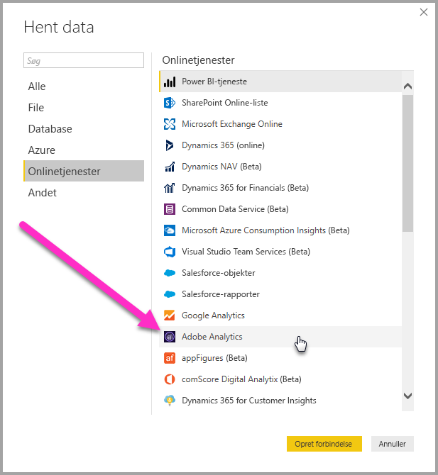
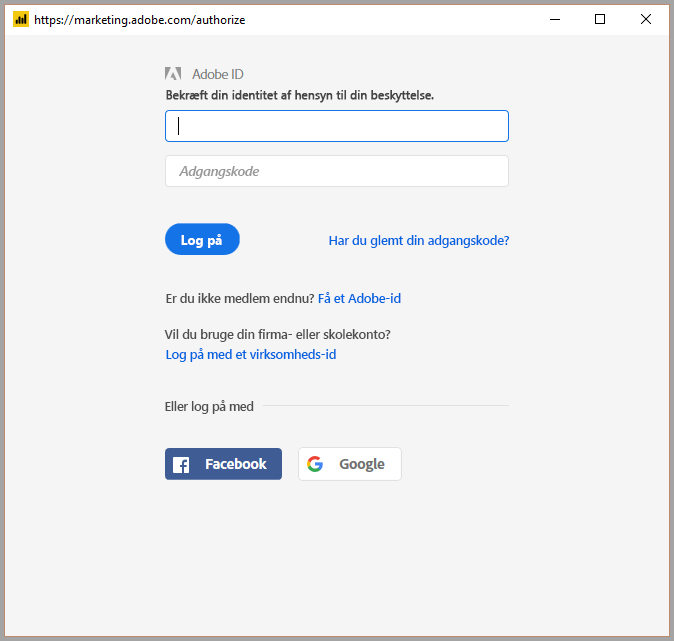
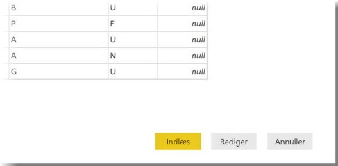

# Opret forbindelse til Adobe Analytics i Power BI Desktop 
I **Power BI Desktop** kan du oprette forbindelse til **Adobe Analytics** og bruge de underliggende data på samme måde som enhver anden datakilde i Power BI Desktop. 

## Opret forbindelse til Adobe Analytics-data
Du opretter forbindelse til **Adobe Analytics**-data ved at vælge **Hent data** på båndet **Hjem** i Power BI Desktop. Vælg **Onlinetjenester** under kategorier til venstre, så kan du se **Adobe Analytics-connector**.

I vinduet **Adobe Analytics**, der vises, skal du vælge knappen **Log på** og angive dine legitimationsoplysninger for at logge på din Adobe Analytics-konto. Vinduet til at logge på Adobe vises, som vist på følgende billede.

Når du bliver bedt om det, skal du angive dit brugernavn og din adgangskode. Når du har oprettet forbindelse, kan du se eksempler på og vælge flere dimensioner og målinger i dialogboksen **Navigator** i Power BI, som du kan bruge til at oprette et enkelt tabellarisk output. Du kan også angive andre nødvendige inputparametre, som kræves for de valgte elementer. 

Du kan **indlæse** den valgte tabel, der fører hele tabellen ind i **Power BI Desktop**, eller du kan **redigere** forespørgslen, der åbner **Forespørgselseditor**, så du kan filtrere og finindstille det datasæt, du vil bruge, og derefter indlæse dette finindstillede datasæt i **Power BI Desktop**.

## De næste trin
Du kan oprette forbindelse til mange forskellige typer data ved hjælp af Power BI Desktop. Hvis du vil have mere at vide om datakilder, kan du se følgende ressourcer:

* [Hvad er Power BI Desktop?](../fundamentals/desktop-what-is-desktop.md)
* [Datakilder i Power BI Desktop](desktop-data-sources.md)
* [Udform og kombiner data med Power BI Desktop](desktop-shape-and-combine-data.md)
* [Opret forbindelse til Excel-projektmapper i Power BI Desktop](desktop-connect-excel.md)   
* [Angiv data direkte i Power BI Desktop](desktop-enter-data-directly-into-desktop.md)   
