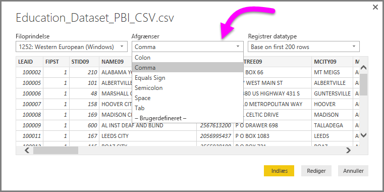
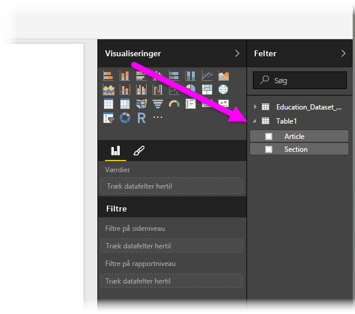

# Opret forbindelse til CSV-filer i Power BI Desktop
Den måde, du opretter forbindelse til en kommasepareret fil (*CSV*) på fra Power BI Desktop, ligner meget den måde, du opretter forbindelse til en Excel-projektmappe på. Begge dele er nemt, og i denne artikel får du en trinvis vejledning til, hvordan du opretter forbindelse til en hvilken som helst CSV-fil, som du har adgang til.

I Power BI Desktop skal du starte med at vælge **Hent data > CSV** på båndet **Hjem**.

Vælg CSV-filen i dialogboksen **Åbn**, der vises.

Når du vælger **Åbn**, får Power BI Desktop adgang til filen og angiver visse filattributter, f.eks. filoprindelse og afgrænsertype, samt hvor mange rækker der skal bruges til at registrere datatyperne i filen.

Disse filattributter og indstillinger vises på rullelisten øverst i dialogboksvinduet **CSV-import**, der er vist nedenfor. Du kan manuelt ændre disse registrerede indstillinger ved at vælge en anden indstilling på en af rullelisterne.

Når du er tilfreds med dine valg, kan du vælge **Indlæs** for at importere filen til Power BI Desktop, eller du kan vælge **Rediger** for at åbne **Forespørgselseditor** og yderligere udforme eller omdanne dataene, før du importerer dem.

Når du indlæser data i Power BI Desktop, kan du se tabellen og dens kolonner, der præsenteres som felter i Power BI Desktop, i ruden **Felter** i højre side af Rapportvisningen i Power BI Desktop.

Det er alt, hvad du skal gøre! Dataene fra din CSV-fil er nu i Power BI Desktop.

Du kan bruge disse data i Power BI Desktop til at oprette visualiseringer og rapporter eller interagere med andre data, som du måske vil oprette forbindelse til og importere, f.eks. Excel-projektmapper, databaser eller en hvilken som helst anden datakilde.

> [!IMPORTANT]
> Når du importerer en CSV-fil, opretter Power BI Desktop en *columns=x* (hvor *x* er antallet af kolonner i CSV-filen under den indledende import) som et trin i Power-forespørgselseditor. Hvis du efterfølgende tilføjer flere kolonner, og datakilden er indstillet til at blive opdateret, opdateres kolonner efter det indledende antal på *x* ikke. 

## Næste trin
Du kan oprette forbindelse til mange forskellige typer data ved hjælp af Power BI Desktop. Du kan finde flere oplysninger om datakilder i følgende ressourcer:

* [Hvad er Power BI Desktop?](../fundamentals/desktop-what-is-desktop.md)
* [Datakilder i Power BI Desktop](desktop-data-sources.md)
* [Udform og kombiner data med Power BI Desktop](desktop-shape-and-combine-data.md)
* [Opret forbindelse til Excel-projektmapper i Power BI Desktop](desktop-connect-excel.md)   
* [Angiv data direkte i Power BI Desktop](desktop-enter-data-directly-into-desktop.md)   
