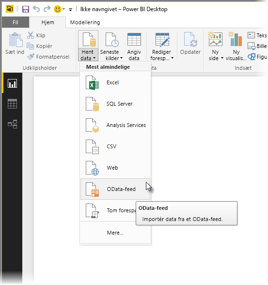
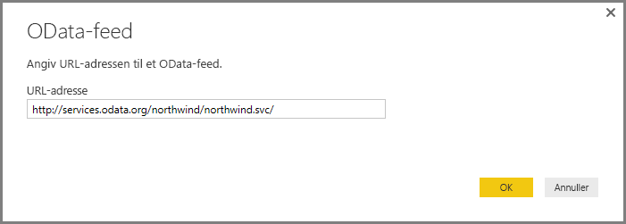
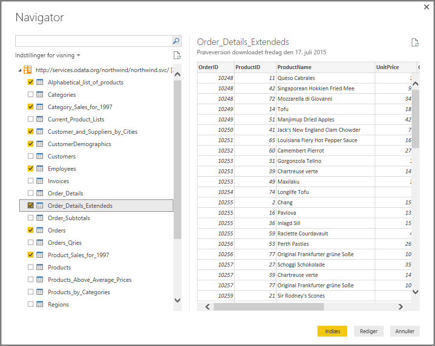
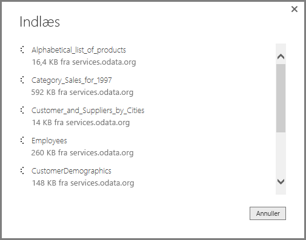

# Opret forbindelse til OData-feeds i Power BI Desktop
I Power BI Desktop kan du oprette forbindelse til et **OData-feed** og bruge de underliggende data på samme måde som enhver anden datakilde i Power BI Desktop.

Hvis du vil oprette forbindelse til et OData-feed, skal du vælge **Hent data > OData-feed** på båndet **Hjem** i Power BI Desktop.

I vinduet **OData-feed**, der åbnes, skal du skrive eller indsætte URL-adressen til dit OData-feed i feltet og vælge **OK**.

Power BI Desktop opretter forbindelse til OData-feed'et og viser de tilgængelige tabeller og andre dataelementer i vinduet **Navigator**. Når du markerer et element, vises der et eksempel på dataene i højre rude i vinduet **Navigator**. Du kan vælge lige så mange tabeller, som du vil importere. I vinduet **Navigator** vises der et eksempel på den aktuelt valgte tabel.

Du kan vælge knappen **Rediger**, hvilket starter **Forespørgselseditor**, hvor du kan udforme og transformere dataene fra OData-feed'et, før du importerer dem til Power BI Desktop. Du kan også vælge knappen **Indlæs** og importere alle dataelementer, du har valgt i venstre rude.

Når vi vælger **Indlæs**, importerer Power BI Desktop de valgte elementer og åbner vinduet **Indlæs** med importstatus.

Når du er færdig, gør Power BI Desktop de valgte tabeller og andre dataelementer tilgængelige i ruden **Felter**, som du finder i højre side af visningen *Rapporter* i Power BI Desktop.

Det var det hele!

Du er nu klar til at bruge de data, der er importeret fra dit OData-feed, i Power BI Desktop til at oprette visuelle elementer og rapporter eller interagere med andre data, som du måske vil oprette forbindelse til og importere, f.eks. andre Excel-projektmapper, databaser eller en hvilken som helst anden datakilde.

## Næste trin
Du kan oprette forbindelse til mange forskellige typer data ved hjælp af Power BI Desktop. Du kan finde flere oplysninger om datakilder i følgende ressourcer:

* [Hvad er Power BI Desktop?](../fundamentals/desktop-what-is-desktop.md)
* [Datakilder i Power BI Desktop](desktop-data-sources.md)
* [Udform og kombiner data med Power BI Desktop](desktop-shape-and-combine-data.md)
* [Opret forbindelse til Excel-projektmapper i Power BI Desktop](desktop-connect-excel.md)   
* [Angiv data direkte i Power BI Desktop](desktop-enter-data-directly-into-desktop.md)   
