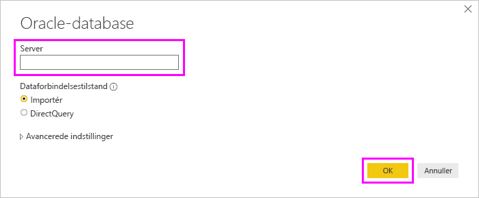

# Opret forbindelse til en Oracle-database med Power BI Desktop
Hvis du vil oprette forbindelse til en Oracle-database med Power BI Desktop, skal den korrekte Oracle-klientsoftware være installeret på den computer, der kører Power BI Desktop. Den Oracle-klientsoftware, du bruger, afhænger af, hvilken version af Power BI Desktop du har installeret: 32-bit eller 64-bit. Det afhænger også af din version af Oracle-serveren.

Understøttede Oracle-versioner: 
- Oracle Server 9 og nyere
- ODAC-software (Oracle Data Access Client) 11.2 og nyere

> [!NOTE]
> Hvis du konfigurerer en Oracle-database til Power BI Desktop, en datagateway i det lokale miljø eller Power BI-rapportserver, kan du se oplysningerne i artiklen [Oracle-forbindelsestype](https://docs.microsoft.com/sql/reporting-services/report-data/oracle-connection-type-ssrs?view=sql-server-ver15). 

## Sådan finder du ud af, hvilken version af Power BI Desktop der er installeret
For at finde ud af, hvilken version af Power BI Desktop der er installeret, skal du vælge **Filer** > **Hjælp** > **Om** og derefter se linjen **Version**. På følgende billede er der installeret en 64-bit version af Power BI Desktop:

## Installér Oracle-klienten
- Til 32-bit versionen af Power BI Desktop skal du [downloade og installere 32-bit Oracle-klienten](https://www.oracle.com/technetwork/topics/dotnet/utilsoft-086879.html).

- Til 64-bit versionen af Power BI Desktop skal du [downloade og installere 64-bit Oracle-klienten](https://www.oracle.com/database/technologies/odac-downloads.html).

> [!NOTE]
> Vælg en version af ODAC (Oracle Data Access Client), som er kompatibel med din Oracle-server. ODAC 12.x understøtter f.eks. ikke altid Oracle Server version 9.
> Vælg Windows-installationsprogrammet til Oracle-klienten.
> Under installationen af Oracle-klienten skal du sørge for, at du aktiverer *Konfigurer ODP.NET- og/eller Oracle-providere for ASP.NET på maskinens niveau* ved at markere det tilsvarende afkrydsningsfelt i installationsguiden. I nogle versioner af Oracle-klientguiden markeres afkrydsningsfeltet som standard, i andre gøres det ikke. Sørg for, at afkrydsningsfelt er markeret, så Power BI kan oprette forbindelse til din Oracle-database.

## Opret forbindelse til en Oracle-database
Når den rette Oracle-klientdriver er installeret, kan du oprette forbindelse til en Oracle-database. Benyt følgende fremgangsmåde for at oprette forbindelse:

1. Vælg **Hent data** under fanen **Hjem**. 

2. I vinduet **Hent data**, der vises, skal du vælge **flere** (om nødvendigt), vælge **Database** > **Oracle database**og derefter vælge **Opret forbindelse**.
   
   
3. I dialogboksen **Oracle-database**, der åbnes, skal du angive navnet på **serveren** og vælge **OK**. Hvis der kræves et SID, skal du angive det i formatet: *Servernavn/SID*, hvor *SID* er det entydige navn på databasen. Hvis formatet *Servernavn/SID* ikke virker, kan du prøve at bruge *Servernavn/Tjenestenavn*, hvor *Tjenestenavn* er det alias, du bruger, når du opretter forbindelse.

   

   > [!NOTE]
   > Hvis du bruger en lokal database eller autonome databaseforbindelser, skal du muligvis sætte servernavnet i anførselstegn for at undgå forbindelsesfejl. 
      
4. Hvis du vil importere data ved hjælp af en oprindelig databaseforespørgsel, kan du placere din forespørgsel i feltet **SQL-sætning**, der vises, når du udvider afsnittet **Avancerede indstillinger** i dialogboksen **Oracle-database**.
   
   

5. Når du har angivet dine oplysninger til Oracle-databasen i dialogboksen **Oracle-database** (herunder alle valgfrie oplysninger, f.eks. et SID eller en oprindelig databaseforespørgsel), skal du vælge **OK** for at oprette forbindelse.
5. Hvis Oracle-databasen kræver brugeroplysninger til databasen, skal du angive disse legitimationsoplysninger i dialogboksen, når du bliver bedt om det.

## Fejlfinding

Du kan støde på en af flere fejl fra Oracle, når navngivningssyntaksen enten er forkert eller ikke konfigureret korrekt:

* ORA-12154: TNS: Den angivne forbindelsesidentifikator kunne ikke løses.
* ORA-12514: TNS: Lyttefunktionen kender i øjeblikket ikke til den anmodede tjeneste i forbindelsesbeskrivelsen.
* ORA-12541: TNS: Ingen lyttefunktion.
* ORA-12170: TNS: Der opstod timeout for forbindelsen.
* ORA-12504: TNS: Lyttefunktionen fik ikke SERVICE_NAME i CONNECT_DATA.

Disse fejl kan opstå, hvis Oracle-klienten enten ikke er installeret eller konfigureret korrekt. Hvis den er installeret, skal du bekræfte, at filen tnsnames.ora er konfigureret korrekt, og at du bruger det korrekte net_service_name. Du skal også sikre, at net_service_name er det samme for den maskine, der bruger Power BI Desktop, og den maskine, der kører gatewayen. Du kan finde flere oplysninger under [Installér Oracle-klienten](#install-the-oracle-client).

Du støder måske også på et kompatibilitetsproblem mellem Oracle-serverversionen og Oracle Data Access Client-versionen. Det anbefales, at disse versioner matcher, da nogle kombinationer er inkompatible. ODAC 12.x understøtter f.eks. ikke Oracle Server version 9.

Hvis du har downloadet Power BI Desktop via Microsoft Store, kan du muligvis ikke oprette forbindelse til Oracle-databaser på grund af et problem med en Oracle-driver. Hvis du oplever dette problem, returneres fejlmeddelelsen: *Objektreference er ikke angivet*. Du kan løse problemet ved at gøre et af følgende:

* Download Power BI Desktop fra [Download Center](https://www.microsoft.com/download/details.aspx?id=58494) i stedet for Microsoft Store.

* Hvis du vil bruge versionen fra Microsoft Store: Kopiér oraons.dll fra _12.X.X\client_X_ til _12.X.X\client_X\bin_ på din lokale computer, hvor _X_ repræsenterer versions- og mappenummeret.

Hvis du får vist fejlmeddelelsen *Objektreference er ikke angivet* i Power BI Gateway, når du opretter forbindelse til en Oracle-database, skal du følge vejledningen under [Administrer din datakilde – Oracle](service-gateway-onprem-manage-oracle.md).

Hvis du bruger Power BI-rapportserver, kan du se vejledningen i artiklen [Oracle-forbindelsestype](https://docs.microsoft.com/sql/reporting-services/report-data/oracle-connection-type-ssrs?view=sql-server-ver15).
